# 主题与样式系统

<cite>
**本文档引用的文件**
- [style_sheet.py](file://gui/qtpy/version2/gallery/app/common/style_sheet.py)
- [config.json](file://gui/qtpy/version2/gallery/app/config/config.json)
- [setting_interface.py](file://gui/qtpy/version2/gallery/app/view/setting_interface.py)
- [config.py](file://gui/qtpy/version2/gallery/app/common/config.py)
- [main_window.py](file://gui/qtpy/version2/gallery/app/view/main_window.py)
- [home_interface.py](file://gui/qtpy/version2/gallery/app/view/home_interface.py)
- [gallery_interface.py](file://gui/qtpy/version2/gallery/app/view/gallery_interface.py)
- [main_window.qss](file://gui/qtpy/version2/gallery/app/resource/qss/light/main_window.qss)
- [main_window.qss](file://gui/qtpy/version2/gallery/app/resource/qss/dark/main_window.qss)
- [link_card.qss](file://gui/qtpy/version2/gallery/app/resource/qss/light/link_card.qss)
- [link_card.qss](file://gui/qtpy/version2/gallery/app/resource/qss/dark/link_card.qss)
</cite>

## 目录
1. [简介](#简介)
2. [项目结构概览](#项目结构概览)
3. [核心组件分析](#核心组件分析)
4. [架构概览](#架构概览)
5. [详细组件分析](#详细组件分析)
6. [依赖关系分析](#依赖关系分析)
7. [性能考虑](#性能考虑)
8. [故障排除指南](#故障排除指南)
9. [结论](#结论)

## 简介

python-office GUI Version2采用了一套完整而灵活的主题与样式系统，基于QFluentWidgets框架构建。该系统提供了完整的亮色/暗色主题切换功能，支持动态样式加载，并通过CSS样式表实现了高度可定制的用户界面。

系统的核心设计理念是分离关注点：样式定义与业务逻辑分离，主题配置与界面组件分离，确保了代码的可维护性和扩展性。

## 项目结构概览

主题与样式系统主要分布在以下目录结构中：

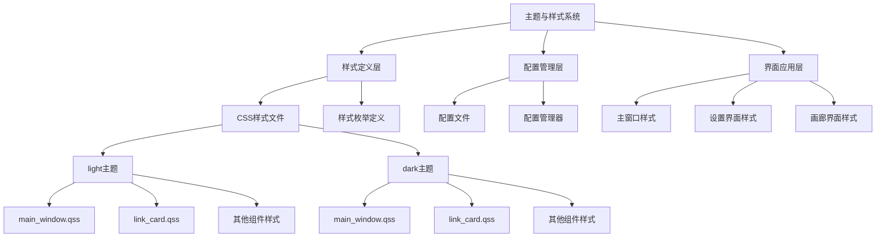

**图表来源**
- [style_sheet.py](file://gui/qtpy/version2/gallery/app/common/style_sheet.py#L7-L22)
- [config.json](file://gui/qtpy/version2/gallery/app/config/config.json#L1-L20)

**章节来源**
- [style_sheet.py](file://gui/qtpy/version2/gallery/app/common/style_sheet.py#L1-L22)
- [config.json](file://gui/qtpy/version2/gallery/app/config/config.json#L1-L20)

## 核心组件分析

### StyleSheet类设计

StyleSheet类是整个样式系统的核心，继承自`StyleSheetBase`和`Enum`，定义了应用程序中所有界面组件的样式标识符。

#### 样式标识符定义

系统定义了以下主要样式标识符：
- **LINK_CARD**: 链接卡片组件样式
- **MAIN_WINDOW**: 主窗口样式
- **SAMPLE_CARD**: 示例卡片样式  
- **HOME_INTERFACE**: 主页面界面样式
- **ICON_INTERFACE**: 图标界面样式
- **VIEW_INTERFACE**: 视图界面样式
- **SETTING_INTERFACE**: 设置界面样式
- **GALLERY_INTERFACE**: 画廊界面样式

#### 动态路径解析机制

StyleSheet类提供了`path()`方法，实现了智能的主题路径解析：

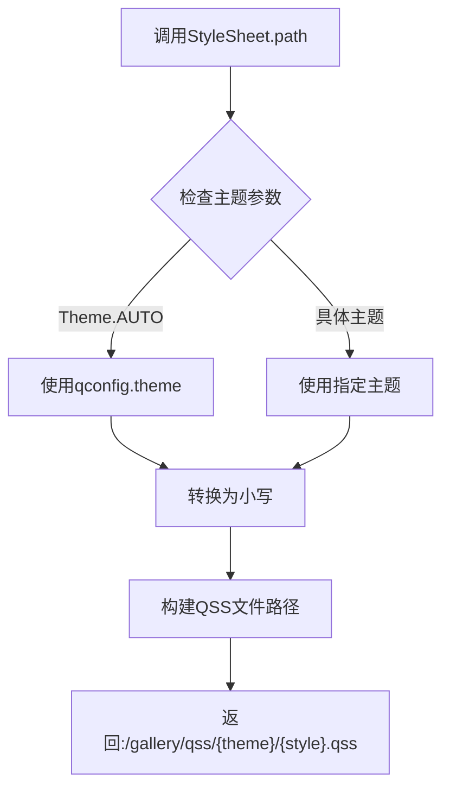

**图表来源**
- [style_sheet.py](file://gui/qtpy/version2/gallery/app/common/style_sheet.py#L19-L21)

**章节来源**
- [style_sheet.py](file://gui/qtpy/version2/gallery/app/common/style_sheet.py#L7-L22)

## 架构概览

主题与样式系统采用分层架构设计，确保了良好的模块化和可扩展性：

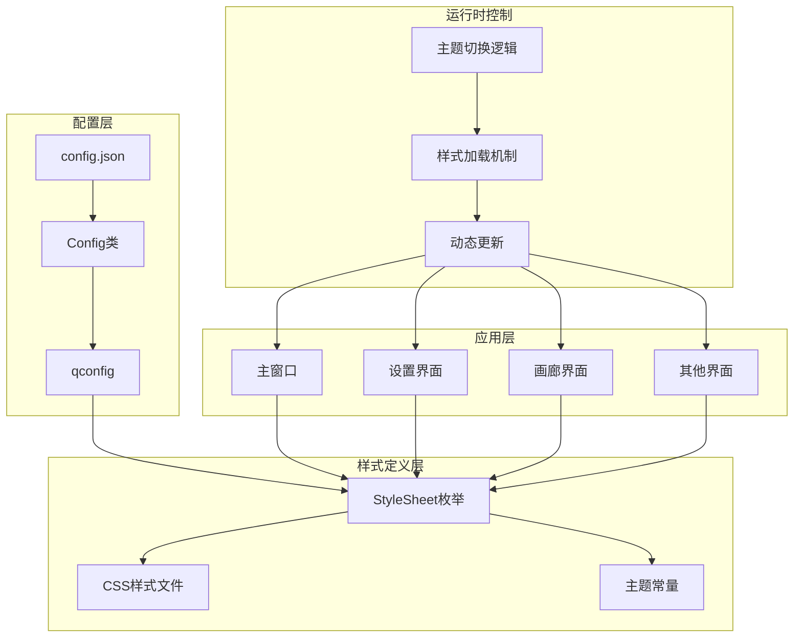

**图表来源**
- [config.py](file://gui/qtpy/version2/gallery/app/common/config.py#L19-L52)
- [style_sheet.py](file://gui/qtpy/version2/gallery/app/common/style_sheet.py#L7-L22)

## 详细组件分析

### 设置界面中的主题配置功能

设置界面（SettingInterface）提供了完整的主题配置功能，包括亮色/暗色模式切换和主题颜色自定义。

#### 主题切换组件

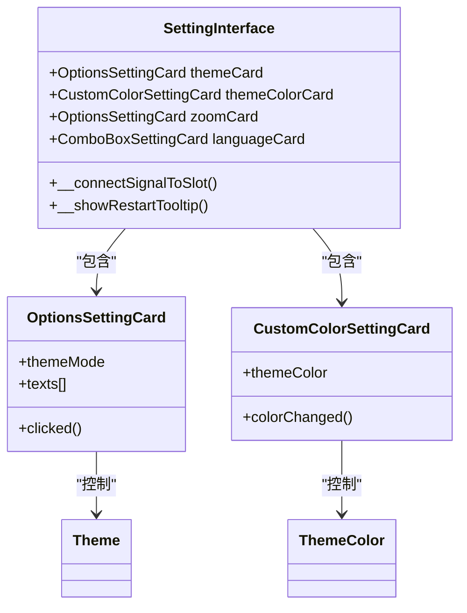

**图表来源**
- [setting_interface.py](file://gui/qtpy/version2/gallery/app/view/setting_interface.py#L56-L73)

#### 主题切换信号连接

设置界面建立了关键的信号连接机制：

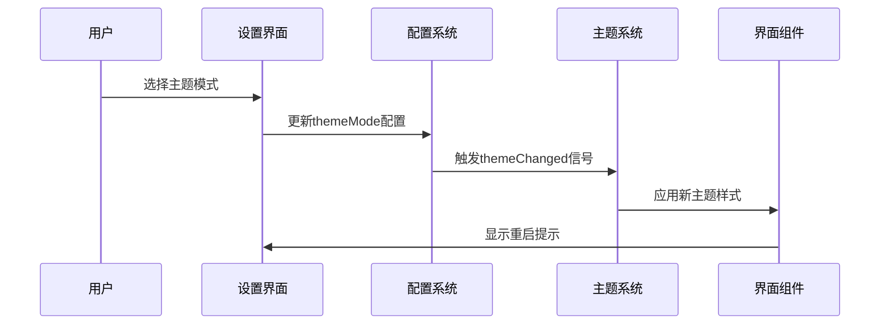

**图表来源**
- [setting_interface.py](file://gui/qtpy/version2/gallery/app/view/setting_interface.py#L210-L227)

**章节来源**
- [setting_interface.py](file://gui/qtpy/version2/gallery/app/view/setting_interface.py#L18-L227)

### 主题配置与全局联动

#### 配置文件结构

配置系统通过JSON文件和Python类实现了配置的持久化存储和类型安全访问：

| 配置项 | 类型 | 默认值 | 描述 |
|--------|------|--------|------|
| ThemeColor | String | "#ff009faa" | 主题色彩值 |
| ThemeMode | String | "Auto" | 主题模式：Light/Dark/Auto |

#### 配置类设计

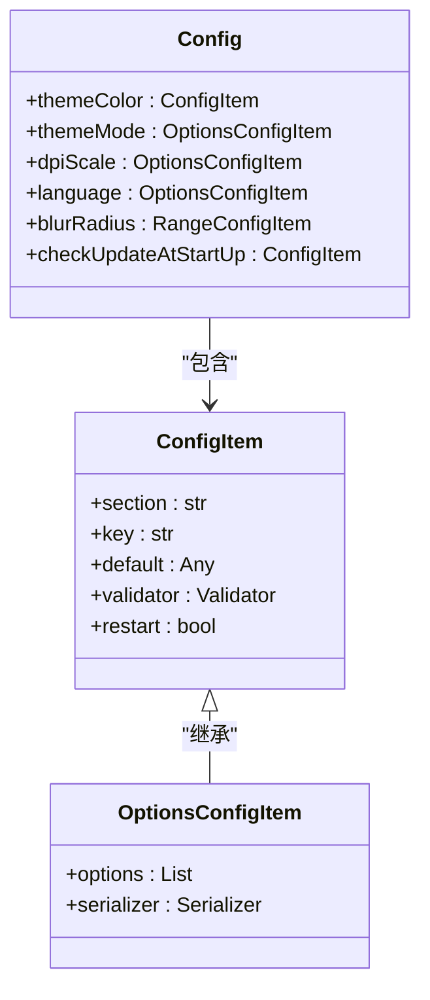

**图表来源**
- [config.py](file://gui/qtpy/version2/gallery/app/common/config.py#L19-L52)

**章节来源**
- [config.py](file://gui/qtpy/version2/gallery/app/common/config.py#L19-L52)
- [config.json](file://gui/qtpy/version2/gallery/app/config/config.json#L16-L19)

### CSS样式规则详解

#### 样式文件组织结构

系统采用按主题和组件分离的CSS文件组织方式：

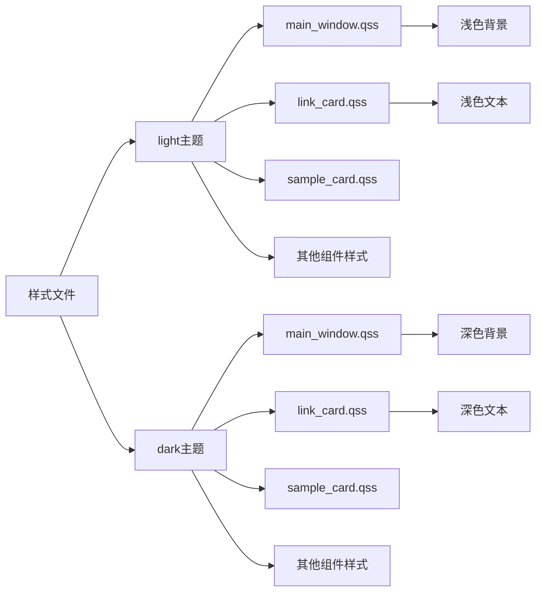

**图表来源**
- [main_window.qss](file://gui/qtpy/version2/gallery/app/resource/qss/light/main_window.qss#L1-L42)
- [main_window.qss](file://gui/qtpy/version2/gallery/app/resource/qss/dark/main_window.qss#L1-L54)

#### 样式规则对比分析

以主窗口样式为例，展示亮色和暗色主题的差异：

| 样式属性 | 亮色主题 | 暗色主题 | 设计理念 |
|----------|----------|----------|----------|
| 背景颜色 | rgb(249, 249, 249) | rgb(39, 39, 39) | 浅色背景提升可读性 |
| 边框颜色 | rgb(229, 229, 229) | rgb(29, 29, 29) | 细微边框保持简洁 |
| 标题颜色 | black | white | 对比度最大化 |
| 按钮悬停 | rgba(0, 0, 0, 26) | rgba(255, 255, 255, 26) | 反向高亮效果 |

**章节来源**
- [main_window.qss](file://gui/qtpy/version2/gallery/app/resource/qss/light/main_window.qss#L1-L42)
- [main_window.qss](file://gui/qtpy/version2/gallery/app/resource/qss/dark/main_window.qss#L1-L54)

### 动态样式加载机制

#### 样式应用流程

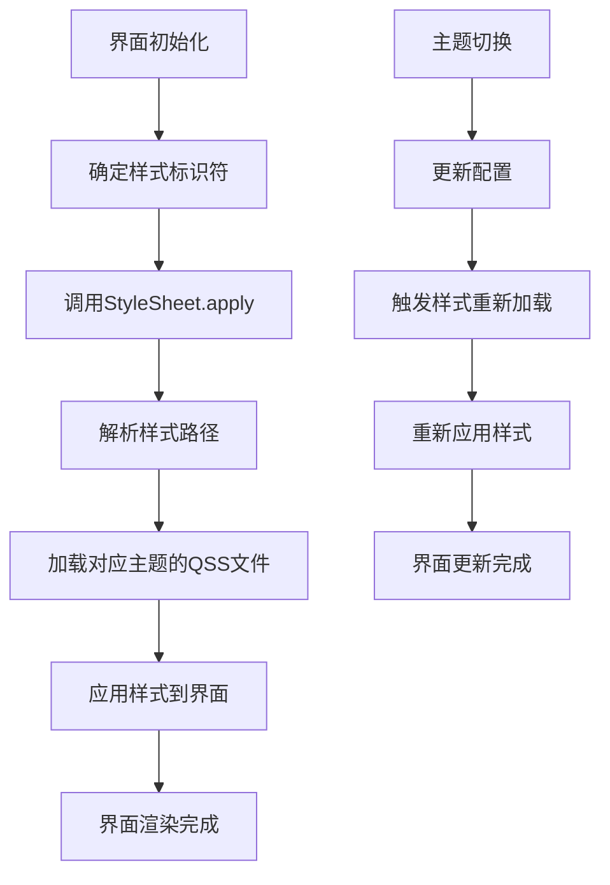

**图表来源**
- [main_window.py](file://gui/qtpy/version2/gallery/app/view/main_window.py#L188)
- [home_interface.py](file://gui/qtpy/version2/gallery/app/view/home_interface.py#L102)

#### 实际应用示例

不同界面组件的样式应用方式：

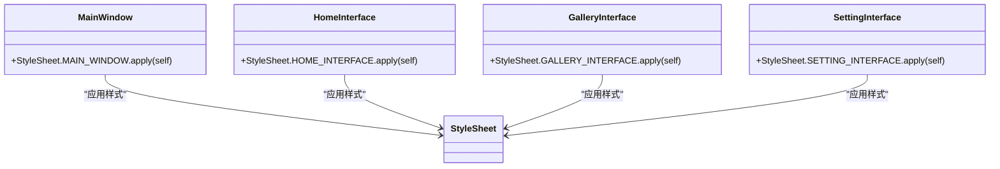

**图表来源**
- [main_window.py](file://gui/qtpy/version2/gallery/app/view/main_window.py#L188)
- [home_interface.py](file://gui/qtpy/version2/gallery/app/view/home_interface.py#L102)
- [gallery_interface.py](file://gui/qtpy/version2/gallery/app/view/gallery_interface.py#L181)
- [setting_interface.py](file://gui/qtpy/version2/gallery/app/view/setting_interface.py#L155)

**章节来源**
- [main_window.py](file://gui/qtpy/version2/gallery/app/view/main_window.py#L188)
- [home_interface.py](file://gui/qtpy/version2/gallery/app/view/home_interface.py#L102)
- [gallery_interface.py](file://gui/qtpy/version2/gallery/app/view/gallery_interface.py#L181)
- [setting_interface.py](file://gui/qtpy/version2/gallery/app/view/setting_interface.py#L155)

### 主题切换逻辑实现

#### 全局主题切换机制

系统提供了两种主题切换方式：

1. **设置界面切换**: 通过OptionsSettingCard进行配置
2. **即时切换**: 通过工具栏按钮实现

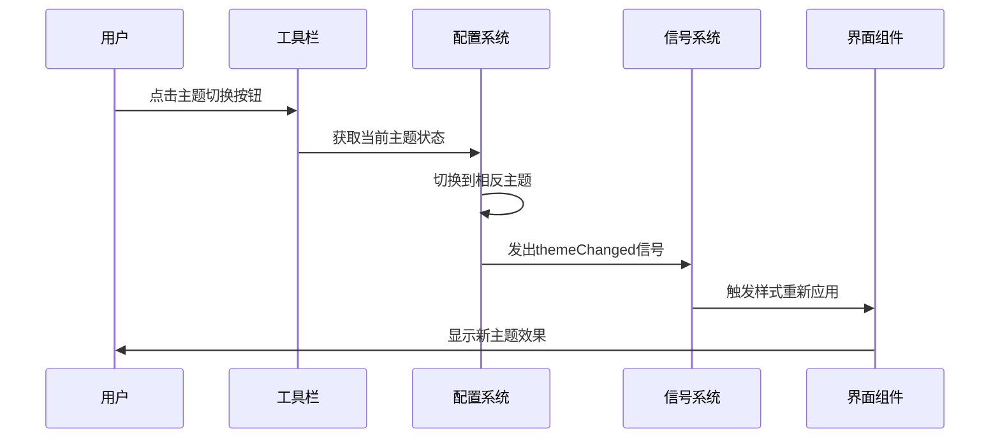

**图表来源**
- [gallery_interface.py](file://gui/qtpy/version2/gallery/app/view/gallery_interface.py#L69-L72)

#### 主题状态管理

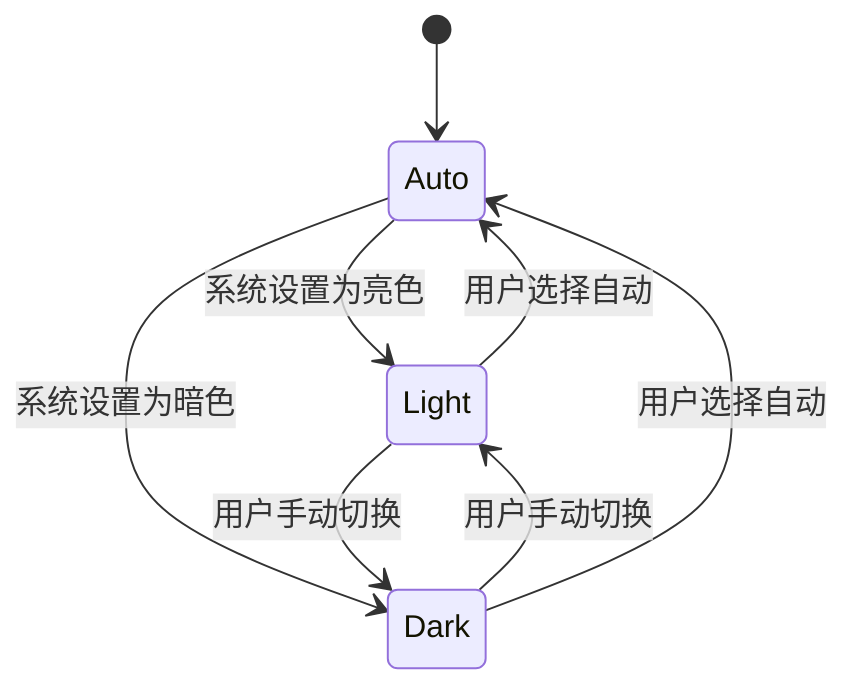

**章节来源**
- [gallery_interface.py](file://gui/qtpy/version2/gallery/app/view/gallery_interface.py#L69-L72)
- [setting_interface.py](file://gui/qtpy/version2/gallery/app/view/setting_interface.py#L210-L227)

## 依赖关系分析

### 样式系统依赖图

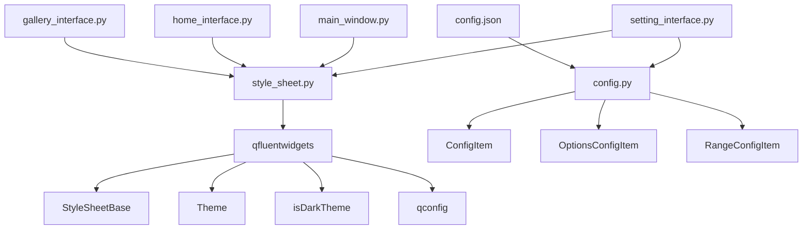

**图表来源**
- [style_sheet.py](file://gui/qtpy/version2/gallery/app/common/style_sheet.py#L3-L4)
- [config.py](file://gui/qtpy/version2/gallery/app/common/config.py#L4-L6)

### 组件耦合分析

系统采用了松耦合的设计原则：

- **样式定义与界面分离**: StyleSheet枚举定义样式标识，不直接依赖具体界面
- **配置与界面分离**: 配置系统独立于界面组件，通过信号机制通信
- **主题文件独立**: CSS文件独立于Python代码，便于修改和扩展

**章节来源**
- [style_sheet.py](file://gui/qtpy/version2/gallery/app/common/style_sheet.py#L1-L22)
- [config.py](file://gui/qtpy/version2/gallery/app/common/config.py#L1-L52)

## 性能考虑

### 样式加载优化策略

1. **延迟加载**: 样式仅在界面首次显示时加载
2. **缓存机制**: 已加载的样式文件会被缓存，避免重复读取
3. **增量更新**: 主题切换时只重新应用受影响的组件样式

### 内存使用优化

- CSS文件采用静态资源管理，减少内存占用
- 样式对象采用枚举方式，避免重复创建
- 主题切换时使用信号机制，避免不必要的界面重建

## 故障排除指南

### 常见问题及解决方案

#### 主题切换不生效

**问题描述**: 更改主题设置后界面没有相应变化

**可能原因**:
1. 配置文件路径错误
2. CSS文件缺失或格式错误
3. 样式应用时机不当

**解决方案**:
1. 检查config.json文件路径和格式
2. 验证对应的.qss文件是否存在
3. 确保在界面初始化完成后应用样式

#### 样式加载失败

**问题描述**: 界面显示异常，样式未正确应用

**诊断步骤**:
1. 检查StyleSheet.path()返回的路径是否正确
2. 验证CSS语法是否符合Qt样式表规范
3. 确认主题文件命名与枚举值匹配

**章节来源**
- [style_sheet.py](file://gui/qtpy/version2/gallery/app/common/style_sheet.py#L19-L21)

## 结论

python-office GUI Version2的主题与样式系统展现了优秀的软件架构设计：

### 系统优势

1. **模块化设计**: 清晰的分层架构，职责明确
2. **高度可扩展**: 支持自定义主题和样式规则
3. **用户体验优秀**: 流畅的主题切换和响应式设计
4. **维护性良好**: 松耦合设计，易于维护和扩展

### 最佳实践总结

1. **样式分离**: 将样式定义与业务逻辑完全分离
2. **配置驱动**: 使用配置文件管理主题设置
3. **信号机制**: 通过信号实现组件间的松耦合通信
4. **资源管理**: 采用静态资源管理CSS文件

### 扩展建议

1. **自定义主题支持**: 可以通过扩展StyleSheet枚举添加新的样式标识
2. **动态主题生成**: 可以开发工具根据用户偏好动态生成主题
3. **主题预览功能**: 在设置界面添加主题预览功能
4. **主题导出导入**: 支持用户保存和分享自定义主题

这套主题与样式系统为python-office提供了坚实的基础，不仅满足了当前的功能需求，也为未来的功能扩展奠定了良好的技术基础。