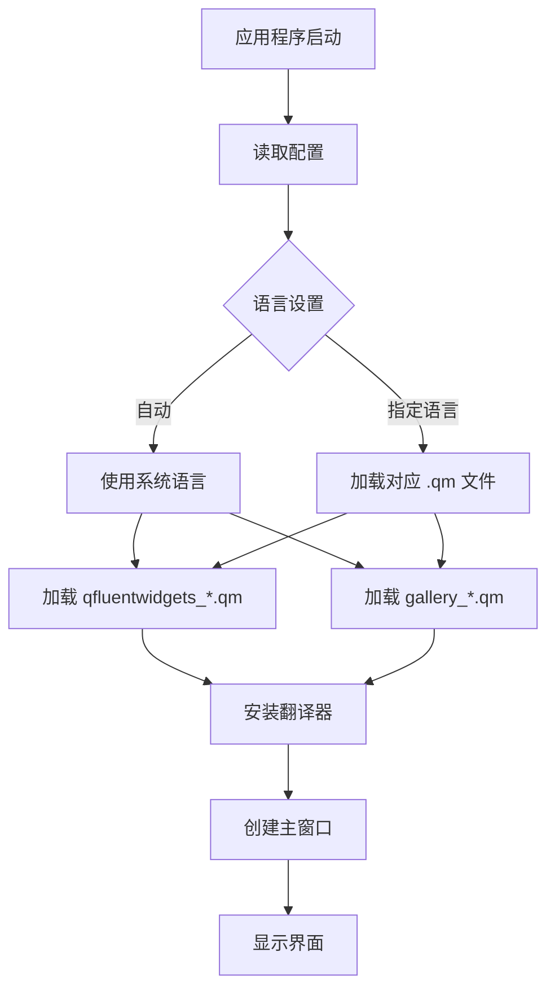
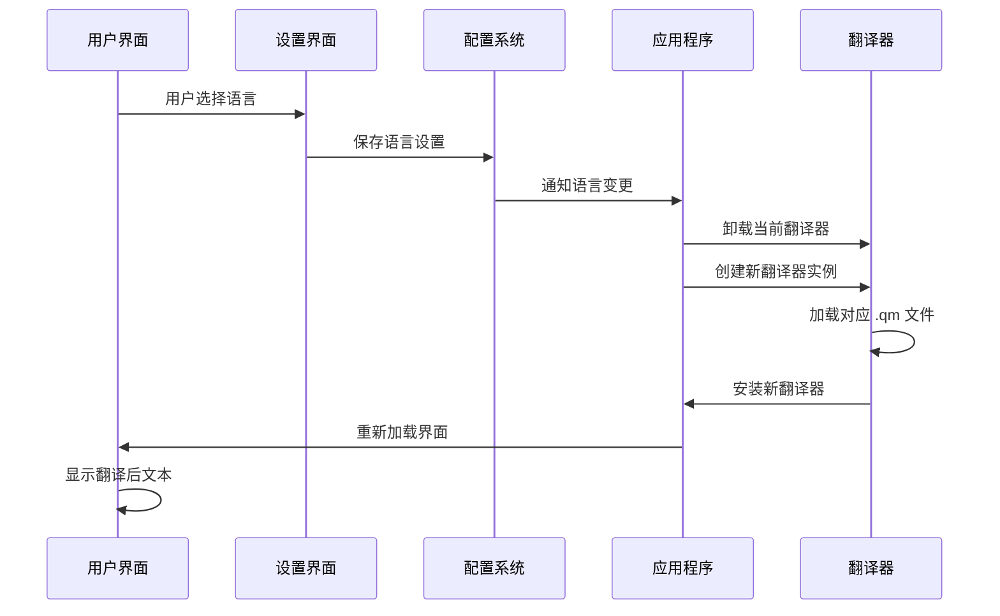

# 多语言支持机制

<cite>
**本文档引用文件**  
- [translator.py](file://gui/qtpy/version2/gallery/app/common/translator.py)
- [setting_interface.py](file://gui/qtpy/version2/gallery/app/view/setting_interface.py)
- [config.py](file://gui/qtpy/version2/gallery/app/common/config.py)
- [demo.py](file://gui/qtpy/version2/gallery/demo.py)
- [gallery_zh.ts](file://gui/qtpy/version2/gallery/app/resource/i18n/gallery_zh.ts)
- [gallery_hk.ts](file://gui/qtpy/version2/gallery/app/resource/i18n/gallery_hk.ts)
- [gallery_zh.qm](file://gui/qtpy/version2/gallery/app/resource/i18n/gallery_zh.qm)
- [gallery_hk.qm](file://gui/qtpy/version2/gallery/app/resource/i18n/gallery_hk.qm)
</cite>

## 目录
1. [简介](#简介)
2. [核心组件分析](#核心组件分析)
3. [国际化实现架构](#国际化实现架构)
4. [翻译资源文件结构](#翻译资源文件结构)
5. [语言切换流程](#语言切换流程)
6. [新增语言支持步骤](#新增语言支持步骤)
7. [语言热加载与动态刷新](#语言热加载与动态刷新)
8. [默认语言 fallback 策略](#默认语言-fallback-策略)
9. [总结](#总结)

## 简介
python-office GUI Version2 采用 Qt Translation System 实现多语言支持，通过 .ts 和 .qm 文件管理翻译资源。系统支持简体中文、繁体中文和英文，并提供语言切换功能。本技术文档详细阐述其国际化实现机制，包括翻译资源管理、语言加载流程、界面文本动态刷新等核心功能。

## 核心组件分析

### Translator 类实现
`translator.py` 文件中的 `Translator` 类继承自 `QObject`，通过 Qt 的 `tr()` 方法标记可翻译的字符串。该类在初始化时定义了多个界面文本属性，如 "Text"、"View"、"Menus" 等，这些字符串将被提取到 .ts 文件中进行翻译。

```python
class Translator(QObject):
    def __init__(self, parent=None):
        super().__init__(parent=parent)
        self.text = self.tr('Text')
        self.view = self.tr('View')
        self.menus = self.tr('Menus')
        # ... 其他界面文本
```

**组件来源**  
- [translator.py](file://gui/qtpy/version2/gallery/app/common/translator.py#L5-L19)

### 语言配置管理
`config.py` 文件定义了 `Language` 枚举类，包含 `CHINESE_SIMPLIFIED`、`CHINESE_TRADITIONAL`、`ENGLISH` 和 `AUTO` 四种语言选项。`Config` 类通过 `OptionsConfigItem` 管理语言设置，存储在 `config.json` 中。

```python
class Language(Enum):
    CHINESE_SIMPLIFIED = "zh"
    CHINESE_TRADITIONAL = "hk"
    ENGLISH = "en"
    AUTO = "Auto"
```

**组件来源**  
- [config.py](file://gui/qtpy/version2/gallery/app/common/config.py#L10-L16)

## 国际化实现架构



**架构来源**  
- [demo.py](file://gui/qtpy/version2/gallery/demo.py#L27-L40)
- [config.py](file://gui/qtpy/version2/gallery/app/common/config.py#L31-L32)

## 翻译资源文件结构

### .ts 文件格式
`.ts` 文件是 XML 格式的翻译源文件，包含 `<context>` 和 `<message>` 元素。每个 `<message>` 包含源字符串 `<source>` 和翻译字符串 `<translation>`。

```xml
<context>
    <name>BasicInputInterface</name>
    <message>
        <location filename="../../view/basic_input_interface.py" line="23"/>
        <source>A simple button with text content</source>
        <translation>带有文本的简单按钮</translation>
    </message>
</context>
```

### gallery_zh.ts 结构
- **语言属性**: `language="zh_CN"`，表示简体中文
- **上下文**: 按界面组件划分，如 `BasicInputInterface`、`DateTimeInterface`
- **翻译条目**: 每个界面元素的源文本和中文翻译
- **位置信息**: 包含源文件路径和行号，便于维护

**文件来源**  
- [gallery_zh.ts](file://gui/qtpy/version2/gallery/app/resource/i18n/gallery_zh.ts#L3)

### gallery_hk.ts 结构
- **语言属性**: `language="zh_CN"`，虽然文件名为 hk，但实际仍标记为 zh_CN
- **翻译差异**: 使用繁体中文词汇，如 "按鈕"、"對話框"、"設置"
- **编码**: UTF-8 编码，支持中文字符

**文件来源**  
- [gallery_hk.ts](file://gui/qtpy/version2/gallery/app/resource/i18n/gallery_hk.ts#L3)

## 语言切换流程



**流程来源**  
- [setting_interface.py](file://gui/qtpy/version2/gallery/app/view/setting_interface.py#L85)
- [demo.py](file://gui/qtpy/version2/gallery/demo.py#L32-L37)

## 新增语言支持步骤

### 1. 生成 .ts 文件
使用 `lupdate` 工具扫描源代码，提取所有 `tr()` 调用的字符串，生成新的 `.ts` 文件。

```bash
lupdate gui/qtpy/version2/gallery/app -ts gui/qtpy/version2/gallery/app/resource/i18n/gallery_fr.ts
```

### 2. 翻译 .ts 文件
编辑新生成的 `.ts` 文件，在 `<translation>` 标签中添加对应语言的翻译。

```xml
<message>
    <source>Settings</source>
    <translation>Paramètres</translation>
</message>
```

### 3. 编译为 .qm 文件
使用 `lrelease` 工具将 `.ts` 文件编译为二进制 `.qm` 文件。

```bash
lrelease gui/qtpy/version2/gallery/app/resource/i18n/gallery_fr.ts
```

### 4. 集成到系统
- 将生成的 `gallery_fr.qm` 放入 `resource/i18n/` 目录
- 在 `config.py` 中添加 `Language.FRENCH = "fr"`
- 更新语言选择下拉菜单

**集成来源**  
- [demo.py](file://gui/qtpy/version2/gallery/demo.py#L36)
- [config.py](file://gui/qtpy/version2/gallery/app/common/config.py#L10-L16)

## 语言热加载与动态刷新

### 热加载机制
系统通过重新创建 `QTranslator` 实例并调用 `installTranslator()` 实现语言热加载，无需重启应用程序。

```python
translator = QTranslator()
galleryTranslator = QTranslator()
translator.load(f":/gallery/i18n/qfluentwidgets_{language.value}.qm")
galleryTranslator.load(f":/gallery/i18n/gallery_{language.value}.qm")
app.installTranslator(translator)
app.installTranslator(galleryTranslator)
```

### 动态刷新界面
当语言切换时，Qt 框架自动重新调用 `tr()` 方法获取新语言的翻译，并更新所有界面文本。

**热加载来源**  
- [demo.py](file://gui/qtpy/version2/gallery/demo.py#L28-L40)

## 默认语言 fallback 策略

### 策略实现
1. **自动模式**: 使用 `QLocale.system()` 获取系统语言，尝试加载对应翻译文件
2. **回退机制**: 如果指定语言文件不存在，自动回退到英文（默认语言）
3. **配置持久化**: 语言设置保存在 `config.json` 中，重启后保持

```python
if language == Language.AUTO:
    translator.load(QLocale.system(), ":/gallery/i18n/qfluentwidgets_")
    galleryTranslator.load(QLocale.system(), ":/gallery/i18n/gallery_")
elif language != Language.ENGLISH:
    translator.load(f":/gallery/i18n/qfluentwidgets_{language.value}.qm")
    galleryTranslator.load(f":/gallery/i18n/gallery_{language.value}.qm")
```

### 回退流程
```mermaid
graph TD
A[请求语言] --> B{文件存在?}
B --> |是| C[加载指定语言]
B --> |否| D{是英文?}
D --> |是| E[使用英文]
D --> |否| F[使用英文(默认)]
```

**回退策略来源**  
- [demo.py](file://gui/qtpy/version2/gallery/demo.py#L32-L37)

## 总结
python-office GUI Version2 的多语言支持机制基于 Qt Translation System，通过 .ts/.qm 文件实现翻译资源管理。系统采用模块化设计，`Translator` 类负责文本标记，`QTranslator` 负责加载和应用翻译，`Config` 类管理语言设置。语言切换通过重新安装翻译器实现热加载，支持动态刷新界面文本。新增语言需生成 .ts 文件、翻译、编译为 .qm 文件并集成到系统中。默认语言 fallback 策略确保在翻译文件缺失时仍能正常显示英文界面。