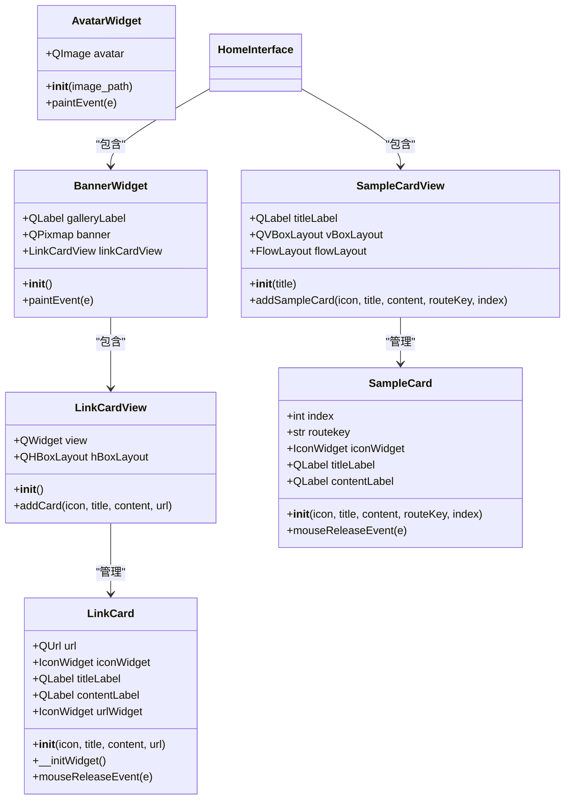
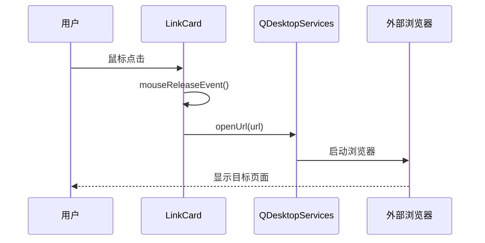
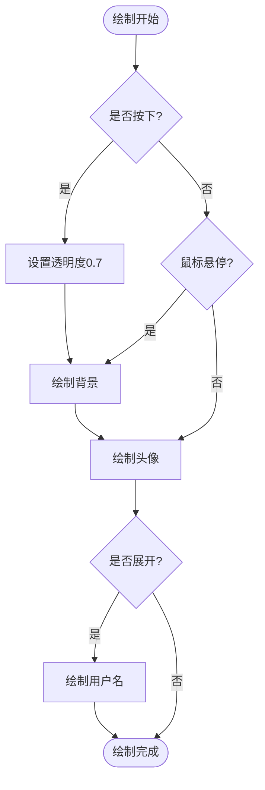
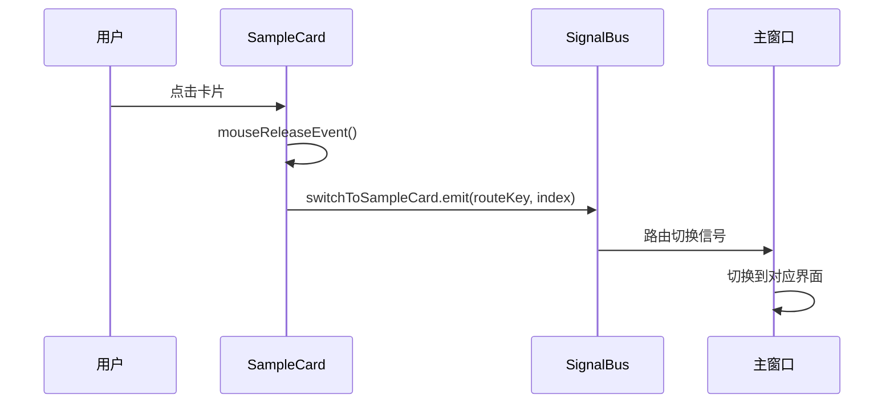
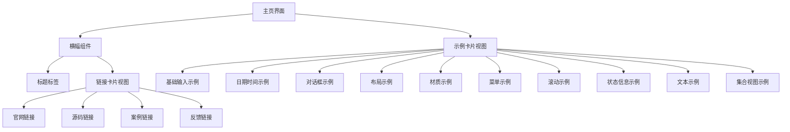
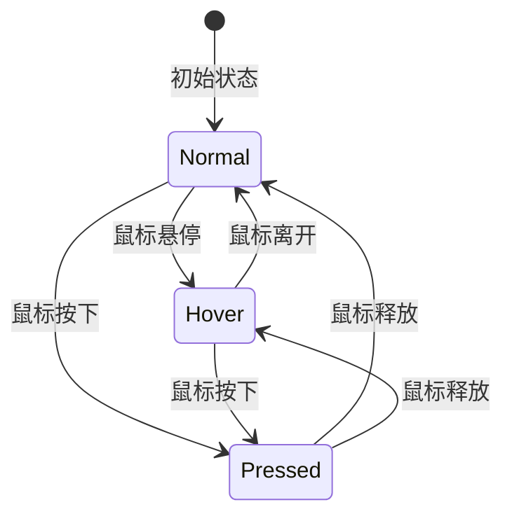

# 核心UI组件详解

<cite>
**本文档引用的文件**
- [link_card.py](file://gui/qtpy/version2/gallery/app/components/link_card.py)
- [avatar_widget.py](file://gui/qtpy/version2/gallery/app/components/avatar_widget.py)
- [sample_card.py](file://gui/qtpy/version2/gallery/app/components/sample_card.py)
- [home_interface.py](file://gui/qtpy/version2/gallery/app/view/home_interface.py)
- [style_sheet.py](file://gui/qtpy/version2/gallery/app/common/style_sheet.py)
- [signal_bus.py](file://gui/qtpy/version2/gallery/app/common/signal_bus.py)
- [icon.py](file://gui/qtpy/version2/gallery/app/common/icon.py)
- [link_card.qss](file://gui/qtpy/version2/gallery/app/resource/qss/light/link_card.qss)
- [sample_card.qss](file://gui/qtpy/version2/gallery/app/resource/qss/light/sample_card.qss)
- [home_interface.qss](file://gui/qtpy/version2/gallery/app/resource/qss/light/home_interface.qss)
</cite>

## 目录
1. [项目概述](#项目概述)
2. [核心UI组件架构](#核心ui组件架构)
3. [LinkCard功能入口卡片](#linkcard功能入口卡片)
4. [AvatarWidget用户头像控件](#avatarwidget用户头像控件)
5. [SampleCard示例卡片](#samplecard示例卡片)
6. [组件集成与布局策略](#组件集成与布局策略)
7. [样式系统与主题支持](#样式系统与主题支持)
8. [响应式设计与交互行为](#响应式设计与交互行为)
9. [组件复用机制](#组件复用机制)
10. [性能优化与最佳实践](#性能优化与最佳实践)
11. [总结](#总结)

## 项目概述

python-office GUI Version2采用基于Qt的现代化桌面应用架构，通过模块化的UI组件设计实现了高度可复用和可维护的界面系统。核心UI组件包括功能入口卡片（LinkCard）、用户头像控件（AvatarWidget）和示例卡片（SampleCard），这些组件在home_interface.py中得到完美集成，展现了优秀的架构设计理念。

## 核心UI组件架构



**图表来源**
- [link_card.py](file://gui/qtpy/version2/gallery/app/components/link_card.py#L10-L70)
- [sample_card.py](file://gui/qtpy/version2/gallery/app/components/sample_card.py#L10-L74)
- [avatar_widget.py](file://gui/qtpy/version2/gallery/app/components/avatar_widget.py#L7-L41)
- [home_interface.py](file://gui/qtpy/version2/gallery/app/view/home_interface.py#L14-L87)

## LinkCard功能入口卡片

### 组件设计原理

LinkCard是功能入口卡片的核心实现，采用简洁直观的设计理念，为用户提供快速访问外部资源的能力。该组件继承自QFrame，集成了图标、标题、内容描述和链接跳转功能。

### 核心属性与配置

| 属性名称 | 类型 | 默认值 | 描述 |
|---------|------|--------|------|
| icon | QIcon/FluentIcon | 必需 | 卡片左侧显示的图标 |
| title | str | 必需 | 卡片主标题文本 |
| content | str | 必需 | 卡片详细描述内容 |
| url | str/QUrl | 必需 | 点击后跳转的目标URL |
| width | int | 198px | 卡片固定宽度 |
| height | int | 220px | 卡片固定高度 |

### 事件处理机制



**图表来源**
- [link_card.py](file://gui/qtpy/version2/gallery/app/components/link_card.py#L43-L45)

### 布局结构分析

LinkCard采用垂直布局（QVBoxLayout）组织内容，确保视觉层次清晰：

- **图标区域**：54x54像素的图标显示区
- **标题区域**：18px字体的主标题
- **内容区域**：12px字体的详细描述
- **链接标识**：右下角的小链接图标

**章节来源**
- [link_card.py](file://gui/qtpy/version2/gallery/app/components/link_card.py#L10-L46)

## AvatarWidget用户头像控件

### 渲染机制与视觉效果

AvatarWidget是一个高度定制化的导航控件，专门用于显示用户头像和状态指示。该组件继承自NavigationWidget，提供了丰富的视觉反馈和动画效果。

### 绘制流程与状态管理



**图表来源**
- [avatar_widget.py](file://gui/qtpy/version2/gallery/app/components/avatar_widget.py#L15-L41)

### 视觉状态系统

| 状态类型 | 触发条件 | 视觉效果 | 实现方式 |
|---------|----------|----------|----------|
| 正常状态 | 鼠标离开 | 无特殊效果 | 标准绘制 |
| 悬停状态 | 鼠标悬停 | 背景高亮 | 圆角矩形覆盖 |
| 按下状态 | 鼠标按下 | 半透明效果 | 设置透明度 |
| 展开状态 | 导航展开 | 显示用户名 | 文本渲染 |

### 主题适配机制

AvatarWidget具备智能的主题适配能力，能够根据当前主题自动调整颜色方案：

- **浅色主题**：白色背景，黑色文字
- **深色主题**：黑色背景，白色文字
- **过渡效果**：平滑的颜色渐变

**章节来源**
- [avatar_widget.py](file://gui/qtpy/version2/gallery/app/components/avatar_widget.py#L7-L41)

## SampleCard示例卡片

### 交互模式与路由系统

SampleCard是示例卡片的核心实现，采用事件驱动的交互模式，通过信号总线实现组件间的通信。该组件不仅提供视觉展示，更重要的是建立了一套完整的路由导航体系。

### 信号通信机制



**图表来源**
- [sample_card.py](file://gui/qtpy/version2/gallery/app/components/sample_card.py#L45-L47)
- [signal_bus.py](file://gui/qtpy/version2/gallery/app/common/signal_bus.py#L8)

### 布局与排版系统

SampleCard采用水平布局（QHBoxLayout）结合垂直布局（QVBoxLayout）的复合结构：

- **图标区域**：48x48像素的固定尺寸
- **文本区域**：动态内容，最大45字符自动换行
- **间距控制**：28像素的图标与文本间距
- **对齐方式**：居中对齐，保持视觉平衡

### 内容包装与文本处理

组件内置了智能的文本包装机制，确保长内容不会破坏布局：

```python
# 文本包装逻辑示例
wrapped_text = TextWrap.wrap(content, 45, False)[0]
```

**章节来源**
- [sample_card.py](file://gui/qtpy/version2/gallery/app/components/sample_card.py#L10-L47)

## 组件集成与布局策略

### HomeInterface整体架构

HomeInterface作为主页的主要容器，采用了精心设计的分层架构，将BannerWidget和SampleCardView有机结合，形成了完整的用户体验流程。

### 布局层次结构



**图表来源**
- [home_interface.py](file://gui/qtpy/version2/gallery/app/view/home_interface.py#L89-L325)

### 动态加载机制

HomeInterface实现了智能的动态加载机制，按需创建和配置各个示例卡片视图：

| 示例类别 | 加载时机 | 组件数量 | 特殊配置 |
|---------|----------|----------|----------|
| 基础输入 | 初始化时 | 6个卡片 | 功能分类标题 |
| 日期时间 | 初始化时 | 2个卡片 | 对话框标题 |
| 对话框 | 初始化时 | 3个卡片 | 对话框标题 |
| 布局 | 初始化时 | 1个卡片 | 布局标题 |
| 材质 | 初始化时 | 1个卡片 | 材质标题 |
| 菜单 | 初始化时 | 1个卡片 | 菜单标题 |
| 滚动 | 初始化时 | 1个卡片 | 滚动标题 |
| 状态信息 | 初始化时 | 3个卡片 | 状态标题 |
| 文本 | 初始化时 | 3个卡片 | 文本标题 |
| 集合 | 初始化时 | 1个卡片 | 视图标题 |

**章节来源**
- [home_interface.py](file://gui/qtpy/version2/gallery/app/view/home_interface.py#L114-L325)

## 样式系统与主题支持

### 样式表架构设计

python-office采用了基于枚举的样式表管理系统，通过StyleSheet类统一管理所有组件的样式资源。

### 样式资源映射

| 样式名称 | 文件路径 | 主要用途 | 主题支持 |
|---------|----------|----------|----------|
| LINK_CARD | link_card.qss | 功能入口卡片样式 | 完整支持 |
| SAMPLE_CARD | sample_card.qss | 示例卡片样式 | 完整支持 |
| HOME_INTERFACE | home_interface.qss | 主页界面样式 | 完整支持 |
| MAIN_WINDOW | main_window.qss | 主窗口样式 | 完整支持 |
| ICON_INTERFACE | icon_interface.qss | 图标界面样式 | 完整支持 |

### 深色主题适配

每个样式文件都包含了针对深色主题的完整适配：

```css
/* 浅色主题 */
LinkCard {
    border: 1px solid rgb(234, 234, 234);
    border-radius: 10px;
    background-color: rgba(249, 249, 249, 0.95);
}

/* 深色主题 */
LinkCard {
    border: 1px solid rgb(60, 60, 60);
    border-radius: 10px;
    background-color: rgba(40, 40, 40, 0.95);
}
```

**章节来源**
- [style_sheet.py](file://gui/qtpy/version2/gallery/app/common/style_sheet.py#L7-L21)
- [link_card.qss](file://gui/qtpy/version2/gallery/app/resource/qss/light/link_card.qss#L1-L29)

## 响应式设计与交互行为

### 响应式布局策略

各组件都采用了响应式设计原则，确保在不同屏幕尺寸下都能提供良好的用户体验：

- **LinkCard**：固定尺寸设计，适合网格布局
- **SampleCard**：固定尺寸设计，便于流式布局
- **BannerWidget**：弹性布局，适应不同宽度
- **AvatarWidget**：自适应大小，根据导航状态变化

### 交互反馈机制



### 性能优化策略

1. **延迟加载**：组件按需创建，减少初始化时间
2. **对象池**：复用相同类型的组件实例
3. **事件委托**：减少事件处理器的数量
4. **缓存机制**：缓存计算结果和渲染状态

## 组件复用机制

### 设计模式应用

python-office的UI组件采用了多种经典的设计模式：

- **工厂模式**：通过addCard/addSampleCard方法创建组件实例
- **观察者模式**：信号总线实现组件间通信
- **模板方法模式**：基类定义通用流程，子类实现具体细节
- **组合模式**：容器组件包含多个子组件

### 复用场景分析

| 复用场景 | 实现方式 | 优势 | 注意事项 |
|---------|----------|------|----------|
| 同类型卡片 | 继承基类 | 代码复用，样式一致 | 注意属性隔离 |
| 不同界面 | 参数化配置 | 灵活适配，减少重复 | 参数验证 |
| 动态添加 | 工厂方法 | 简化调用，提高效率 | 内存管理 |
| 样式定制 | 继承扩展 | 保持一致性，支持定制 | 样式冲突 |

### 最佳实践指南

1. **参数化设计**：所有配置都通过构造函数参数传递
2. **事件封装**：将复杂事件处理封装在组件内部
3. **样式分离**：样式定义与业务逻辑完全分离
4. **接口统一**：提供一致的API接口

## 性能优化与最佳实践

### 渲染性能优化

- **硬件加速**：启用OpenGL渲染加速
- **绘制优化**：减少不必要的重绘操作
- **内存管理**：及时释放不需要的对象
- **异步加载**：大图片资源采用异步加载

### 开发效率提升

1. **组件库建设**：建立了完整的UI组件库
2. **文档完善**：每个组件都有详细的技术文档
3. **测试覆盖**：关键组件都有单元测试
4. **版本管理**：严格的版本控制和发布流程

### 可维护性设计

- **单一职责**：每个组件只负责特定功能
- **低耦合**：组件间依赖关系清晰
- **高内聚**：相关功能集中在同一组件内
- **向后兼容**：API设计考虑长期稳定性

## 总结

python-office GUI Version2的核心UI组件展现了现代桌面应用开发的最佳实践。通过LinkCard、AvatarWidget和SampleCard三个核心组件的精心设计，实现了功能强大、易于维护、高度可复用的界面系统。

### 核心优势

1. **架构清晰**：采用模块化设计，职责分明
2. **扩展性强**：支持灵活的定制和扩展
3. **性能优异**：优化的渲染和内存管理
4. **维护便捷**：完善的文档和测试体系

### 应用价值

这些组件不仅在python-office项目中发挥了重要作用，更为整个Qt生态系统提供了宝贵的参考经验。通过学习和借鉴这些设计思想，开发者可以构建出更加优秀和专业的桌面应用程序。