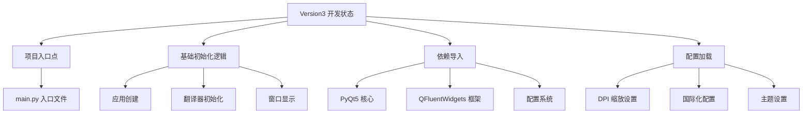
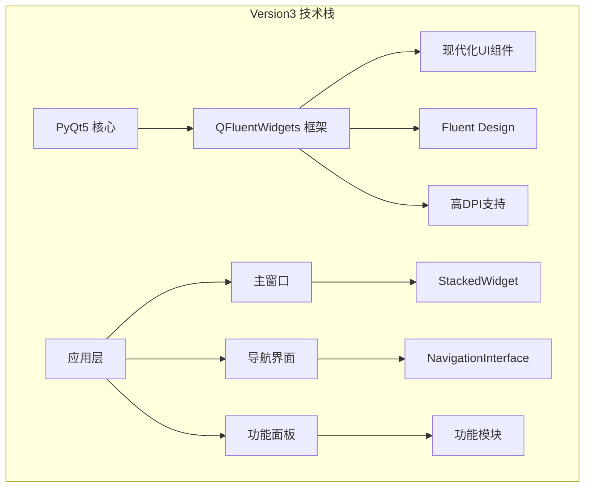
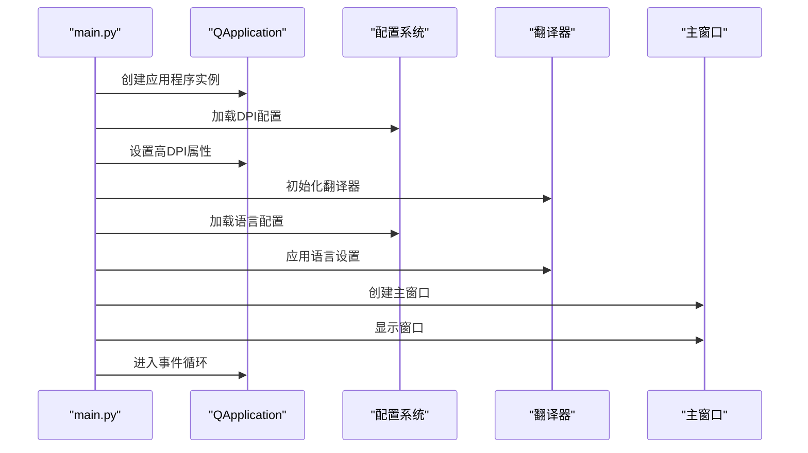
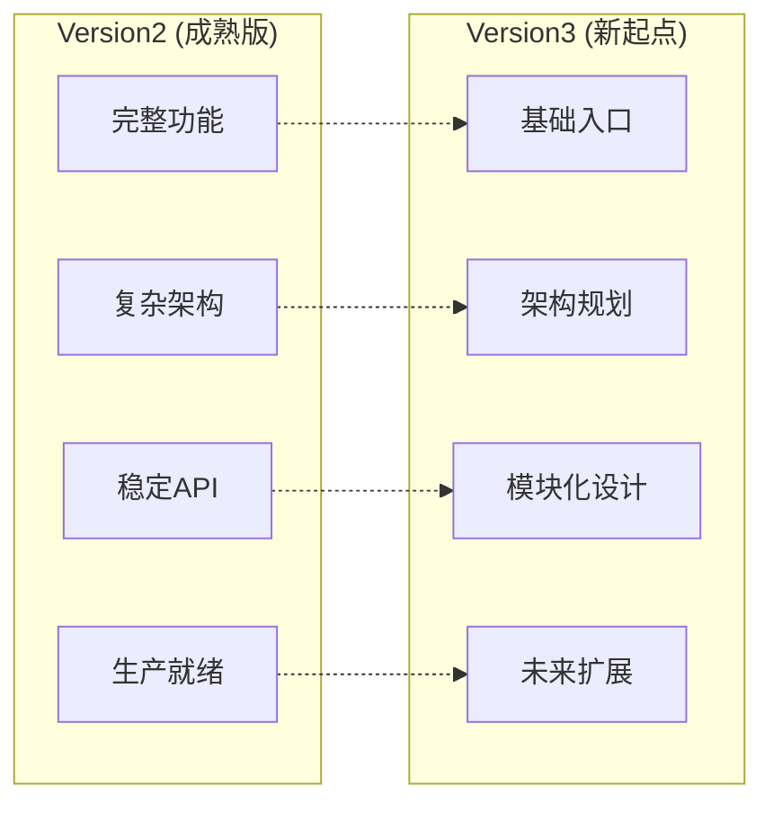
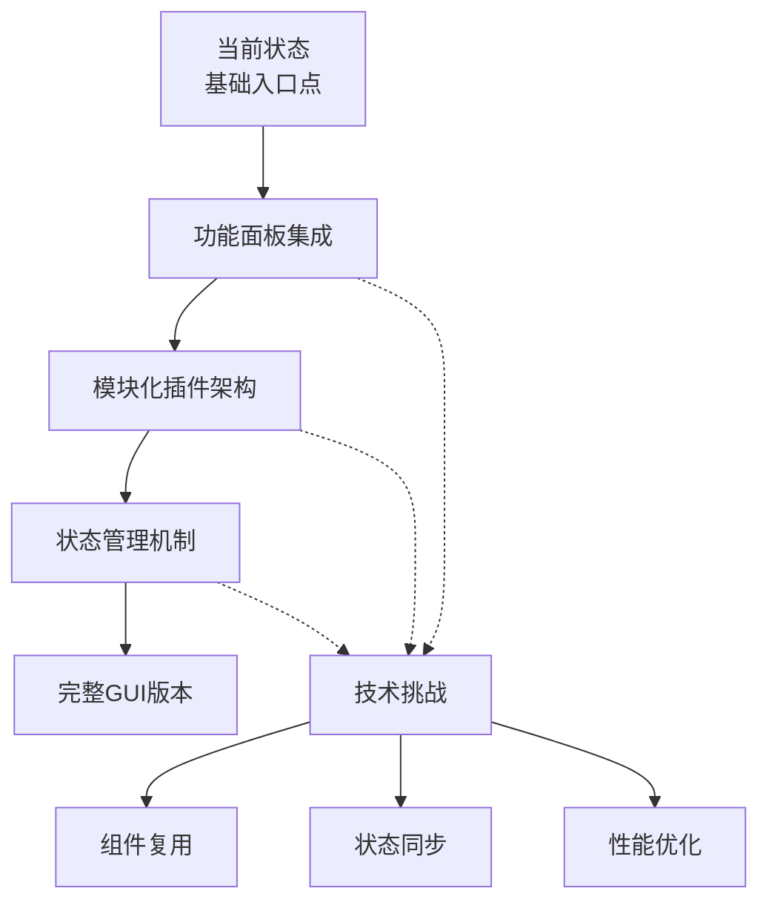
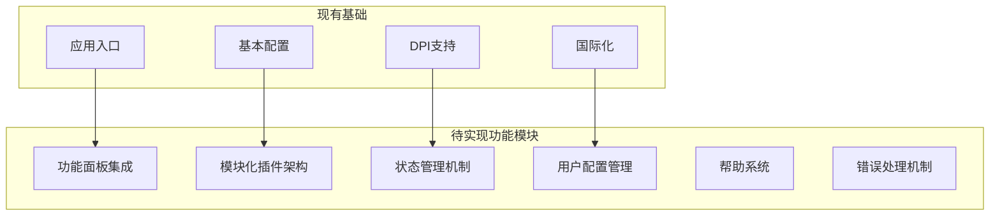
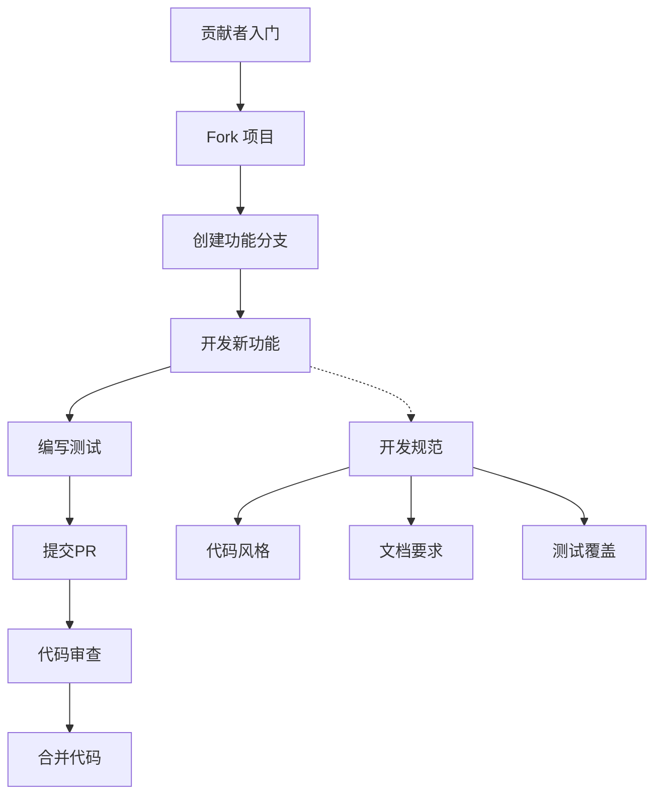

# python-office GUI Version3 概述

<cite>
**本文档引用的文件**
- [gui/qtpy/version3/main.py](file://gui/qtpy/version3/main.py)
- [gui/qtpy/version1/main.py](file://gui/qtpy/version1/main.py)
- [gui/qtpy/version2/gallery/demo.py](file://gui/qtpy/version2/gallery/demo.py)
- [gui/qtpy/version2/requirements.txt](file://gui/qtpy/version2/requirements.txt)
- [README.md](file://README.md)
</cite>

## 目录
1. [项目简介](#项目简介)
2. [Version3 当前状态分析](#version3-当前状态分析)
3. [技术架构概览](#技术架构概览)
4. [核心组件分析](#核心组件分析)
5. [与前代版本对比](#与前代版本对比)
6. [技术演进方向](#技术演进方向)
7. [功能缺失现状](#功能缺失现状)
8. [开发路线图](#开发路线图)
9. [贡献者指南](#贡献者指南)
10. [总结](#总结)

## 项目简介

python-office是一个专注于自动化办公的Python第三方库，旨在通过简洁的API解决大部分办公自动化问题。该项目采用模块化设计，支持多种办公场景，包括文档处理、图像处理、PDF操作、Excel操作等。

GUI Version3是该项目的新一代图形用户界面版本，标志着项目在用户体验和架构设计上的重要升级。虽然目前仍处于早期开发阶段，但已展现出向现代化、模块化GUI架构发展的趋势。

## Version3 当前状态分析

### 开发阶段评估

根据对`gui/qtpy/version3/main.py`文件的分析，Version3目前处于极其早期的开发阶段：



**图表来源**
- [gui/qtpy/version3/main.py](file://gui/qtpy/version3/main.py#L1-L56)

### 项目结构特点

Version3项目结构极其精简，仅包含以下核心元素：

1. **单一入口文件**：`main.py`作为整个GUI应用的启动点
2. **基础配置**：包含DPI缩放、国际化、主题等基础设置
3. **依赖关系**：明确使用PyQt5和QFluentWidgets框架

**章节来源**
- [gui/qtpy/version3/main.py](file://gui/qtpy/version3/main.py#L1-L56)

## 技术架构概览

### 基于QFluentWidgets框架

Version3明确选择了QFluentWidgets作为其GUI框架基础，这是一个专为Windows设计的现代UI框架，具有以下特点：



**图表来源**
- [gui/qtpy/version3/main.py](file://gui/qtpy/version3/main.py#L14-L18)

### 架构设计理念

Version3继承了QFluentWidgets的设计理念，强调：

1. **现代化设计语言**：采用Microsoft Fluent Design规范
2. **响应式布局**：支持高DPI显示器和动态缩放
3. **国际化支持**：内置多语言切换机制
4. **主题系统**：支持明暗主题自动切换

## 核心组件分析

### 应用程序初始化流程

Version3的应用程序初始化遵循标准的Qt应用程序模式：



**图表来源**
- [gui/qtpy/version3/main.py](file://gui/qtpy/version3/main.py#L21-L55)

### 配置管理系统

Version3采用了分层的配置管理策略：

| 配置类型 | 配置项 | 默认值 | 描述 |
|---------|--------|--------|------|
| DPI设置 | dpiScale | Auto | 自动DPI缩放策略 |
| 国际化 | language | AUTO | 语言自动检测 |
| 主题 | theme | Light/Dark | 明暗主题切换 |
| 窗口 | windowSize | 960x780 | 默认窗口尺寸 |

**章节来源**
- [gui/qtpy/version3/main.py](file://gui/qtpy/version3/main.py#L21-L49)

## 与前代版本对比

### Version1 vs Version3

| 特性 | Version1 | Version3 |
|------|----------|----------|
| 框架选择 | PyQt5 + qt_material | PyQt5 + QFluentWidgets |
| 设计风格 | Material Design | Fluent Design |
| 导航结构 | 简单界面 | 复杂导航系统 |
| 国际化 | 基础支持 | 完整多语言 |
| 主题系统 | 单一主题 | 明暗主题切换 |
| 开发状态 | 成熟版本 | 早期开发 |

### Version2 vs Version3

Version3相比Version2有以下改进：



**图表来源**
- [gui/qtpy/version1/main.py](file://gui/qtpy/version1/main.py#L1-L21)
- [gui/qtpy/version2/gallery/demo.py](file://gui/qtpy/version2/gallery/demo.py#L1-L46)

**章节来源**
- [gui/qtpy/version1/main.py](file://gui/qtpy/version1/main.py#L1-L21)
- [gui/qtpy/version2/gallery/demo.py](file://gui/qtpy/version2/gallery/demo.py#L1-L46)

## 技术演进方向

### 框架选择分析

Version3明确选择了QFluentWidgets作为技术基础，这一选择具有以下优势：

1. **设计一致性**：与Windows 10/11的设计语言保持一致
2. **性能优化**：针对现代硬件进行了深度优化
3. **生态系统**：丰富的组件库和社区支持
4. **可维护性**：清晰的架构设计和良好的文档

### 可能的技术演进路径



### 前端技术栈演进

虽然目前确定使用PyQt5+QFluentWidgets组合，但未来可能考虑的技术演进：

1. **跨平台支持**：扩展到macOS和Linux平台
2. **Web技术融合**：考虑WebView组件的使用
3. **移动端适配**：探索移动设备上的应用可能性
4. **云服务集成**：与云端办公服务的深度集成

## 功能缺失现状

### 当前缺失的核心模块

基于Version3的现状分析，以下核心功能模块尚未实现：



### 功能矩阵对比

| 功能类别 | Version3 | Version2 | 预期目标 |
|---------|----------|----------|----------|
| 应用启动 | ✓ 基础入口 | ✓ 完整启动 | ✓ 生产就绪 |
| 界面设计 | ✗ 基础框架 | ✓ 现代化设计 | ✓ Fluent Design |
| 导航系统 | ✗ 无导航 | ✓ 复杂导航 | ✓ 模块化导航 |
| 功能集成 | ✗ 空白界面 | ✓ 完整功能 | ✓ 功能面板 |
| 用户体验 | ✗ 基础交互 | ✓ 优秀体验 | ✓ 无缝体验 |

## 开发路线图

### 短期目标（1-3个月）

1. **基础功能完善**
   - 实现基本的功能面板布局
   - 添加导航栏和侧边菜单
   - 完善窗口管理和状态保存

2. **核心模块开发**
   - 文档处理模块集成
   - 图像处理模块集成
   - PDF处理模块集成

3. **用户体验优化**
   - 添加进度指示器
   - 实现拖拽功能
   - 优化键盘快捷键

### 中期目标（3-6个月）

1. **架构完善**
   - 实现插件化架构
   - 添加状态管理机制
   - 完善错误处理系统

2. **功能扩展**
   - 集成更多办公功能
   - 添加模板系统
   - 实现批处理功能

3. **性能优化**
   - 内存使用优化
   - 启动速度优化
   - 响应性能优化

### 长期目标（6-12个月）

1. **生态建设**
   - 开发插件市场
   - 建立开发者社区
   - 完善文档体系

2. **技术创新**
   - AI功能集成
   - 云端同步支持
   - 移动端适配

## 贡献者指南

### 如何参与开发

基于python-office项目的贡献模式，Version3的开发同样遵循以下原则：



### 开发环境搭建

1. **环境要求**
   - Python 3.7+
   - PyQt5
   - QFluentWidgets
   - 相关依赖包

2. **项目结构**
   ```
   gui/
   └── qtpy/
       ├── version3/
       │   └── main.py
       └── version2/
           └── gallery/
               └── demo.py
   ```

3. **开发流程**
   - 基于Version2的经验进行开发
   - 遵循QFluentWidgets的设计规范
   - 保持与Version1的兼容性

### 贡献指导原则

1. **代码质量**
   - 遵循PEP 8编码规范
   - 编写清晰的注释
   - 确保代码可读性

2. **功能设计**
   - 保持界面一致性
   - 注重用户体验
   - 支持国际化

3. **测试要求**
   - 编写单元测试
   - 进行集成测试
   - 确保跨平台兼容性

**章节来源**
- [README.md](file://README.md#L117-L135)

## 总结

python-office GUI Version3代表了项目在图形用户界面领域的重要突破。虽然目前仍处于早期开发阶段，仅包含项目入口点和基础初始化逻辑，但已经展现出向现代化、模块化GUI架构发展的明确方向。

### 关键成就

1. **技术选型明确**：确定使用QFluentWidgets作为GUI框架基础
2. **架构基础建立**：建立了配置管理、国际化、DPI支持等基础架构
3. **发展方向清晰**：明确了从基础入口到完整GUI产品的演进路径

### 发展机遇

1. **现代化用户体验**：利用QFluentWidgets提供现代化的Windows应用体验
2. **模块化架构**：为未来的功能扩展奠定坚实基础
3. **社区驱动发展**：基于开源社区的力量推动产品发展

### 挑战与展望

Version3的发展面临着功能完善、性能优化、用户体验提升等多重挑战。但基于其良好的技术基础和明确的发展方向，相信在不久的将来能够成为一个功能完整、用户体验优秀的办公自动化GUI解决方案。

对于希望参与贡献的开发者而言，Version3提供了良好的起点。基于Version2的丰富经验，结合Version3的现代化架构，可以快速参与到项目的开发中，共同推动python-office GUI版本的发展。