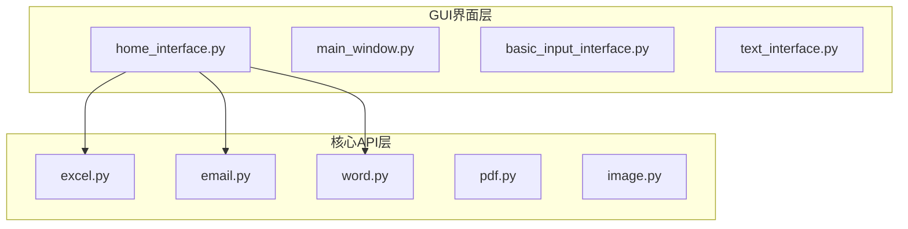
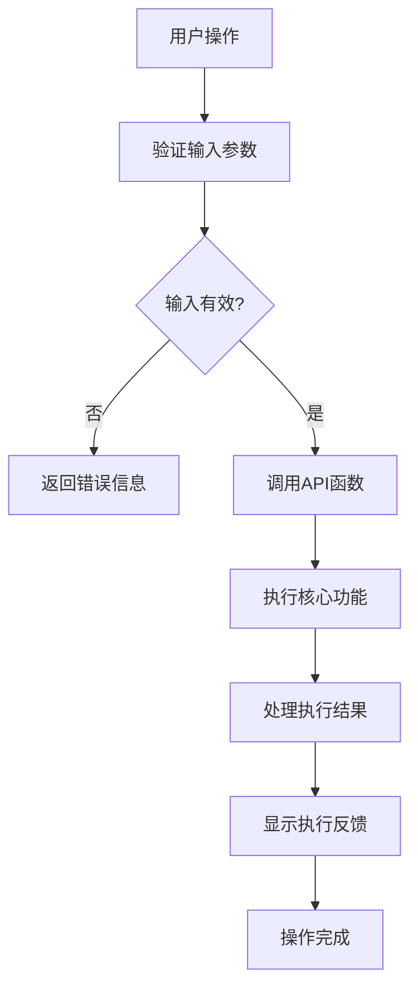
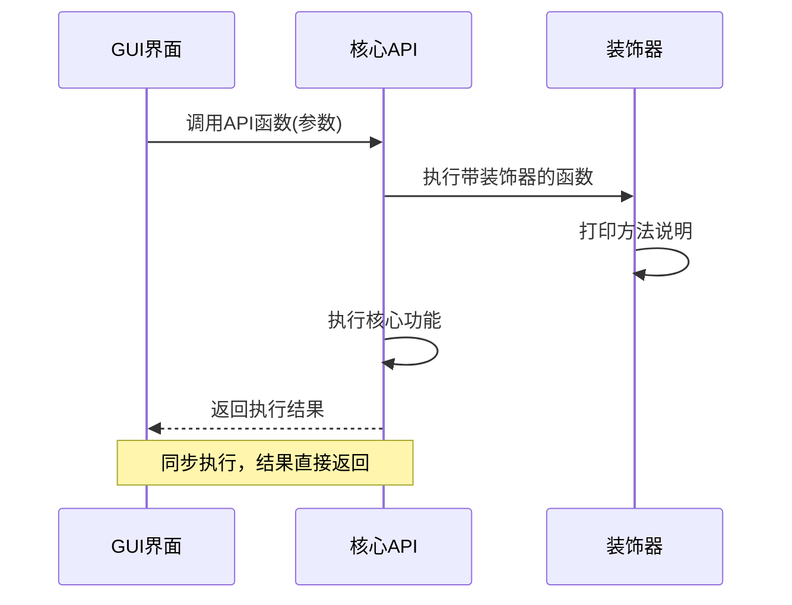
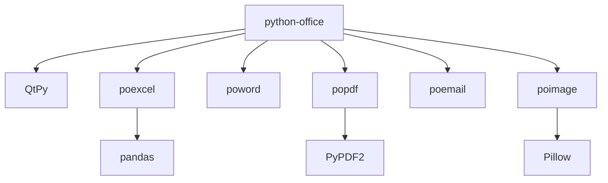

# 功能映射与集成

<cite>
**本文档中引用的文件**  
- [home_interface.py](file://gui/qtpy/version2/gallery/app/view/home_interface.py)
- [main_window.py](file://gui/qtpy/version2/gallery/app/view/main_window.py)
- [excel.py](file://office/api/excel.py)
- [email.py](file://office/api/email.py)
- [word.py](file://office/api/word.py)
- [pdf.py](file://office/api/pdf.py)
- [image.py](file://office/api/image.py)
- [instruction_url.py](file://office/lib/decorator_utils/instruction_url.py)
- [basic_input_interface.py](file://gui/qtpy/version2/gallery/app/view/basic_input_interface.py)
- [text_interface.py](file://gui/qtpy/version2/gallery/app/view/text_interface.py)
</cite>

## 目录
1. [简介](#简介)
2. [项目结构](#项目结构)
3. [核心组件](#核心组件)
4. [架构概述](#架构概述)
5. [详细组件分析](#详细组件分析)
6. [依赖分析](#依赖分析)
7. [性能考虑](#性能考虑)
8. [故障排除指南](#故障排除指南)
9. [结论](#结论)

## 简介
本项目是一个基于Python的办公自动化工具集，提供了丰富的GUI界面与核心API功能的集成。系统通过QtPy框架构建现代化的用户界面，同时封装了多个办公文档处理功能，包括Excel、Word、PDF、邮件、图片等操作。GUI界面通过清晰的导航结构将用户操作映射到后端API，实现了直观易用的办公自动化体验。

## 项目结构
项目采用分层架构设计，主要分为GUI界面层和核心API层。GUI界面位于`gui/qtpy/version2/gallery/app/view/`目录下，采用Fluent Design风格，包含多个功能界面模块。核心API位于`office/api/`目录下，每个文件对应一个功能模块，如`excel.py`、`word.py`等。这种分离设计使得界面与功能逻辑解耦，便于维护和扩展。

**图源**  
- [home_interface.py](file://gui/qtpy/version2/gallery/app/view/home_interface.py)
- [excel.py](file://office/api/excel.py)
- [email.py](file://office/api/email.py)
- [word.py](file://office/api/word.py)
- [pdf.py](file://office/api/pdf.py)
- [image.py](file://office/api/image.py)

## 核心组件
系统的核心组件包括GUI界面模块和API功能模块。GUI界面通过`main_window.py`中的`MainWindow`类统一管理各个功能界面，使用`StackedWidget`实现界面切换。核心API模块通过简单的函数封装调用底层库（如poexcel、poword等），提供简洁的接口供GUI调用。参数传递通过函数参数直接传递，结果反馈通过异常处理和日志输出实现。

**节源**  
- [main_window.py](file://gui/qtpy/version2/gallery/app/view/main_window.py)
- [excel.py](file://office/api/excel.py)

## 架构概述
系统采用典型的MVC（Model-View-Controller）架构模式，其中GUI界面作为View层，API函数作为Controller层，底层办公库作为Model层。这种架构实现了关注点分离，使得界面设计与业务逻辑解耦。GUI界面通过事件驱动机制响应用户操作，调用相应的API函数，并将执行结果反馈给用户。

**图源**  
- [home_interface.py](file://gui/qtpy/version2/gallery/app/view/home_interface.py)
- [main_window.py](file://gui/qtpy/version2/gallery/app/view/main_window.py)

## 详细组件分析

### GUI与API映射机制分析
系统通过清晰的界面导航结构将用户操作映射到具体的API功能。在`home_interface.py`中，`HomeInterface`类通过`loadSamples`方法加载各个功能分类，每个分类对应一个API模块。例如，"自动化办公 - 功能分类"分类中的按钮对应`office/api/`下的具体功能。

**图源**  
- [home_interface.py](file://gui/qtpy/version2/gallery/app/view/home_interface.py)
- [main_window.py](file://gui/qtpy/version2/gallery/app/view/main_window.py)

**节源**  
- [home_interface.py](file://gui/qtpy/version2/gallery/app/view/home_interface.py)
- [main_window.py](file://gui/qtpy/version2/gallery/app/view/main_window.py)

### 参数传递与结果反馈机制
系统通过函数参数直接传递用户输入，API函数执行完成后通过异常处理机制反馈结果。在`instruction_url.py`中定义的`instruction`装饰器为每个API调用提供了运行时说明，增强了用户体验。当API函数执行时，装饰器会打印当前运行的方法及其使用说明链接。

**图源**  
- [instruction_url.py](file://office/lib/decorator_utils/instruction_url.py)
- [excel.py](file://office/api/excel.py)

**节源**  
- [instruction_url.py](file://office/lib/decorator_utils/instruction_url.py)

### 已封装功能范围
系统已封装了广泛的办公自动化功能，涵盖文档处理、文件管理、邮件操作等多个方面。通过分析API模块，可以确定当前支持的功能范围：

| 功能类别 | 具体功能 | 状态 |
|---------|---------|------|
| 文档转换 | Excel转PDF、PDF转Word、Word转PDF | 已支持 |
| 文件处理 | Excel合并拆分、PDF合并加密、图片加水印 | 已支持 |
| 邮件操作 | 发送邮件、接收邮件 | 已支持 |
| 图片处理 | 图片压缩、生成词云、二维码识别 | 已支持 |
| 其他功能 | PPT处理、视频处理、微信机器人 | 部分支持 |

**节源**  
- [excel.py](file://office/api/excel.py)
- [pdf.py](file://office/api/pdf.py)
- [word.py](file://office/api/word.py)
- [image.py](file://office/api/image.py)
- [email.py](file://office/api/email.py)

### 未支持功能模块
尽管系统已支持大量功能，但仍有一些功能模块尚未完全支持或需要进一步完善：

1. **邮件接收功能**：`email.py`中的`receive_email`函数存在但未完善
2. **部分PPT功能**：如PPT转图片等功能需要进一步测试
3. **微信机器人功能**：`wechat.py`中的部分功能需要依赖外部API
4. **OCR识别功能**：需要配置百度API密钥才能使用
5. **财务分析功能**：`pofinance`模块功能较为基础

这些未支持的功能主要由于依赖外部服务或需要特定环境配置，建议在文档中明确说明使用前提。

**节源**  
- [email.py](file://office/api/email.py)
- [wechat.py](file://office/api/wechat.py)
- [ocr.py](file://office/api/ocr.py)

### 新功能扩展开发指南
为了便于开发者扩展新功能，系统提供了清晰的开发模式和最佳实践：

#### 界面注册流程
1. 在`main_window.py`中导入新的界面模块
2. 在`MainWindow`类中创建新的界面实例
3. 使用`addSubInterface`方法将新界面添加到导航栏
4. 确保新界面继承`GalleryInterface`基类

#### API绑定最佳实践
1. 在`office/api/`目录下创建新的功能模块
2. 使用清晰的函数命名和完整的文档字符串
3. 添加`instruction`装饰器以提供使用说明
4. 保持参数简洁，使用合理的默认值
5. 实现完善的异常处理机制

#### 错误处理策略
1. 使用Python异常机制捕获和处理错误
2. 提供用户友好的错误信息
3. 记录详细的错误日志用于调试
4. 实现优雅的降级处理
5. 在GUI中显示适当的错误提示

**节源**  
- [main_window.py](file://gui/qtpy/version2/gallery/app/view/main_window.py)
- [instruction_url.py](file://office/lib/decorator_utils/instruction_url.py)

## 依赖分析
系统依赖关系清晰，主要依赖包括QtPy框架用于GUI界面，以及多个第三方库用于具体功能实现。通过`setup.py`文件可以查看完整的依赖列表。核心API模块通过简单的import语句调用底层库，如`poexcel`、`poword`等，实现了功能的封装和复用。

**图源**  
- [excel.py](file://office/api/excel.py)
- [word.py](file://office/api/word.py)
- [pdf.py](file://office/api/pdf.py)

**节源**  
- [excel.py](file://office/api/excel.py)
- [word.py](file://office/api/word.py)
- [pdf.py](file://office/api/pdf.py)

## 性能考虑
系统性能主要受文件操作和外部API调用影响。对于大文件处理，建议实现进度提示和异步执行机制。当前系统采用同步执行模式，对于耗时操作可能会导致界面卡顿。未来可以考虑引入多线程或异步处理机制来提升用户体验。

## 故障排除指南
常见问题主要集中在环境配置和依赖库安装方面。建议用户在使用前仔细阅读文档，确保所有依赖库正确安装。对于API调用失败的情况，可以通过查看装饰器输出的说明链接获取更多使用信息。日志记录功能可以帮助诊断问题原因。

**节源**  
- [instruction_url.py](file://office/lib/decorator_utils/instruction_url.py)

## 结论
本系统成功实现了GUI界面与核心API的映射关系，提供了一套完整的办公自动化解决方案。通过清晰的架构设计和模块化实现，系统具有良好的可维护性和扩展性。未来可以进一步完善异步执行机制，增强用户体验，并持续扩展新的办公自动化功能。