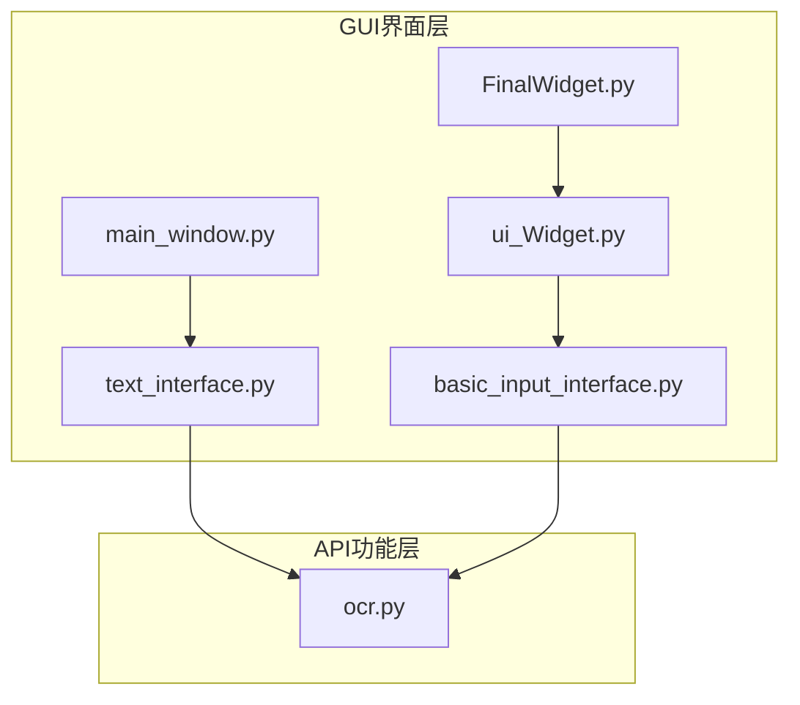
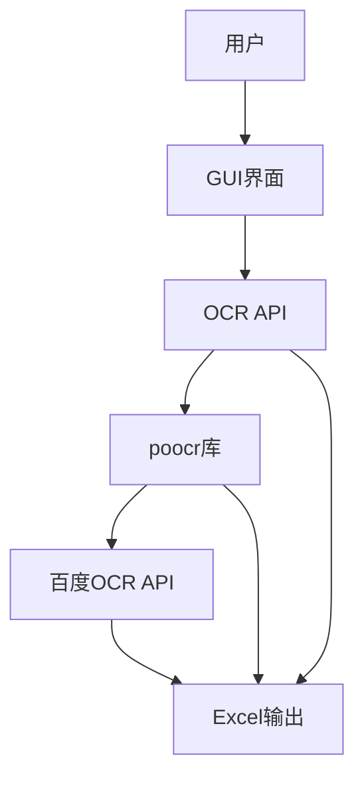
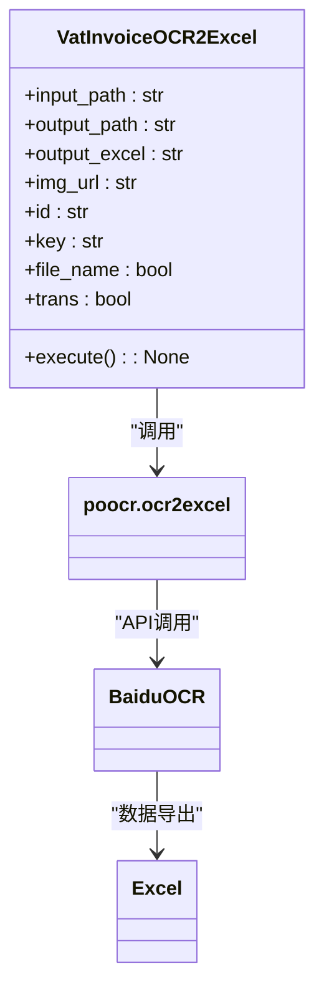
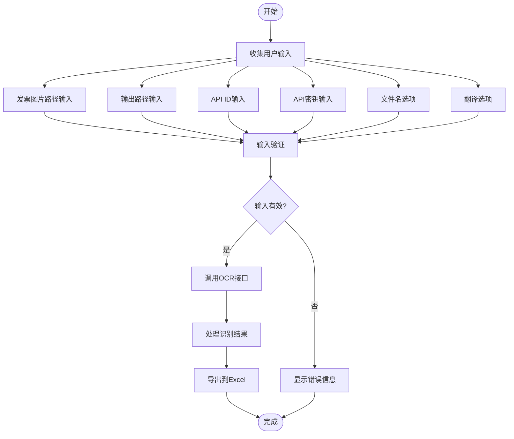
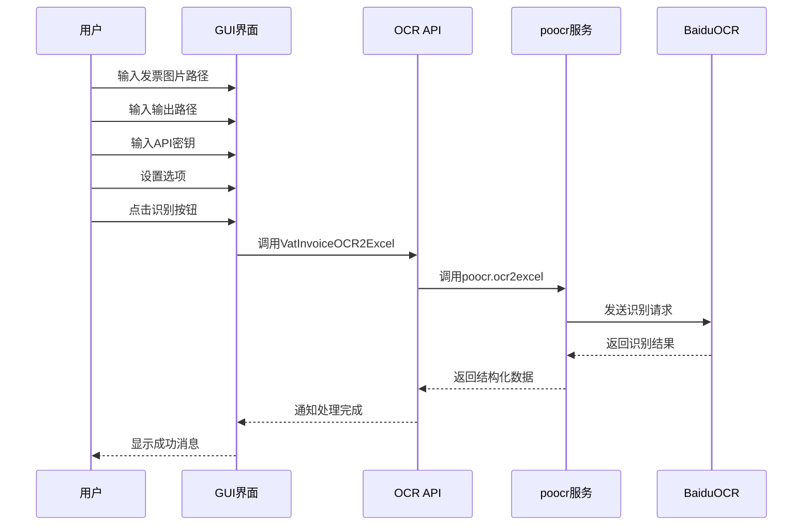
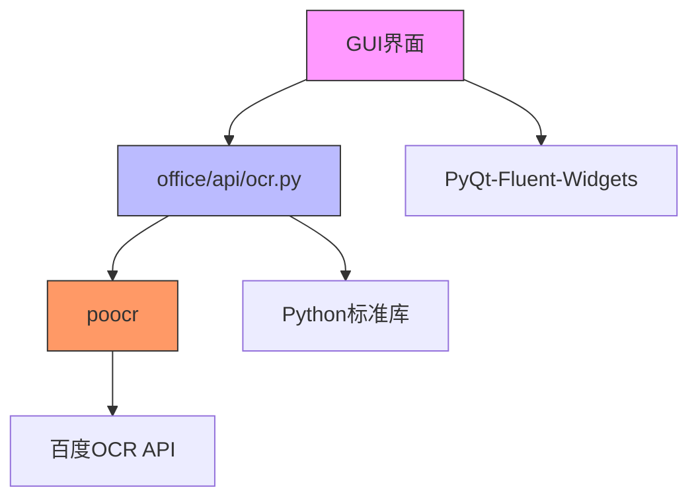

# OCR识别功能集成

<cite>
**本文档引用的文件**   
- [ocr.py](file://office/api/ocr.py)
- [text_interface.py](file://gui/qtpy/version2/gallery/app/view/text_interface.py)
- [main_window.py](file://gui/qtpy/version2/gallery/app/view/main_window.py)
- [basic_input_interface.py](file://gui/qtpy/version2/gallery/app/view/basic_input_interface.py)
- [FinalWidget.py](file://gui/qtpy/version1/customizeWindowPyfile/FinalWidget.py)
- [ui_Widget.py](file://gui/qtpy/version1/customizeWindowPyfile/ui/ui_Widget.py)
</cite>

## 目录
1. [简介](#简介)
2. [项目结构](#项目结构)
3. [核心组件](#核心组件)
4. [架构概述](#架构概述)
5. [详细组件分析](#详细组件分析)
6. [依赖分析](#依赖分析)
7. [性能考虑](#性能考虑)
8. [故障排除指南](#故障排除指南)
9. [结论](#结论)

## 简介
本文档深入解析了GUI界面与OCR识别功能的集成技术细节。重点说明如何在图形用户界面中构建表单以收集增值税发票OCR识别所需的关键参数，包括发票图片路径、输出位置、API密钥等。文档详细描述了用户输入数据如何从GUI组件传递到后端OCR接口，并处理可能的认证错误或识别失败。通过完整的集成示例，展示了用户上传增值税发票图片后，系统自动调用百度OCR API并将结构化数据导出到Excel文件的全过程。

## 项目结构
该项目采用分层架构设计，将GUI界面与核心功能API分离。主要结构包括：
- **gui/qtpy/**: 包含基于PyQt-Fluent-Widgets的图形用户界面实现
- **office/api/**: 包含核心功能API，其中ocr.py提供OCR识别功能
- **examples/**: 包含各种功能的使用示例
- **tests/**: 包含单元测试代码

GUI界面采用模块化设计，通过不同的界面组件（如text_interface.py、basic_input_interface.py）构建完整的用户交互体验，而核心OCR功能则封装在独立的API模块中，实现了关注点分离。

**图表来源**
- [text_interface.py](file://gui/qtpy/version2/gallery/app/view/text_interface.py)
- [basic_input_interface.py](file://gui/qtpy/version2/gallery/app/view/basic_input_interface.py)
- [main_window.py](file://gui/qtpy/version2/gallery/app/view/main_window.py)
- [FinalWidget.py](file://gui/qtpy/version1/customizeWindowPyfile/FinalWidget.py)
- [ui_Widget.py](file://gui/qtpy/version1/customizeWindowPyfile/ui/ui_Widget.py)
- [ocr.py](file://office/api/ocr.py)

## 核心组件

**文档来源**
- [ocr.py](file://office/api/ocr.py#L6-L28)
- [text_interface.py](file://gui/qtpy/version2/gallery/app/view/text_interface.py#L8-L75)

## 架构概述
系统采用典型的分层架构，将用户界面与业务逻辑分离。用户通过GUI界面输入参数，这些参数通过事件驱动机制传递给后端OCR服务。系统主要由三个层次组成：表示层（GUI）、应用层（API接口）和数据处理层（poocr库）。

**图表来源**
- [ocr.py](file://office/api/ocr.py#L6-L28)
- [text_interface.py](file://gui/qtpy/version2/gallery/app/view/text_interface.py#L8-L75)

## 详细组件分析

### OCR功能组件分析
VatInvoiceOCR2Excel函数是OCR识别功能的核心，负责将增值税发票图片中的信息提取并导出到Excel文件中。该函数封装了对poocr库的调用，提供了简化的API接口。

**图表来源**
- [ocr.py](file://office/api/ocr.py#L6-L28)

### GUI表单组件分析
GUI界面通过text_interface.py和basic_input_interface.py中的组件构建表单，收集用户输入的OCR识别参数。系统使用了多种输入控件来收集不同类型的数据。

**图表来源**
- [text_interface.py](file://gui/qtpy/version2/gallery/app/view/text_interface.py#L8-L75)
- [basic_input_interface.py](file://gui/qtpy/version2/gallery/app/view/basic_input_interface.py#L11-L143)

### 数据流分析
系统实现了从用户界面到后端服务的完整数据流。用户在GUI中输入参数后，这些参数通过事件处理机制传递给OCR服务。

**图表来源**
- [ocr.py](file://office/api/ocr.py#L6-L28)
- [text_interface.py](file://gui/qtpy/version2/gallery/app/view/text_interface.py#L8-L75)

## 依赖分析
系统依赖关系清晰，主要依赖包括：

**图表来源**
- [go.mod](file://go.mod#L1-L20)
- [ocr.py](file://office/api/ocr.py#L1-L28)

## 性能考虑
在OCR识别功能的集成中，性能主要受以下几个因素影响：
1. 网络延迟：与百度OCR API的通信时间
2. 图像处理：发票图片的大小和质量
3. 数据处理：识别结果的解析和Excel导出
4. 用户界面响应：GUI的流畅度

建议用户在使用时选择网络状况良好的环境，并确保发票图片清晰可读，以获得最佳的识别效果和性能表现。

## 故障排除指南
在使用OCR识别功能时，可能会遇到以下常见问题：

**文档来源**
- [ocr.py](file://office/api/ocr.py#L6-L28)
- [test_ocr.py](file://tests/test_code/test_ocr.py#L26-L34)

## 结论
本文档详细解析了GUI界面与OCR识别功能的集成技术。通过分析代码结构，我们了解到系统采用分层架构设计，将用户界面与核心功能分离。GUI界面通过多种输入组件收集用户参数，这些参数通过清晰的数据流传递给后端OCR服务。整个集成过程体现了良好的软件工程实践，包括关注点分离、模块化设计和清晰的依赖管理。用户可以通过简单的界面操作，实现复杂的发票信息识别和数据导出功能。