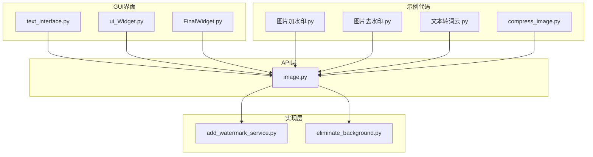
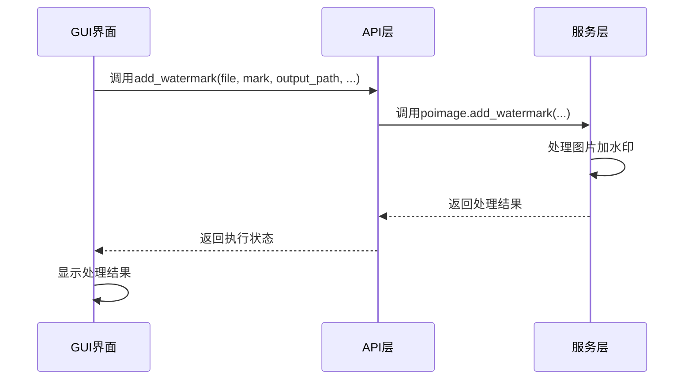
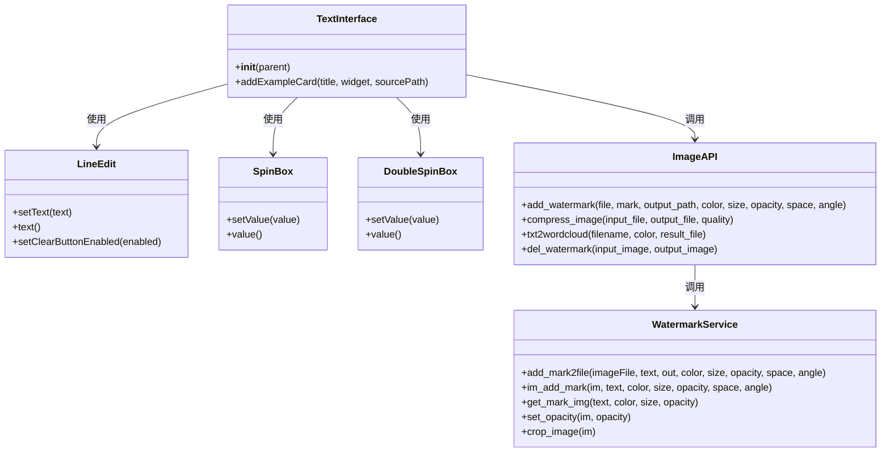
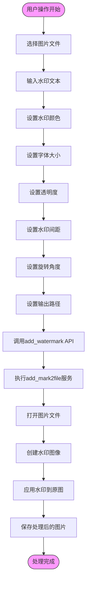
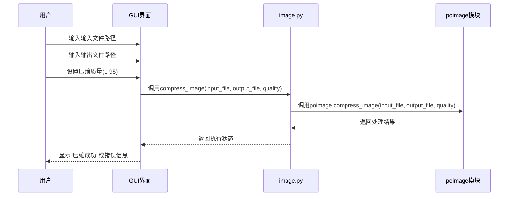
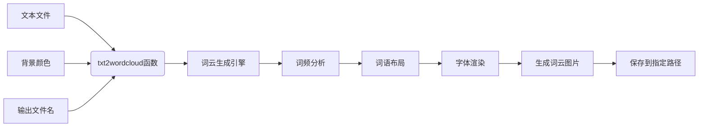
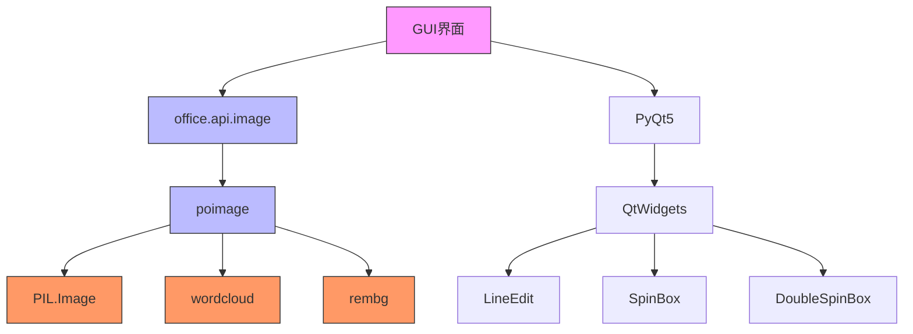
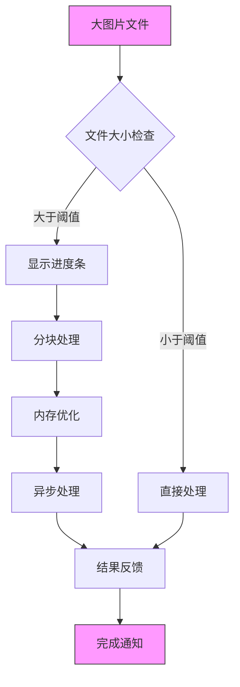
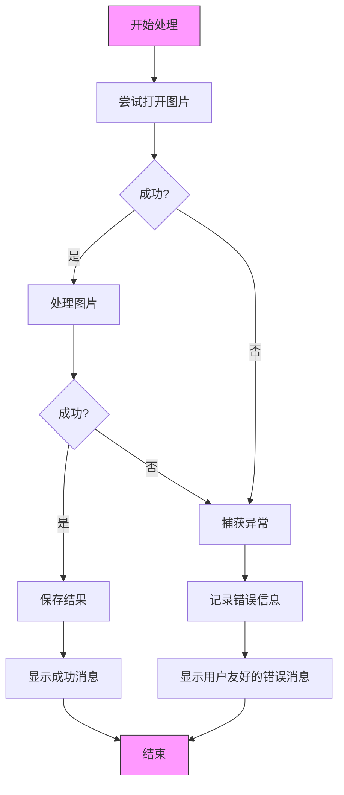

# 图片处理功能集成

<cite>
**本文档引用的文件**
- [text_interface.py](file://gui/qtpy/version2/gallery/app/view/text_interface.py)
- [image.py](file://office/api/image.py)
- [add_watermark_service.py](file://office/lib/image/add_watermark_service.py)
- [eliminate_background.py](file://office/lib/image/eliminate_background.py)
- [ui_Widget.py](file://gui/qtpy/version1/customizeWindowPyfile/ui/ui_Widget.py)
- [FinalWidget.py](file://gui/qtpy/version1/customizeWindowPyfile/FinalWidget.py)
- [图片加水印.py](file://examples/poimage/图片加水印.py)
- [图片去水印.py](file://examples/poimage/图片去水印.py)
- [文本转词云.py](file://examples/poimage/文本转词云.py)
- [compress_image.py](file://examples/poimage_demo/compress_image.py)
- [数据可视化-文章转图云.py](file://examples/pydatav/数据可视化-文章转图云.py)
</cite>

## 目录
1. [简介](#简介)
2. [项目结构](#项目结构)
3. [核心组件](#核心组件)
4. [架构概述](#架构概述)
5. [详细组件分析](#详细组件分析)
6. [依赖分析](#依赖分析)
7. [性能考虑](#性能考虑)
8. [故障排除指南](#故障排除指南)
9. [结论](#结论)

## 简介
本文档详细说明了Python-Office项目中GUI界面与图片处理功能的集成实现。重点分析了GUI界面中的输入组件如何与核心图片处理功能进行对接，包括图片压缩、加水印、去水印和生成词云等操作。文档提供了从用户界面操作到调用底层模块执行处理的完整数据流示例，解释了函数参数如何映射到GUI控件，并展示了处理结果的反馈机制。

## 项目结构
Python-Office项目的图片处理功能分布在多个目录中，形成了清晰的分层架构。GUI界面位于`gui/qtpy/version2/gallery/app/view/`目录下，核心API功能位于`office/api/`目录，而具体的实现逻辑则在`office/lib/image/`目录中。

**图示来源**
- [text_interface.py](file://gui/qtpy/version2/gallery/app/view/text_interface.py)
- [image.py](file://office/api/image.py)
- [add_watermark_service.py](file://office/lib/image/add_watermark_service.py)
- [eliminate_background.py](file://office/lib/image/eliminate_background.py)
- [ui_Widget.py](file://gui/qtpy/version1/customizeWindowPyfile/ui/ui_Widget.py)
- [FinalWidget.py](file://gui/qtpy/version1/customizeWindowPyfile/FinalWidget.py)

**节来源**
- [gui/qtpy/version2/gallery/app/view/text_interface.py](file://gui/qtpy/version2/gallery/app/view/text_interface.py)
- [office/api/image.py](file://office/api/image.py)
- [office/lib/image/add_watermark_service.py](file://office/lib/image/add_watermark_service.py)

## 核心组件
本项目的核心图片处理功能包括图片压缩、加水印、去水印和生成词云。这些功能通过清晰的分层架构实现：GUI界面负责用户交互，API层提供统一的接口，实现层包含具体的业务逻辑。

**节来源**
- [office/api/image.py](file://office/api/image.py#L5-L152)
- [office/lib/image/add_watermark_service.py](file://office/lib/image/add_watermark_service.py#L1-L139)
- [office/lib/image/eliminate_background.py](file://office/lib/image/eliminate_background.py#L1-L72)

## 架构概述
Python-Office的图片处理功能采用分层架构设计，确保了界面与业务逻辑的分离。用户通过GUI界面进行操作，界面组件收集用户输入并调用API层函数，API层函数再调用底层实现模块完成具体处理。

**图示来源**
- [image.py](file://office/api/image.py#L35-L52)
- [add_watermark_service.py](file://office/lib/image/add_watermark_service.py#L114-L139)

## 详细组件分析

### 图片加水印功能分析
图片加水印功能是本项目的核心功能之一，实现了从用户界面到后端处理的完整流程。用户在GUI界面输入参数，系统调用相应的API函数，最终由底层服务完成图片处理。

#### 类图

**图示来源**
- [text_interface.py](file://gui/qtpy/version2/gallery/app/view/text_interface.py#L8-L75)
- [image.py](file://office/api/image.py#L35-L52)
- [add_watermark_service.py](file://office/lib/image/add_watermark_service.py#L114-L139)

#### 参数映射流程

**图示来源**
- [image.py](file://office/api/image.py#L35-L52)
- [add_watermark_service.py](file://office/lib/image/add_watermark_service.py#L114-L139)

**节来源**
- [text_interface.py](file://gui/qtpy/version2/gallery/app/view/text_interface.py#L8-L75)
- [image.py](file://office/api/image.py#L35-L52)
- [add_watermark_service.py](file://office/lib/image/add_watermark_service.py#L114-L139)

### 图片压缩功能分析
图片压缩功能允许用户减小图片文件大小，同时尽量保持视觉质量。该功能通过简单的参数设置即可完成高效的图片压缩。

#### 序列图

**图示来源**
- [image.py](file://office/api/image.py#L5-L17)
- [compress_image.py](file://examples/poimage_demo/compress_image.py#L5-L7)

### 词云生成功能分析
词云生成功能将文本内容转换为可视化图形，通过分析文本中词语的频率来生成具有视觉吸引力的词云图像。

#### 数据流图

**图示来源**
- [image.py](file://office/api/image.py#L94-L106)
- [数据可视化-文章转图云.py](file://examples/pydatav/数据可视化-文章转图云.py#L6-L9)

## 依赖分析
图片处理功能的实现依赖于多个外部库和内部模块，形成了复杂的依赖关系网络。

**图示来源**
- [office/api/image.py](file://office/api/image.py)
- [office/lib/image/add_watermark_service.py](file://office/lib/image/add_watermark_service.py)
- [office/lib/image/eliminate_background.py](file://office/lib/image/eliminate_background.py)

**节来源**
- [office/api/image.py](file://office/api/image.py)
- [office/lib/image/add_watermark_service.py](file://office/lib/image/add_watermark_service.py)
- [office/lib/image/eliminate_background.py](file://office/lib/image/eliminate_background.py)

## 性能考虑
在处理大图片文件时，系统需要考虑内存使用、处理时间和用户体验等方面的性能优化策略。

### 大文件处理优化

**图示来源**
- [add_watermark_service.py](file://office/lib/image/add_watermark_service.py#L130-L137)
- [eliminate_background.py](file://office/lib/image/eliminate_background.py#L29-L62)

### 异常处理机制
系统实现了完善的异常处理机制，确保在处理过程中出现错误时能够提供清晰的反馈信息。

**图示来源**
- [add_watermark_service.py](file://office/lib/image/add_watermark_service.py#L129-L139)
- [eliminate_background.py](file://office/lib/image/eliminate_background.py#L29-L62)

## 故障排除指南
当图片处理功能出现问题时，可以参考以下常见问题及解决方案。

**节来源**
- [add_watermark_service.py](file://office/lib/image/add_watermark_service.py#L138-L139)
- [eliminate_background.py](file://office/lib/image/eliminate_background.py#L61-L62)
- [图片去水印.py](file://examples/poimage/图片去水印.py#L8-L11)

## 结论
Python-Office项目的图片处理功能通过清晰的分层架构实现了GUI界面与核心功能的高效集成。系统采用模块化设计，将用户界面、API接口和业务逻辑分离，提高了代码的可维护性和可扩展性。通过合理的参数映射和异常处理机制，确保了用户友好的操作体验和系统的稳定性。