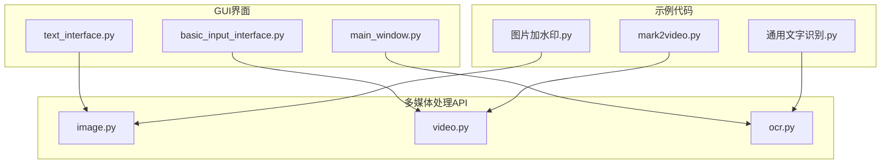
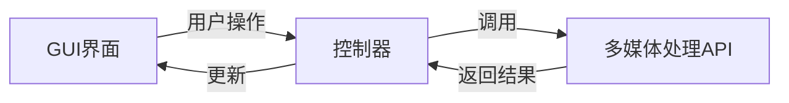
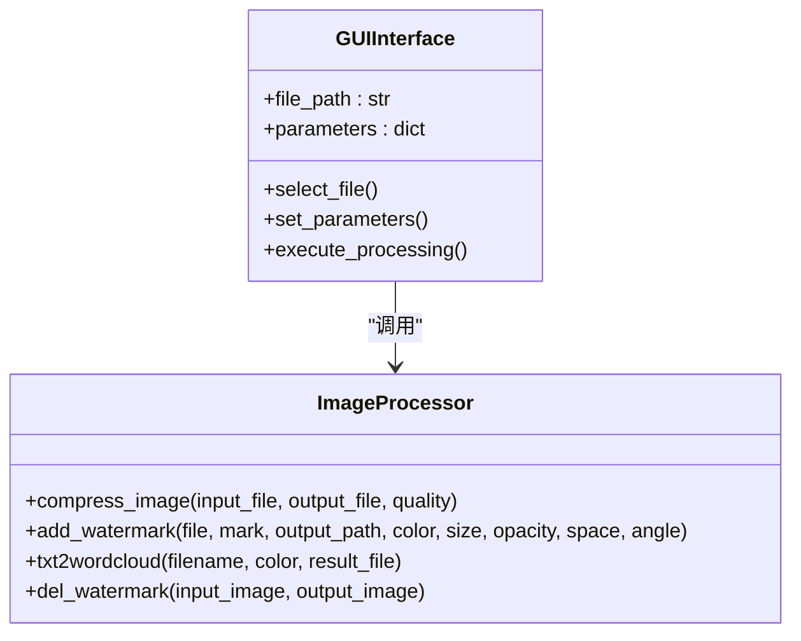
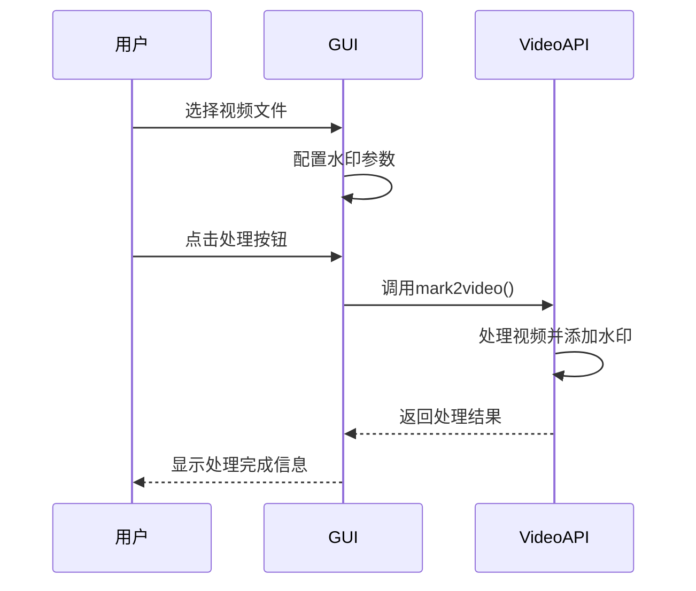
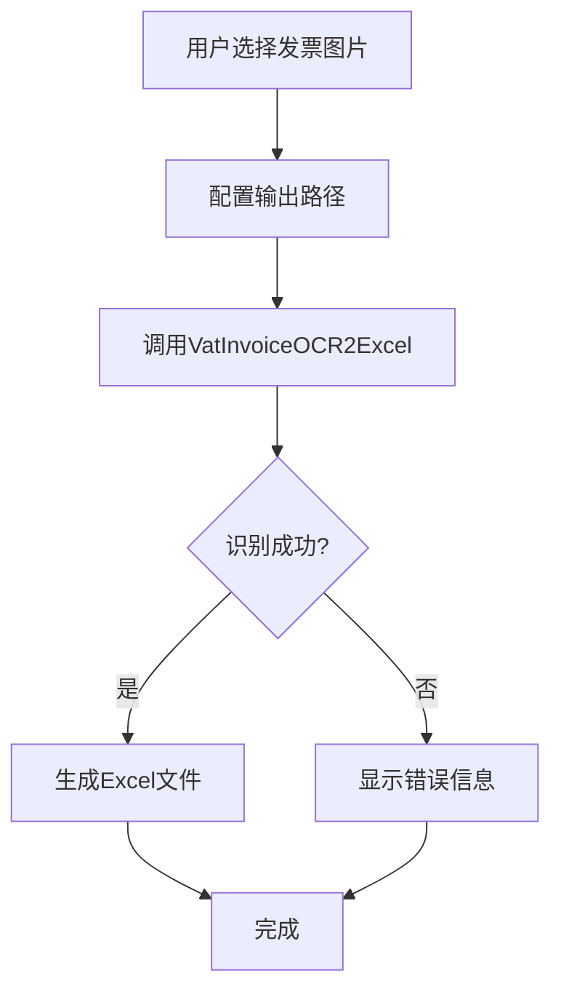
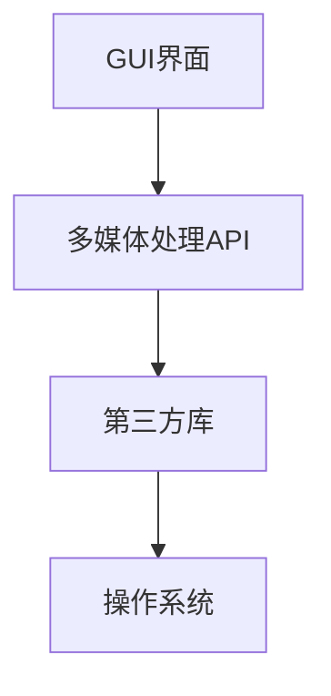

# 多媒体处理功能集成

<cite>
**本文档引用的文件**
- [text_interface.py](file://gui/qtpy/version2/gallery/app/view/text_interface.py)
- [image.py](file://office/api/image.py)
- [video.py](file://office/api/video.py)
- [ocr.py](file://office/api/ocr.py)
- [main_window.py](file://gui/qtpy/version2/gallery/app/view/main_window.py)
- [basic_input_interface.py](file://gui/qtpy/version2/gallery/app/view/basic_input_interface.py)
- [ui_Widget.py](file://gui/qtpy/version1/customizeWindowPyfile/ui/ui_Widget.py)
- [图片加水印.py](file://examples/poimage/图片加水印.py)
- [通用文字识别.py](file://examples/poocr/通用文字识别.py)
- [mark2video.py](file://examples/povideo/mark2video.py)
</cite>

## 目录
1. [简介](#简介)
2. [项目结构](#项目结构)
3. [核心组件](#核心组件)
4. [架构概述](#架构概述)
5. [详细组件分析](#详细组件分析)
6. [依赖分析](#依赖分析)
7. [性能考虑](#性能考虑)
8. [故障排除指南](#故障排除指南)
9. [结论](#结论)

## 简介
本文档全面说明了Python-Office项目中GUI界面与多媒体处理功能（图片处理、视频标注、OCR识别）的集成方案。重点分析了GUI界面中输入组件如何与多媒体处理API进行交互，包括文件选择、参数配置和处理结果展示等流程。

## 项目结构
该项目采用分层架构设计，将GUI界面与核心功能分离。GUI界面位于`gui/qtpy/version2/gallery/app/view/`目录下，而多媒体处理功能则封装在`office/api/`目录中。这种设计实现了界面与业务逻辑的解耦，便于维护和扩展。

**图示来源**
- [text_interface.py](file://gui/qtpy/version2/gallery/app/view/text_interface.py)
- [image.py](file://office/api/image.py)
- [video.py](file://office/api/video.py)
- [ocr.py](file://office/api/ocr.py)

**章节来源**
- [gui/qtpy/version2/gallery/app/view/](file://gui/qtpy/version2/gallery/app/view/)
- [office/api/](file://office/api/)

## 核心组件
系统的核心组件包括GUI界面组件和多媒体处理API。GUI界面基于QtPy框架构建，提供了现代化的用户交互体验。多媒体处理API则封装了图片处理、视频标注和OCR识别等核心功能，通过简洁的接口供GUI调用。

**章节来源**
- [main_window.py](file://gui/qtpy/version2/gallery/app/view/main_window.py)
- [image.py](file://office/api/image.py)
- [video.py](file://office/api/video.py)
- [ocr.py](file://office/api/ocr.py)

## 架构概述
系统采用典型的MVC（Model-View-Controller）架构模式。GUI界面作为View层，负责用户交互；多媒体处理API作为Model层，负责数据处理；而事件处理和流程控制则作为Controller层，协调View和Model之间的交互。

**图示来源**
- [main_window.py](file://gui/qtpy/version2/gallery/app/view/main_window.py)
- [image.py](file://office/api/image.py)
- [video.py](file://office/api/video.py)
- [ocr.py](file://office/api/ocr.py)

## 详细组件分析
### 图片处理功能分析
图片处理功能通过`office/api/image.py`文件中的函数实现，支持图片压缩、添加水印、生成词云等多种操作。GUI界面通过参数配置和文件选择组件与这些功能进行交互。

#### 图片处理类图

**图示来源**
- [image.py](file://office/api/image.py)
- [ui_Widget.py](file://gui/qtpy/version1/customizeWindowPyfile/ui/ui_Widget.py)

### 视频标注功能分析
视频标注功能通过`office/api/video.py`文件中的`mark2video`函数实现，允许用户为视频添加文字水印。该功能在`examples/povideo/mark2video.py`中有具体使用示例。

#### 视频标注序列图

**图示来源**
- [video.py](file://office/api/video.py)
- [mark2video.py](file://examples/povideo/mark2video.py)

### OCR识别功能分析
OCR识别功能通过`office/api/ocr.py`文件中的`VatInvoiceOCR2Excel`函数实现，能够将增值税发票图片中的文字识别并导出到Excel文件中。

#### OCR识别流程图

**图示来源**
- [ocr.py](file://office/api/ocr.py)
- [通用文字识别.py](file://examples/poocr/通用文字识别.py)

**章节来源**
- [ocr.py](file://office/api/ocr.py)
- [通用文字识别.py](file://examples/poocr/通用文字识别.py)

## 依赖分析
系统各组件之间的依赖关系清晰，GUI界面依赖于多媒体处理API，而API又依赖于底层的第三方库。这种分层依赖结构确保了系统的可维护性和可扩展性。

**图示来源**
- [main_window.py](file://gui/qtpy/version2/gallery/app/view/main_window.py)
- [image.py](file://office/api/image.py)
- [video.py](file://office/api/video.py)
- [ocr.py](file://office/api/ocr.py)

**章节来源**
- [gui/qtpy/version2/gallery/app/view/](file://gui/qtpy/version2/gallery/app/view/)
- [office/api/](file://office/api/)

## 性能考虑
对于大文件处理，系统应实现进度显示和异步处理机制，避免界面冻结。同时，应提供合理的默认参数，减少用户配置负担。对于网络依赖的功能（如OCR识别），需要实现错误重试和超时处理机制。

**章节来源**
- [image.py](file://office/api/image.py)
- [video.py](file://office/api/video.py)
- [ocr.py](file://office/api/ocr.py)

## 故障排除指南
常见问题包括文件路径错误、参数配置不当和网络连接问题。建议在GUI界面中提供详细的错误提示信息，并在日志中记录详细的处理过程，便于问题排查。

**章节来源**
- [image.py](file://office/api/image.py)
- [video.py](file://office/api/video.py)
- [ocr.py](file://office/api/ocr.py)

## 结论
Python-Office项目的GUI界面与多媒体处理功能集成方案设计合理，通过清晰的接口定义和分层架构，实现了用户友好的交互体验和强大的多媒体处理能力。未来可进一步优化大文件处理性能，并增加更多多媒体处理功能。