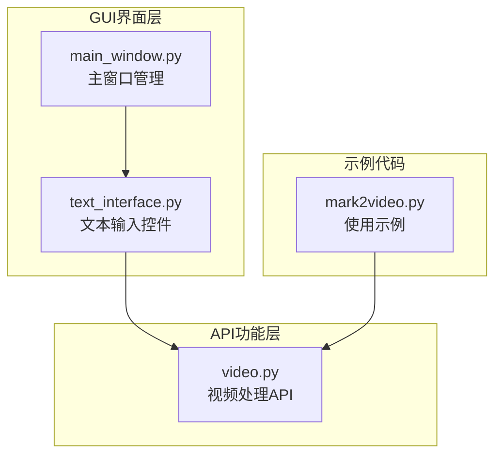
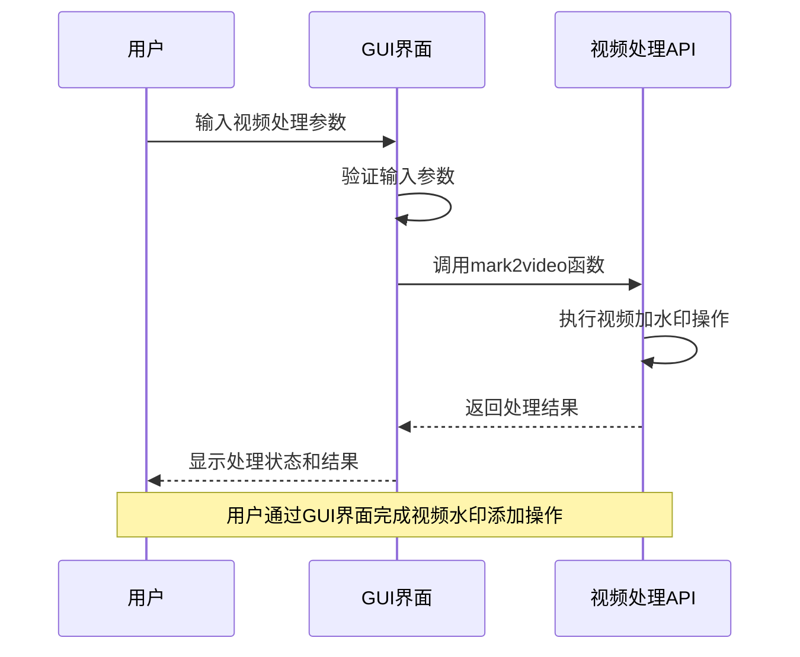
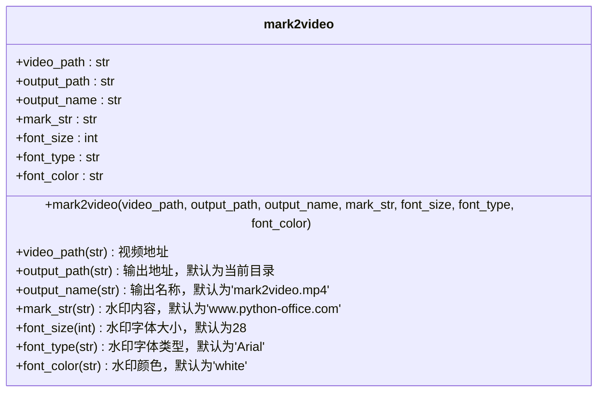
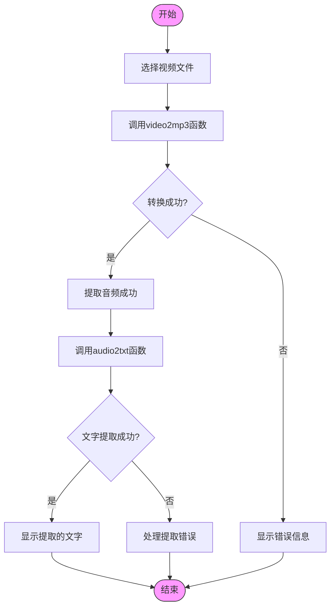
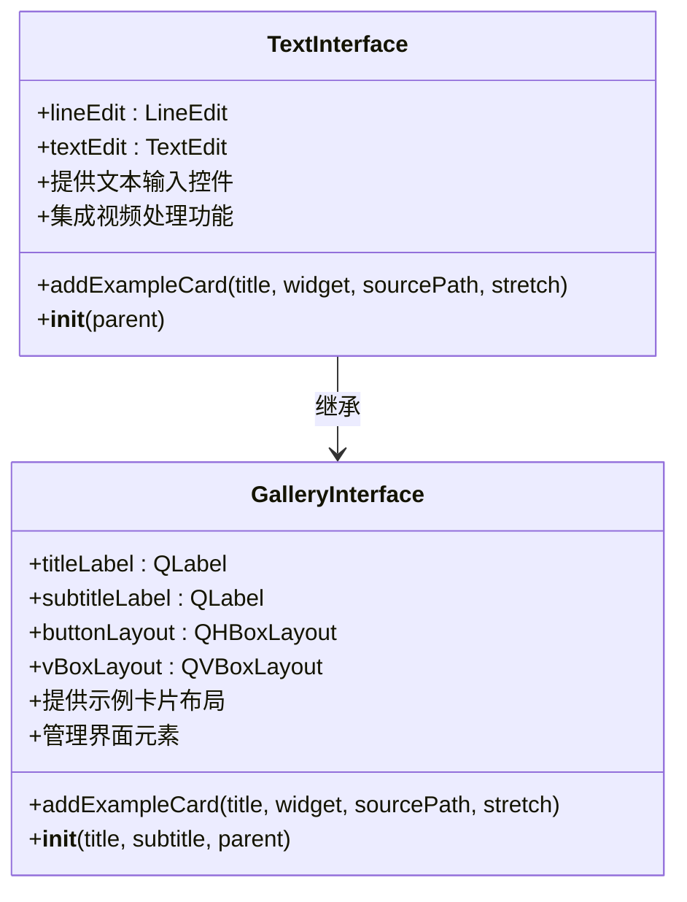
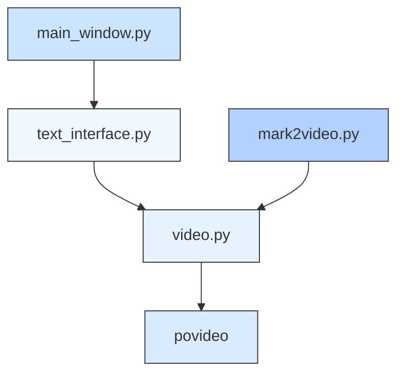

# 视频处理功能集成

<cite>
**本文档引用的文件**
- [video.py](file://office/api/video.py)
- [text_interface.py](file://gui/qtpy/version2/gallery/app/view/text_interface.py)
- [mark2video.py](file://examples/povideo/mark2video.py)
- [main_window.py](file://gui/qtpy/version2/gallery/app/view/main_window.py)
</cite>

## 目录
1. [简介](#简介)
2. [项目结构](#项目结构)
3. [核心组件](#核心组件)
4. [架构概述](#架构概述)
5. [详细组件分析](#详细组件分析)
6. [依赖分析](#依赖分析)
7. [性能考虑](#性能考虑)
8. [故障排除指南](#故障排除指南)
9. [结论](#结论)

## 简介
本文档全面阐述了GUI与视频处理功能的集成方法，重点分析了文本输入控件如何配置视频转音频、音频转文字、视频加水印等功能。文档详细说明了mark2video函数的参数如何通过GUI界面进行设置，并描述了video2mp3和audio2txt等函数在GUI中的调用流程和结果展示方式。

## 项目结构
该项目采用分层架构设计，主要分为GUI界面层和API功能层。GUI界面使用QtPy框架实现，提供了现代化的用户交互体验；API功能层则封装了各种办公自动化功能，包括视频处理、文档转换等。

**图表来源**
- [text_interface.py](file://gui/qtpy/version2/gallery/app/view/text_interface.py#L1-L75)
- [video.py](file://office/api/video.py#L1-L73)
- [main_window.py](file://gui/qtpy/version2/gallery/app/view/main_window.py#L1-L212)
- [mark2video.py](file://examples/povideo/mark2video.py#L1-L6)

**章节来源**
- [text_interface.py](file://gui/qtpy/version2/gallery/app/view/text_interface.py#L1-L75)
- [video.py](file://office/api/video.py#L1-L73)

## 核心组件
本系统的核心组件包括GUI界面组件和视频处理API组件。GUI界面组件负责用户交互，提供直观的操作界面；视频处理API组件则封装了底层的视频处理逻辑，提供简洁的函数接口。

**章节来源**
- [video.py](file://office/api/video.py#L1-L73)
- [text_interface.py](file://gui/qtpy/version2/gallery/app/view/text_interface.py#L1-L75)

## 架构概述
系统采用典型的MVC（Model-View-Controller）架构模式，实现了界面与业务逻辑的分离。用户通过GUI界面输入参数，界面组件将参数传递给视频处理API，API执行具体操作并返回结果。

**图表来源**
- [video.py](file://office/api/video.py#L38-L57)
- [text_interface.py](file://gui/qtpy/version2/gallery/app/view/text_interface.py#L8-L75)

## 详细组件分析

### 视频处理API分析
视频处理API提供了多个核心功能函数，包括视频转音频、音频转文字和视频加水印等。这些函数封装了复杂的底层操作，为上层应用提供了简洁的接口。

#### mark2video函数参数分析

**图表来源**
- [video.py](file://office/api/video.py#L38-L57)

#### video2mp3和audio2txt调用流程

**图表来源**
- [video.py](file://office/api/video.py#L8-L35)

**章节来源**
- [video.py](file://office/api/video.py#L8-L73)

### GUI界面分析
GUI界面组件负责接收用户输入，并将输入参数传递给视频处理API。界面设计遵循现代化的Fluent Design风格，提供了良好的用户体验。

**图表来源**
- [text_interface.py](file://gui/qtpy/version2/gallery/app/view/text_interface.py#L8-L75)
- [gallery_interface.py](file://gui/qtpy/version2/gallery/app/view/gallery_interface.py#L150-L167)

## 依赖分析
系统各组件之间存在明确的依赖关系，GUI界面依赖于视频处理API，而视频处理API又依赖于底层的povideo库。

**图表来源**
- [text_interface.py](file://gui/qtpy/version2/gallery/app/view/text_interface.py#L1-L75)
- [video.py](file://office/api/video.py#L1-L73)
- [main_window.py](file://gui/qtpy/version2/gallery/app/view/main_window.py#L78-L90)
- [mark2video.py](file://examples/povideo/mark2video.py#L1-L6)

**章节来源**
- [video.py](file://office/api/video.py#L1-L73)
- [text_interface.py](file://gui/qtpy/version2/gallery/app/view/text_interface.py#L1-L75)

## 性能考虑
在视频处理过程中，需要考虑以下几个性能因素：
- 大文件处理：视频文件通常较大，需要优化内存使用
- 异步处理：长时间操作应采用异步方式，避免界面冻结
- 错误处理：需要完善的错误处理机制，确保系统稳定性
- 用户反馈：提供进度指示，让用户了解处理状态

## 故障排除指南
当视频处理功能出现问题时，可以按照以下步骤进行排查：
1. 检查输入文件路径是否正确
2. 确认输出目录是否有写入权限
3. 验证参数是否符合要求（如水印文字只支持英文）
4. 检查依赖库是否安装完整
5. 查看错误日志获取详细信息

**章节来源**
- [video.py](file://office/api/video.py#L1-L73)
- [text_interface.py](file://gui/qtpy/version2/gallery/app/view/text_interface.py#L1-L75)

## 结论
本文档详细分析了GUI与视频处理功能的集成方法，展示了如何通过文本输入控件配置视频处理参数。系统采用清晰的分层架构，实现了界面与业务逻辑的分离，为用户提供了便捷的视频处理功能。通过mark2video函数的参数配置和调用流程分析，展示了完整的视频水印添加过程，为类似功能的开发提供了参考。