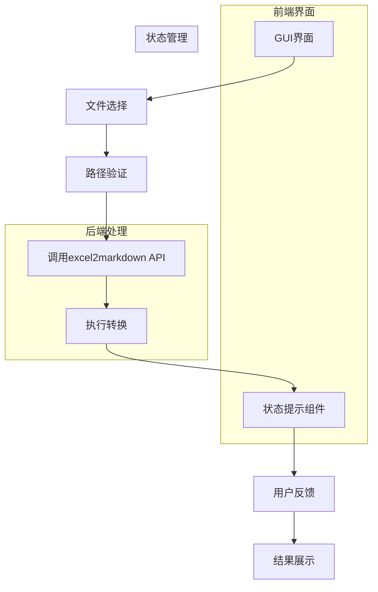
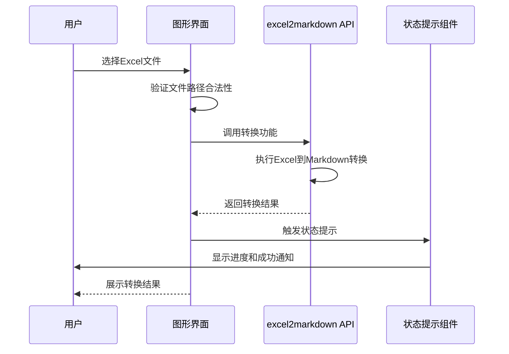
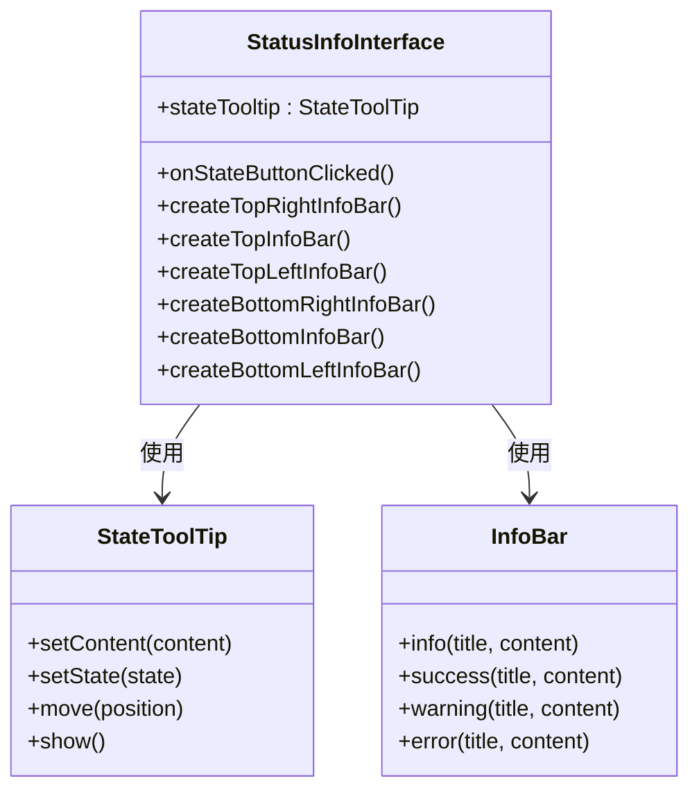
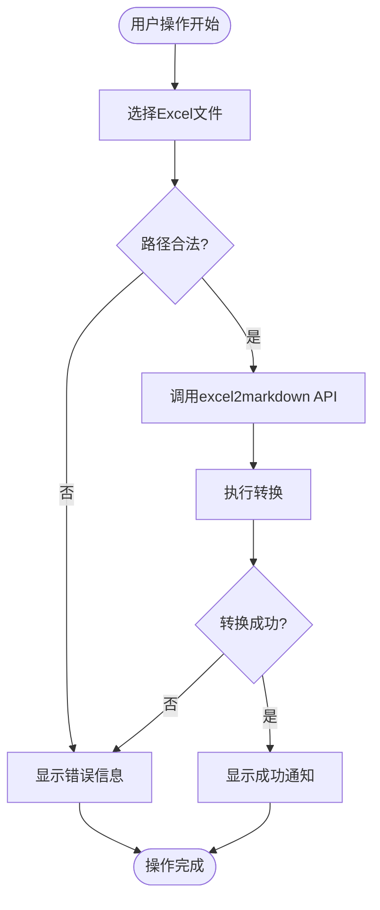

# Markdown处理功能集成

<cite>
**本文档引用的文件**
- [markdown.py](file://office/api/markdown.py)
- [status_info_interface.py](file://gui/qtpy/version2/gallery/app/view/status_info_interface.py)
- [main_window.py](file://gui/qtpy/version2/gallery/app/view/main_window.py)
- [Excel转Markdown.py](file://examples/pomarkdown/Excel转Markdown.py)
</cite>

## 目录
1. [功能概述](#功能概述)
2. [系统架构](#系统架构)
3. [数据流分析](#数据流分析)
4. [状态提示组件](#状态提示组件)
5. [错误处理机制](#错误处理机制)
6. [集成示例](#集成示例)

## 功能概述

本系统实现了图形用户界面与Excel转Markdown功能的完整集成。用户通过GUI界面选择Excel文件后，系统调用后端API完成转换，并利用状态提示组件向用户反馈转换过程。该集成方案采用了模块化设计，将前端界面、后端处理和状态反馈分离，确保了系统的可维护性和扩展性。

**本文档引用的文件**
- [markdown.py](file://office/api/markdown.py#L1-L20)
- [status_info_interface.py](file://gui/qtpy/version2/gallery/app/view/status_info_interface.py#L1-L221)

## 系统架构

**图表来源**
- [main_window.py](file://gui/qtpy/version2/gallery/app/view/main_window.py#L66-L212)
- [status_info_interface.py](file://gui/qtpy/version2/gallery/app/view/status_info_interface.py#L12-L221)

## 数据流分析

**图表来源**
- [markdown.py](file://office/api/markdown.py#L4-L20)
- [status_info_interface.py](file://gui/qtpy/version2/gallery/app/view/status_info_interface.py#L141-L154)

**本文档引用的文件**
- [markdown.py](file://office/api/markdown.py#L4-L20)
- [status_info_interface.py](file://gui/qtpy/version2/gallery/app/view/status_info_interface.py#L141-L154)

## 状态提示组件

系统使用`status_info_interface.py`中的状态提示组件来向用户反馈转换过程。主要包含以下几种提示类型：

- **进度提示条 (StateToolTip)**: 在转换过程中显示"正在训练模型"的提示，告知用户系统正在处理
- **成功通知 (InfoBar)**: 转换完成后显示"模型训练完成啦！"的成功提示
- **工具提示 (ToolTip)**: 为界面元素提供额外的说明信息

这些组件通过信号-槽机制与主界面交互，确保状态更新的实时性和准确性。

**图表来源**
- [status_info_interface.py](file://gui/qtpy/version2/gallery/app/view/status_info_interface.py#L12-L154)

**本文档引用的文件**
- [status_info_interface.py](file://gui/qtpy/version2/gallery/app/view/status_info_interface.py#L12-L154)

## 错误处理机制

系统实现了完整的错误恢复机制，包括：

1. **文件路径合法性校验**: 在调用转换功能前，验证文件路径是否存在、是否为有效的Excel文件格式
2. **异常捕获**: 使用try-catch机制捕获转换过程中的异常
3. **用户反馈**: 当转换失败时，通过状态提示组件向用户显示错误信息
4. **恢复选项**: 提供重新选择文件或取消操作的选项

错误处理流程确保了系统的健壮性，即使在异常情况下也能提供良好的用户体验。

**本文档引用的文件**
- [markdown.py](file://office/api/markdown.py#L18-L19)
- [status_info_interface.py](file://gui/qtpy/version2/gallery/app/view/status_info_interface.py#L142-L147)

## 集成示例

**图表来源**
- [Excel转Markdown.py](file://examples/pomarkdown/Excel转Markdown.py#L53-L57)
- [status_info_interface.py](file://gui/qtpy/version2/gallery/app/view/status_info_interface.py#L141-L154)

**本文档引用的文件**
- [Excel转Markdown.py](file://examples/pomarkdown/Excel转Markdown.py#L53-L57)
- [status_info_interface.py](file://gui/qtpy/version2/gallery/app/view/status_info_interface.py#L141-L154)