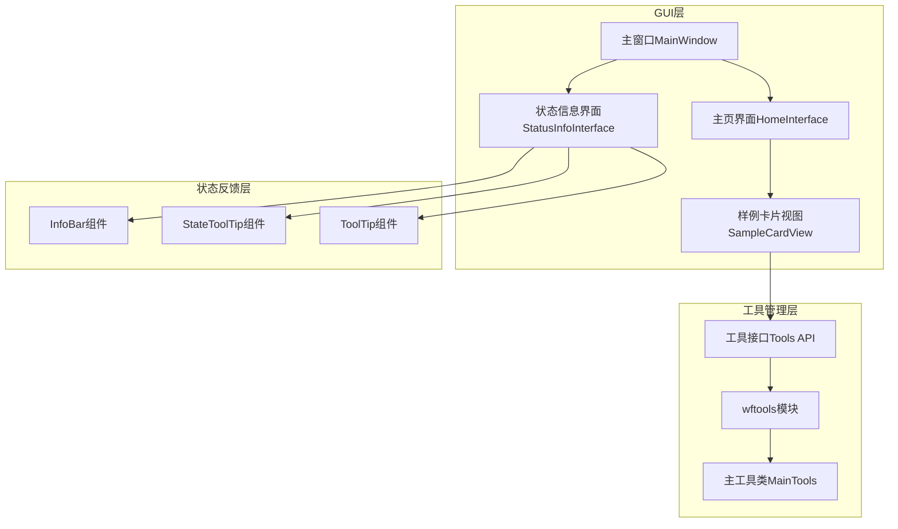
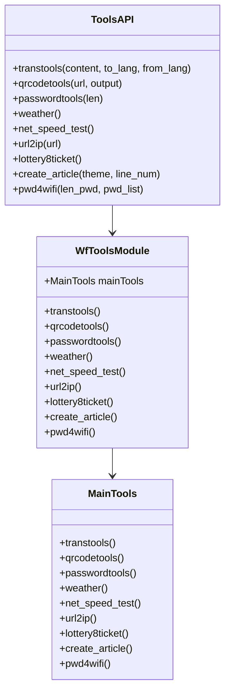
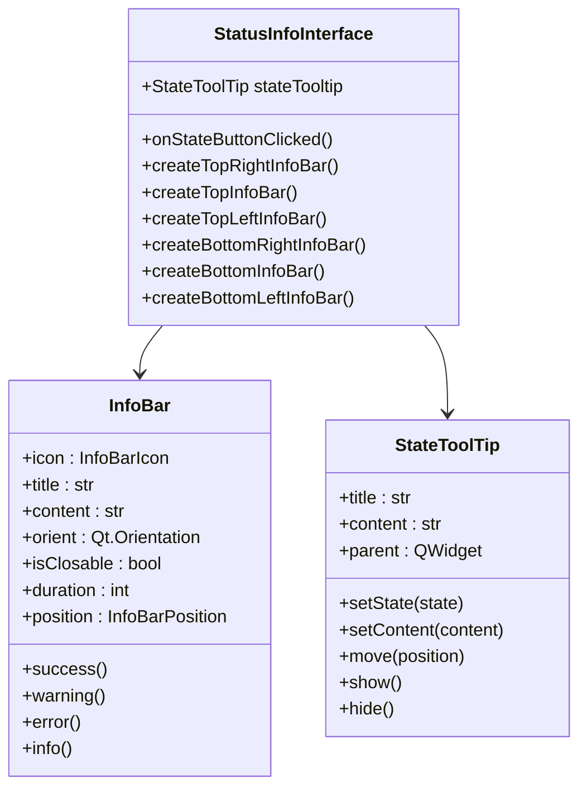
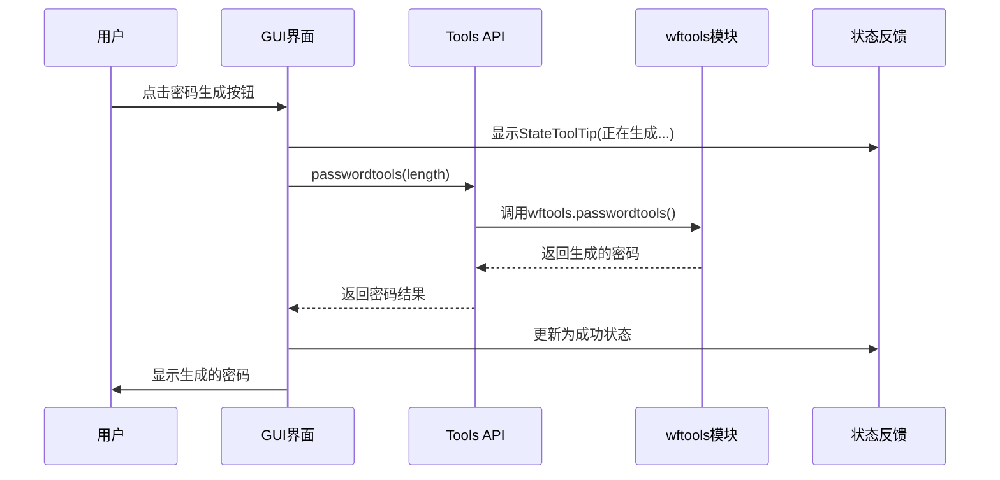
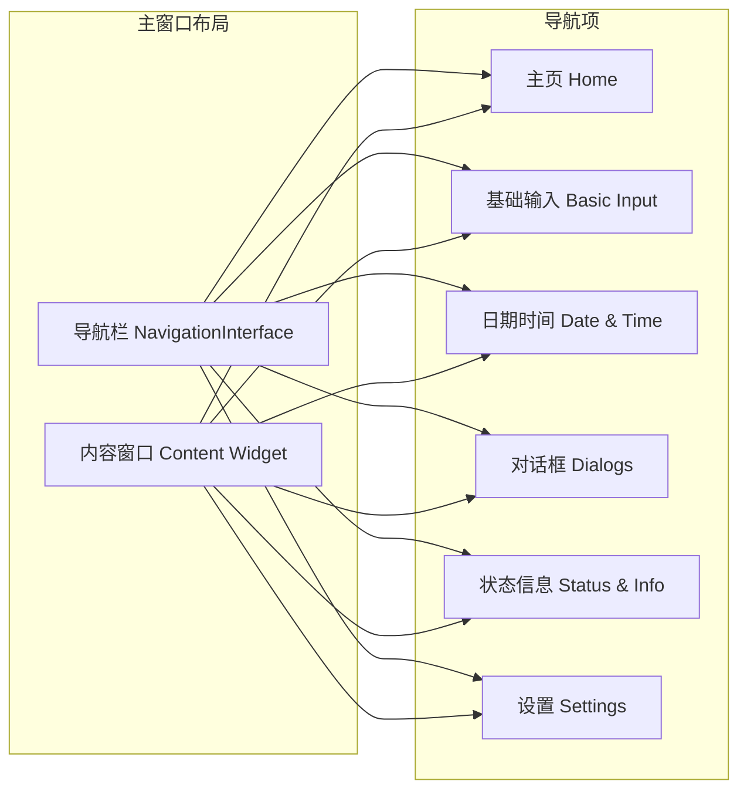
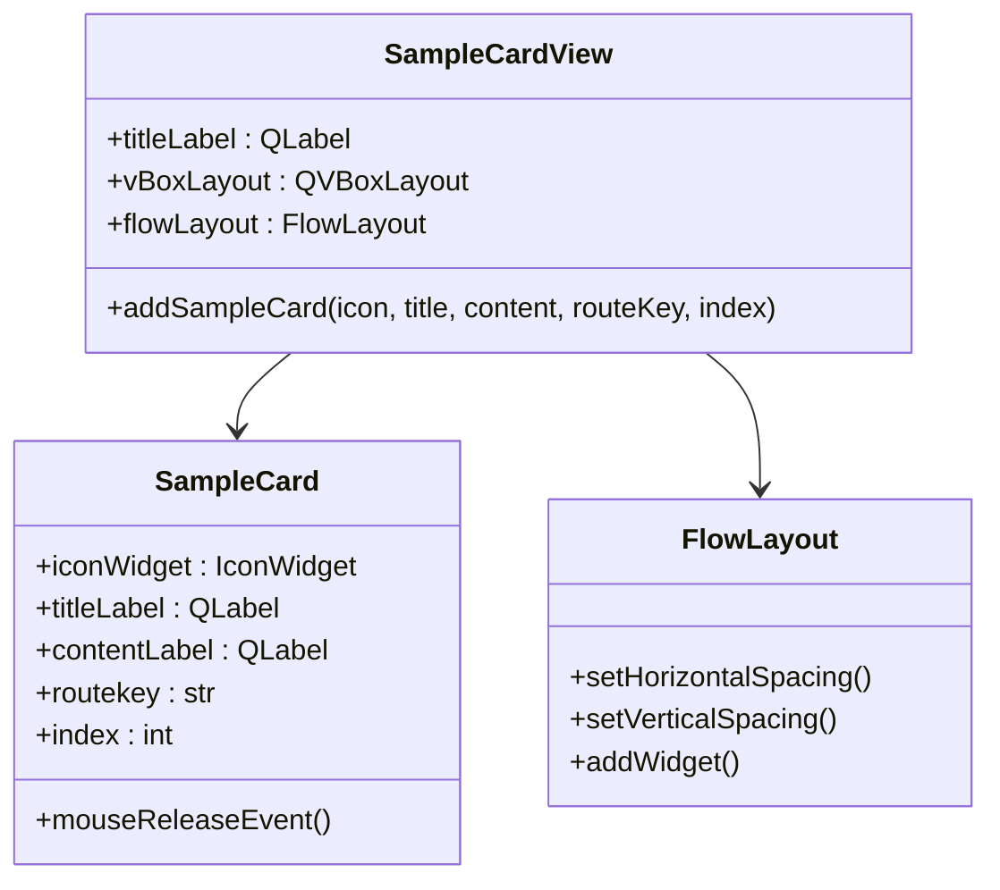
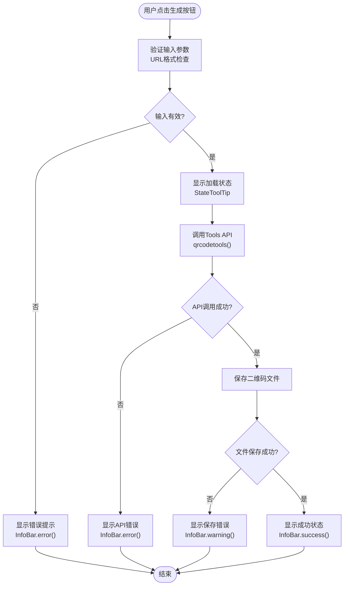
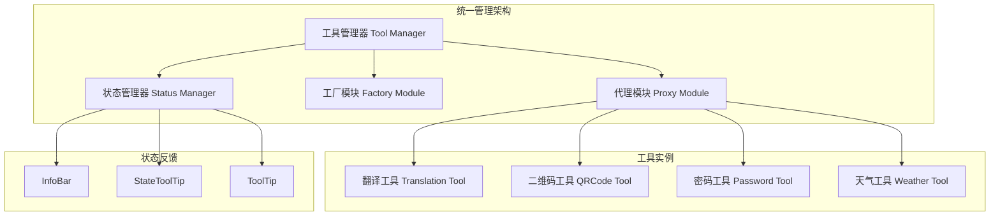

# 工具集功能集成

<cite>
**本文档引用的文件**
- [status_info_interface.py](file://gui/qtpy/version2/gallery/app/view/status_info_interface.py)
- [tools.py](file://office/api/tools.py)
- [tools.py](file://venv/Lib/site-packages/wftools/api/tools.py)
- [home_interface.py](file://gui/qtpy/version2/gallery/app/view/home_interface.py)
- [gallery_interface.py](file://gui/qtpy/version2/gallery/app/view/gallery_interface.py)
- [main_window.py](file://gui/qtpy/version2/gallery/app/view/main_window.py)
- [sample_card.py](file://gui/qtpy/version2/gallery/app/components/sample_card.py)
- [test_tools.py](file://tests/test_code/test_tools.py)
</cite>

## 目录
1. [项目概述](#项目概述)
2. [系统架构](#系统架构)
3. [核心组件分析](#核心组件分析)
4. [状态提示系统](#状态提示系统)
5. [工具集功能集成](#工具集功能集成)
6. [GUI界面设计](#gui界面设计)
7. [调用流程分析](#调用流程分析)
8. [多工具统一管理模式](#多工具统一管理模式)
9. [性能考虑](#性能考虑)
10. [总结](#总结)

## 项目概述

Python Office是一个功能丰富的自动化办公工具集合，提供了多样化的实用工具功能，包括密码生成、二维码生成、翻译、天气查询、IP解析、网速测试等。该项目采用QtPy框架构建图形用户界面，通过模块化设计实现了工具功能的统一管理和集成。

## 系统架构

**图表来源**
- [main_window.py](file://gui/qtpy/version2/gallery/app/view/main_window.py#L66-L90)
- [gallery_interface.py](file://gui/qtpy/version2/gallery/app/view/gallery_interface.py#L150-L196)
- [tools.py](file://office/api/tools.py#L1-L146)

**章节来源**
- [main_window.py](file://gui/qtpy/version2/gallery/app/view/main_window.py#L1-L212)
- [gallery_interface.py](file://gui/qtpy/version2/gallery/app/view/gallery_interface.py#L1-L196)

## 核心组件分析

### 工具接口层

工具接口层位于系统的核心位置，负责统一管理各种工具功能。主要包含以下组件：

#### Tools API模块
Tools API模块提供了标准化的工具调用接口，封装了底层wftools模块的功能。该模块采用代理模式，将上层GUI请求转发到底层工具实现。

#### wftools模块
wftools是底层工具实现的核心模块，包含了所有具体工具功能的实现代码。该模块采用面向对象设计，通过MainTools类统一管理各种工具功能。

**图表来源**
- [tools.py](file://office/api/tools.py#L1-L146)
- [tools.py](file://venv/Lib/site-packages/wftools/api/tools.py#L1-L55)

**章节来源**
- [tools.py](file://office/api/tools.py#L1-L146)
- [tools.py](file://venv/Lib/site-packages/wftools/api/tools.py#L1-L55)

### 状态反馈系统

状态反馈系统是GUI与用户交互的重要组成部分，提供了多种状态提示组件来反馈工具执行状态。

#### InfoBar组件
InfoBar组件用于显示应用范围的状态变更信息，支持成功、警告、错误等多种状态类型。

#### StateToolTip组件
StateToolTip组件专门用于显示任务进度或正在进行的工作状态，不会阻塞用户交互。

#### ToolTip组件
ToolTip组件提供简单的元素信息提示功能。

**图表来源**
- [status_info_interface.py](file://gui/qtpy/version2/gallery/app/view/status_info_interface.py#L12-L220)

**章节来源**
- [status_info_interface.py](file://gui/qtpy/version2/gallery/app/view/status_info_interface.py#L1-L220)

## 状态提示系统

状态提示系统是Python Office GUI的重要组成部分，通过三种不同的组件为用户提供实时的状态反馈。

### InfoBar组件详解

InfoBar组件提供了灵活的状态信息展示功能，支持多种配置选项：

| 属性 | 类型 | 描述 | 默认值 |
|------|------|------|--------|
| icon | InfoBarIcon | 图标类型 | SUCCESS |
| title | str | 标题文本 | 必需 |
| content | str | 内容文本 | 必需 |
| orient | Qt.Orientation | 布局方向 | Horizontal |
| isClosable | bool | 是否可关闭 | True |
| duration | int | 显示时长(ms) | -1(永久) |
| position | InfoBarPosition | 显示位置 | NONE |

### StateToolTip组件详解

StateToolTip组件专门用于显示长时间运行的任务状态，具有以下特点：
- 不会阻塞用户交互
- 支持动态状态更新
- 可自动定位到合适位置

### ToolTip组件详解

ToolTip组件提供简单的悬停提示功能，适用于快速信息展示。

**章节来源**
- [status_info_interface.py](file://gui/qtpy/version2/gallery/app/view/status_info_interface.py#L56-L220)

## 工具集功能集成

Python Office集成了九种主要工具功能，每种工具都有其特定的用途和实现方式。

### 主要工具功能

| 工具名称 | 功能描述 | 输入参数 | 输出结果 | GUI集成方式 |
|----------|----------|----------|----------|-------------|
| transtools | 多语言翻译 | to_lang, content, from_lang | 翻译结果 | 按钮触发 |
| qrcodetools | 二维码生成 | url, output | 二维码图片 | 文件选择+按钮 |
| passwordtools | 密码生成 | len | 随机密码 | 数字输入+按钮 |
| weather | 天气查询 | 无 | 天气信息 | 按钮触发 |
| net_speed_test | 网速测试 | 无 | 测试结果 | 按钮触发 |
| url2ip | IP地址解析 | url | IP地址 | URL输入+按钮 |
| lottery8ticket | 彩票号码生成 | 无 | 彩票号码 | 按钮触发 |
| create_article | 自动生成文章 | theme, line_num | 文章内容 | 主题输入+数量输入+按钮 |
| pwd4wifi | WiFi密码破解 | len_pwd, pwd_list | 密码列表 | 参数输入+按钮 |

### 典型工具实现流程

以密码生成工具(passwordtools)为例，展示典型的工具调用流程：

**图表来源**
- [tools.py](file://office/api/tools.py#L35-L44)
- [status_info_interface.py](file://gui/qtpy/version2/gallery/app/view/status_info_interface.py#L141-L154)

**章节来源**
- [tools.py](file://office/api/tools.py#L1-L146)
- [tools.py](file://venv/Lib/site-packages/wftools/api/tools.py#L1-L55)

## GUI界面设计

### 主界面布局

主界面采用导航栏+内容区的布局设计，通过StackedWidget实现界面切换：

**图表来源**
- [main_window.py](file://gui/qtpy/version2/gallery/app/view/main_window.py#L117-L156)

### 样例卡片系统

样例卡片系统是GUI的重要组成部分，采用Flow Layout实现灵活的卡片排列：

**图表来源**
- [sample_card.py](file://gui/qtpy/version2/gallery/app/components/sample_card.py#L50-L75)

**章节来源**
- [main_window.py](file://gui/qtpy/version2/gallery/app/view/main_window.py#L66-L212)
- [sample_card.py](file://gui/qtpy/version2/gallery/app/components/sample_card.py#L1-L75)

## 调用流程分析

### 完整的工具调用闭环

以二维码生成功能为例，展示完整的用户操作、后台处理与界面响应的闭环流程：

**图表来源**
- [tools.py](file://office/api/tools.py#L22-L32)
- [status_info_interface.py](file://gui/qtpy/version2/gallery/app/view/status_info_interface.py#L190-L220)

### 错误处理机制

系统实现了完善的错误处理机制，确保用户能够获得清晰的错误反馈：

| 错误类型 | 处理方式 | 界面反馈 | 用户体验 |
|----------|----------|----------|----------|
| 输入参数错误 | 参数验证 | InfoBar.warning() | 明确指出问题所在 |
| API调用失败 | 异常捕获 | InfoBar.error() | 显示错误详情 |
| 文件操作失败 | 文件检查 | InfoBar.warning() | 提供解决建议 |
| 网络连接问题 | 连接检测 | StateToolTip + InfoBar | 实时状态更新 |

**章节来源**
- [status_info_interface.py](file://gui/qtpy/version2/gallery/app/view/status_info_interface.py#L190-L220)
- [test_tools.py](file://tests/test_code/test_tools.py#L1-L40)

## 多工具统一管理模式

### 设计模式分析

Python Office采用了多种设计模式来实现工具功能的统一管理：

#### 代理模式(Proxy Pattern)
Tools API模块作为wftools模块的代理，隐藏了底层实现细节，提供了统一的接口。

#### 工厂模式(Factory Pattern)
通过MainTools类统一管理各种工具的创建和初始化。

#### 观察者模式(Observer Pattern)
状态反馈系统采用观察者模式，当工具状态发生变化时，自动通知相关的UI组件。

**图表来源**
- [tools.py](file://office/api/tools.py#L1-L146)
- [gallery_interface.py](file://gui/qtpy/version2/gallery/app/view/gallery_interface.py#L150-L196)

### 扩展性设计

系统设计具有良好的扩展性，新增工具功能时只需：
1. 在wftools模块中添加新的工具实现
2. 在Tools API模块中添加对应的代理方法
3. 在GUI界面中添加相应的控件和事件处理

这种设计模式使得系统能够轻松适应新功能的添加，同时保持现有功能的稳定性。

**章节来源**
- [tools.py](file://office/api/tools.py#L1-L146)
- [gallery_interface.py](file://gui/qtpy/version2/gallery/app/view/gallery_interface.py#L150-L196)

## 性能考虑

### 异步处理策略

对于耗时较长的操作，系统采用了异步处理策略：
- 使用StateToolTip显示任务进度
- 避免阻塞主线程
- 实现非阻塞性的状态反馈

### 资源管理

系统实现了完善的资源管理机制：
- 及时释放临时文件
- 控制内存使用
- 优化UI渲染性能

### 缓存机制

对于频繁使用的工具功能，系统考虑了缓存机制的应用可能性，特别是在网络请求密集的场景下。

## 总结

Python Office的工具集功能集成展现了优秀的软件架构设计。通过模块化的设计理念，系统实现了工具功能的统一管理和高效集成。状态提示系统提供了丰富的用户体验反馈，而GUI界面则采用了现代化的设计模式，确保了良好的用户交互体验。

系统的主要优势包括：
1. **模块化架构**：清晰的分层设计便于维护和扩展
2. **统一接口**：标准化的工具调用接口简化了集成过程
3. **丰富反馈**：多层次的状态提示系统提升了用户体验
4. **良好扩展性**：设计模式确保了系统的可扩展性
5. **性能优化**：异步处理和资源管理保证了系统性能

这种设计模式不仅适用于当前的工具集功能，也为未来的功能扩展奠定了坚实的基础。通过持续的优化和改进，Python Office将成为一个功能强大、用户体验优秀的自动化办公工具平台。