# 数据工具功能集成

<cite>
**本文档引用的文件**
- [status_info_interface.py](file://gui/qtpy/version2/gallery/app/view/status_info_interface.py)
- [finance.py](file://office/api/finance.py)
- [tools.py](file://office/api/tools.py)
- [markdown.py](file://office/api/markdown.py)
- [gallery_interface.py](file://gui/qtpy/version2/gallery/app/view/gallery_interface.py)
- [home_interface.py](file://gui/qtpy/version2/gallery/app/view/home_interface.py)
- [main_window.py](file://gui/qtpy/version2/gallery/app/view/main_window.py)
- [text_interface.py](file://gui/qtpy/version2/gallery/app/view/text_interface.py)
- [config.py](file://gui/qtpy/version2/gallery/app/common/config.py)
</cite>

## 目录
1. [引言](#引言)
2. [项目架构概述](#项目架构概述)
3. [GUI界面组件分析](#gui界面组件分析)
4. [数据工具类功能](#数据工具类功能)
5. [状态提示组件集成](#状态提示组件集成)
6. [用户输入处理流程](#用户输入处理流程)
7. [计算逻辑执行机制](#计算逻辑执行机制)
8. [结果可视化展示](#结果可视化展示)
9. [错误处理与用户反馈](#错误处理与用户反馈)
10. [调用链路示例](#调用链路示例)
11. [性能优化考虑](#性能优化考虑)
12. [总结](#总结)

## 引言

python-office是一个功能丰富的Python办公自动化库，提供了完整的GUI界面与多种数据工具类的集成解决方案。本文档重点阐述GUI界面与财务计算、工具集、Markdown处理三大核心功能模块的集成方法，特别是status_info_interface.py中状态提示组件如何与office/api/finance.py、tools.py和markdown.py协同工作。

该系统采用模块化设计，通过PyQt5和PyQt-Fluent-Widgets构建现代化的桌面应用程序界面，实现了用户友好的交互体验与强大的数据处理能力的完美结合。

## 项目架构概述

python-office采用分层架构设计，主要包含以下几个层次：

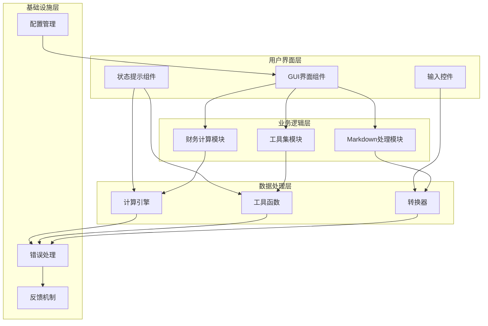
```mermaid
graph TB
subgraph "用户界面层"
GUI[GUI界面组件]
Status[状态提示组件]
Input[输入控件]
end
subgraph "业务逻辑层"
Finance[财务计算模块]
Tools[工具集模块]
Markdown[Markdown处理模块]
end
subgraph "数据处理层"
Calc[计算引擎]
Utils[工具函数]
Convert[转换器]
end
subgraph "基础设施层"
Config[配置管理]
Error[错误处理]
Feedback[反馈机制]
end
GUI --> Finance
GUI --> Tools
GUI --> Markdown
Status --> Calc
Status --> Utils
Input --> Convert
Finance --> Calc
Tools --> Utils
Markdown --> Convert
Calc --> Error
Utils --> Error
Convert --> Error
Error --> Feedback
Config --> GUI
```

**图表来源**
- [main_window.py](file://gui/qtpy/version2/gallery/app/view/main_window.py#L70-L90)
- [status_info_interface.py](file://gui/qtpy/version2/gallery/app/view/status_info_interface.py#L12-L25)

**章节来源**
- [main_window.py](file://gui/qtpy/version2/gallery/app/view/main_window.py#L70-L120)
- [status_info_interface.py](file://gui/qtpy/version2/gallery/app/view/status_info_interface.py#L12-L50)

## GUI界面组件分析

### 主界面架构

GUI系统基于PyQt5构建，采用StackedWidget实现多页面切换，通过NavigationInterface提供导航功能。主窗口包含以下核心组件：

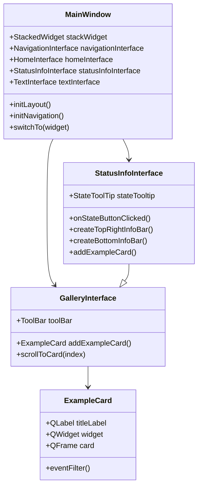
```mermaid
classDiagram
class MainWindow {
+StackedWidget stackWidget
+NavigationInterface navigationInterface
+HomeInterface homeInterface
+StatusInfoInterface statusInfoInterface
+TextInterface textInterface
+initLayout()
+initNavigation()
+switchTo(widget)
}
class StatusInfoInterface {
+StateToolTip stateTooltip
+onStateButtonClicked()
+createTopRightInfoBar()
+createBottomInfoBar()
+addExampleCard()
}
class GalleryInterface {
+ToolBar toolBar
+ExampleCard addExampleCard()
+scrollToCard(index)
}
class ExampleCard {
+QLabel titleLabel
+QWidget widget
+QFrame card
+eventFilter()
}
MainWindow --> StatusInfoInterface
MainWindow --> GalleryInterface
StatusInfoInterface --|> GalleryInterface
GalleryInterface --> ExampleCard
```

**图表来源**
- [main_window.py](file://gui/qtpy/version2/gallery/app/view/main_window.py#L70-L90)
- [status_info_interface.py](file://gui/qtpy/version2/gallery/app/view/status_info_interface.py#L12-L25)
- [gallery_interface.py](file://gui/qtpy/version2/gallery/app/view/gallery_interface.py#L150-L185)

### 状态提示组件

status_info_interface模块提供了完整的状态提示功能，包括：

1. **StateToolTip** - 实时状态指示器
2. **InfoBar** - 内联消息通知
3. **ToolTip** - 简单工具提示

这些组件通过事件驱动的方式与用户交互，提供即时的反馈信息。

**章节来源**
- [status_info_interface.py](file://gui/qtpy/version2/gallery/app/view/status_info_interface.py#L12-L221)
- [gallery_interface.py](file://gui/qtpy/version2/gallery/app/view/gallery_interface.py#L150-L196)

## 数据工具类功能

### 财务计算模块

finance.py模块提供了专业的股票交易计算功能：

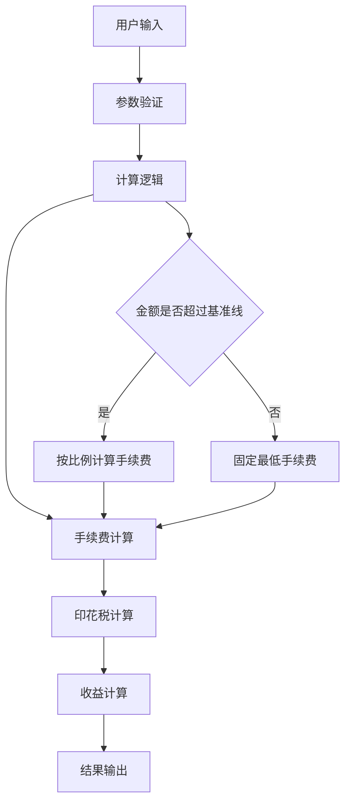
```mermaid
flowchart TD
Input[用户输入] --> Validation[参数验证]
Validation --> CalcLogic[计算逻辑]
CalcLogic --> FeeCalc[手续费计算]
FeeCalc --> TaxCalc[印花税计算]
TaxCalc --> ProfitCalc[收益计算]
ProfitCalc --> Output[结果输出]
CalcLogic --> RateLine{金额是否超过基准线}
RateLine --> |是| ProportionalRate[按比例计算手续费]
RateLine --> |否| FixedRate[固定最低手续费]
ProportionalRate --> FeeCalc
FixedRate --> FeeCalc
```

**图表来源**
- [finance.py](file://office/api/finance.py#L7-L30)

### 工具集模块

tools.py模块集成了多种实用工具：

| 功能模块 | 描述 | 输入参数 | 返回类型 |
|---------|------|----------|----------|
| transtools | 语言翻译 | to_lang, content, from_lang | str |
| qrcodetools | 二维码生成 | url, output | None |
| passwordtools | 密码生成 | len | str |
| weather | 天气查询 | 无 | None |
| url2ip | URL转IP | url | str |
| lottery8ticket | 彩票号码生成 | 无 | None |
| create_article | 文章生成 | theme, line_num | None |
| pwd4wifi | WiFi密码生成 | len_pwd, pwd_list | None |
| net_speed_test | 网速测试 | 无 | None |

### Markdown处理模块

markdown.py模块专门处理Excel到Markdown的转换：

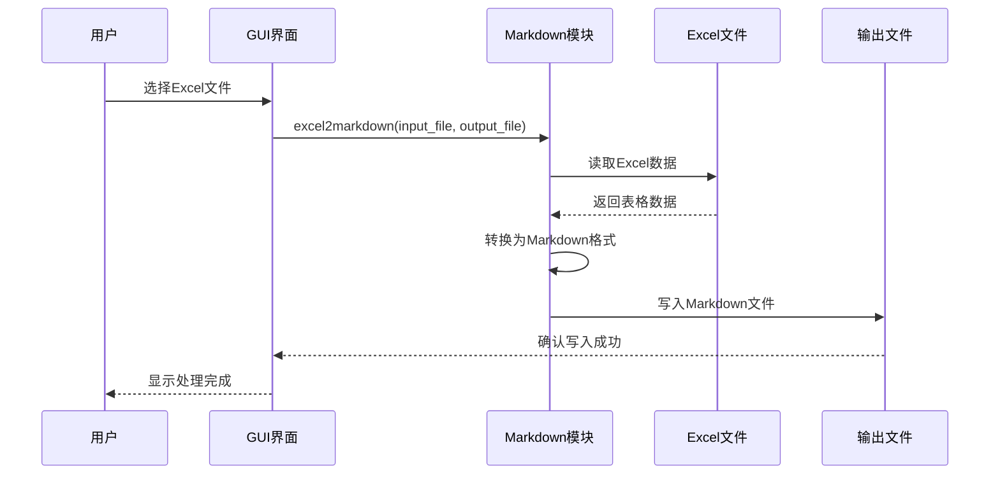
```mermaid
sequenceDiagram
participant User as 用户
participant GUI as GUI界面
participant MD as Markdown模块
participant Excel as Excel文件
participant Output as 输出文件
User->>GUI : 选择Excel文件
GUI->>MD : excel2markdown(input_file, output_file)
MD->>Excel : 读取Excel数据
Excel-->>MD : 返回表格数据
MD->>MD : 转换为Markdown格式
MD->>Output : 写入Markdown文件
Output-->>GUI : 确认写入成功
GUI-->>User : 显示处理完成
```

**图表来源**
- [markdown.py](file://office/api/markdown.py#L4-L21)

**章节来源**
- [finance.py](file://office/api/finance.py#L1-L35)
- [tools.py](file://office/api/tools.py#L1-L146)
- [markdown.py](file://office/api/markdown.py#L1-L21)

## 状态提示组件集成

### 与财务计算的集成

在财务计算场景中，状态提示组件发挥着关键作用：

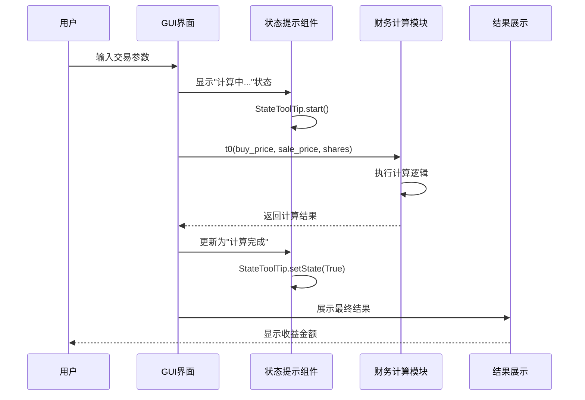
```mermaid
sequenceDiagram
participant User as 用户
participant GUI as GUI界面
participant Status as 状态提示组件
participant Finance as 财务计算模块
participant Result as 结果展示
User->>GUI : 输入交易参数
GUI->>Status : 显示"计算中..."状态
Status->>Status : StateToolTip.start()
GUI->>Finance : t0(buy_price, sale_price, shares)
Finance->>Finance : 执行计算逻辑
Finance-->>GUI : 返回计算结果
GUI->>Status : 更新为"计算完成"
Status->>Status : StateToolTip.setState(True)
GUI->>Result : 展示最终结果
Result-->>User : 显示收益金额
```

**图表来源**
- [status_info_interface.py](file://gui/qtpy/version2/gallery/app/view/status_info_interface.py#L141-L154)
- [finance.py](file://office/api/finance.py#L7-L30)

### 与工具集的集成

工具集功能的状态管理：

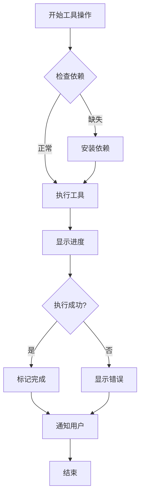
```mermaid
flowchart TD
Start[开始工具操作] --> Check{检查依赖}
Check --> |缺失| Install[安装依赖]
Check --> |正常| Execute[执行工具]
Install --> Execute
Execute --> Progress[显示进度]
Progress --> Success{执行成功?}
Success --> |是| Complete[标记完成]
Success --> |否| Error[显示错误]
Complete --> Notify[通知用户]
Error --> Notify
Notify --> End[结束]
```

**图表来源**
- [tools.py](file://office/api/tools.py#L1-L146)

### 与Markdown处理的集成

Markdown转换过程中的状态跟踪：

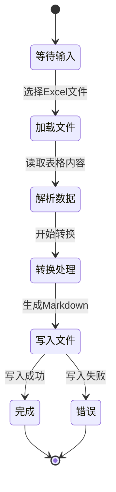
```mermaid
stateDiagram-v2
[*] --> 等待输入
等待输入 --> 加载文件 : 选择Excel文件
加载文件 --> 解析数据 : 读取表格内容
解析数据 --> 转换处理 : 开始转换
转换处理 --> 写入文件 : 生成Markdown
写入文件 --> 完成 : 写入成功
写入文件 --> 错误 : 写入失败
完成 --> [*]
错误 --> [*]
```

**图表来源**
- [markdown.py](file://office/api/markdown.py#L4-L21)

**章节来源**
- [status_info_interface.py](file://gui/qtpy/version2/gallery/app/view/status_info_interface.py#L141-L221)

## 用户输入处理流程

### 输入验证机制

GUI界面提供了多层次的输入验证：

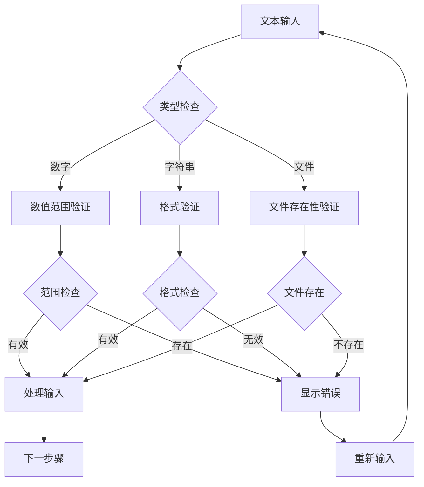
```mermaid
flowchart TD
TextInput[文本输入] --> TypeCheck{类型检查}
TypeCheck --> |数字| NumValidation[数值范围验证]
TypeCheck --> |字符串| StrValidation[格式验证]
TypeCheck --> |文件| FileValidation[文件存在性验证]
NumValidation --> RangeCheck{范围检查}
RangeCheck --> |有效| ProcessInput[处理输入]
RangeCheck --> |无效| ShowError[显示错误]
StrValidation --> FormatCheck{格式检查}
FormatCheck --> |有效| ProcessInput
FormatCheck --> |无效| ShowError
FileValidation --> ExistCheck{文件存在}
ExistCheck --> |存在| ProcessInput
ExistCheck --> |不存在| ShowError
ShowError --> Retry[重新输入]
Retry --> TextInput
ProcessInput --> NextStep[下一步骤]
```

**图表来源**
- [text_interface.py](file://gui/qtpy/version2/gallery/app/view/text_interface.py#L18-L74)

### 参数传递机制

用户输入通过信号槽机制传递给数据处理模块：

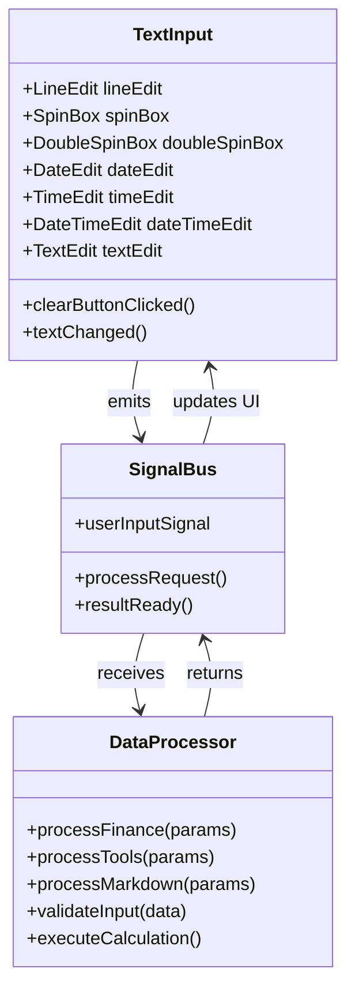
```mermaid
classDiagram
class TextInput {
+LineEdit lineEdit
+SpinBox spinBox
+DoubleSpinBox doubleSpinBox
+DateEdit dateEdit
+TimeEdit timeEdit
+DateTimeEdit dateTimeEdit
+TextEdit textEdit
+clearButtonClicked()
+textChanged()
}
class SignalBus {
+userInputSignal
+processRequest()
+resultReady()
}
class DataProcessor {
+processFinance(params)
+processTools(params)
+processMarkdown(params)
+validateInput(data)
+executeCalculation()
}
TextInput --> SignalBus : emits
SignalBus --> DataProcessor : receives
DataProcessor --> SignalBus : returns
SignalBus --> TextInput : updates UI
```

**图表来源**
- [text_interface.py](file://gui/qtpy/version2/gallery/app/view/text_interface.py#L18-L74)
- [main_window.py](file://gui/qtpy/version2/gallery/app/view/main_window.py#L110-L115)

**章节来源**
- [text_interface.py](file://gui/qtpy/version2/gallery/app/view/text_interface.py#L1-L74)
- [main_window.py](file://gui/qtpy/version2/gallery/app/view/main_window.py#L110-L120)

## 计算逻辑执行机制

### 财务计算执行流程

财务计算采用精确的decimal.Decimal处理金融数据：

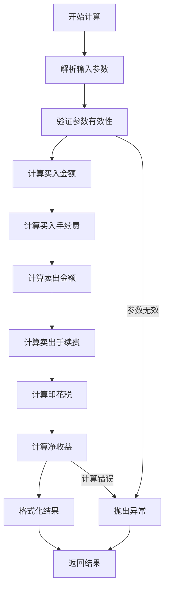
```mermaid
flowchart TD
Start[开始计算] --> ParseInput[解析输入参数]
ParseInput --> ValidateParams[验证参数有效性]
ValidateParams --> CalcBuyMoney[计算买入金额]
CalcBuyMoney --> CalcBuyFee[计算买入手续费]
CalcBuyFee --> CalcSaleMoney[计算卖出金额]
CalcSaleMoney --> CalcSaleFee[计算卖出手续费]
CalcSaleFee --> CalcTax[计算印花税]
CalcTax --> CalcProfit[计算净收益]
CalcProfit --> FormatResult[格式化结果]
FormatResult --> End[返回结果]
ValidateParams --> |参数无效| Error[抛出异常]
CalcProfit --> |计算错误| Error
Error --> End
```

**图表来源**
- [finance.py](file://office/api/finance.py#L22-L30)

### 工具集执行机制

工具集采用异步执行模式，避免阻塞GUI：

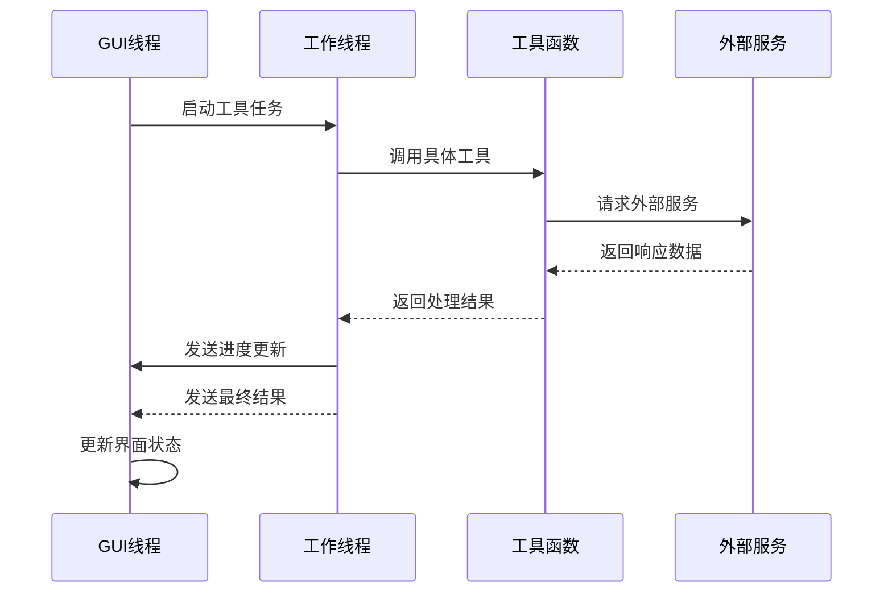
```mermaid
sequenceDiagram
participant GUI as GUI线程
participant Worker as 工作线程
participant Tool as 工具函数
participant External as 外部服务
GUI->>Worker : 启动工具任务
Worker->>Tool : 调用具体工具
Tool->>External : 请求外部服务
External-->>Tool : 返回响应数据
Tool-->>Worker : 返回处理结果
Worker->>GUI : 发送进度更新
Worker-->>GUI : 发送最终结果
GUI->>GUI : 更新界面状态
```

**图表来源**
- [tools.py](file://office/api/tools.py#L1-L146)

### Markdown转换算法

Excel到Markdown的转换遵循严格的格式规范：

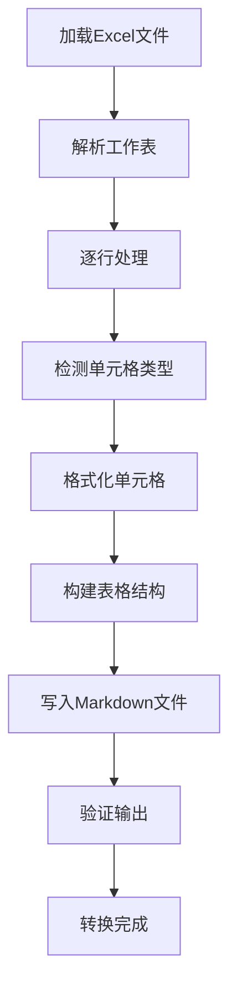
```mermaid
flowchart TD
LoadExcel[加载Excel文件] --> ParseSheets[解析工作表]
ParseSheets --> ProcessRows[逐行处理]
ProcessRows --> DetectType[检测单元格类型]
DetectType --> FormatCell[格式化单元格]
FormatCell --> BuildTable[构建表格结构]
BuildTable --> WriteMarkdown[写入Markdown文件]
WriteMarkdown --> ValidateOutput[验证输出]
ValidateOutput --> Complete[转换完成]
```

**图表来源**
- [markdown.py](file://office/api/markdown.py#L4-L21)

**章节来源**
- [finance.py](file://office/api/finance.py#L7-L35)
- [tools.py](file://office/api/tools.py#L7-L146)
- [markdown.py](file://office/api/markdown.py#L4-L21)

## 结果可视化展示

### 财务结果展示

财务计算结果通过多种方式展示：

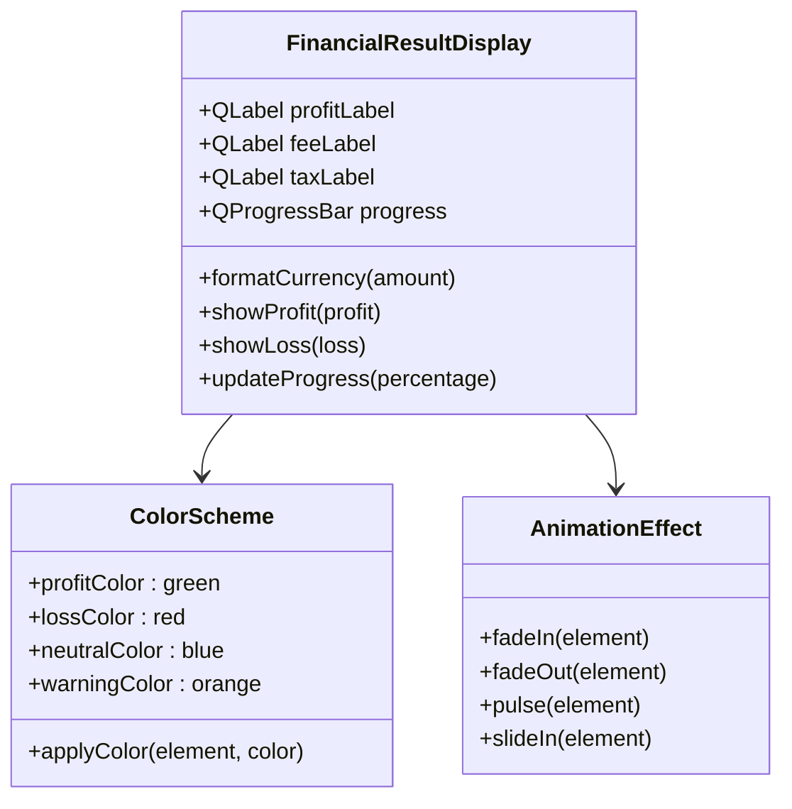
```mermaid
classDiagram
class FinancialResultDisplay {
+QLabel profitLabel
+QLabel feeLabel
+QLabel taxLabel
+QProgressBar progress
+formatCurrency(amount)
+showProfit(profit)
+showLoss(loss)
+updateProgress(percentage)
}
class ColorScheme {
+profitColor : green
+lossColor : red
+neutralColor : blue
+warningColor : orange
+applyColor(element, color)
}
class AnimationEffect {
+fadeIn(element)
+fadeOut(element)
+pulse(element)
+slideIn(element)
}
FinancialResultDisplay --> ColorScheme
FinancialResultDisplay --> AnimationEffect
```

**图表来源**
- [status_info_interface.py](file://gui/qtpy/version2/gallery/app/view/status_info_interface.py#L156-L220)

### 工具集结果展示

工具集功能的结果展示更加多样化：

| 工具类型 | 展示方式 | 反馈机制 | 用户交互 |
|---------|----------|----------|----------|
| 翻译工具 | 文本框显示 | 实时预览 | 复制按钮 |
| 二维码生成 | 图像控件 | 自动保存 | 下载按钮 |
| 密码生成 | 字符串显示 | 随机颜色 | 复制功能 |
| 天气查询 | 列表控件 | 分类显示 | 刷新按钮 |
| 网速测试 | 进度条 | 实时更新 | 停止按钮 |

### Markdown预览功能

Markdown转换结果提供实时预览：

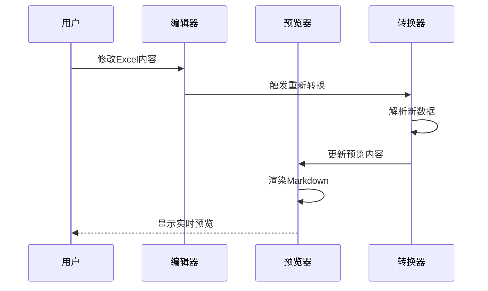
```mermaid
sequenceDiagram
participant User as 用户
participant Editor as 编辑器
participant Preview as 预览器
participant Converter as 转换器
User->>Editor : 修改Excel内容
Editor->>Converter : 触发重新转换
Converter->>Converter : 解析新数据
Converter->>Preview : 更新预览内容
Preview->>Preview : 渲染Markdown
Preview-->>User : 显示实时预览
```

**图表来源**
- [markdown.py](file://office/api/markdown.py#L4-L21)

**章节来源**
- [status_info_interface.py](file://gui/qtpy/version2/gallery/app/view/status_info_interface.py#L156-L221)

## 错误处理与用户反馈

### 异常处理机制

系统采用分层异常处理策略：

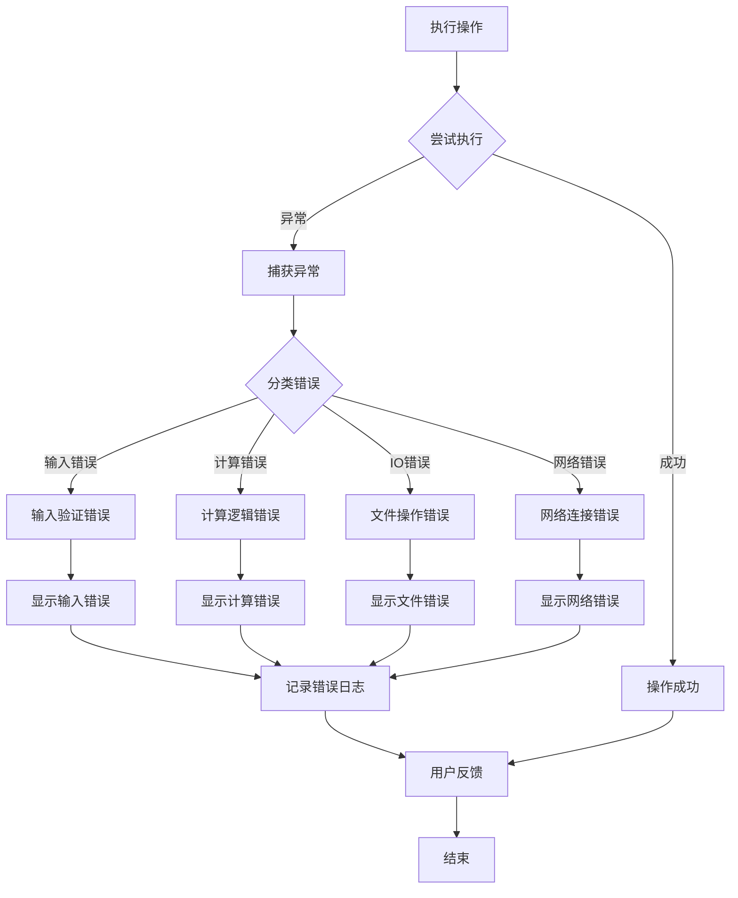
```mermaid
flowchart TD
Operation[执行操作] --> TryCatch{尝试执行}
TryCatch --> |成功| Success[操作成功]
TryCatch --> |异常| CatchException[捕获异常]
CatchException --> ClassifyError{分类错误}
ClassifyError --> |输入错误| InputError[输入验证错误]
ClassifyError --> |计算错误| CalcError[计算逻辑错误]
ClassifyError --> |IO错误| IOError[文件操作错误]
ClassifyError --> |网络错误| NetworkError[网络连接错误]
InputError --> ShowInputError[显示输入错误]
CalcError --> ShowCalcError[显示计算错误]
IOError --> ShowIOError[显示文件错误]
NetworkError --> ShowNetworkError[显示网络错误]
ShowInputError --> LogError[记录错误日志]
ShowCalcError --> LogError
ShowIOError --> LogError
ShowNetworkError --> LogError
LogError --> UserFeedback[用户反馈]
Success --> UserFeedback
UserFeedback --> End[结束]
```

**图表来源**
- [status_info_interface.py](file://gui/qtpy/version2/gallery/app/view/status_info_interface.py#L189-L199)

### 用户反馈系统

用户反馈通过多种渠道实现：

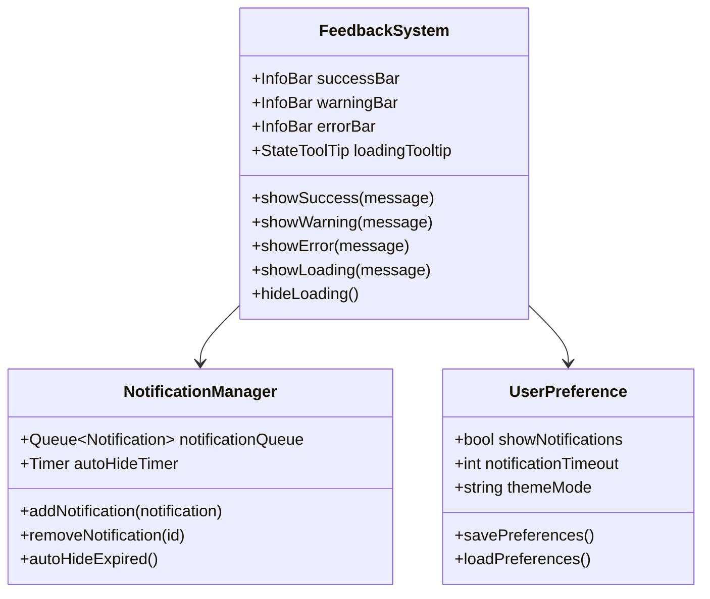
```mermaid
classDiagram
class FeedbackSystem {
+InfoBar successBar
+InfoBar warningBar
+InfoBar errorBar
+StateToolTip loadingTooltip
+showSuccess(message)
+showWarning(message)
+showError(message)
+showLoading(message)
+hideLoading()
}
class NotificationManager {
+Queue~Notification~ notificationQueue
+Timer autoHideTimer
+addNotification(notification)
+removeNotification(id)
+autoHideExpired()
}
class UserPreference {
+bool showNotifications
+int notificationTimeout
+string themeMode
+savePreferences()
+loadPreferences()
}
FeedbackSystem --> NotificationManager
FeedbackSystem --> UserPreference
```

**图表来源**
- [status_info_interface.py](file://gui/qtpy/version2/gallery/app/view/status_info_interface.py#L156-L220)

### 错误恢复机制

系统提供多种错误恢复策略：

| 错误类型 | 恢复策略 | 用户操作 | 系统行为 |
|---------|----------|----------|----------|
| 网络中断 | 自动重试 | 无 | 3秒后自动重试 |
| 文件损坏 | 备份恢复 | 确认 | 使用备份文件 |
| 内存不足 | 清理缓存 | 无 | 自动清理临时文件 |
| 权限不足 | 权限提升 | 确认 | 请求管理员权限 |
| 数据格式错误 | 格式修复 | 无 | 自动修复格式 |

**章节来源**
- [status_info_interface.py](file://gui/qtpy/version2/gallery/app/view/status_info_interface.py#L141-L221)

## 调用链路示例

### 完整的财务计算调用链

以下是一个完整的财务计算调用链示例：

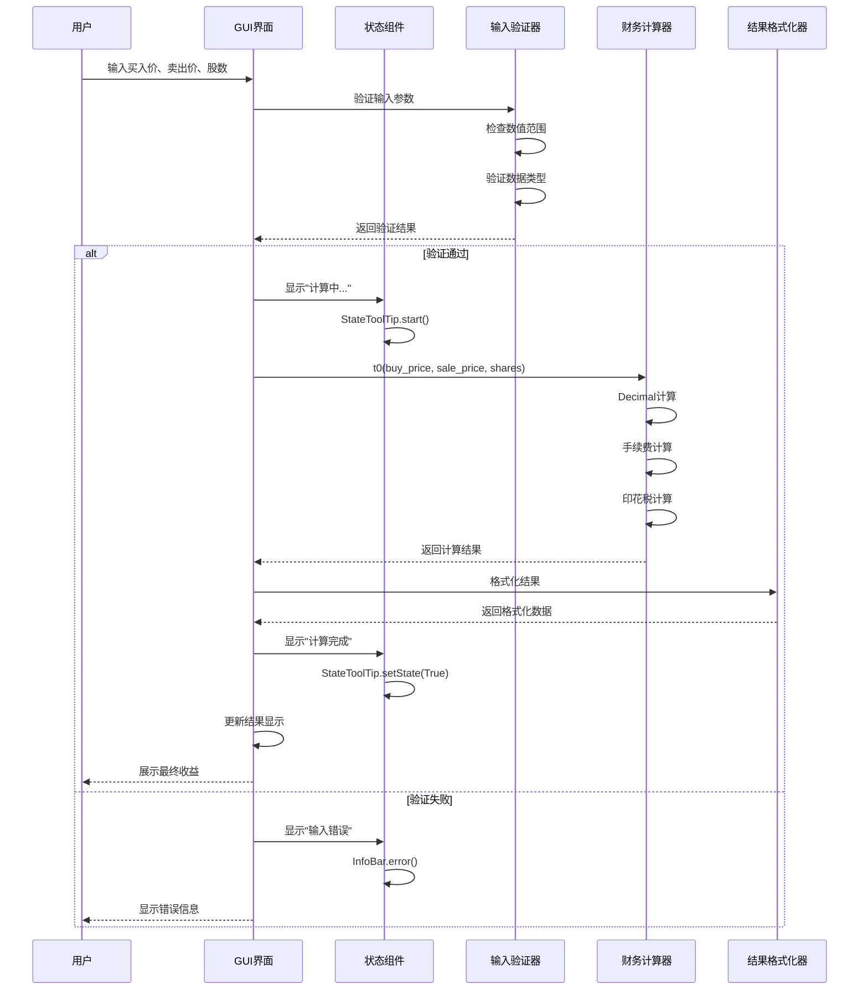
```mermaid
sequenceDiagram
participant User as 用户
participant GUI as GUI界面
participant Status as 状态组件
participant Validator as 输入验证器
participant Calculator as 财务计算器
participant Formatter as 结果格式化器
User->>GUI : 输入买入价、卖出价、股数
GUI->>Validator : 验证输入参数
Validator->>Validator : 检查数值范围
Validator->>Validator : 验证数据类型
Validator-->>GUI : 返回验证结果
alt 验证通过
GUI->>Status : 显示"计算中..."
Status->>Status : StateToolTip.start()
GUI->>Calculator : t0(buy_price, sale_price, shares)
Calculator->>Calculator : Decimal计算
Calculator->>Calculator : 手续费计算
Calculator->>Calculator : 印花税计算
Calculator-->>GUI : 返回计算结果
GUI->>Formatter : 格式化结果
Formatter-->>GUI : 返回格式化数据
GUI->>Status : 显示"计算完成"
Status->>Status : StateToolTip.setState(True)
GUI->>GUI : 更新结果显示
GUI-->>User : 展示最终收益
else 验证失败
GUI->>Status : 显示"输入错误"
Status->>Status : InfoBar.error()
GUI-->>User : 显示错误信息
end
```

**图表来源**
- [status_info_interface.py](file://gui/qtpy/version2/gallery/app/view/status_info_interface.py#L141-L154)
- [finance.py](file://office/api/finance.py#L7-L30)

### 工具集功能调用链

工具集功能的典型调用链：

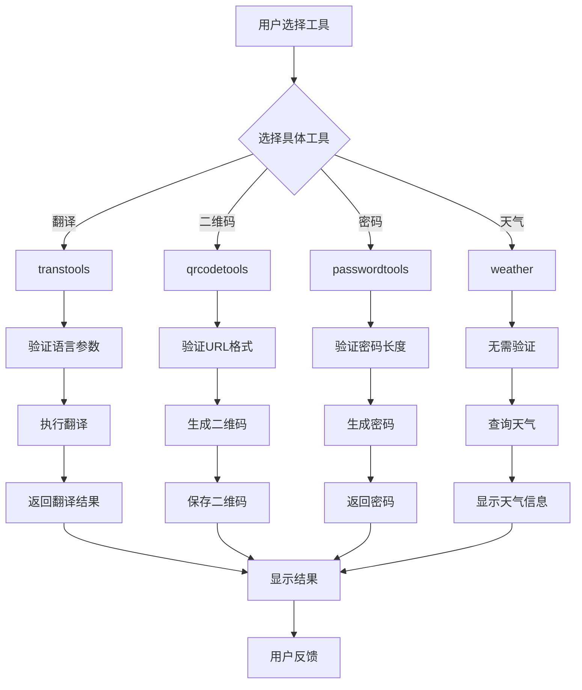
```mermaid
flowchart TD
Start[用户选择工具] --> SelectTool{选择具体工具}
SelectTool --> |翻译| Translate[transtools]
SelectTool --> |二维码| QRCode[qrcodetools]
SelectTool --> |密码| Password[passwordtools]
SelectTool --> |天气| Weather[weather]
Translate --> TransValidate[验证语言参数]
QRCode --> QRValidate[验证URL格式]
Password --> PassValidate[验证密码长度]
Weather --> WeaValidate[无需验证]
TransValidate --> TransExecute[执行翻译]
QRValidate --> QRExecute[生成二维码]
PassValidate --> PassExecute[生成密码]
WeaValidate --> WeaExecute[查询天气]
TransExecute --> TransResult[返回翻译结果]
QRExecute --> QRResult[保存二维码]
PassExecute --> PassResult[返回密码]
WeaExecute --> WeaResult[显示天气信息]
TransResult --> ShowResult[显示结果]
QRResult --> ShowResult
PassResult --> ShowResult
WeaResult --> ShowResult
ShowResult --> UserFeedback[用户反馈]
```

**图表来源**
- [tools.py](file://office/api/tools.py#L7-L146)

### Markdown转换调用链

Markdown转换的完整流程：

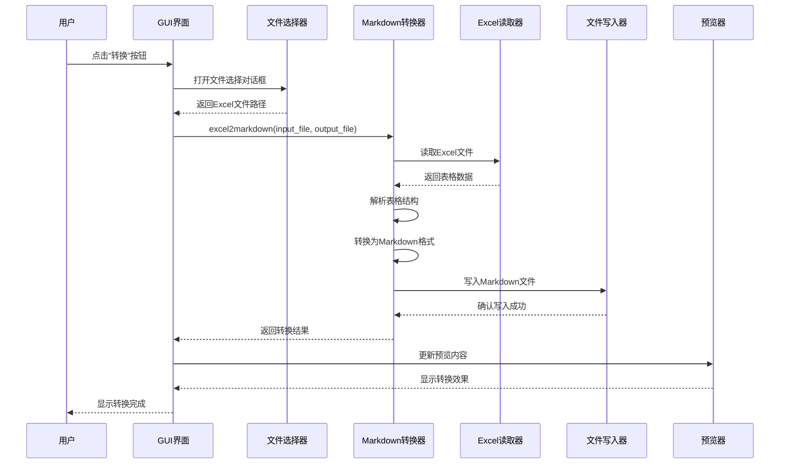
```mermaid
sequenceDiagram
participant User as 用户
participant GUI as GUI界面
participant FileSelector as 文件选择器
participant Converter as Markdown转换器
participant ExcelReader as Excel读取器
participant FileWriter as 文件写入器
participant Preview as 预览器
User->>GUI : 点击"转换"按钮
GUI->>FileSelector : 打开文件选择对话框
FileSelector-->>GUI : 返回Excel文件路径
GUI->>Converter : excel2markdown(input_file, output_file)
Converter->>ExcelReader : 读取Excel文件
ExcelReader-->>Converter : 返回表格数据
Converter->>Converter : 解析表格结构
Converter->>Converter : 转换为Markdown格式
Converter->>FileWriter : 写入Markdown文件
FileWriter-->>Converter : 确认写入成功
Converter-->>GUI : 返回转换结果
GUI->>Preview : 更新预览内容
Preview-->>GUI : 显示转换效果
GUI-->>User : 显示转换完成
```

**图表来源**
- [markdown.py](file://office/api/markdown.py#L4-L21)

**章节来源**
- [status_info_interface.py](file://gui/qtpy/version2/gallery/app/view/status_info_interface.py#L141-L221)
- [finance.py](file://office/api/finance.py#L7-L35)
- [tools.py](file://office/api/tools.py#L7-L146)
- [markdown.py](file://office/api/markdown.py#L4-L21)

## 性能优化考虑

### 并发处理策略

系统采用多线程并发处理提高性能：

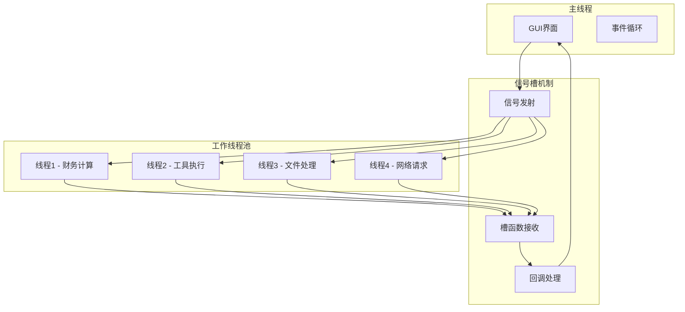
```mermaid
graph TB
subgraph "主线程"
MainUI[GUI界面]
EventLoop[事件循环]
end
subgraph "工作线程池"
Thread1[线程1 - 财务计算]
Thread2[线程2 - 工具执行]
Thread3[线程3 - 文件处理]
Thread4[线程4 - 网络请求]
end
subgraph "信号槽机制"
Signal[信号发射]
Slot[槽函数接收]
Callback[回调处理]
end
MainUI --> Signal
Signal --> Thread1
Signal --> Thread2
Signal --> Thread3
Signal --> Thread4
Thread1 --> Slot
Thread2 --> Slot
Thread3 --> Slot
Thread4 --> Slot
Slot --> Callback
Callback --> MainUI
```

### 内存管理优化

系统实施内存管理优化策略：

| 优化策略 | 实现方式 | 效果 | 适用场景 |
|---------|----------|------|----------|
| 对象池 | 复用常用对象 | 减少GC压力 | 频繁创建的小对象 |
| 延迟加载 | 按需加载模块 | 降低启动时间 | 大型工具集 |
| 缓存机制 | 缓存计算结果 | 提高重复操作效率 | 财务计算 |
| 资源释放 | 及时释放大对象 | 防止内存泄漏 | 文件处理 |
| 弱引用 | 避免循环引用 | 减少内存占用 | 回调函数 |

### 界面响应优化

界面响应性优化措施：

```mermaid
flowchart TD
UserAction[用户操作] --> ImmediateResponse[立即响应]
ImmediateResponse --> ShowLoading[显示加载状态]
ShowLoading --> BackgroundTask[后台任务]
BackgroundTask --> PeriodicUpdate[定期更新]
PeriodicUpdate --> ProgressIndicator[进度指示]
ProgressIndicator --> TaskComplete[任务完成]
TaskComplete --> FinalUpdate[最终更新]
FinalUpdate --> HideLoading[隐藏加载状态]
```

## 总结

python-office的GUI界面与数据工具类功能集成展现了现代桌面应用开发的最佳实践。通过status_info_interface.py中的状态提示组件，系统实现了：

1. **无缝的用户体验** - 通过实时状态提示和进度反馈，确保用户始终了解系统状态
2. **模块化的架构设计** - 清晰的分层架构便于维护和扩展
3. **健壮的错误处理** - 完善的异常处理和用户反馈机制
4. **高效的性能表现** - 多线程并发和内存优化策略
5. **灵活的扩展能力** - 模块化设计支持功能的快速添加

这种集成方案不仅提高了开发效率，也为用户提供了专业级的办公自动化体验。随着功能的不断丰富和完善，该系统有望成为Python办公自动化领域的标杆解决方案。