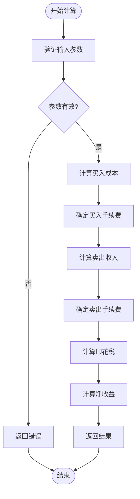
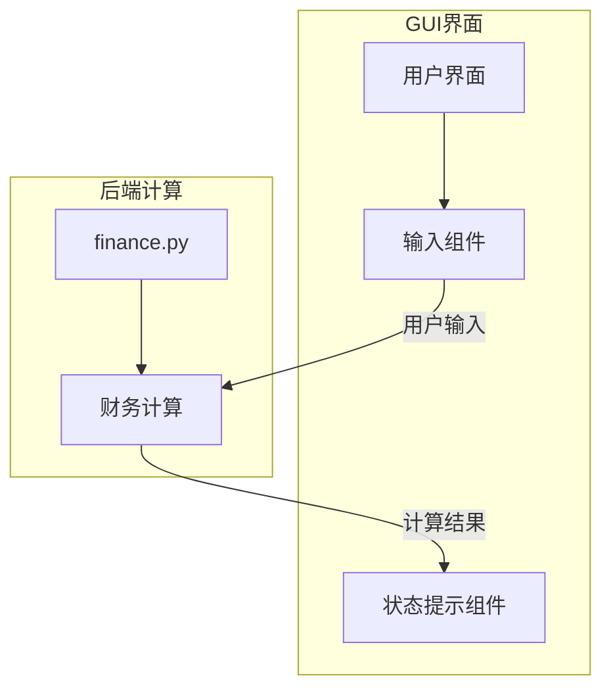
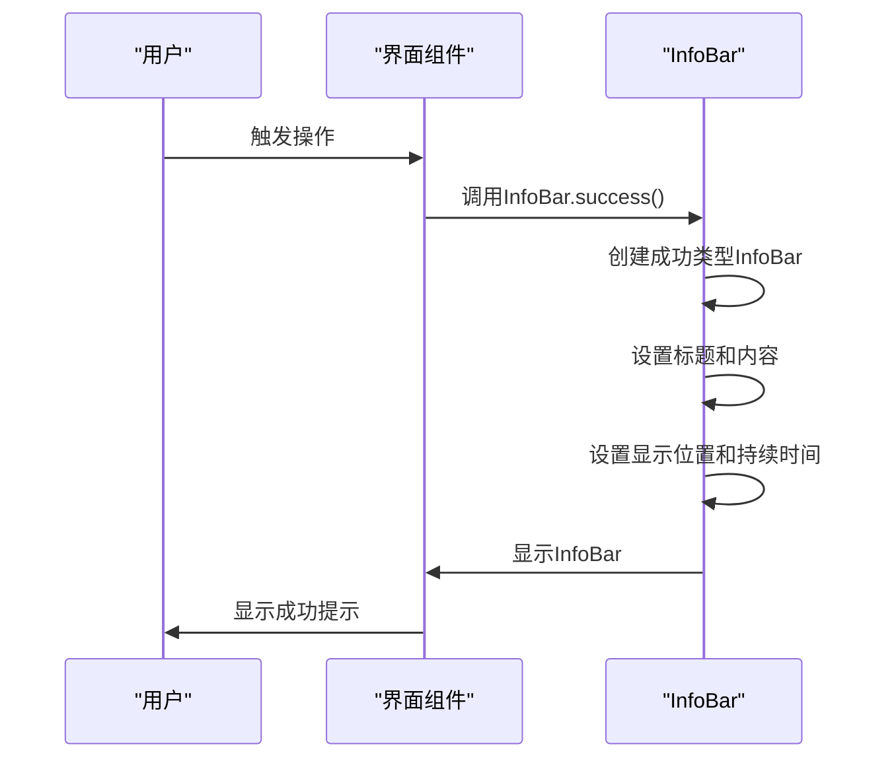
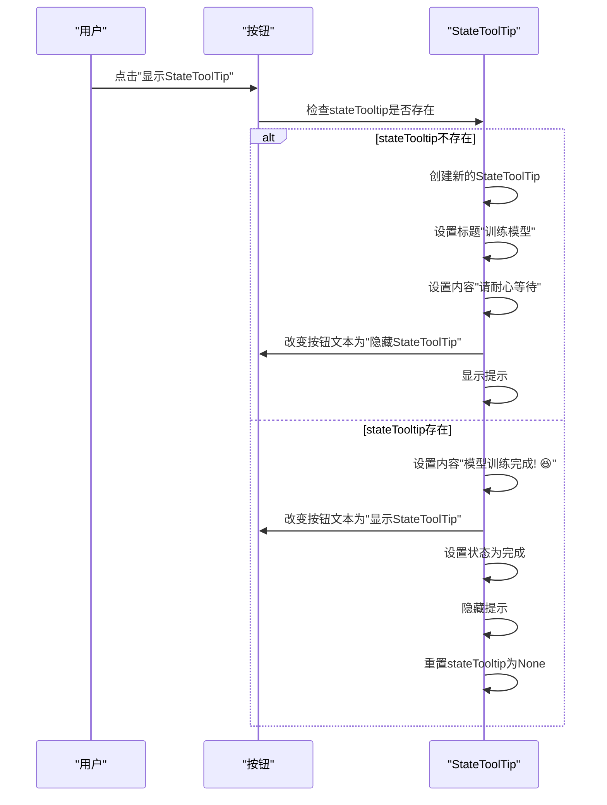
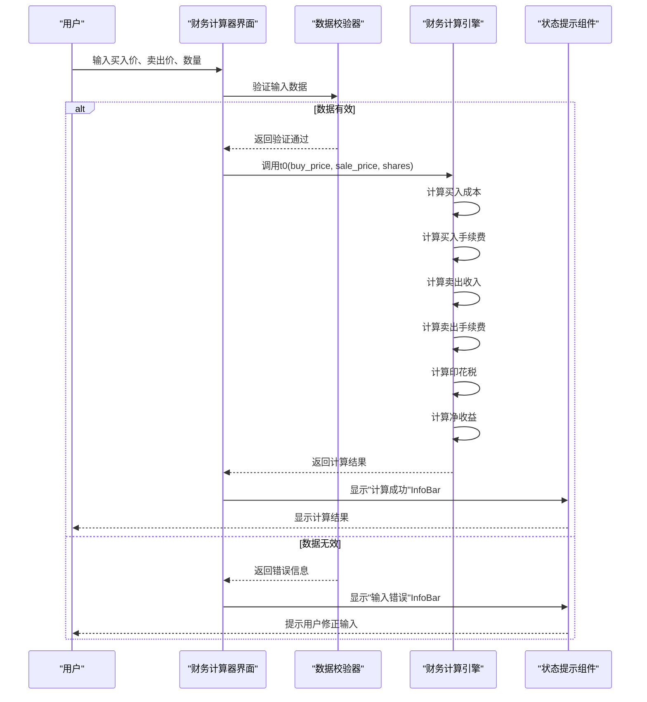
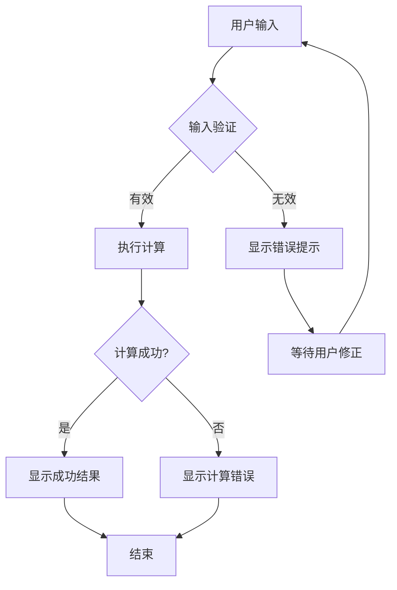

# 财务计算功能集成

<cite>
**本文档引用的文件**  
- [finance.py](file://office/api/finance.py)
- [status_info_interface.py](file://gui/qtpy/version2/gallery/app/view/status_info_interface.py)
- [main_window.py](file://gui/qtpy/version2/gallery/app/view/main_window.py)
- [basic_input_interface.py](file://gui/qtpy/version2/gallery/app/view/basic_input_interface.py)
- [text_interface.py](file://gui/qtpy/version2/gallery/app/view/text_interface.py)
- [1、单次做T.py](file://examples/pofinance/1、单次做T.py)
</cite>

## 目录
1. [项目概述](#项目概述)
2. [财务计算功能实现](#财务计算功能实现)
3. [GUI界面与后端计算集成](#gui界面与后端计算集成)
4. [状态提示组件工作机制](#状态提示组件工作机制)
5. [完整调用链路示例](#完整调用链路示例)
6. [异常处理策略](#异常处理策略)
7. [用户体验优化方案](#用户体验优化方案)

## 项目概述

本项目是一个基于Python的办公自动化工具集，其中包含了财务计算功能模块。系统采用QtPy框架构建现代化GUI界面，通过模块化设计实现了前端界面与后端计算功能的分离。核心财务计算功能位于`office/api/finance.py`文件中，而GUI界面则位于`gui/qtpy/version2/`目录下，采用Fluent Design风格提供用户友好的交互体验。

系统架构采用分层设计模式，将业务逻辑（财务计算）与用户界面完全解耦，便于维护和扩展。通过分析代码结构，我们可以看到项目遵循了清晰的关注点分离原则，使得各个组件职责明确、易于测试和维护。

**Section sources**
- [main_window.py](file://gui/qtpy/version2/gallery/app/view/main_window.py#L1-L212)

## 财务计算功能实现

财务计算功能的核心是`t0`函数，该函数实现了股票"T+0"交易收益的精确计算。函数考虑了多种交易成本因素，包括手续费、印花税等，确保计算结果的准确性。

**Diagram sources**
- [finance.py](file://office/api/finance.py#L7-L30)

**Section sources**
- [finance.py](file://office/api/finance.py#L7-L30)

## GUI界面与后端计算集成

虽然当前GUI界面中没有专门的财务计算器界面，但系统提供了完整的输入组件和状态反馈机制，为集成财务计算功能奠定了基础。通过分析`basic_input_interface.py`和`text_interface.py`文件，我们可以看到系统提供了丰富的输入控件，包括数值输入框、滑块等，这些都可以用于构建财务计算界面。

集成方案建议创建一个新的`FinanceCalculatorInterface`类，继承自`GalleryInterface`，并使用现有的输入组件收集用户参数。当用户提交计算请求时，界面将调用`pofinance.t0()`函数执行计算，并通过状态提示组件向用户反馈结果。

**Diagram sources**
- [basic_input_interface.py](file://gui/qtpy/version2/gallery/app/view/basic_input_interface.py#L1-L143)
- [text_interface.py](file://gui/qtpy/version2/gallery/app/view/text_interface.py#L1-L75)
- [finance.py](file://office/api/finance.py#L7-L30)

**Section sources**
- [basic_input_interface.py](file://gui/qtpy/version2/gallery/app/view/basic_input_interface.py#L1-L143)
- [text_interface.py](file://gui/qtpy/version2/gallery/app/view/text_interface.py#L1-L75)

## 状态提示组件工作机制

`status_info_interface.py`文件实现了系统中的状态提示功能，包含`InfoBar`和`StateToolTip`两种主要组件。这些组件在用户交互过程中提供实时反馈，增强用户体验。

### InfoBar工作机制

`InfoBar`组件用于显示应用范围的状态变更信息，支持多种类型（成功、警告、错误等）和位置（顶部、底部、左上、右上等）。通过静态方法如`InfoBar.success()`、`InfoBar.warning()`等可以快速创建不同类型的提示。

**Diagram sources**
- [status_info_interface.py](file://gui/qtpy/version2/gallery/app/view/status_info_interface.py#L56-L108)

### StateToolTip工作机制

`StateToolTip`组件用于表示长时间运行的操作状态，如模型训练、文件处理等。它提供了一个动态的视觉反馈，让用户知道系统正在处理请求。

**Diagram sources**
- [status_info_interface.py](file://gui/qtpy/version2/gallery/app/view/status_info_interface.py#L141-L154)

**Section sources**
- [status_info_interface.py](file://gui/qtpy/version2/gallery/app/view/status_info_interface.py#L23-L219)

## 完整调用链路示例

以下是一个从界面输入到后端计算再到状态反馈的完整调用链路示例：

**Diagram sources**
- [finance.py](file://office/api/finance.py#L7-L30)
- [status_info_interface.py](file://gui/qtpy/version2/gallery/app/view/status_info_interface.py#L56-L108)

## 异常处理策略

系统采用多层次的异常处理策略来确保稳定性和用户体验：

1. **输入验证层**：在数据进入计算引擎之前，进行严格的输入验证，防止无效数据导致计算错误。
2. **计算保护层**：使用`Decimal`类型进行精确计算，避免浮点数精度问题。
3. **状态反馈层**：通过`InfoBar`和`StateToolTip`提供清晰的错误信息和操作状态。

**Diagram sources**
- [finance.py](file://office/api/finance.py#L7-L30)
- [status_info_interface.py](file://gui/qtpy/version2/gallery/app/view/status_info_interface.py#L56-L108)

## 用户体验优化方案

为了提升用户体验，建议实施以下优化方案：

### 1. 实时计算反馈
实现输入即计算功能，当用户修改任一参数时，立即重新计算并显示结果，提高交互效率。

### 2. 可视化收益展示
使用图表展示不同交易策略的收益对比，帮助用户做出更明智的决策。

### 3. 历史记录功能
保存用户的计算历史，方便后续参考和比较。

### 4. 智能默认值
根据市场数据提供智能默认值建议，如常用手续费率、典型交易数量等。

### 5. 多场景支持
扩展支持更多交易场景，如"T+1"、"网格交易"等，满足不同用户需求。

这些优化方案可以显著提升系统的实用性和用户满意度，使财务计算功能更加完善和专业。

**Section sources**
- [status_info_interface.py](file://gui/qtpy/version2/gallery/app/view/status_info_interface.py#L23-L219)
- [finance.py](file://office/api/finance.py#L7-L30)