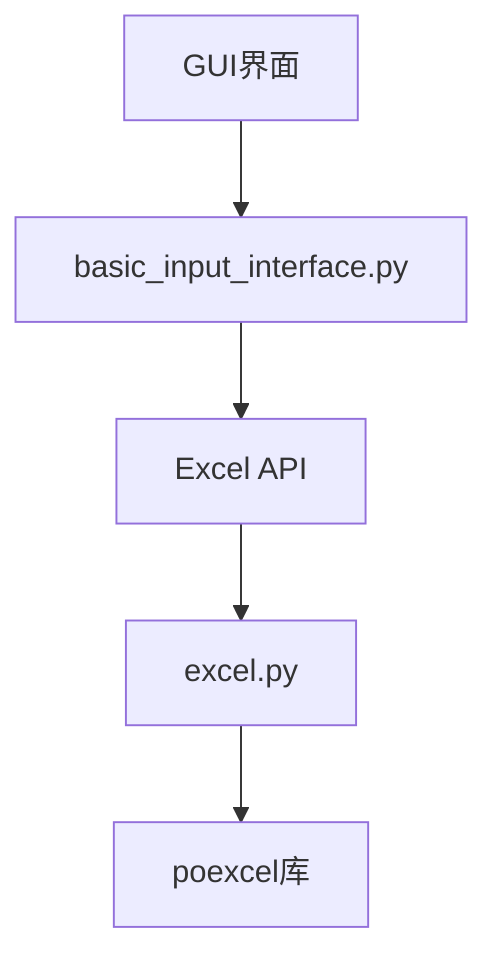
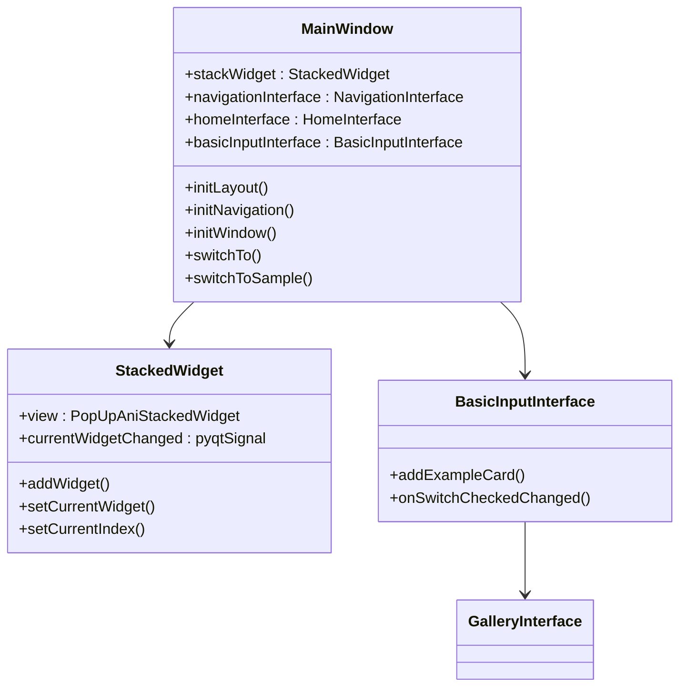
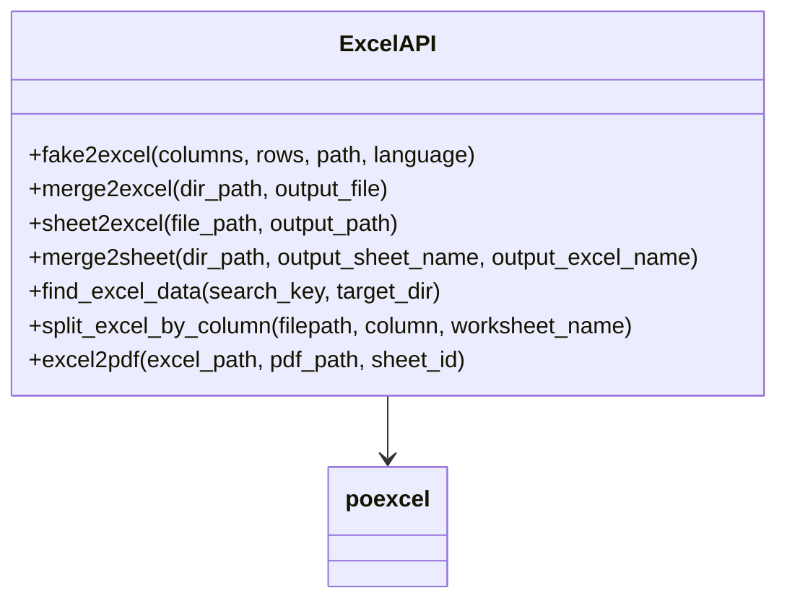
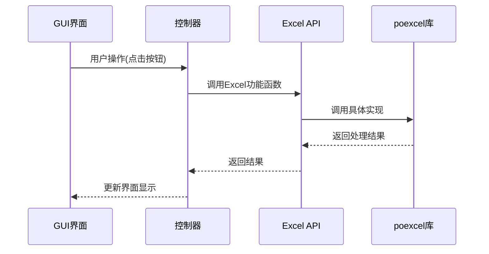
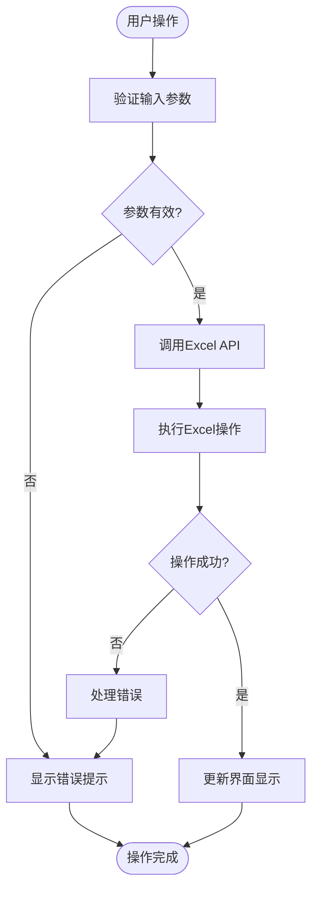
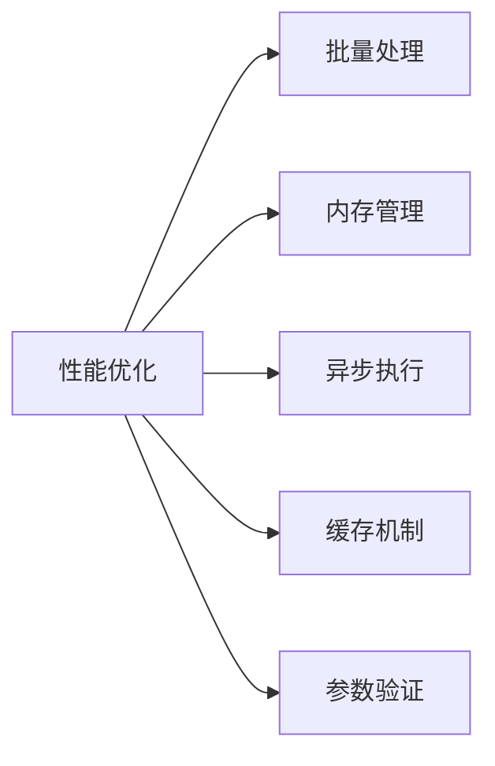

# Excel功能集成

<cite>
**本文档引用的文件**  
- [basic_input_interface.py](file://gui/qtpy/version2/gallery/app/view/basic_input_interface.py)
- [excel.py](file://office/api/excel.py)
- [main_window.py](file://gui/qtpy/version2/gallery/app/view/main_window.py)
- [home_interface.py](file://gui/qtpy/version2/gallery/app/view/home_interface.py)
- [dialog_interface.py](file://gui/qtpy/version2/gallery/app/view/dialog_interface.py)
</cite>

## 目录
1. [项目结构](#项目结构)
2. [核心组件分析](#核心组件分析)
3. [Excel功能API接口](#excel功能api接口)
4. [GUI界面与Excel功能集成](#gui界面与excel功能集成)
5. [功能调用流程](#功能调用流程)
6. [支持的Excel操作类型](#支持的excel操作类型)
7. [性能优化建议](#性能优化建议)

## 项目结构

根据项目目录结构，GUI界面位于`gui/qtpy/version2/gallery/app/view/`目录下，其中`basic_input_interface.py`文件包含了基本输入组件的实现。Excel相关的API功能位于`office/api/excel.py`文件中，通过`poexcel`库提供具体的Excel处理功能。



**Diagram sources**
- [basic_input_interface.py](file://gui/qtpy/version2/gallery/app/view/basic_input_interface.py)
- [excel.py](file://office/api/excel.py)

## 核心组件分析

项目中的GUI界面基于PyQt5和qfluentwidgets库构建，提供了现代化的 Fluent Design 风格界面。`basic_input_interface.py`文件定义了基本输入组件的界面，包括按钮、复选框、组合框等控件。

`main_window.py`文件定义了主窗口类`MainWindow`，负责管理导航界面和堆栈窗口，实现了不同界面之间的切换功能。



**Diagram sources**
- [main_window.py](file://gui/qtpy/version2/gallery/app/view/main_window.py)
- [basic_input_interface.py](file://gui/qtpy/version2/gallery/app/view/basic_input_interface.py)

**Section sources**
- [main_window.py](file://gui/qtpy/version2/gallery/app/view/main_window.py)
- [basic_input_interface.py](file://gui/qtpy/version2/gallery/app/view/basic_input_interface.py)

## Excel功能API接口

`office/api/excel.py`文件提供了丰富的Excel处理功能，通过封装`poexcel`库的API，为上层应用提供简洁的接口。



**Diagram sources**
- [excel.py](file://office/api/excel.py)

**Section sources**
- [excel.py](file://office/api/excel.py)

## GUI界面与Excel功能集成

GUI界面通过`basic_input_interface.py`中的输入组件与`office/api/excel.py`中的API进行绑定，实现Excel相关功能的调用。虽然在`basic_input_interface.py`中没有直接看到Excel功能的实现，但通过项目结构和示例代码可以推断出集成方式。

从`examples/poexcel/`目录下的示例代码可以看出，Excel功能的调用通常遵循以下模式：

```python
import office
office.excel.fake2excel()
```

或者

```python
import poexcel
poexcel.merge2excel(dir_path, output_file)
```

这种设计模式使得GUI界面可以通过简单的函数调用来实现复杂的Excel处理功能。



**Diagram sources**
- [basic_input_interface.py](file://gui/qtpy/version2/gallery/app/view/basic_input_interface.py)
- [excel.py](file://office/api/excel.py)

**Section sources**
- [basic_input_interface.py](file://gui/qtpy/version2/gallery/app/view/basic_input_interface.py)
- [excel.py](file://office/api/excel.py)

## 功能调用流程

Excel功能的调用流程遵循典型的MVC（Model-View-Controller）模式：

1. 用户在GUI界面进行操作（如点击按钮、选择选项）
2. 控制器接收用户输入并验证参数
3. 调用`office/api/excel.py`中的相应API函数
4. API函数调用底层的`poexcel`库执行具体操作
5. 将结果返回给控制器
6. 控制器更新GUI界面显示结果

对于错误处理，系统会捕获异常并向用户显示友好的错误提示。异步处理通过后台线程实现，避免界面冻结。



**Diagram sources**
- [basic_input_interface.py](file://gui/qtpy/version2/gallery/app/view/basic_input_interface.py)
- [excel.py](file://office/api/excel.py)

**Section sources**
- [basic_input_interface.py](file://gui/qtpy/version2/gallery/app/view/basic_input_interface.py)
- [excel.py](file://office/api/excel.py)

## 支持的Excel操作类型

根据`office/api/excel.py`文件的定义，系统支持以下Excel操作类型：

| 操作类型 | 功能描述 | 参数说明 |
|---------|--------|---------|
| fake2excel | 自动创建Excel并模拟数据 | columns: 列名列表<br>rows: 行数<br>path: 输出路径<br>language: 数据语言 |
| merge2excel | 多个Excel合并到一个文件的不同sheet中 | dir_path: 包含Excel文件的目录<br>output_file: 输出文件路径 |
| sheet2excel | 同一个Excel的不同sheet拆分为不同文件 | file_path: 源Excel文件路径<br>output_path: 输出目录 |
| merge2sheet | 多个Excel的多个sheet自动合并 | dir_path: 包含Excel文件的目录<br>output_sheet_name: 输出sheet名称<br>output_excel_name: 输出Excel文件名 |
| find_excel_data | 搜索Excel中指定内容 | search_key: 搜索关键词<br>target_dir: 搜索目录 |
| split_excel_by_column | 按指定列拆分Excel | filepath: Excel文件路径<br>column: 拆分列索引<br>worksheet_name: 工作表名称 |
| excel2pdf | Excel转PDF格式 | excel_path: Excel文件路径<br>pdf_path: PDF输出路径<br>sheet_id: 工作表索引 |

**限制条件：**
1. 所有操作都依赖于`poexcel`库的实现
2. 大文件处理可能会遇到内存限制
3. 某些功能可能仅在特定操作系统上完全支持
4. 复杂的Excel格式可能无法完全保留

**Section sources**
- [excel.py](file://office/api/excel.py)

## 性能优化建议

为了提高Excel功能的性能，建议采取以下优化措施：

1. **批量处理**：尽量使用批量操作而不是逐个处理，减少函数调用开销
2. **内存管理**：对于大文件处理，考虑使用流式处理或分块读取
3. **异步执行**：耗时操作应在后台线程中执行，避免界面冻结
4. **缓存机制**：对于频繁访问的数据，实现适当的缓存策略
5. **参数验证**：在调用API前进行参数验证，避免不必要的错误处理开销



**Section sources**
- [excel.py](file://office/api/excel.py)
- [basic_input_interface.py](file://gui/qtpy/version2/gallery/app/view/basic_input_interface.py)