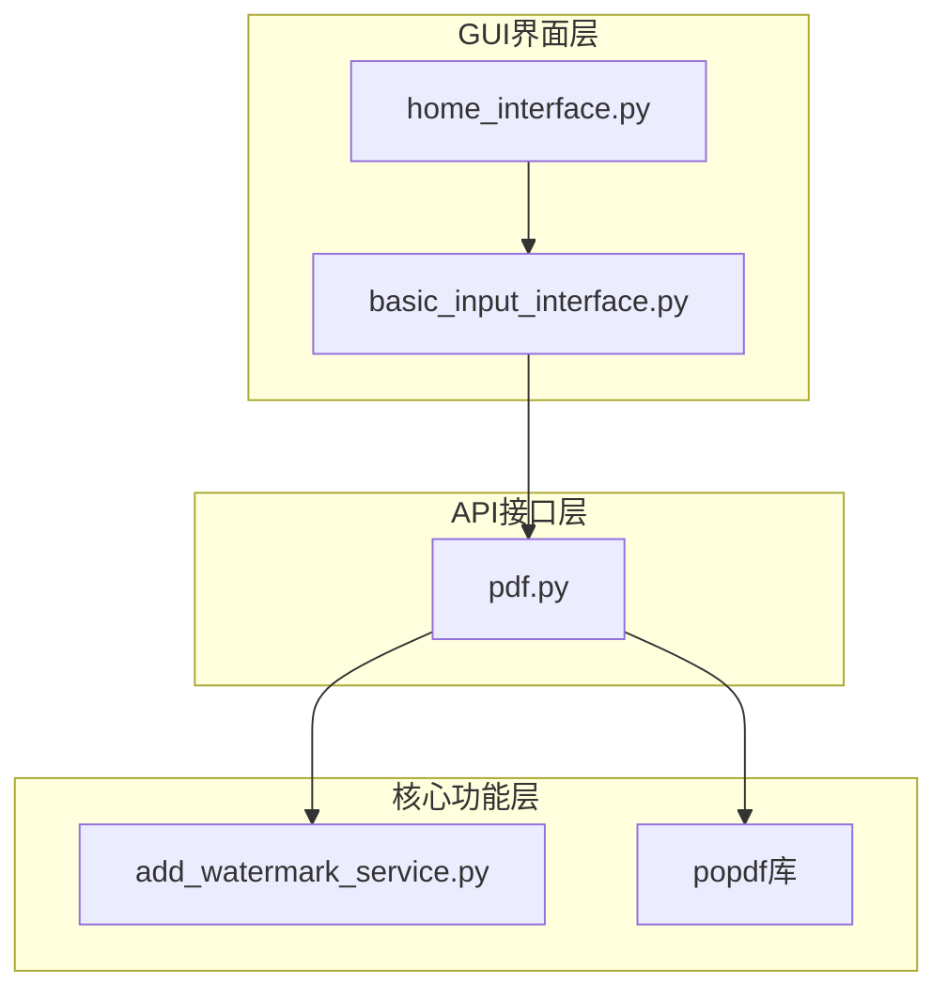
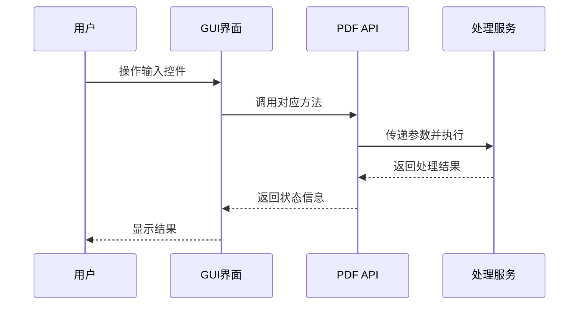
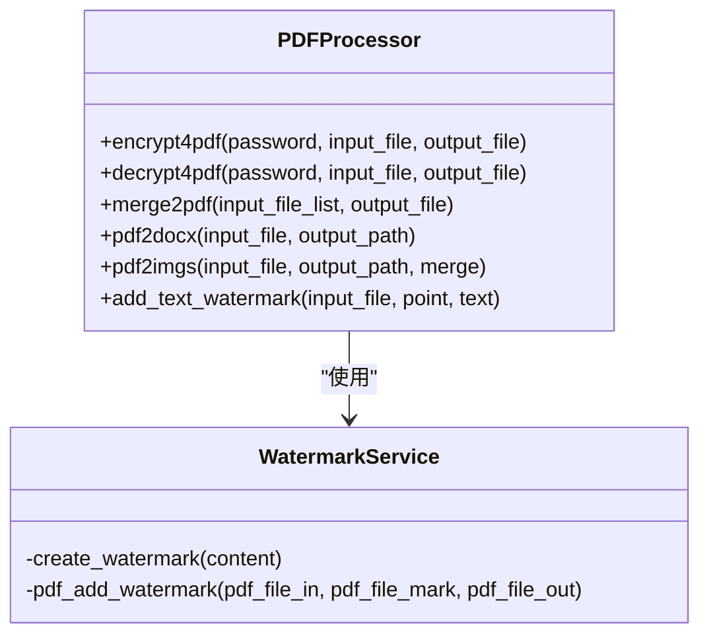
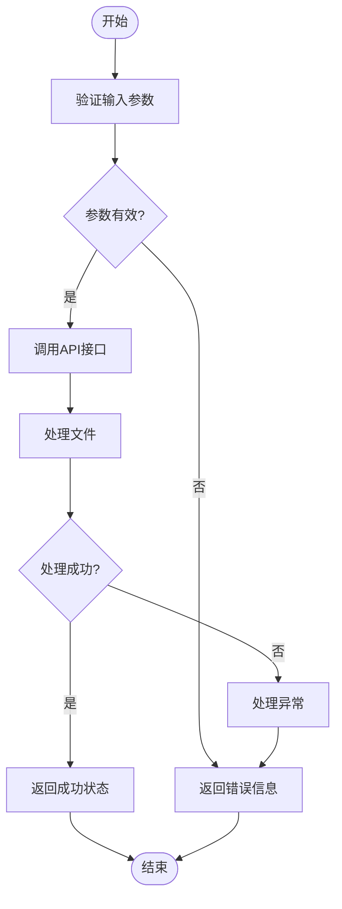
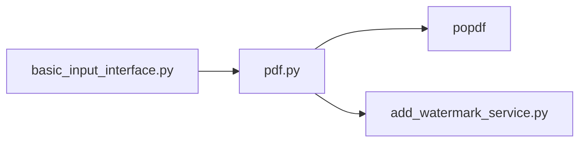

# PDF功能集成

<cite>
**本文档引用文件**  
- [basic_input_interface.py](file://gui/qtpy/version2/gallery/app/view/basic_input_interface.py)
- [pdf.py](file://office/api/pdf.py)
- [add_watermark_service.py](file://office/lib/pdf/add_watermark_service.py)
- [PDF加密.py](file://examples/popdf/PDF加密.py)
- [PDF解密.py](file://examples/popdf/PDF解密.py)
- [PDF加水印.py](file://examples/popdf/PDF加水印.py)
- [合并PDF.py](file://examples/popdf/合并PDF.py)
- [pdf转word.py](file://examples/popdf/pdf转word.py)
- [pdf转图片.py](file://examples/popdf/pdf转图片.py)
- [pdf_demo.py](file://examples/popdf/pdf_demo.py)
</cite>

## 目录
1. [简介](#简介)
2. [项目结构](#项目结构)
3. [核心组件](#核心组件)
4. [架构概述](#架构概述)
5. [详细组件分析](#详细组件分析)
6. [依赖分析](#依赖分析)
7. [性能考虑](#性能考虑)
8. [故障排除指南](#故障排除指南)
9. [结论](#结论)

## 简介
本项目是一个基于Python的办公自动化工具集，专注于PDF文件的各种处理功能。系统通过GUI界面与后端API的紧密结合，实现了PDF加密、解密、加水印、格式转换（转Word、转图片）、合并等核心功能。用户可以通过直观的图形界面操作，调用底层API完成复杂的PDF处理任务。系统采用模块化设计，将GUI输入控件与业务逻辑分离，确保了代码的可维护性和扩展性。

## 项目结构
项目采用分层架构，主要分为GUI界面层、API接口层和核心功能实现层。GUI层基于PyQt5和Fluent Design风格构建，提供现代化的用户交互体验。API层作为中间桥梁，封装了对底层功能的调用。核心功能则由独立的模块实现，确保了功能的独立性和可复用性。

**图示来源**  
- [basic_input_interface.py](file://gui/qtpy/version2/gallery/app/view/basic_input_interface.py)
- [pdf.py](file://office/api/pdf.py)
- [add_watermark_service.py](file://office/lib/pdf/add_watermark_service.py)

## 核心组件
系统的核心组件包括GUI输入控件、PDF API接口和底层处理服务。`basic_input_interface.py`负责构建用户交互界面，`office/api/pdf.py`提供统一的API接口，而`office/lib/pdf/add_watermark_service.py`等文件则实现了具体的PDF处理逻辑。这种分层设计使得各组件职责清晰，便于维护和扩展。

**组件来源**  
- [basic_input_interface.py](file://gui/qtpy/version2/gallery/app/view/basic_input_interface.py#L1-L143)
- [pdf.py](file://office/api/pdf.py#L1-L226)
- [add_watermark_service.py](file://office/lib/pdf/add_watermark_service.py#L1-L73)

## 架构概述
系统采用典型的三层架构模式，从上至下分别为表现层（GUI）、业务逻辑层（API）和数据处理层（Service）。用户在GUI界面进行操作，触发事件后由API层接收参数并调用相应的处理函数，最终由底层服务完成具体的PDF文件操作。整个流程通过参数封装和异常捕获机制保证了系统的稳定性和可靠性。

**图示来源**  
- [basic_input_interface.py](file://gui/qtpy/version2/gallery/app/view/basic_input_interface.py)
- [pdf.py](file://office/api/pdf.py)

## 详细组件分析

### PDF功能实现分析
系统通过`office/api/pdf.py`文件提供了完整的PDF处理功能接口，包括加密、解密、加水印、格式转换和文件合并等。每个功能都通过简洁的函数接口暴露给上层调用，参数设计合理，便于GUI界面进行参数封装。

**图示来源**  
- [pdf.py](file://office/api/pdf.py#L92-L226)
- [add_watermark_service.py](file://office/lib/pdf/add_watermark_service.py#L10-L73)

### GUI与API对接机制
`basic_input_interface.py`中的输入控件与`office/api/pdf.py`的接口通过参数传递方式进行对接。当用户在GUI界面完成参数输入并点击执行按钮时，系统会收集所有输入控件的值，封装成函数参数，然后调用对应的API方法。这种设计实现了界面与逻辑的完全解耦。

**组件来源**  
- [basic_input_interface.py](file://gui/qtpy/version2/gallery/app/view/basic_input_interface.py)
- [pdf.py](file://office/api/pdf.py)

### 参数封装与文件处理流程
系统采用统一的参数封装机制，将GUI界面收集的用户输入转换为API调用所需的参数。对于文件处理操作，系统首先验证输入参数的有效性，然后调用底层服务进行处理，最后返回操作结果。整个流程通过try-catch机制捕获可能出现的异常，确保程序的稳定性。

**图示来源**  
- [pdf.py](file://office/api/pdf.py)
- [add_watermark_service.py](file://office/lib/pdf/add_watermark_service.py)

### 异常捕获机制
系统在多个层级实现了完善的异常捕获机制。在底层服务中，针对文件加密状态、密码验证等场景进行了专门的异常处理。在API层，通过统一的错误处理逻辑确保异常不会向上传播。GUI层则通过友好的提示信息告知用户操作失败的原因。

**组件来源**  
- [add_watermark_service.py](file://office/lib/pdf/add_watermark_service.py#L50-L58)
- [pdf.py](file://office/api/pdf.py)

## 依赖分析
系统的主要依赖关系体现在GUI界面层对API接口层的依赖，以及API接口层对核心处理服务的依赖。通过`import popdf`语句，API层调用了底层的PDF处理库。同时，GUI界面通过`import office`语句访问所有功能接口。这种依赖关系清晰明了，避免了循环依赖的问题。

**图示来源**  
- [basic_input_interface.py](file://gui/qtpy/version2/gallery/app/view/basic_input_interface.py)
- [pdf.py](file://office/api/pdf.py)

## 性能考虑
系统在处理大型PDF文件时可能会遇到性能瓶颈，特别是在转换为图片或添加水印等需要逐页处理的操作中。建议在处理大文件时提供进度提示，并考虑异步处理机制以避免界面冻结。此外，水印模板的创建可以优化为单例模式，避免重复创建。

## 故障排除指南
常见问题包括文件路径无效、密码错误、文件被占用等。系统应提供详细的错误信息帮助用户定位问题。对于加密PDF的处理，需要特别注意密码验证失败的情况。在开发和测试过程中，可以通过查看日志输出来诊断问题。

**问题来源**  
- [add_watermark_service.py](file://office/lib/pdf/add_watermark_service.py#L51-L57)
- [test_pdf.py](file://tests/test_code/test_pdf.py)

## 结论
该PDF功能集成方案设计合理，通过清晰的分层架构实现了GUI界面与业务逻辑的分离。系统提供了丰富的PDF处理功能，接口设计简洁易用。未来可以考虑增加批量处理、任务队列、进度监控等高级功能，进一步提升用户体验。