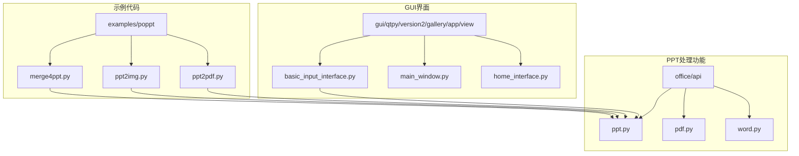
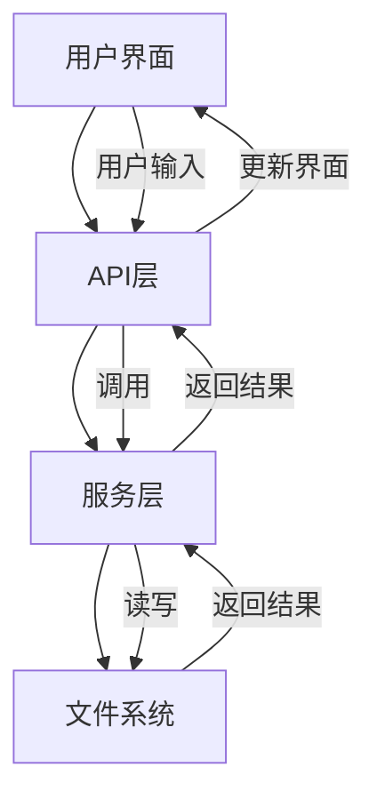
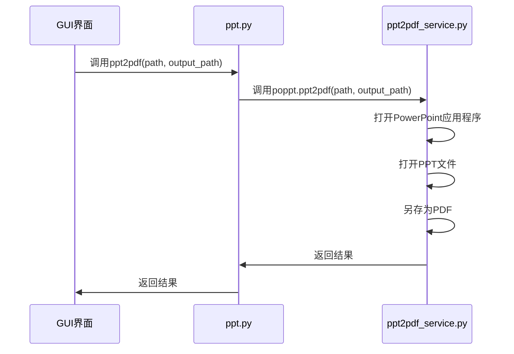
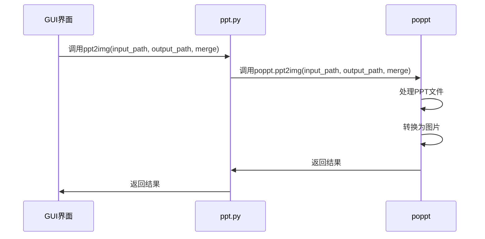
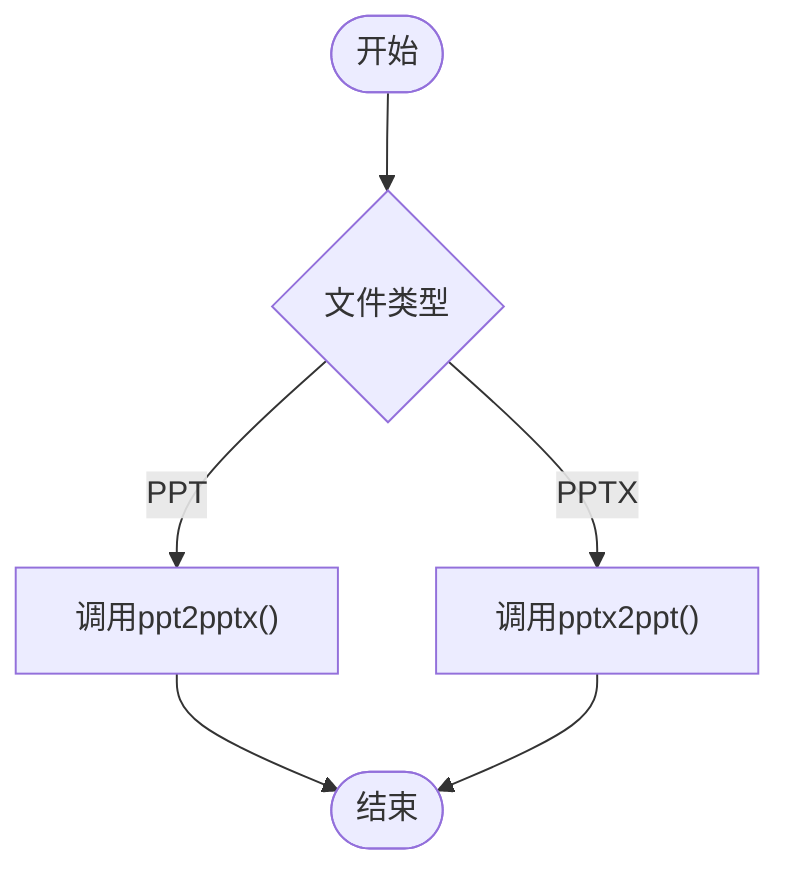
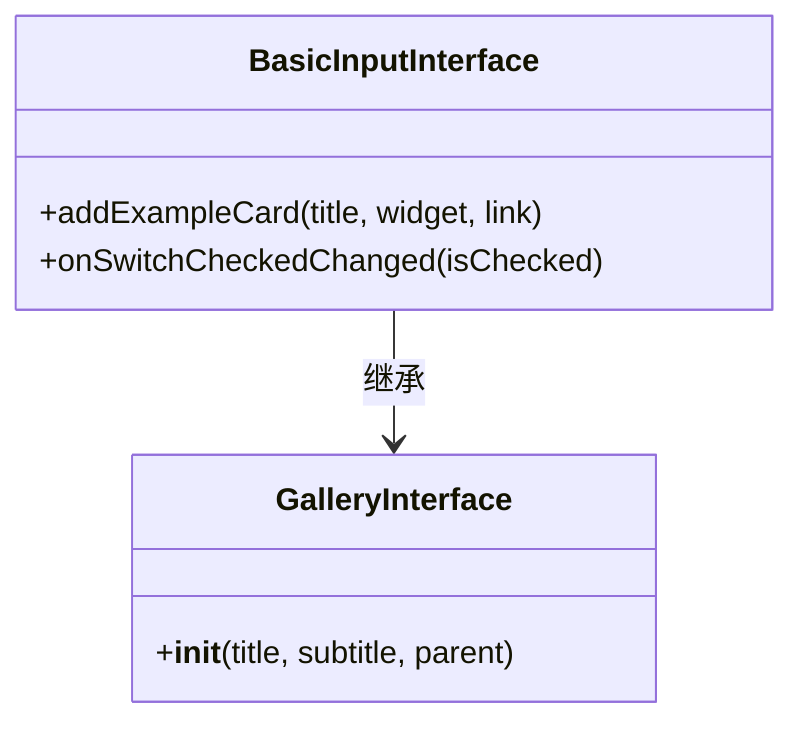
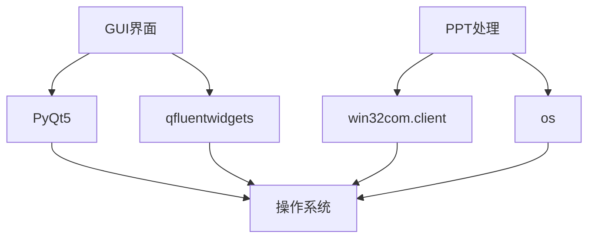
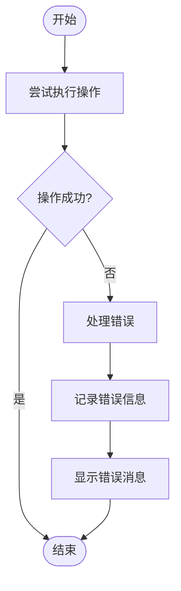

# PPT功能集成

<cite>
**本文档引用的文件**
- [basic_input_interface.py](file://gui/qtpy/version2/gallery/app/view/basic_input_interface.py)
- [ppt.py](file://office/api/ppt.py)
- [ui_Widget.py](file://gui/qtpy/version1/customizeWindowPyfile/ui/ui_Widget.py)
- [FinalWidget.py](file://gui/qtpy/version1/customizeWindowPyfile/FinalWidget.py)
- [ppt2pdf.py](file://examples/poppt/ppt2pdf.py)
- [ppt2img.py](file://examples/poppt/ppt2img.py)
- [merge4ppt.py](file://examples/poppt/merge4ppt.py)
- [ppt2pptx.py](file://contributors/CatchDr/ppt2pptx.py)
- [pptx2ppt.py](file://contributors/CatchDr/pptx2ppt.py)
- [ppt2pdf_service.py](file://office/lib/ppt/ppt2pdf_service.py)
</cite>

## 目录
1. [简介](#简介)
2. [项目结构](#项目结构)
3. [核心组件](#核心组件)
4. [架构概述](#架构概述)
5. [详细组件分析](#详细组件分析)
6. [依赖分析](#依赖分析)
7. [性能考虑](#性能考虑)
8. [故障排除指南](#故障排除指南)
9. [结论](#结论)

## 简介
本文档详细说明了GUI界面中PPT相关功能的实现机制，包括PPT与PPTX互转、PPT转PDF、PPT转图片等操作。分析了basic_input_interface.py中按钮和下拉框等组件如何调用office/api/ppt.py提供的API，描述了文件输入、参数配置、后台执行及结果输出的完整流程。提供了实际调用示例，解释了异步执行时的界面响应策略和错误处理方案。

## 项目结构
项目结构清晰地组织了GUI界面和PPT处理功能。GUI界面位于gui/qtpy/version2/gallery/app/view目录下，而PPT处理功能位于office/api目录下。这种分离的设计使得界面和业务逻辑可以独立开发和维护。

**Diagram sources**
- [basic_input_interface.py](file://gui/qtpy/version2/gallery/app/view/basic_input_interface.py)
- [ppt.py](file://office/api/ppt.py)
- [ppt2pdf.py](file://examples/poppt/ppt2pdf.py)
- [ppt2img.py](file://examples/poppt/ppt2img.py)
- [merge4ppt.py](file://examples/poppt/merge4ppt.py)

## 核心组件
PPT功能的核心组件包括GUI界面组件和后端处理API。GUI界面组件负责用户交互，而后端处理API负责实际的文件转换操作。

**Section sources**
- [basic_input_interface.py](file://gui/qtpy/version2/gallery/app/view/basic_input_interface.py)
- [ppt.py](file://office/api/ppt.py)

## 架构概述
系统架构采用分层设计，将用户界面、业务逻辑和数据处理分离。GUI界面通过调用API来执行PPT相关的操作，API则调用底层的处理服务来完成具体的文件转换任务。

**Diagram sources**
- [basic_input_interface.py](file://gui/qtpy/version2/gallery/app/view/basic_input_interface.py)
- [ppt.py](file://office/api/ppt.py)
- [ppt2pdf_service.py](file://office/lib/ppt/ppt2pdf_service.py)

## 详细组件分析
### PPT转换功能分析
PPT转换功能通过调用office/api/ppt.py中的API来实现。这些API提供了PPT转PDF、PPT转图片和合并PPT文件的功能。

#### PPT转PDF

**Diagram sources**
- [ppt.py](file://office/api/ppt.py)
- [ppt2pdf_service.py](file://office/lib/ppt/ppt2pdf_service.py)

#### PPT转图片

**Diagram sources**
- [ppt.py](file://office/api/ppt.py)

#### PPT与PPTX互转

**Diagram sources**
- [ppt2pptx.py](file://contributors/CatchDr/ppt2pptx.py)
- [pptx2ppt.py](file://contributors/CatchDr/pptx2ppt.py)

### GUI界面组件分析
GUI界面组件通过按钮和下拉框等控件与用户交互，调用后端API来执行PPT相关的操作。

**Diagram sources**
- [basic_input_interface.py](file://gui/qtpy/version2/gallery/app/view/basic_input_interface.py)

## 依赖分析
PPT功能的实现依赖于多个组件和库。GUI界面依赖于PyQt5和qfluentwidgets库，而PPT处理功能依赖于win32com.client库来操作PowerPoint应用程序。

**Diagram sources**
- [basic_input_interface.py](file://gui/qtpy/version2/gallery/app/view/basic_input_interface.py)
- [ppt.py](file://office/api/ppt.py)
- [ppt2pdf_service.py](file://office/lib/ppt/ppt2pdf_service.py)

## 性能考虑
PPT转换操作的性能主要受文件大小和系统资源的影响。建议在执行大量转换任务时，使用异步处理来避免界面卡顿。

## 故障排除指南
### 常见问题
1. **PowerPoint未安装**：PPT转换功能依赖于PowerPoint应用程序，如果未安装PowerPoint，转换将失败。
2. **文件路径错误**：确保输入和输出路径正确，且具有读写权限。
3. **文件格式不支持**：确保输入文件是支持的PPT或PPTX格式。

### 错误处理

**Diagram sources**
- [ppt2pdf_service.py](file://office/lib/ppt/ppt2pdf_service.py)

## 结论
PPT功能集成通过清晰的分层架构实现了GUI界面与后端处理的分离。用户可以通过直观的界面操作来执行PPT相关的转换任务，而复杂的文件处理逻辑则在后台透明地执行。这种设计既保证了用户体验，又提高了代码的可维护性。