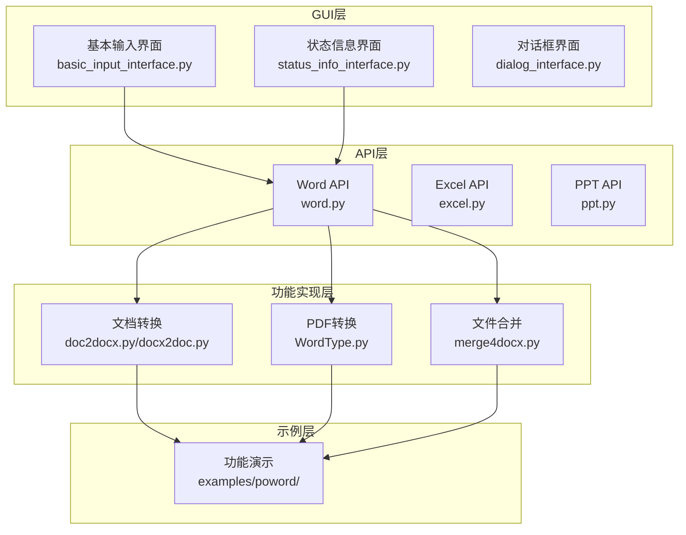
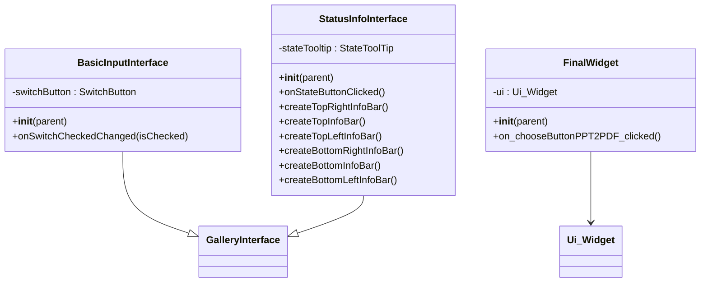
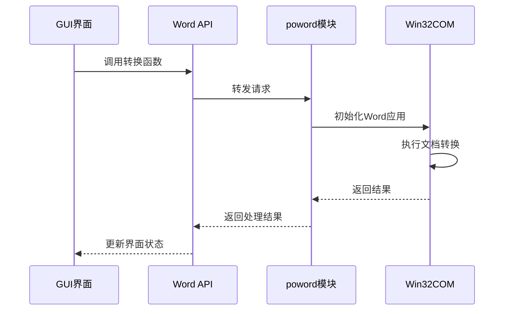
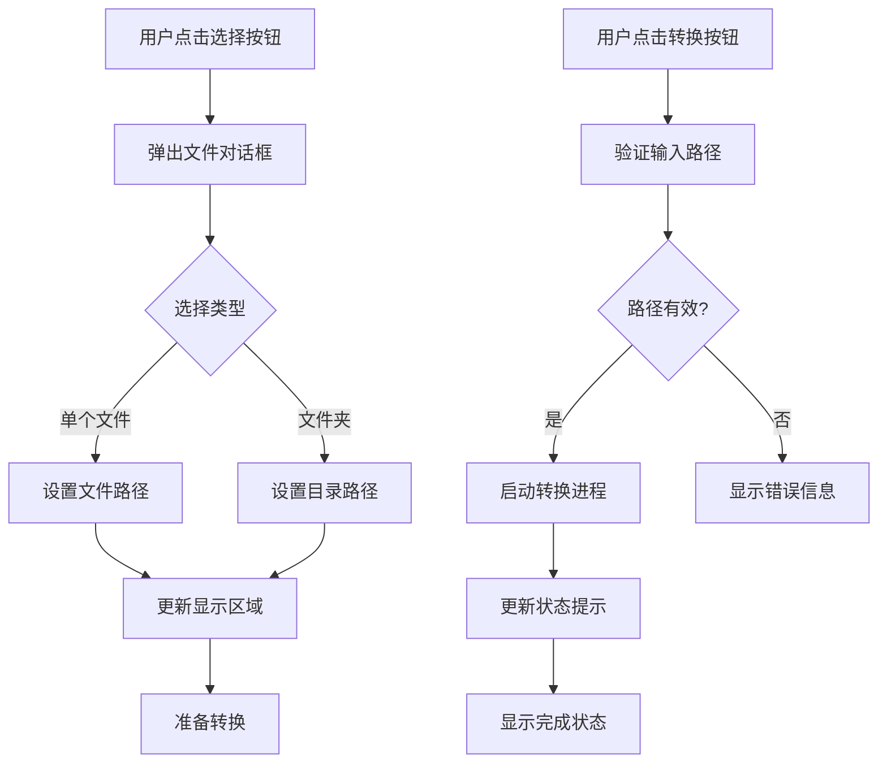
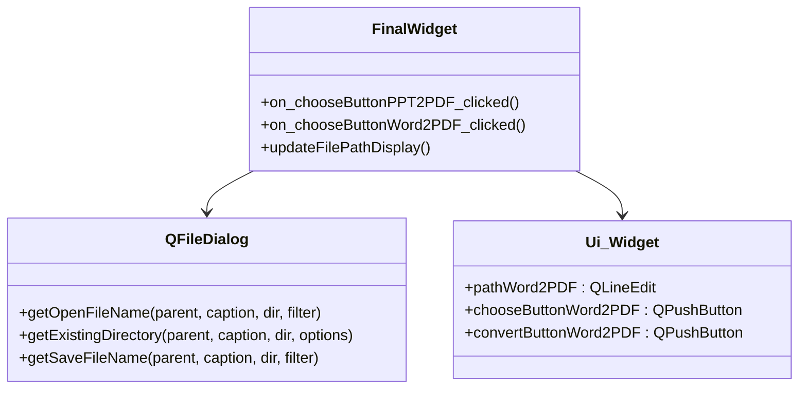
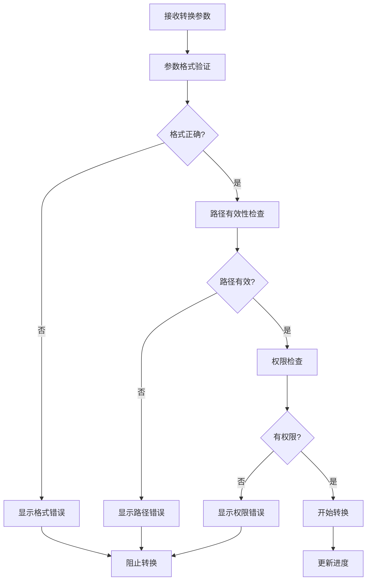
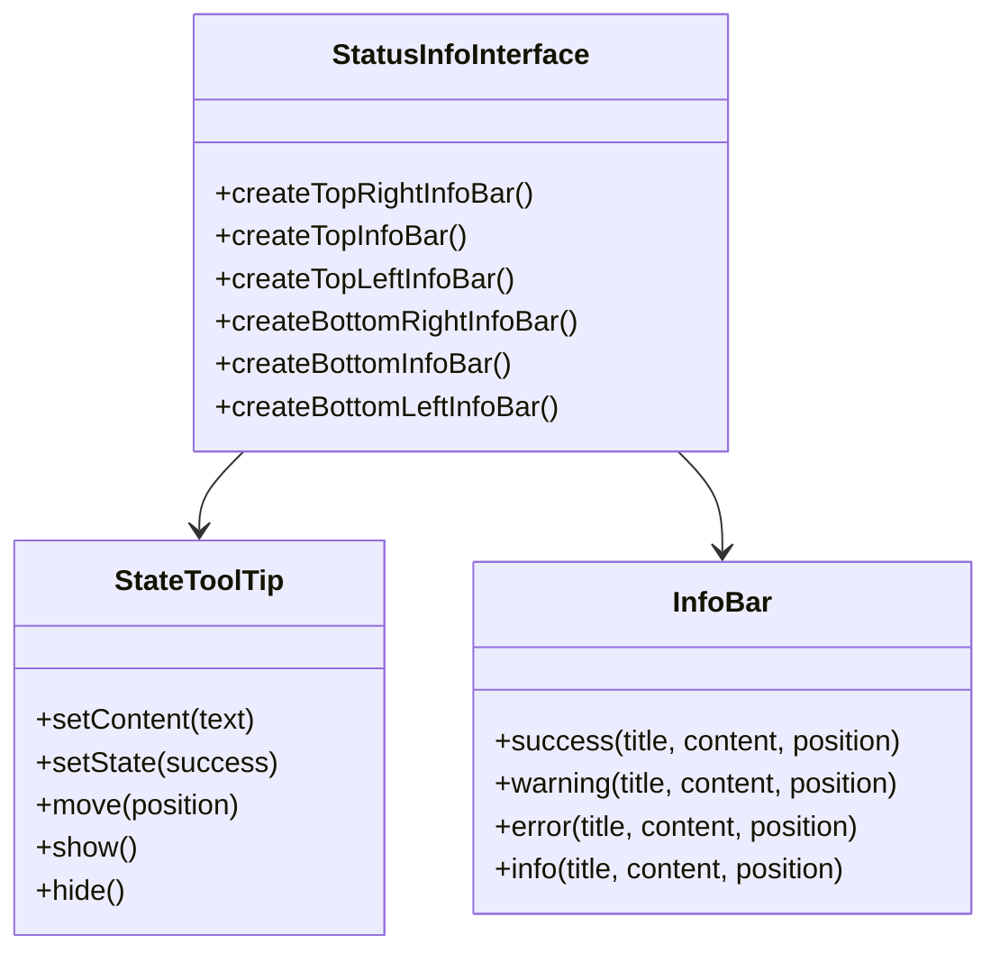
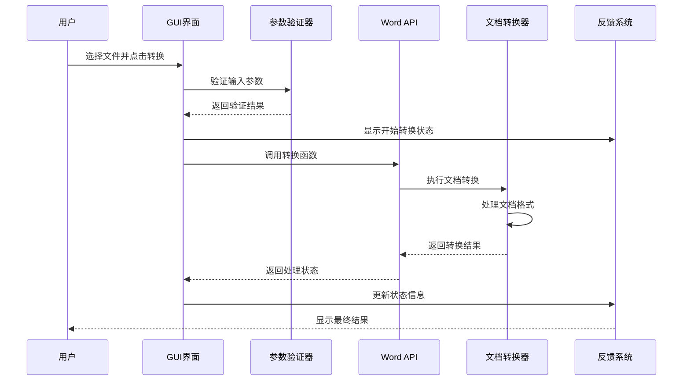

# Word功能集成

<cite>
**本文档引用的文件**
- [basic_input_interface.py](file://gui/qtpy/version2/gallery/app/view/basic_input_interface.py)
- [word.py](file://office/api/word.py)
- [FinalWidget.py](file://gui/qtpy/version1/customizeWindowPyfile/FinalWidget.py)
- [ui_Widget.py](file://gui/qtpy/version1/customizeWindowPyfile/ui/ui_Widget.py)
- [doc2docx.py](file://contributors/CatchDr/doc2docx.py)
- [docx2doc.py](file://contributors/CatchDr/docx2doc.py)
- [WordType.py](file://contributors/demo/WordType.py)
- [status_info_interface.py](file://gui/qtpy/version2/gallery/app/view/status_info_interface.py)
- [doc和docx互转.py](file://examples/poword/doc和docx互转.py)
- [word转PDF.py](file://examples/poword/word转PDF.py)
- [合并word.py](file://examples/poword/合并word.py)
- [compatibility.py](file://office/compatibility.py)
</cite>

## 目录
1. [概述](#概述)
2. [项目结构分析](#项目结构分析)
3. [GUI界面架构](#gui界面架构)
4. [Word文档处理核心功能](#word文档处理核心功能)
5. [控件配置与事件绑定](#控件配置与事件绑定)
6. [文件路径选择机制](#文件路径选择机制)
7. [转换参数设置](#转换参数设置)
8. [执行反馈机制](#执行反馈机制)
9. [调用链路分析](#调用链路分析)
10. [常见问题与解决方案](#常见问题与解决方案)
11. [用户体验优化建议](#用户体验优化建议)
12. [总结](#总结)

## 概述

python-office项目提供了一套完整的Office文档处理解决方案，其中Word功能集成是核心组件之一。该项目通过GUI界面实现了doc与docx互转、Word转PDF、合并Word文件等多种文档处理功能，采用PyQt5作为GUI框架，结合win32com组件实现与Microsoft Office的交互。

## 项目结构分析

项目采用模块化架构设计，主要包含以下核心模块：

**图表来源**
- [basic_input_interface.py](file://gui/qtpy/version2/gallery/app/view/basic_input_interface.py#L1-L143)
- [word.py](file://office/api/word.py#L1-L72)

**章节来源**
- [basic_input_interface.py](file://gui/qtpy/version2/gallery/app/view/basic_input_interface.py#L1-L143)
- [word.py](file://office/api/word.py#L1-L72)

## GUI界面架构

### 基础界面组件

GUI界面采用PyQt5框架构建，主要界面组件包括：

**图表来源**
- [basic_input_interface.py](file://gui/qtpy/version2/gallery/app/view/basic_input_interface.py#L11-L143)
- [status_info_interface.py](file://gui/qtpy/version2/gallery/app/view/status_info_interface.py#L12-L221)
- [FinalWidget.py](file://gui/qtpy/version1/customizeWindowPyfile/FinalWidget.py#L13-L34)

### 控件类型与用途

| 控件类型 | 用途 | 示例 |
|---------|------|------|
| PushButton | 执行主要操作 | 文档转换按钮 |
| QLineEdit | 显示文件路径 | 输入/输出路径显示框 |
| QPushButton | 触发文件选择 | 选择文件夹按钮 |
| SwitchButton | 开关状态控制 | 功能启用/禁用切换 |
| ComboBox | 参数选项选择 | 转换格式选项 |

**章节来源**
- [basic_input_interface.py](file://gui/qtpy/version2/gallery/app/view/basic_input_interface.py#L22-L136)
- [status_info_interface.py](file://gui/qtpy/version2/gallery/app/view/status_info_interface.py#L23-L221)

## Word文档处理核心功能

### API接口设计

Word功能通过统一的API接口进行封装，提供了简洁的调用方式：

**图表来源**
- [word.py](file://office/api/word.py#L6-L72)

### 支持的功能类型

| 功能名称 | 函数名 | 输入参数 | 输出描述 |
|---------|--------|----------|----------|
| Doc转Docx | `doc2docx()` | `input_path`, `output_path`, `output_name` | 将.doc文件转换为.docx格式 |
| Docx转Doc | `docx2doc()` | `input_path`, `output_path`, `output_name` | 将.docx文件转换为.doc格式 |
| Word转PDF | `docx2pdf()` | `path`, `output_path` | 将Word文档转换为PDF格式 |
| 合并Word文件 | `merge4docx()` | `input_path`, `output_path`, `new_word_name` | 合并多个Word文档为一个文件 |

**章节来源**
- [word.py](file://office/api/word.py#L6-L72)

## 控件配置与事件绑定

### 文件路径选择控件

GUI界面中包含专门的Word转换控件配置：

**图表来源**
- [ui_Widget.py](file://gui/qtpy/version1/customizeWindowPyfile/ui/ui_Widget.py#L192-L213)
- [FinalWidget.py](file://gui/qtpy/version1/customizeWindowPyfile/FinalWidget.py#L28-L33)

### 事件绑定机制

控件事件通过信号槽机制实现响应式编程：

| 事件类型 | 触发条件 | 处理函数 | 功能描述 |
|---------|----------|----------|----------|
| 文件选择事件 | 用户点击选择按钮 | `on_chooseButtonWord2PDF_clicked()` | 弹出文件选择对话框 |
| 转换执行事件 | 用户点击转换按钮 | `on_convertButtonWord2PDF_clicked()` | 执行文档转换操作 |
| 状态更新事件 | 转换过程状态变化 | `on_conversion_status_changed()` | 更新进度和状态信息 |

**章节来源**
- [FinalWidget.py](file://gui/qtpy/version1/customizeWindowPyfile/FinalWidget.py#L28-L33)
- [ui_Widget.py](file://gui/qtpy/version1/customizeWindowPyfile/ui/ui_Widget.py#L192-L213)

## 文件路径选择机制

### QFileDialog集成

项目使用PyQt5的QFileDialog组件实现文件路径选择：

**图表来源**
- [FinalWidget.py](file://gui/qtpy/version1/customizeWindowPyfile/FinalWidget.py#L28-L33)

### 路径验证与处理

文件路径选择流程包含多层验证机制：

1. **路径存在性验证**：检查目标路径是否存在
2. **文件类型验证**：确认文件格式符合要求
3. **权限验证**：确保有读写权限
4. **路径格式标准化**：统一路径分隔符格式

**章节来源**
- [FinalWidget.py](file://gui/qtpy/version1/customizeWindowPyfile/FinalWidget.py#L28-L33)

## 转换参数设置

### 参数配置表

| 参数名称 | 类型 | 默认值 | 描述 | 用户可配置性 |
|---------|------|--------|------|-------------|
| 输入路径 | str | 必填 | 源文档所在路径 | 是 |
| 输出路径 | str | 当前目录 | 转换后文件保存位置 | 是 |
| 输出名称 | str | 原文件名 | 转换后文件的名称 | 是 |
| 转换模式 | enum | 单文件 | 单文件或批量处理模式 | 是 |
| 格式选项 | enum | 自动检测 | 目标格式类型 | 是 |

### 参数验证机制

**章节来源**
- [word.py](file://office/api/word.py#L34-L60)

## 执行反馈机制

### 状态提示系统

项目实现了多层次的状态反馈机制：

**图表来源**
- [status_info_interface.py](file://gui/qtpy/version2/gallery/app/view/status_info_interface.py#L12-L221)

### 反馈类型与时机

| 反馈类型 | 触发时机 | 显示位置 | 持续时间 | 用户交互 |
|---------|----------|----------|----------|----------|
| 进度提示 | 转换开始时 | 屏幕中央 | 实时更新 | 不可关闭 |
| 成功通知 | 转换完成 | 顶部居中 | 2秒 | 可关闭 |
| 错误警告 | 转换失败 | 底部居中 | 持续显示 | 可关闭 |
| 警告提示 | 参数异常 | 右上角 | 2秒 | 可关闭 |

**章节来源**
- [status_info_interface.py](file://gui/qtpy/version2/gallery/app/view/status_info_interface.py#L152-L221)

## 调用链路分析

### 完整调用流程

以下是Word转换功能的完整调用链路：

**图表来源**
- [word.py](file://office/api/word.py#L6-L72)
- [status_info_interface.py](file://gui/qtpy/version2/gallery/app/view/status_info_interface.py#L141-L154)

### 具体调用示例

以Word转PDF功能为例，调用链路如下：

1. **用户操作**：点击转换按钮
2. **界面响应**：显示进度提示
3. **参数验证**：检查输入路径和格式
4. **API调用**：调用`office.word.docx2pdf()`
5. **底层处理**：通过win32com执行转换
6. **状态反馈**：更新界面状态
7. **结果通知**：显示成功或失败信息

**章节来源**
- [word转PDF.py](file://examples/poword/word转PDF.py#L1-L10)
- [status_info_interface.py](file://gui/qtpy/version2/gallery/app/view/status_info_interface.py#L141-L154)

## 常见问题与解决方案

### 格式丢失问题

**问题描述**：在转换过程中可能出现格式丢失的情况，特别是复杂的排版和样式。

**解决方案**：
1. **预检查机制**：在转换前检查文档复杂度
2. **备份原始文件**：保留未转换的原始文档
3. **格式对比工具**：提供转换前后对比功能
4. **分步转换**：对于复杂文档，采用分步转换策略

### 兼容性问题

**问题描述**：不同版本的Office软件可能导致转换效果不一致。

**解决方案**：
1. **版本检测**：自动检测Office版本
2. **格式适配**：针对不同版本调整转换参数
3. **降级处理**：当高级格式不支持时自动降级
4. **用户提示**：明确告知可能的兼容性问题

### 性能优化

**问题描述**：大批量文件转换时可能出现性能瓶颈。

**解决方案**：
1. **异步处理**：采用多线程处理大批量任务
2. **进度监控**：实时显示转换进度
3. **内存管理**：及时释放不再使用的对象
4. **缓存机制**：缓存常用配置和临时文件

**章节来源**
- [compatibility.py](file://office/compatibility.py#L101-L237)

## 用户体验优化建议

### 界面设计优化

1. **直观的文件选择**：提供拖拽上传功能
2. **清晰的状态指示**：使用图标和颜色区分不同状态
3. **智能的参数推荐**：根据文件类型自动推荐最佳参数
4. **批量操作支持**：支持同时选择多个文件进行处理

### 功能增强建议

1. **转换历史记录**：保存最近的转换记录
2. **模板支持**：允许用户保存常用的转换配置
3. **批量预览**：在批量转换前预览结果
4. **云端同步**：支持将转换结果同步到云端

### 错误处理改进

1. **详细的错误信息**：提供具体的错误原因和解决建议
2. **自动恢复机制**：在意外中断后能够恢复部分工作
3. **日志记录**：详细记录转换过程以便排查问题
4. **用户反馈渠道**：提供便捷的问题反馈入口

### 性能提升策略

1. **增量处理**：只处理发生变化的文件
2. **智能队列**：根据文件大小和复杂度安排处理顺序
3. **硬件加速**：利用GPU加速图像处理部分
4. **内存优化**：减少内存占用，提高大文件处理能力

## 总结

python-office项目的Word功能集成展现了优秀的软件架构设计和用户体验理念。通过PyQt5 GUI框架、win32com组件集成以及模块化的API设计，项目成功实现了doc与docx互转、Word转PDF、合并Word文件等核心功能。

### 技术亮点

1. **模块化设计**：清晰的分层架构便于维护和扩展
2. **跨平台兼容性**：通过兼容性检查机制提供平台特定建议
3. **丰富的反馈机制**：多层次的状态提示提升用户体验
4. **完善的错误处理**：全面的异常捕获和用户友好提示

### 应用价值

该项目不仅为开发者提供了强大的Office文档处理能力，更重要的是展示了如何构建高质量的桌面应用程序。其设计理念和实现方式对类似项目的开发具有重要的参考价值。

通过持续的功能优化和用户体验改进，python-office项目有望成为Office文档处理领域的标杆解决方案，为用户提供更加便捷、高效的文档处理体验。