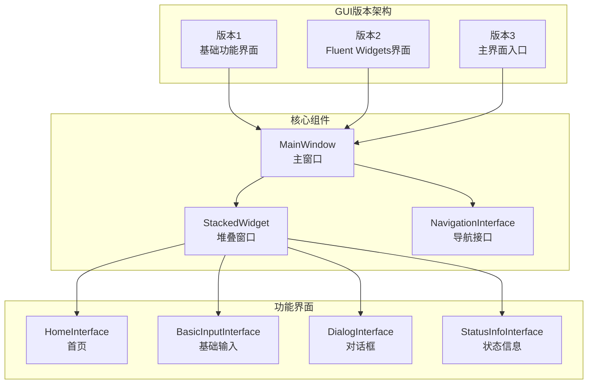
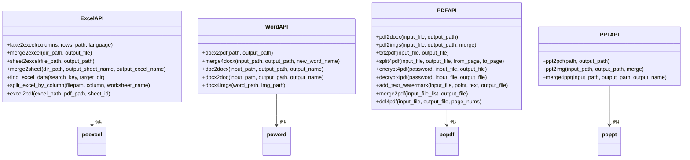
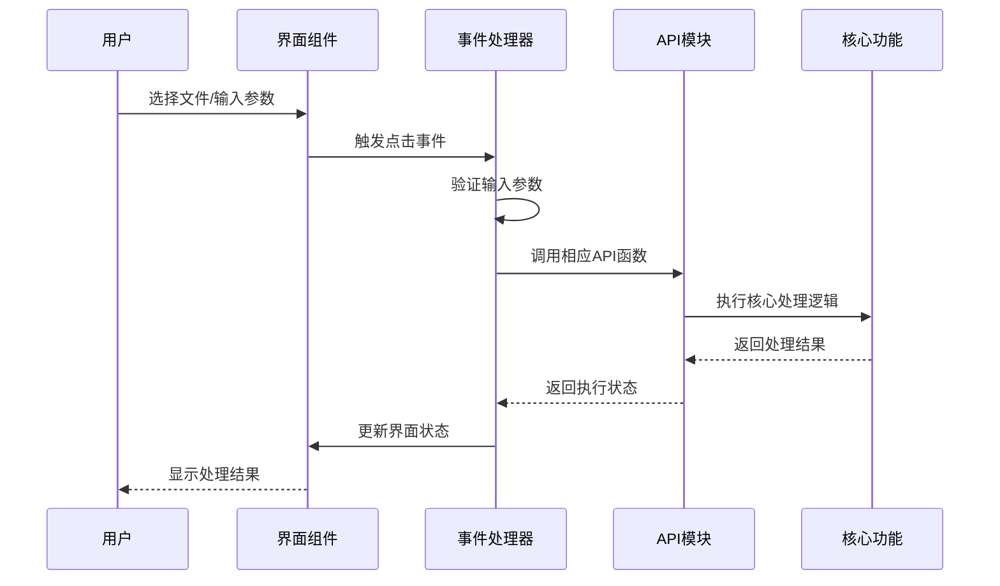
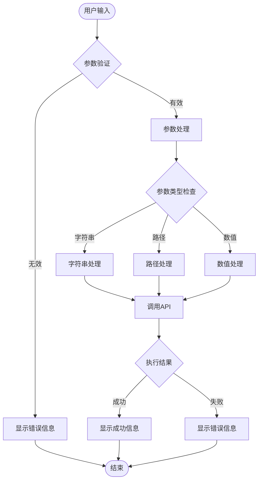
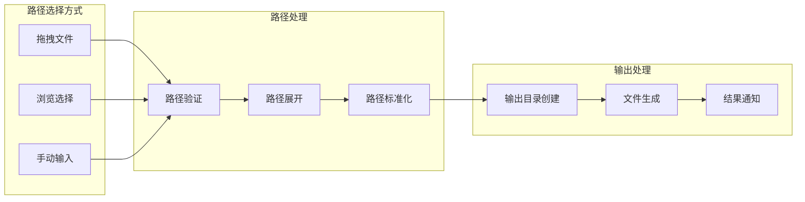
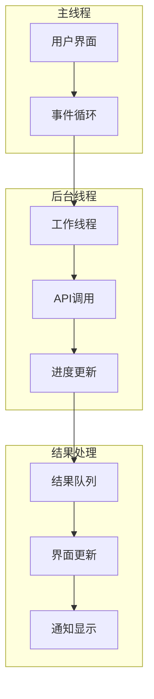
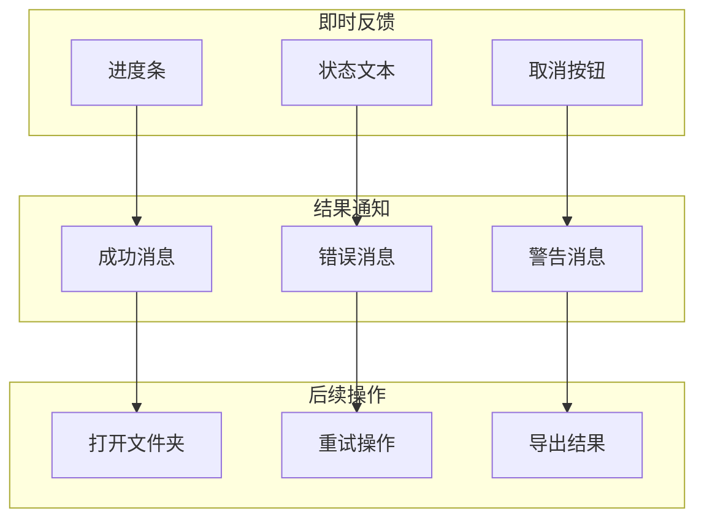
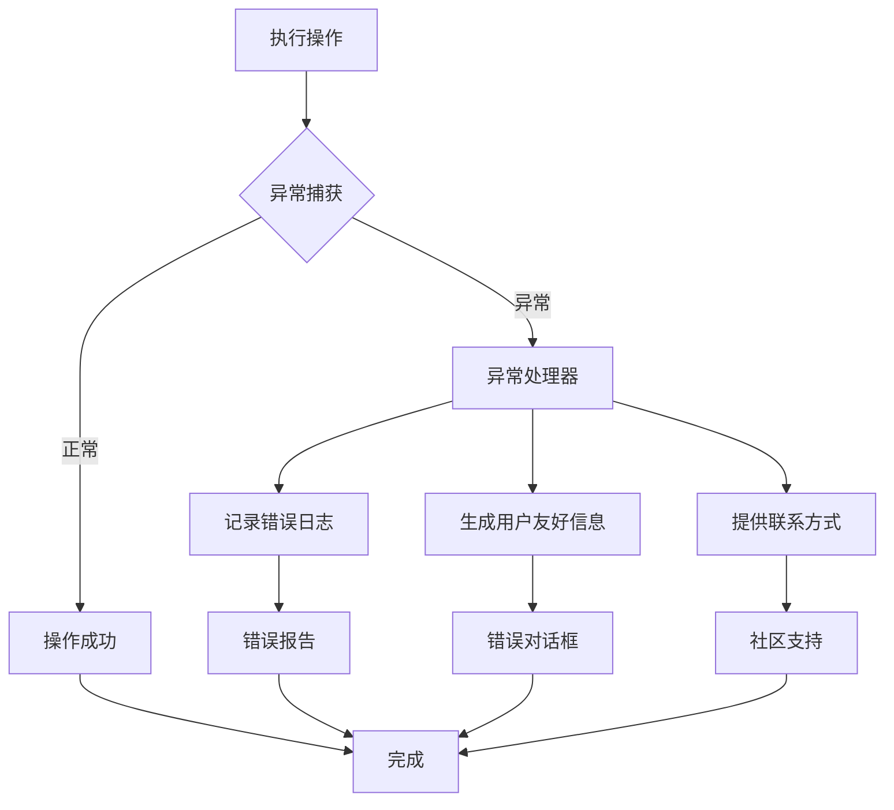
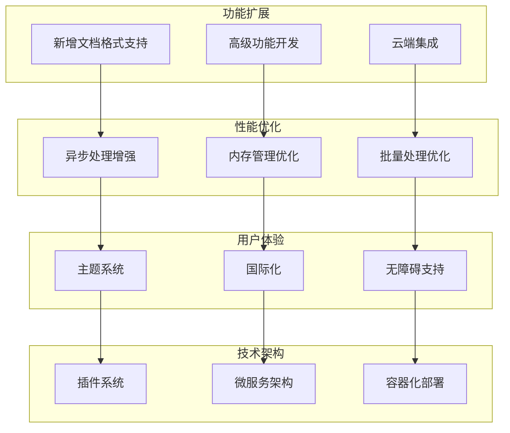

# 文档处理功能集成

<cite>
**本文档引用的文件**
- [basic_input_interface.py](file://gui/qtpy/version2/gallery/app/view/basic_input_interface.py)
- [main_window.py](file://gui/qtpy/version2/gallery/app/view/main_window.py)
- [home_interface.py](file://gui/qtpy/version2/gallery/app/view/home_interface.py)
- [FinalWidget.py](file://gui/qtpy/version1/customizeWindowPyfile/FinalWidget.py)
- [ui_Widget.py](file://gui/qtpy/version1/customizeWindowPyfile/ui/ui_Widget.py)
- [excel.py](file://office/api/excel.py)
- [word.py](file://office/api/word.py)
- [pdf.py](file://office/api/pdf.py)
- [ppt.py](file://office/api/ppt.py)
- [except_utils.py](file://office/lib/utils/except_utils.py)
- [Excel转PDF.py](file://examples/poexcel/Excel转PDF.py)
</cite>

## 目录
1. [项目概述](#项目概述)
2. [GUI界面架构](#gui界面架构)
3. [文档处理API模块](#文档处理api模块)
4. [界面组件与API调用关系](#界面组件与api调用关系)
5. [参数传递机制](#参数传递机制)
6. [文件路径处理](#文件路径处理)
7. [异步执行策略](#异步执行策略)
8. [结果反馈方式](#结果反馈方式)
9. [错误处理和用户提示](#错误处理和用户提示)
10. [功能范围分析](#功能范围分析)
11. [扩展点分析](#扩展点分析)
12. [最佳实践总结](#最佳实践总结)

## 项目概述

python-office是一个集成了多种文档处理功能的Python库，提供了完整的GUI界面来操作Excel、Word、PDF、PPT等文档格式。该项目采用模块化设计，将GUI界面与底层API功能分离，实现了良好的可维护性和扩展性。

### 核心功能模块
- **Excel处理**：数据模拟、文件合并拆分、格式转换
- **Word处理**：格式转换、文档合并、图片提取
- **PDF处理**：格式转换、加密解密、水印添加
- **PPT处理**：格式转换、合并操作

## GUI界面架构

### 版本对比

项目提供了三个版本的GUI界面，每个版本都有其特点：

**图表来源**
- [main_window.py](file://gui/qtpy/version2/gallery/app/view/main_window.py#L66-L212)
- [home_interface.py](file://gui/qtpy/version2/gallery/app/view/home_interface.py#L89-L326)

### 界面组织结构

GUI界面采用模块化组织结构，主要包含以下核心组件：

1. **主窗口系统**：负责整体布局和导航
2. **功能界面**：提供具体的文档处理功能
3. **状态管理系统**：处理用户交互和状态反馈
4. **资源管理系统**：管理图标、样式等资源

**章节来源**
- [main_window.py](file://gui/qtpy/version2/gallery/app/view/main_window.py#L66-L212)
- [basic_input_interface.py](file://gui/qtpy/version2/gallery/app/view/basic_input_interface.py#L11-L143)

## 文档处理API模块

### API模块设计

文档处理功能通过专门的API模块实现，每个模块对应一种文档类型：

**图表来源**
- [excel.py](file://office/api/excel.py#L25-L137)
- [word.py](file://office/api/word.py#L6-L72)
- [pdf.py](file://office/api/pdf.py#L28-L226)
- [ppt.py](file://office/api/ppt.py#L7-L46)

### 支持的功能范围

| 功能类别 | Excel | Word | PDF | PPT |
|---------|-------|------|-----|-----|
| 格式转换 | ✅ | ✅ | ✅ | ✅ |
| 文件合并 | ✅ | ❌ | ✅ | ✅ |
| 文件拆分 | ✅ | ❌ | ✅ | ❌ |
| 数据处理 | ✅ | ❌ | ❌ | ❌ |
| 加密解密 | ❌ | ❌ | ✅ | ❌ |
| 水印添加 | ❌ | ❌ | ✅ | ❌ |
| 图片提取 | ❌ | ✅ | ❌ | ❌ |

**章节来源**
- [excel.py](file://office/api/excel.py#L1-L137)
- [word.py](file://office/api/word.py#L1-L72)
- [pdf.py](file://office/api/pdf.py#L1-L226)
- [ppt.py](file://office/api/ppt.py#L1-L46)

## 界面组件与API调用关系

### 基础输入界面

基本输入界面提供了各种控件来收集用户输入，这些控件与相应的API函数建立联系：

**图表来源**
- [basic_input_interface.py](file://gui/qtpy/version2/gallery/app/view/basic_input_interface.py#L138-L143)
- [ui_Widget.py](file://gui/qtpy/version1/customizeWindowPyfile/ui/ui_Widget.py#L16-L24)

### 具体调用流程

以PPT转PDF功能为例，展示完整的调用流程：

1. **界面初始化**：
   - 创建文件路径输入框
   - 设置选择按钮和转换按钮
   - 连接按钮点击事件

2. **事件处理**：
   - 用户点击选择按钮，打开文件选择对话框
   - 用户点击转换按钮，触发转换逻辑

3. **API调用**：
   - 获取用户选择的文件路径
   - 调用`ppt2pdf` API函数
   - 处理转换结果

**章节来源**
- [ui_Widget.py](file://gui/qtpy/version1/customizeWindowPyfile/ui/ui_Widget.py#L16-L24)
- [FinalWidget.py](file://gui/qtpy/version1/customizeWindowPyfile/FinalWidget.py#L28-L33)

## 参数传递机制

### 参数验证和处理

GUI界面通过多种方式收集和验证用户输入参数：

### 参数类型处理

不同类型的参数有不同的处理方式：

1. **文件路径参数**：
   - 支持拖拽文件
   - 自动验证路径有效性
   - 处理相对路径和绝对路径

2. **数值参数**：
   - 数字格式验证
   - 范围限制检查
   - 默认值处理

3. **选项参数**：
   - 下拉菜单选择
   - 单选按钮组
   - 复选框组合

**章节来源**
- [ui_Widget.py](file://gui/qtpy/version1/customizeWindowPyfile/ui/ui_Widget.py#L16-L24)
- [FinalWidget.py](file://gui/qtpy/version1/customizeWindowPyfile/FinalWidget.py#L28-L33)

## 文件路径处理

### 路径选择机制

GUI界面提供了多种文件路径选择方式：

### 路径处理策略

1. **相对路径处理**：
   - 自动转换为绝对路径
   - 保持相对关系
   - 处理跨平台差异

2. **输出路径管理**：
   - 自动生成输出目录
   - 处理文件名冲突
   - 支持批量处理

3. **路径验证**：
   - 文件存在性检查
   - 权限验证
   - 格式验证

**章节来源**
- [ui_Widget.py](file://gui/qtpy/version1/customizeWindowPyfile/ui/ui_Widget.py#L30-L41)
- [FinalWidget.py](file://gui/qtpy/version1/customizeWindowPyfile/FinalWidget.py#L28-L33)

## 异步执行策略

### 异步处理架构

为了防止界面阻塞，GUI界面采用了多种异步处理策略：

### 进度反馈机制

1. **实时进度显示**：
   - 进度条更新
   - 状态文本变化
   - 时间估算

2. **中断处理**：
   - 用户取消操作
   - 系统资源不足
   - 异常情况处理

3. **完成通知**：
   - 成功完成提示
   - 错误信息显示
   - 文件位置指引

**章节来源**
- [status_info_interface.py](file://gui/qtpy/version2/gallery/app/view/status_info_interface.py#L141-L154)

## 结果反馈方式

### 多层次反馈系统

GUI界面提供了多层次的结果反馈机制：

### 反馈类型和时机

1. **操作前反馈**：
   - 参数验证提示
   - 资源检查
   - 权限确认

2. **操作中反馈**：
   - 实时进度更新
   - 状态信息显示
   - 取消操作支持

3. **操作后反馈**：
   - 结果统计信息
   - 文件位置指引
   - 相关操作建议

**章节来源**
- [status_info_interface.py](file://gui/qtpy/version2/gallery/app/view/status_info_interface.py#L156-L220)

## 错误处理和用户提示

### 统一异常处理

项目采用了统一的异常处理机制，确保错误信息的一致性和用户体验的友好性：

**图表来源**
- [except_utils.py](file://office/lib/utils/except_utils.py#L10-L35)

### 错误处理最佳实践

1. **异常捕获**：
   - 使用装饰器模式统一处理
   - 记录详细的错误信息
   - 提供恢复建议

2. **用户提示**：
   - 清晰的错误描述
   - 可操作的解决方案
   - 社区支持链接

3. **日志记录**：
   - 时间戳记录
   - 函数调用栈
   - 用户环境信息

**章节来源**
- [except_utils.py](file://office/lib/utils/except_utils.py#L10-L35)

## 功能范围分析

### 当前支持的功能

基于现有代码分析，当前支持的文档处理功能范围如下：

#### Excel功能
- **数据模拟**：生成模拟数据的Excel文件
- **文件合并**：多个Excel文件合并到一个文件的不同sheet中
- **工作表拆分**：同一Excel的不同sheet拆分为不同文件
- **内容搜索**：搜索Excel中指定内容的文件
- **列拆分**：按指定列的内容拆分Excel
- **格式转换**：Excel转PDF

#### Word功能
- **格式转换**：Docx转PDF
- **文档合并**：多个Docx文件合并
- **格式转换**：Doc转Docx，Docx转Doc
- **图片提取**：从Word中提取图片

#### PDF功能
- **格式转换**：PDF转Word
- **格式转换**：PDF转图片
- **文本转换**：文本文件转PDF
- **文件拆分**：拆分PDF文件
- **加密解密**：PDF文件加密和解密
- **水印添加**：添加文本和图片水印
- **文件合并**：合并多个PDF文件
- **页面删除**：删除PDF指定页面

#### PPT功能
- **格式转换**：PPT转PDF
- **格式转换**：PPT转图片
- **文件合并**：合并多个PPT文件

### 功能完整性评估

| 功能类别 | 完整度 | 主要限制 | 改进建议 |
|---------|--------|----------|----------|
| 格式转换 | ⭐⭐⭐⭐⭐ | 依赖外部软件 | 增加更多格式支持 |
| 文件操作 | ⭐⭐⭐⭐ | Windows特定功能 | 跨平台兼容性改进 |
| 批量处理 | ⭐⭐⭐ | 性能限制 | 异步处理优化 |
| 错误处理 | ⭐⭐⭐ | 用户体验 | 更详细的错误提示 |

**章节来源**
- [excel.py](file://office/api/excel.py#L1-L137)
- [word.py](file://office/api/word.py#L1-L72)
- [pdf.py](file://office/api/pdf.py#L1-L226)
- [ppt.py](file://office/api/ppt.py#L1-L46)

## 扩展点分析

### 潜在的扩展方向

基于现有架构，以下是几个重要的扩展点：

### 具体扩展建议

1. **新增文档格式支持**：
   - Markdown处理功能
   - 图片格式转换
   - 压缩文件处理

2. **高级功能开发**：
   - OCR文字识别
   - 数据分析和可视化
   - 自动化工作流

3. **性能优化**：
   - 多线程处理
   - 内存池管理
   - 缓存机制

4. **用户体验改进**：
   - 主题切换功能
   - 多语言支持
   - 辅助功能

## 最佳实践总结

### 开发最佳实践

基于对项目架构的分析，总结出以下最佳实践：

1. **模块化设计**：
   - 将GUI界面与业务逻辑分离
   - 使用清晰的接口定义
   - 保持模块间的低耦合

2. **异常处理**：
   - 统一的异常处理机制
   - 用户友好的错误提示
   - 详细的日志记录

3. **用户体验**：
   - 实时进度反馈
   - 清晰的操作指导
   - 友好的错误恢复

4. **性能考虑**：
   - 异步处理避免界面阻塞
   - 合理的资源管理
   - 批量操作优化

### 架构设计原则

1. **单一职责原则**：每个模块专注于特定功能
2. **开放封闭原则**：对扩展开放，对修改封闭
3. **依赖倒置原则**：依赖抽象而非具体实现
4. **接口隔离原则**：提供最小化的接口

### 代码质量保证

1. **单元测试覆盖**：确保核心功能的稳定性
2. **文档完整性**：提供详细的API文档
3. **版本控制**：合理的版本管理和发布策略
4. **持续集成**：自动化测试和部署流程

通过遵循这些最佳实践，可以确保项目的长期可维护性和扩展性，同时为用户提供优秀的使用体验。