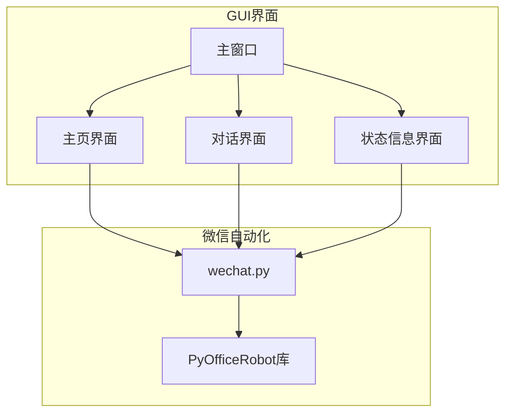
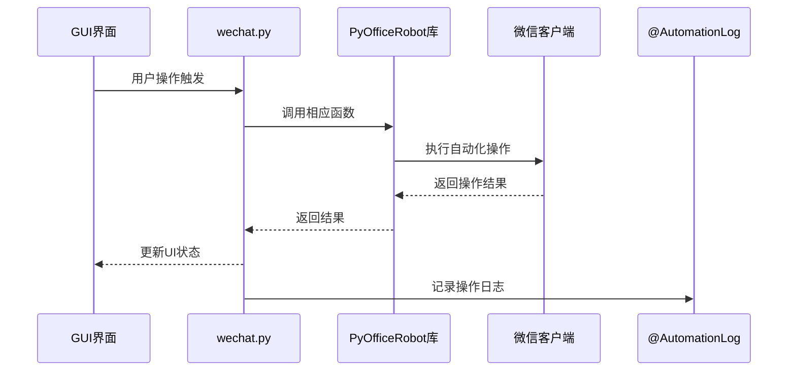
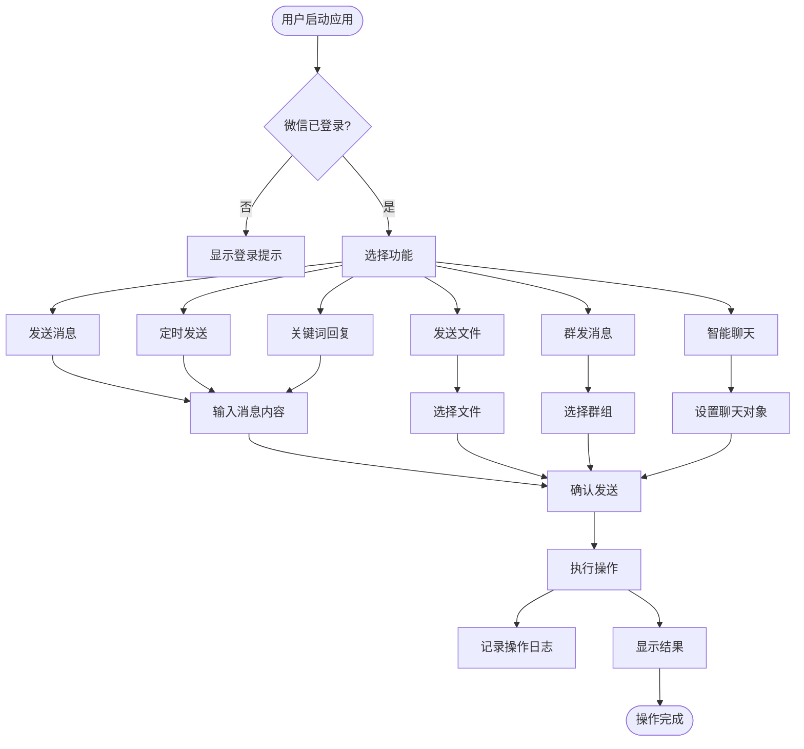

# 微信机器人功能集成

<cite>
**本文档引用的文件**
- [dialog_interface.py](file://gui/qtpy/version2/gallery/app/view/dialog_interface.py)
- [wechat.py](file://office/api/wechat.py)
- [main_window.py](file://gui/qtpy/version2/gallery/app/view/main_window.py)
- [status_info_interface.py](file://gui/qtpy/version2/gallery/app/view/status_info_interface.py)
- [home_interface.py](file://gui/qtpy/version2/gallery/app/view/home_interface.py)
- [@AutomationLog.txt](file://examples/PyOfficeRobot/@AutomationLog.txt)
</cite>

## 目录
1. [项目结构](#项目结构)
2. [核心功能集成](#核心功能集成)
3. [微信客户端连接状态管理](#微信客户端连接状态管理)
4. [消息内容序列化与传递](#消息内容序列化与传递)
5. [发送结果反馈显示逻辑](#发送结果反馈显示逻辑)
6. [异步执行模型与日志处理](#异步执行模型与日志处理)
7. [典型使用场景交互流程](#典型使用场景交互流程)
8. [常见问题应对策略](#常见问题应对策略)

## 项目结构

**图示来源**
- [main_window.py](file://gui/qtpy/version2/gallery/app/view/main_window.py#L66-L212)
- [home_interface.py](file://gui/qtpy/version2/gallery/app/view/home_interface.py#L89-L326)
- [dialog_interface.py](file://gui/qtpy/version2/gallery/app/view/dialog_interface.py#L9-L68)
- [status_info_interface.py](file://gui/qtpy/version2/gallery/app/view/status_info_interface.py#L12-L221)
- [wechat.py](file://office/api/wechat.py#L1-L95)

**本节来源**
- [main_window.py](file://gui/qtpy/version2/gallery/app/view/main_window.py#L1-L212)
- [home_interface.py](file://gui/qtpy/version2/gallery/app/view/home_interface.py#L1-L326)

## 核心功能集成

`dialog_interface.py`中的用户操作通过事件绑定机制调用`office/api/wechat.py`提供的各类函数。GUI界面通过按钮点击事件触发相应的微信自动化功能，包括发送消息、定时发送、关键词回复、文件发送、群发消息及智能聊天等核心功能。

在`dialog_interface.py`中，通过`clicked.connect()`方法将按钮点击事件与具体功能函数关联。`wechat.py`作为API接口层，封装了对`PyOfficeRobot`库的调用，提供了简洁的函数接口供GUI调用。

**本节来源**
- [dialog_interface.py](file://gui/qtpy/version2/gallery/app/view/dialog_interface.py#L20-L68)
- [wechat.py](file://office/api/wechat.py#L6-L95)

## 微信客户端连接状态管理

系统通过`PyOfficeRobot`库管理微信客户端的连接状态。当用户执行任何微信相关操作时，系统会自动检查微信客户端是否已启动并保持连接。如果微信客户端未启动，系统会提示用户启动微信客户端。

连接状态的管理主要通过`PyOfficeRobot`库内部机制实现，GUI层通过调用`wechat.py`中的函数间接管理连接状态。系统会定期检测连接状态，并在连接中断时提供相应的用户提示。

**本节来源**
- [wechat.py](file://office/api/wechat.py#L4-L95)
- [@AutomationLog.txt](file://examples/PyOfficeRobot/@AutomationLog.txt#L1-L84)

## 消息内容序列化与传递

消息内容通过参数传递的方式在GUI界面和微信自动化功能之间进行序列化传递。用户在GUI界面输入的消息内容、接收人、发送时间等信息被封装为函数参数，通过`wechat.py`接口传递给`PyOfficeRobot`库。

消息序列化过程包括：
1. GUI界面收集用户输入的数据
2. 将数据转换为函数调用参数
3. 通过`wechat.py`接口传递给`PyOfficeRobot`库
4. `PyOfficeRobot`库将消息内容序列化为微信客户端可识别的格式

**本节来源**
- [dialog_interface.py](file://gui/qtpy/version2/gallery/app/view/dialog_interface.py#L20-L68)
- [wechat.py](file://office/api/wechat.py#L6-L95)

## 发送结果反馈显示逻辑

系统通过多种方式向用户反馈消息发送结果。在`status_info_interface.py`中实现了状态提示工具（StateToolTip）和信息栏（InfoBar），用于显示操作状态和结果。

发送结果的反馈包括：
- 成功发送：显示绿色状态提示
- 发送失败：显示红色错误信息
- 发送中：显示加载状态提示
- 操作取消：显示相应提示信息

这些反馈机制通过`qfluentwidgets`库提供的UI组件实现，确保用户能够及时了解操作结果。

**本节来源**
- [status_info_interface.py](file://gui/qtpy/version2/gallery/app/view/status_info_interface.py#L12-L221)
- [wechat.py](file://office/api/wechat.py#L6-L95)

## 异步执行模型与日志处理

`chat_robot`和`receive_message`函数在GUI环境下采用异步执行模型，确保UI界面的响应性。当执行长时间运行的操作时，系统会在后台线程中执行，避免阻塞UI线程。

日志输出处理通过`@AutomationLog.txt`文件记录系统运行日志。日志文件记录了操作时间、操作类型、执行状态等信息，便于问题排查和系统监控。系统会定期清理过期日志，确保日志文件不会无限增长。

**图示来源**
- [dialog_interface.py](file://gui/qtpy/version2/gallery/app/view/dialog_interface.py#L20-L68)
- [wechat.py](file://office/api/wechat.py#L84-L95)
- [@AutomationLog.txt](file://examples/PyOfficeRobot/@AutomationLog.txt#L1-L84)

**本节来源**
- [dialog_interface.py](file://gui/qtpy/version2/gallery/app/view/dialog_interface.py#L20-L68)
- [wechat.py](file://office/api/wechat.py#L84-L95)
- [@AutomationLog.txt](file://examples/PyOfficeRobot/@AutomationLog.txt#L1-L84)

## 典型使用场景交互流程

**图示来源**
- [dialog_interface.py](file://gui/qtpy/version2/gallery/app/view/dialog_interface.py#L20-L68)
- [wechat.py](file://office/api/wechat.py#L6-L95)
- [status_info_interface.py](file://gui/qtpy/version2/gallery/app/view/status_info_interface.py#L12-L221)

## 常见问题应对策略

### 微信登录失效
当检测到微信登录失效时，系统会：
1. 显示明确的错误提示
2. 引导用户重新启动微信客户端
3. 提供重新连接的按钮
4. 记录相关日志信息

### 消息发送频率限制
为应对微信的消息发送频率限制，系统采取以下策略：
1. 实现发送间隔控制，避免过于频繁的发送
2. 当检测到频率限制时，自动暂停发送并提示用户
3. 提供可配置的发送间隔设置
4. 记录发送历史，避免重复发送相同内容

### 网络连接问题
针对网络连接问题，系统会：
1. 检测网络连接状态
2. 在网络不稳定时降低发送频率
3. 提供离线模式，缓存待发送消息
4. 网络恢复后自动重试发送

### 客户端版本兼容性
为确保与不同版本微信客户端的兼容性：
1. 定期更新`PyOfficeRobot`库
2. 实现版本检测机制
3. 提供兼容性模式选项
4. 记录客户端版本信息用于问题排查

**本节来源**
- [wechat.py](file://office/api/wechat.py#L1-L95)
- [@AutomationLog.txt](file://examples/PyOfficeRobot/@AutomationLog.txt#L1-L84)
- [status_info_interface.py](file://gui/qtpy/version2/gallery/app/view/status_info_interface.py#L12-L221)