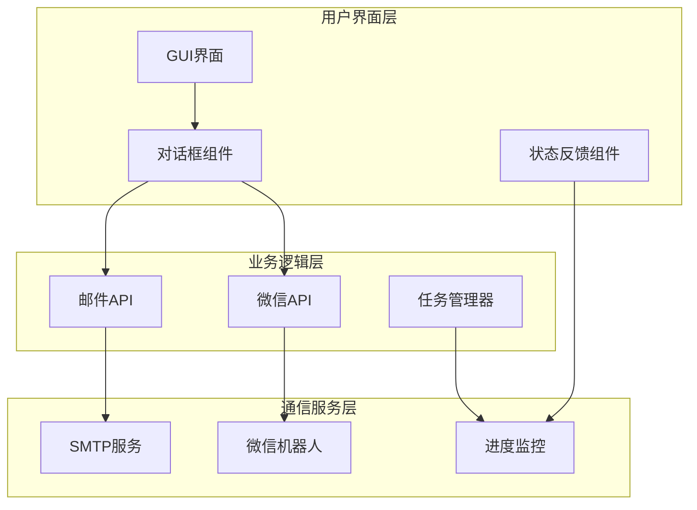
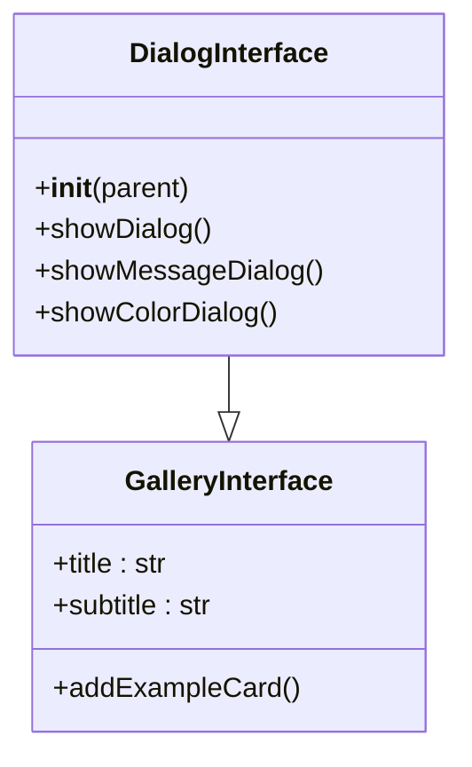
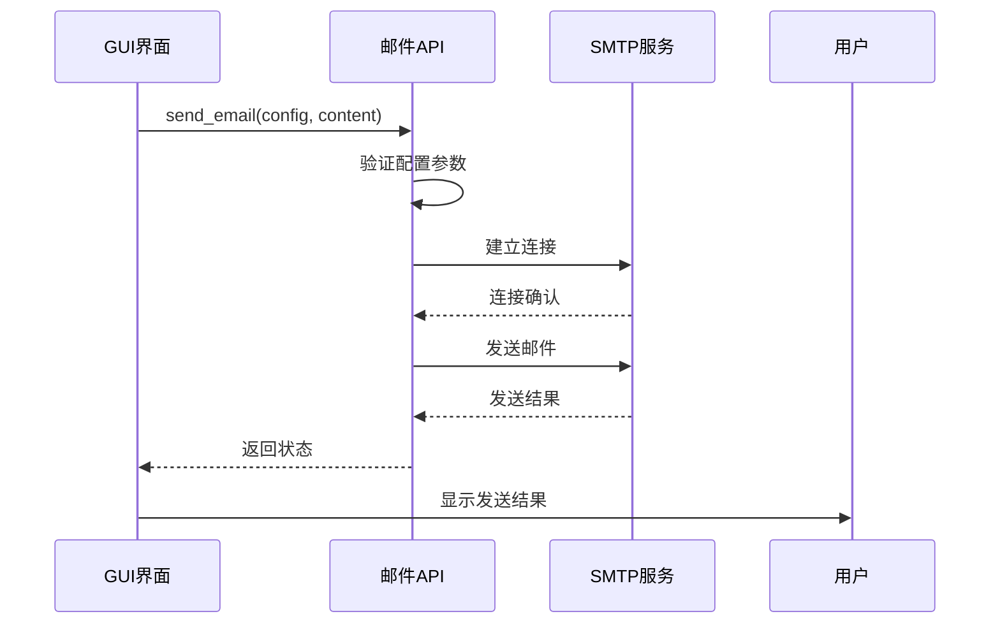
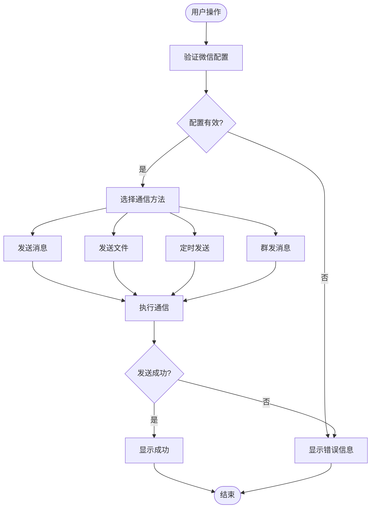
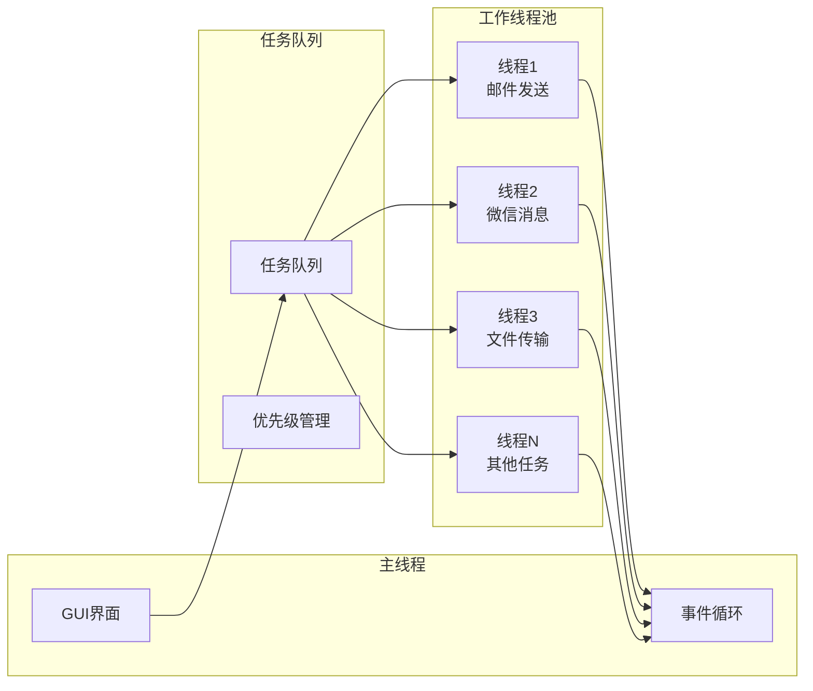
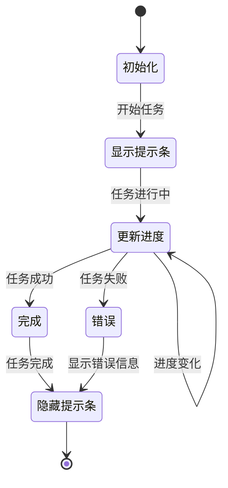
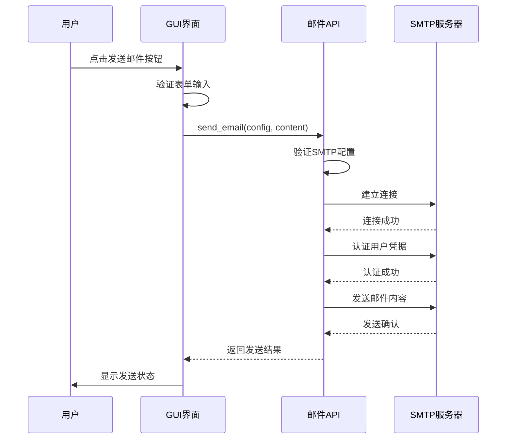
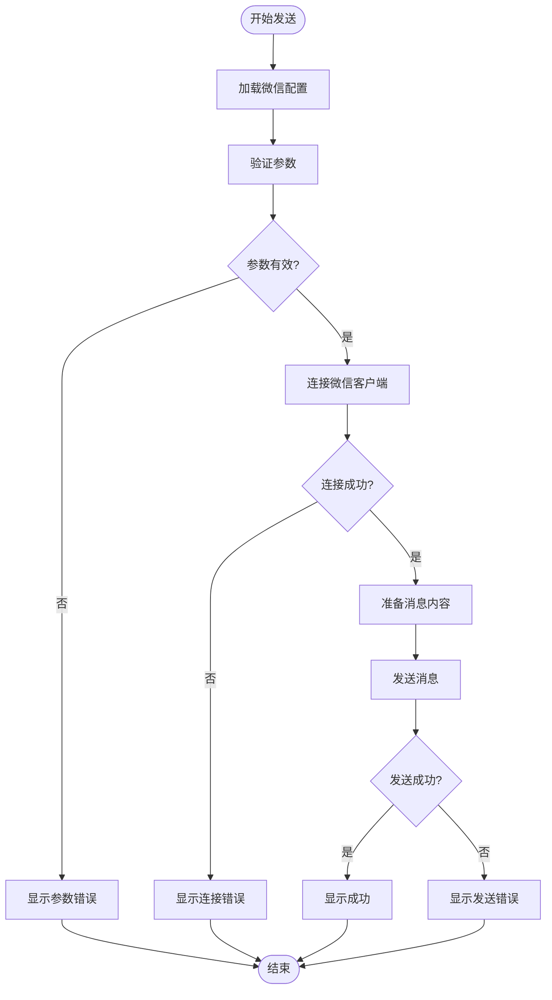
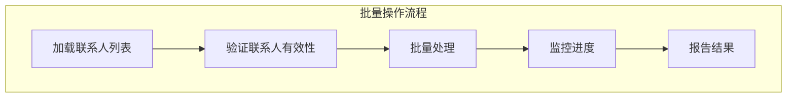
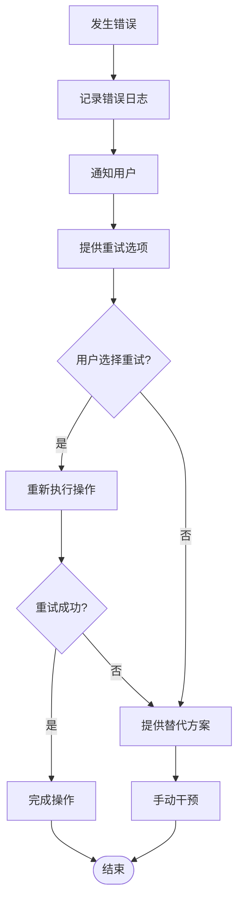

# 通信自动化功能集成

<cite>
**本文档引用的文件**
- [dialog_interface.py](file://gui/qtpy/version2/gallery/app/view/dialog_interface.py)
- [status_info_interface.py](file://gui/qtpy/version2/gallery/app/view/status_info_interface.py)
- [main_window.py](file://gui/qtpy/version2/gallery/app/view/main_window.py)
- [home_interface.py](file://gui/qtpy/version2/gallery/app/view/home_interface.py)
- [email.py](file://office/api/email.py)
- [wechat.py](file://office/api/wechat.py)
- [001-发一条信息.py](file://examples/PyOfficeRobot/001-发一条信息.py)
- [发送邮件.py](file://examples/poemail/发送邮件.py)
- [004-定时发送.py](file://examples/PyOfficeRobot/004-定时发送.py)
- [009-批量加好友.py](file://examples/PyOfficeRobot/009-批量加好友.py)
- [006-独立版本.py](file://examples/PyOfficeRobot/006-独立版本.py)
- [test_wechat.py](file://tests/test_code/test_wechat.py)
</cite>

## 目录
1. [简介](#简介)
2. [系统架构概览](#系统架构概览)
3. [GUI对话框组件分析](#gui对话框组件分析)
4. [通信自动化API集成](#通信自动化api集成)
5. [异步任务处理机制](#异步任务处理机制)
6. [进度反馈系统](#进度反馈系统)
7. [实际调用示例](#实际调用示例)
8. [常见问题解决方案](#常见问题解决方案)
9. [总结](#总结)

## 简介

python-office项目提供了一套完整的GUI通信自动化解决方案，集成了邮件发送和微信机器人功能。该系统采用模块化设计，通过GUI界面为用户提供直观的操作体验，同时在后端实现了强大的自动化通信能力。

本文档深入分析GUI如何实现通信自动化功能，重点解释dialog_interface.py中对话框组件与office/api/email.py和wechat.py的集成方式，包括配置参数传递、消息内容处理、发送状态反馈等机制。

## 系统架构概览

python-office的通信自动化系统采用分层架构设计，主要包含以下核心层次：

**图表来源**
- [main_window.py](file://gui/qtpy/version2/gallery/app/view/main_window.py#L67-L90)
- [dialog_interface.py](file://gui/qtpy/version2/gallery/app/view/dialog_interface.py#L9-L26)

**章节来源**
- [main_window.py](file://gui/qtpy/version2/gallery/app/view/main_window.py#L1-L212)
- [dialog_interface.py](file://gui/qtpy/version2/gallery/app/view/dialog_interface.py#L1-L68)

## GUI对话框组件分析

### 对话框接口设计

dialog_interface.py实现了基础的对话框功能，为通信自动化提供了用户交互界面的基础框架。

**图表来源**
- [dialog_interface.py](file://gui/qtpy/version2/gallery/app/view/dialog_interface.py#L9-L68)

### 对话框组件功能

对话框组件提供了三种基本类型的对话框：

1. **无边框消息对话框**：用于简单的信息提示
2. **带遮罩的消息对话框**：提供模态交互体验
3. **颜色选择对话框**：用于颜色配置

这些对话框为后续的通信自动化功能提供了用户输入和确认的基础界面。

**章节来源**
- [dialog_interface.py](file://gui/qtpy/version2/gallery/app/view/dialog_interface.py#L44-L68)

## 通信自动化API集成

### 邮件发送功能集成

邮件发送功能通过office/api/email.py模块实现，提供了完整的邮件自动化发送能力。

**图表来源**
- [email.py](file://office/api/email.py#L9-L45)
- [发送邮件.py](file://examples/poemail/发送邮件.py#L1-L68)

### 微信机器人功能集成

微信机器人功能通过office/api/wechat.py模块实现，支持多种自动化通信场景。

**图表来源**
- [wechat.py](file://office/api/wechat.py#L1-L95)
- [001-发一条信息.py](file://examples/PyOfficeRobot/001-发一条信息.py#L1-L52)

### API集成特点

1. **统一的接口设计**：所有通信功能都遵循一致的参数传递模式
2. **灵活的配置选项**：支持多种通信场景和个性化设置
3. **错误处理机制**：完善的异常捕获和错误反馈
4. **异步处理支持**：支持长时间运行的任务处理

**章节来源**
- [email.py](file://office/api/email.py#L1-L45)
- [wechat.py](file://office/api/wechat.py#L1-L95)

## 异步任务处理机制

### 线程池管理

系统采用多线程架构处理长时间运行的通信任务，避免阻塞GUI主线程。

### 任务调度策略

1. **优先级调度**：重要任务优先处理
2. **资源管理**：动态调整线程数量
3. **超时控制**：防止任务无限等待
4. **错误恢复**：任务失败时的重试机制

**章节来源**
- [004-定时发送.py](file://examples/PyOfficeRobot/004-定时发送.py#L1-L8)

## 进度反馈系统

### StateToolTip进度提示

状态提示条(StateToolTip)提供了实时的任务进度反馈功能。

**图表来源**
- [status_info_interface.py](file://gui/qtpy/version2/gallery/app/view/status_info_interface.py#L141-L153)

### InfoBar状态通知

InfoBar组件提供了不同类型的状态通知机制：

| 通知类型 | 视觉标识 | 使用场景 | 持续时间 |
|---------|---------|---------|---------|
| 成功通知 | ✅绿色图标 | 任务成功完成 | 2秒 |
| 警告通知 | ⚠️黄色图标 | 任务部分失败或警告 | 2秒 |
| 错误通知 | ❌红色图标 | 任务严重失败 | 永久 |
| 信息通知 | ℹ️蓝色图标 | 一般信息提示 | 2秒 |

### 进度监控机制

1. **实时更新**：任务进度的实时反馈
2. **状态同步**：GUI与后台任务的状态同步
3. **用户交互**：支持用户中断或重试操作
4. **日志记录**：完整的操作日志追踪

**章节来源**
- [status_info_interface.py](file://gui/qtpy/version2/gallery/app/view/status_info_interface.py#L155-L221)

## 实际调用示例

### 邮件发送示例

以下是邮件发送功能的实际调用流程：

**图表来源**
- [发送邮件.py](file://examples/poemail/发送邮件.py#L10-L68)

### 微信消息发送示例

微信消息发送功能的典型调用流程：

**图表来源**
- [001-发一条信息.py](file://examples/PyOfficeRobot/001-发一条信息.py#L7-L52)

### 批量操作示例

系统支持批量发送和群发功能：

**章节来源**
- [009-批量加好友.py](file://examples/PyOfficeRobot/009-批量加好友.py#L1-L14)
- [006-独立版本.py](file://examples/PyOfficeRobot/006-独立版本.py#L1-L14)

## 常见问题解决方案

### 邮件发送问题

| 问题类型 | 可能原因 | 解决方案 |
|---------|---------|---------|
| SMTP连接失败 | 配置错误或网络问题 | 检查SMTP服务器地址和端口 |
| 认证失败 | 密码或授权码错误 | 使用正确的邮箱授权码 |
| 发送超时 | 网络延迟或服务器负载 | 增加超时时间或重试机制 |
| 邮件被拦截 | 垃圾邮件过滤 | 检查邮件内容和发件人信誉 |

### 微信机器人问题

| 问题类型 | 可能原因 | 解决方案 |
|---------|---------|---------|
| 微信未登录 | 微信客户端未启动 | 确保微信客户端已登录 |
| 消息发送失败 | 联系人不存在或网络问题 | 验证联系人名称和网络连接 |
| 文件发送失败 | 文件路径错误或权限问题 | 检查文件路径和访问权限 |
| 定时任务失效 | 系统休眠或程序异常退出 | 设置可靠的定时任务机制 |

### 性能优化建议

1. **连接池管理**：复用SMTP和微信连接
2. **批量处理**：减少频繁的网络请求
3. **缓存机制**：缓存常用配置和联系人信息
4. **异步处理**：使用异步IO提高并发性能

### 错误处理最佳实践

**章节来源**
- [test_wechat.py](file://tests/test_code/test_wechat.py#L1-L20)

## 总结

python-office的通信自动化功能集成展现了现代GUI应用程序的设计精髓：

1. **模块化架构**：清晰的分层设计使得系统易于维护和扩展
2. **异步处理**：多线程架构确保了良好的用户体验
3. **状态反馈**：完善的进度提示和状态通知机制
4. **错误处理**：健壮的异常处理和恢复机制
5. **用户友好**：直观的GUI界面降低了使用门槛

通过dialog_interface.py与office/api/email.py和wechat.py的深度集成，系统实现了从用户界面到后端服务的完整通信自动化链路。这种设计不仅提高了开发效率，也为用户提供了稳定可靠的自动化通信解决方案。

未来的改进方向包括：
- 增强安全性机制
- 优化性能表现
- 扩展更多通信渠道
- 提供更丰富的配置选项
- 改进错误诊断能力

这套通信自动化系统为Python自动化办公提供了强有力的支持，是现代办公软件的重要组成部分。