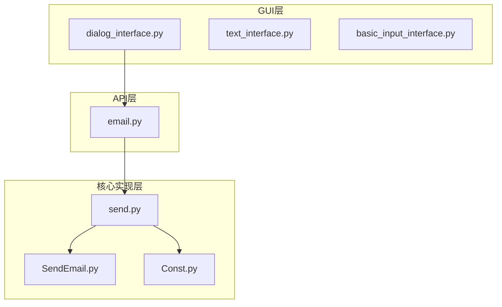
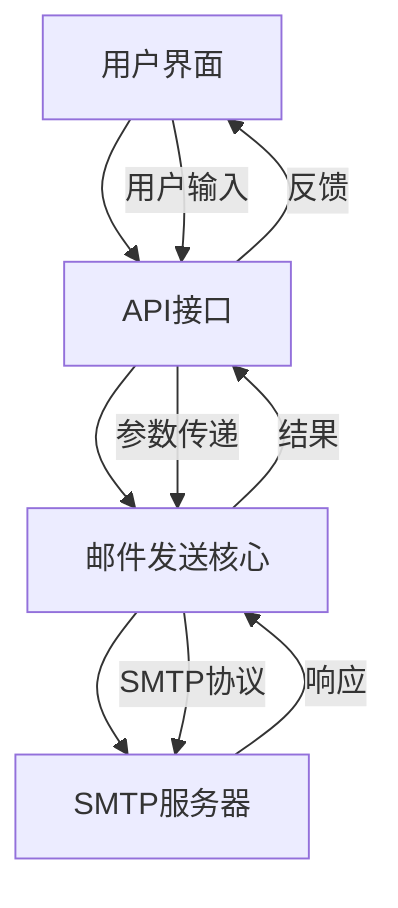
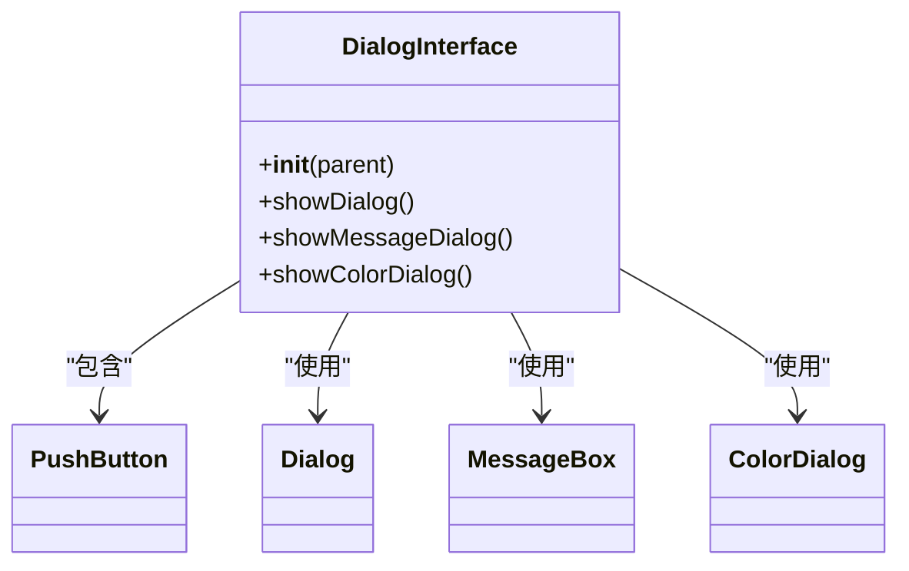
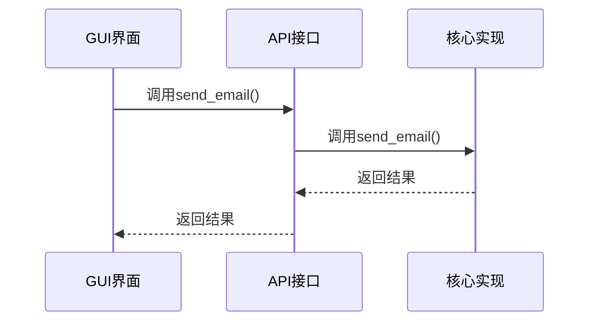
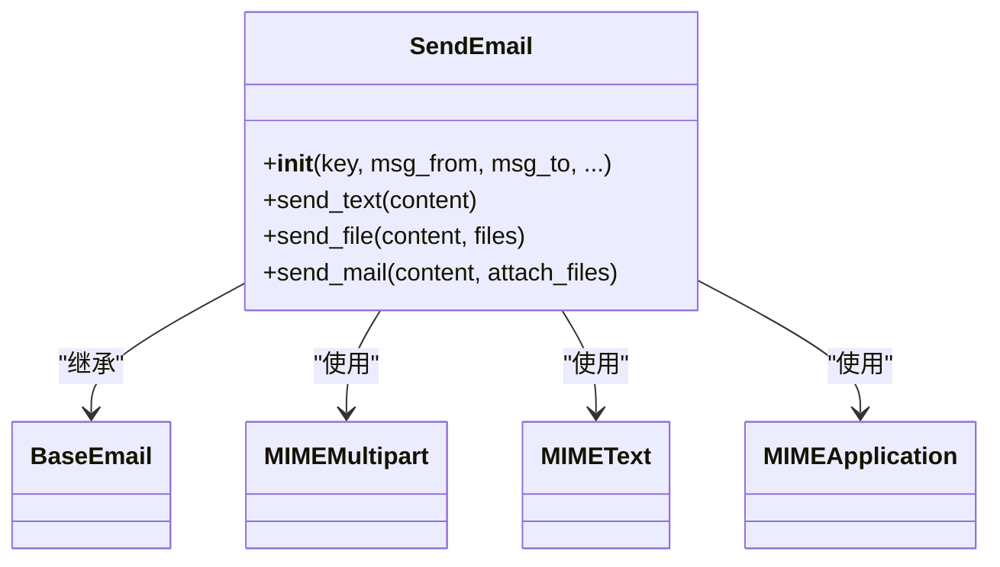
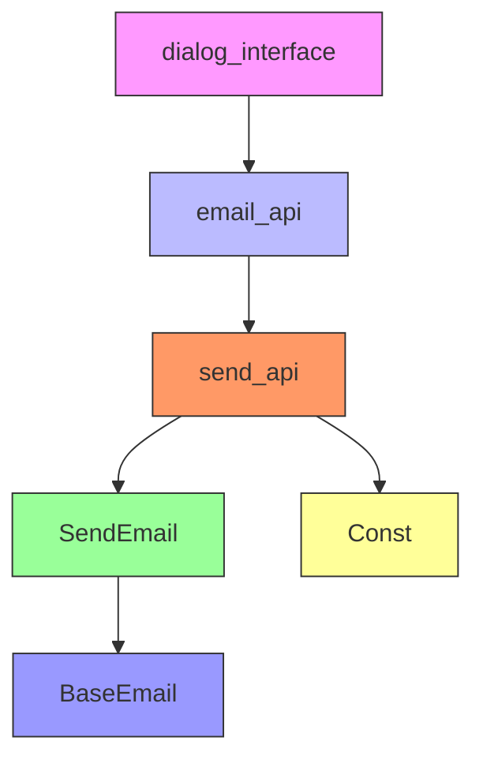

# 邮件发送功能集成

<cite>
**本文档引用的文件**
- [dialog_interface.py](file://gui/qtpy/version2/gallery/app/view/dialog_interface.py)
- [email.py](file://office/api/email.py)
- [send.py](file://venv/Lib/site-packages/poemail/api/send.py)
- [SendEmail.py](file://venv/Lib/site-packages/poemail/core/SendEmail.py)
- [Const.py](file://venv/Lib/site-packages/poemail/lib/Const.py)
- [发送邮件.py](file://examples/poemail/发送邮件.py)
</cite>

## 目录
1. [简介](#简介)
2. [项目结构](#项目结构)
3. [核心组件](#核心组件)
4. [架构概述](#架构概述)
5. [详细组件分析](#详细组件分析)
6. [依赖分析](#依赖分析)
7. [性能考虑](#性能考虑)
8. [故障排除指南](#故障排除指南)
9. [结论](#结论)

## 简介
本文档深入分析了python-office项目中GUI邮件发送功能的实现机制。重点说明了用户界面操作如何触发后端邮件发送功能，包括参数传递流程、异常处理机制以及SMTP服务器配置。通过完整的调用链路示例，展示用户在图形界面输入信息后，数据如何被封装并调用后端API完成邮件发送。

## 项目结构
python-office项目的邮件发送功能分布在多个模块中，形成了清晰的分层架构。GUI界面位于`gui/qtpy/version2/gallery/app/view/`目录下，后端API位于`office/api/`目录下，而具体的邮件发送实现则在`poemail`包中。

**图表来源**
- [dialog_interface.py](file://gui/qtpy/version2/gallery/app/view/dialog_interface.py)
- [email.py](file://office/api/email.py)
- [send.py](file://venv/Lib/site-packages/poemail/api/send.py)
- [SendEmail.py](file://venv/Lib/site-packages/poemail/core/SendEmail.py)
- [Const.py](file://venv/Lib/site-packages/poemail/lib/Const.py)

## 核心组件
邮件发送功能的核心组件包括GUI界面组件、API接口层和邮件发送核心实现。GUI组件负责收集用户输入，API接口层作为中间层处理参数传递，核心实现层则负责实际的邮件发送操作。

**章节来源**
- [dialog_interface.py](file://gui/qtpy/version2/gallery/app/view/dialog_interface.py)
- [email.py](file://office/api/email.py)
- [send.py](file://venv/Lib/site-packages/poemail/api/send.py)

## 架构概述
邮件发送功能采用分层架构设计，各层职责分明。GUI层负责用户交互，API层负责接口定义和参数处理，核心实现层负责具体的邮件发送逻辑。

**图表来源**
- [dialog_interface.py](file://gui/qtpy/version2/gallery/app/view/dialog_interface.py)
- [email.py](file://office/api/email.py)
- [send.py](file://venv/Lib/site-packages/poemail/api/send.py)

## 详细组件分析
### GUI界面组件分析
GUI界面中的`DialogInterface`类负责提供邮件发送的用户界面。用户通过界面输入邮件参数，点击按钮触发邮件发送操作。

**图表来源**
- [dialog_interface.py](file://gui/qtpy/version2/gallery/app/view/dialog_interface.py)

### API接口层分析
API接口层的`send_email`函数是GUI与核心实现之间的桥梁，负责接收GUI传递的参数并调用核心实现。

**图表来源**
- [email.py](file://office/api/email.py)
- [send.py](file://venv/Lib/site-packages/poemail/api/send.py)

### 核心实现层分析
核心实现层的`SendEmail`类负责实际的邮件发送操作，包括构建邮件消息、处理附件和与SMTP服务器通信。

**图表来源**
- [SendEmail.py](file://venv/Lib/site-packages/poemail/core/SendEmail.py)
- [BaseEmail.py](file://venv/Lib/site-packages/poemail/core/BaseEmail.py)

## 依赖分析
邮件发送功能的依赖关系清晰，各组件之间的依赖都是单向的，从上层到下层，避免了循环依赖。

**图表来源**
- [dialog_interface.py](file://gui/qtpy/version2/gallery/app/view/dialog_interface.py)
- [email.py](file://office/api/email.py)
- [send.py](file://venv/Lib/site-packages/poemail/api/send.py)
- [SendEmail.py](file://venv/Lib/site-packages/poemail/core/SendEmail.py)
- [Const.py](file://venv/Lib/site-packages/poemail/lib/Const.py)

## 性能考虑
邮件发送功能的性能主要受网络状况和SMTP服务器响应时间的影响。为提高性能，建议：
1. 使用连接池复用SMTP连接
2. 异步发送邮件以避免阻塞UI
3. 压缩大附件以减少传输时间
4. 设置合理的超时时间以避免长时间等待

## 故障排除指南
### 常见错误及解决方案
| 错误类型 | 可能原因 | 解决方案 |
|---------|--------|---------|
| 认证失败 | 邮箱授权码错误 | 检查邮箱授权码是否正确 |
| 网络超时 | 网络连接不稳定 | 检查网络连接，重试发送 |
| SMTP服务器拒绝 | 服务器地址或端口错误 | 检查SMTP服务器配置 |
| 附件过大 | 超过服务器限制 | 压缩附件或分批发送 |

**章节来源**
- [SendEmail.py](file://venv/Lib/site-packages/poemail/core/SendEmail.py)
- [send.py](file://venv/Lib/site-packages/poemail/api/send.py)

## 结论
python-office的邮件发送功能通过清晰的分层架构实现了GUI与核心功能的解耦。用户界面负责收集输入，API层处理参数传递，核心实现层负责实际的邮件发送操作。这种设计使得功能易于维护和扩展，同时也便于错误排查和性能优化。