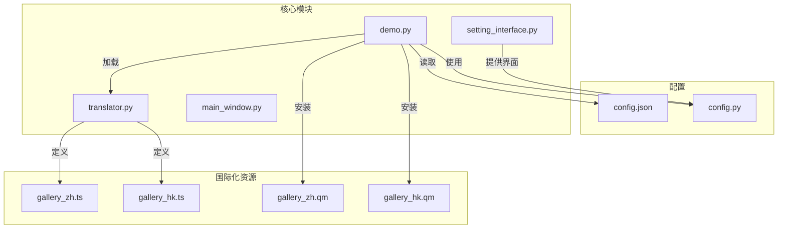
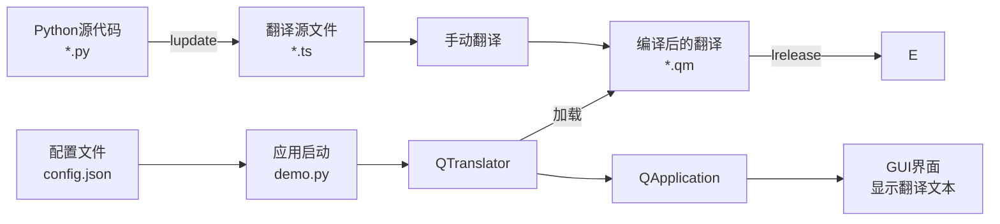
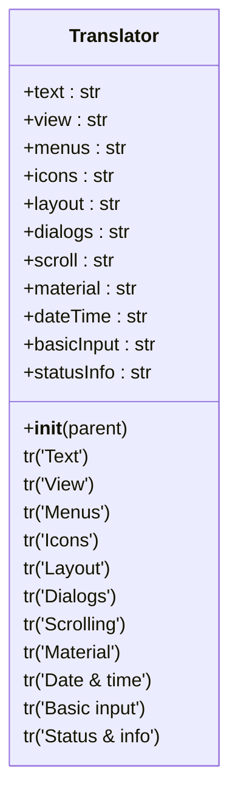
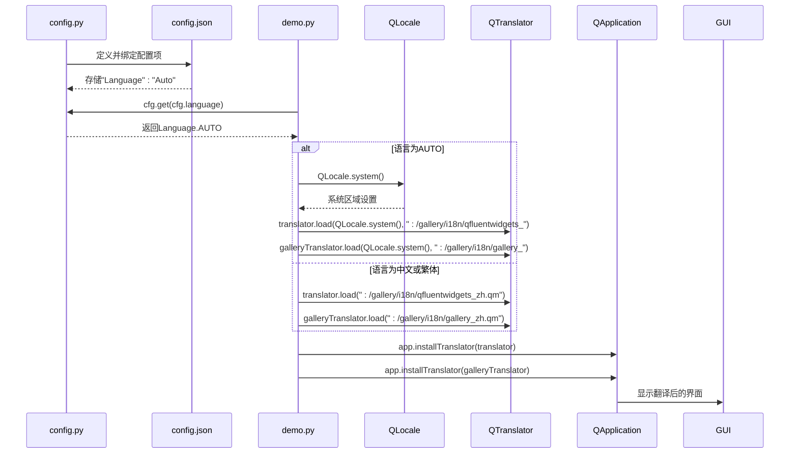
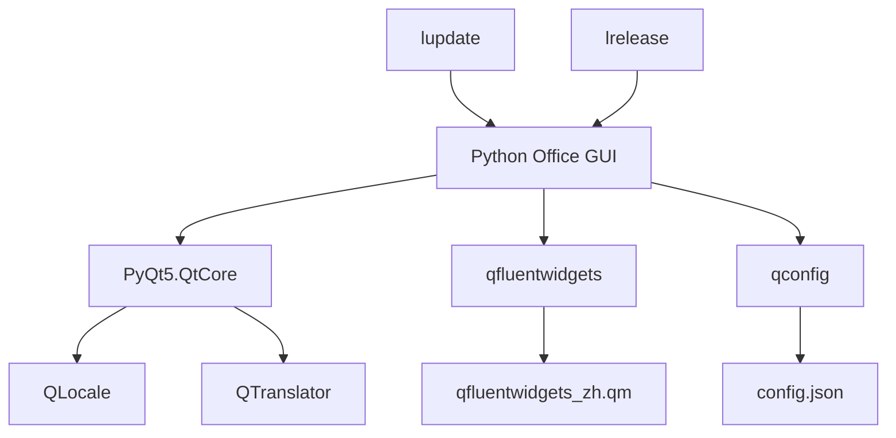

# 国际化支持

<cite>
**本文档中引用的文件**   
- [translator.py](file://gui/qtpy/version2/gallery/app/common/translator.py)
- [config.py](file://gui/qtpy/version2/gallery/app/common/config.py)
- [config.json](file://gui/qtpy/version2/gallery/app/config/config.json)
- [demo.py](file://gui/qtpy/version2/gallery/demo.py)
- [main_window.py](file://gui/qtpy/version2/gallery/app/view/main_window.py)
- [setting_interface.py](file://gui/qtpy/version2/gallery/app/view/setting_interface.py)
- [gallery_zh.ts](file://gui/qtpy/version2/gallery/app/resource/i18n/gallery_zh.ts)
- [gallery_hk.ts](file://gui/qtpy/version2/gallery/app/resource/i18n/gallery_hk.ts)
- [gallery_zh.qm](file://gui/qtpy/version2/gallery/app/resource/i18n/gallery_zh.qm)
- [gallery_hk.qm](file://gui/qtpy/version2/gallery/app/resource/i18n/gallery_hk.qm)
</cite>

## 目录
1. [简介](#简介)
2. [项目结构](#项目结构)
3. [核心组件](#核心组件)
4. [架构概述](#架构概述)
5. [详细组件分析](#详细组件分析)
6. [依赖分析](#依赖分析)
7. [性能考虑](#性能考虑)
8. [故障排除指南](#故障排除指南)
9. [结论](#结论)
10. [附录](#附录)（如有必要）

## 简介
本文档详细说明了Python Office项目中GUI的国际化实现机制。系统基于Qt的国际化框架，通过`translator.py`和`.ts/.qm`语言资源文件实现了多语言支持。项目支持简体中文、繁体中文和英文三种语言，并提供了自动检测系统语言的选项。国际化机制的核心是Qt的`QLocale`和`QTranslator`类，通过配置文件`cfg`管理语言设置，并在应用启动时根据用户选择加载相应的语言资源。用户可以通过设置界面切换语言，切换后需要重启应用以使配置生效。翻译流程包括使用`lupdate`工具生成`.ts`文件，手动翻译文本，然后使用`lrelease`工具编译为`.qm`二进制文件供应用加载。

## 项目结构
项目的国际化相关文件组织清晰，遵循Qt的标准国际化实践。语言资源文件集中存放在`gui/qtpy/version2/gallery/app/resource/i18n/`目录下，包括`.ts`源文件和编译后的`.qm`文件。核心配置文件`config.json`存储用户的语言偏好设置。`common`目录包含国际化相关的Python模块，如`translator.py`定义了可翻译的文本字符串，`config.py`定义了语言枚举和配置项。主程序入口`demo.py`负责初始化国际化环境，加载相应的翻译文件。

**Diagram sources**
- [gui/qtpy/version2/gallery/app/resource/i18n/gallery_zh.ts](file://gui/qtpy/version2/gallery/app/resource/i18n/gallery_zh.ts)
- [gui/qtpy/version2/gallery/app/resource/i18n/gallery_hk.ts](file://gui/qtpy/version2/gallery/app/resource/i18n/gallery_hk.ts)
- [gui/qtpy/version2/gallery/app/resource/i18n/gallery_zh.qm](file://gui/qtpy/version2/gallery/app/resource/i18n/gallery_zh.qm)
- [gui/qtpy/version2/gallery/app/resource/i18n/gallery_hk.qm](file://gui/qtpy/version2/gallery/app/resource/i18n/gallery_hk.qm)
- [gui/qtpy/version2/gallery/app/config/config.json](file://gui/qtpy/version2/gallery/app/config/config.json)
- [gui/qtpy/version2/gallery/app/common/config.py](file://gui/qtpy/version2/gallery/app/common/config.py)
- [gui/qtpy/version2/gallery/app/common/translator.py](file://gui/qtpy/version2/gallery/app/common/translator.py)
- [gui/qtpy/version2/gallery/demo.py](file://gui/qtpy/version2/gallery/demo.py)

**Section sources**
- [gui/qtpy/version2/gallery/app/resource/i18n](file://gui/qtpy/version2/gallery/app/resource/i18n)
- [gui/qtpy/version2/gallery/app/config/config.json](file://gui/qtpy/version2/gallery/app/config/config.json)
- [gui/qtpy/version2/gallery/app/common](file://gui/qtpy/version2/gallery/app/common)

## 核心组件
国际化实现的核心组件包括`Translator`类、`Language`枚举、`QTranslator`对象和`.ts/.qm`文件。`Translator`类（在`translator.py`中定义）集中管理所有可翻译的文本字符串，这些字符串通过`self.tr()`方法标记，使其能被Qt的`lupdate`工具提取。`Language`枚举（在`config.py`中定义）规范了支持的语言选项：简体中文(zh)、繁体中文(hk)、英文(en)和自动(Auto)。`demo.py`中的`QTranslator`对象负责加载和应用编译后的`.qm`翻译文件。`.ts`文件是XML格式的翻译源文件，由开发者手动编辑完成翻译，然后编译为`.qm`文件供运行时加载。

**Section sources**
- [gui/qtpy/version2/gallery/app/common/translator.py](file://gui/qtpy/version2/gallery/app/common/translator.py#L1-L19)
- [gui/qtpy/version2/gallery/app/common/config.py](file://gui/qtpy/version2/gallery/app/common/config.py#L10-L17)
- [gui/qtpy/version2/gallery/demo.py](file://gui/qtpy/version2/gallery/demo.py#L28-L40)

## 架构概述
系统的国际化架构遵循Qt的标准模式，分为翻译提取、翻译编辑、翻译编译和运行时加载四个阶段。在开发阶段，使用`lupdate`工具扫描所有Python源文件，提取用`tr()`标记的字符串，生成或更新`.ts`文件。开发者在`.ts`文件中完成翻译。然后使用`lrelease`工具将`.ts`文件编译成紧凑的二进制`.qm`文件。在应用启动时，`demo.py`根据`config.json`中的语言设置，创建`QTranslator`对象并加载对应的`.qm`文件到`QApplication`中。Qt框架会自动将界面上所有用`tr()`标记的文本替换为翻译后的文本。

**Diagram sources**
- [gui/qtpy/version2/gallery/app/common/translator.py](file://gui/qtpy/version2/gallery/app/common/translator.py)
- [gui/qtpy/version2/gallery/app/resource/i18n/gallery_zh.ts](file://gui/qtpy/version2/gallery/app/resource/i18n/gallery_zh.ts)
- [gui/qtpy/version2/gallery/app/resource/i18n/gallery_zh.qm](file://gui/qtpy/version2/gallery/app/resource/i18n/gallery_zh.qm)
- [gui/qtpy/version2/gallery/app/config/config.json](file://gui/qtpy/version2/gallery/app/config/config.json)
- [gui/qtpy/version2/gallery/demo.py](file://gui/qtpy/version2/gallery/demo.py)

## 详细组件分析
### Translator类分析
`Translator`类是国际化机制的核心，它继承自`QObject`，以便使用Qt的`tr()`方法。该类在初始化时，将所有需要翻译的菜单项和界面标签作为实例属性进行定义，每个属性都通过`self.tr()`包装。这确保了这些字符串能被`lupdate`工具识别和提取。

**Diagram sources**
- [gui/qtpy/version2/gallery/app/common/translator.py](file://gui/qtpy/version2/gallery/app/common/translator.py#L5-L19)

**Section sources**
- [gui/qtpy/version2/gallery/app/common/translator.py](file://gui/qtpy/version2/gallery/app/common/translator.py#L1-L19)

### 语言配置与加载流程分析
语言配置和加载流程始于`config.py`中的`Language`枚举和`Config`类。`Config`类定义了一个`language`配置项，其类型为`Language`枚举，默认值为`Language.AUTO`。这个配置项与`config.json`文件中的`"Language"`键绑定。应用启动时，`demo.py`首先读取此配置。

**Diagram sources**
- [gui/qtpy/version2/gallery/app/common/config.py](file://gui/qtpy/version2/gallery/app/common/config.py#L10-L32)
- [gui/qtpy/version2/gallery/app/config/config.json](file://gui/qtpy/version2/gallery/app/config/config.json#L14)
- [gui/qtpy/version2/gallery/demo.py](file://gui/qtpy/version2/gallery/demo.py#L30-L40)

**Section sources**
- [gui/qtpy/version2/gallery/app/common/config.py](file://gui/qtpy/version2/gallery/app/common/config.py#L1-L52)
- [gui/qtpy/version2/gallery/app/config/config.json](file://gui/qtpy/version2/gallery/app/config/config.json#L1-L20)
- [gui/qtpy/version2/gallery/demo.py](file://gui/qtpy/version2/gallery/demo.py#L1-L46)

### 新增语言支持操作指南
要为应用添加新的语言支持（例如法语），请遵循以下步骤：
1.  **创建.ts文件**：在`gui/qtpy/version2/gallery/app/resource/i18n/`目录下创建新的`.ts`文件，例如`gallery_fr.ts`。可以复制现有的`gallery_zh.ts`作为模板，并将`<TS>`标签的`language`属性改为`fr_FR`。
2.  **更新翻译**：运行`lupdate`工具（通常作为`pylupdate5`命令）来提取最新的可翻译字符串。命令类似于：`pylupdate5 gui/qtpy/version2/gallery/app/**/*.py -ts gui/qtpy/version2/gallery/app/resource/i18n/gallery_fr.ts`。这将确保新文件包含所有最新的待翻译文本。
3.  **翻译文本**：使用Qt Linguist工具或文本编辑器打开`gallery_fr.ts`文件，将每个`<source>`标签内的英文文本翻译成法语，并填入对应的`<translation>`标签中。
4.  **编译.qm文件**：使用`lrelease`工具（通常作为`pylrelease5`命令）将翻译好的`.ts`文件编译成`.qm`文件。命令为：`pylrelease5 gui/qtpy/version2/gallery/app/resource/i18n/gallery_fr.ts`。这将生成`gallery_fr.qm`文件。
5.  **更新配置**：在`config.py`的`Language`枚举中添加新的语言选项，例如`FRENCH = "fr"`。
6.  **更新界面**：在`setting_interface.py`的`languageCard`中，将`texts`列表更新为包含新的语言名称，例如`['简体中文', '繁體中文', 'English', 'Français', self.tr('Use system setting')]`。
7.  **修改加载逻辑**：在`demo.py`中，扩展`if-elif`语句以支持新的语言代码，加载相应的`.qm`文件。

完成以上步骤后，重新启动应用，即可在设置中看到新的语言选项。

**Section sources**
- [gui/qtpy/version2/gallery/app/resource/i18n/gallery_zh.ts](file://gui/qtpy/version2/gallery/app/resource/i18n/gallery_zh.ts)
- [gui/qtpy/version2/gallery/app/common/config.py](file://gui/qtpy/version2/gallery/app/common/config.py#L10-L17)
- [gui/qtpy/version2/gallery/app/view/setting_interface.py](file://gui/qtpy/version2/gallery/app/view/setting_interface.py#L85-L92)
- [gui/qtpy/version2/gallery/demo.py](file://gui/qtpy/version2/gallery/demo.py#L30-L38)

### 多语言文本动态加载效果
多语言文本的动态加载效果体现在应用的各个界面组件中。例如，在`main_window.py`的`initNavigation`方法中，导航项的文本是通过`self.tr()`动态获取的。当用户在设置中选择“简体中文”并重启应用后，`self.tr('Basic input')`会返回“基本输入”，`self.tr('Date & time')`会返回“日期和时间”。同样，在`setting_interface.py`中，`self.tr('Language')`会显示为“语言”，`self.tr('Personalization')`会显示为“个性化”。这种机制确保了整个用户界面的一致性，所有文本都能根据用户的语言偏好进行切换。

**Section sources**
- [gui/qtpy/version2/gallery/app/view/main_window.py](file://gui/qtpy/version2/gallery/app/view/main_window.py#L118-L143)
- [gui/qtpy/version2/gallery/app/view/setting_interface.py](file://gui/qtpy/version2/gallery/app/view/setting_interface.py#L54-L92)

## 依赖分析
国际化功能依赖于Qt框架的核心模块，特别是`PyQt5.QtCore`中的`QLocale`和`QTranslator`类。项目还依赖于`qfluentwidgets`库，该库本身也提供了可翻译的组件，因此需要加载`qfluentwidgets_zh.qm`等对应的翻译文件。配置管理依赖于`qconfig`模块来持久化用户的语言选择。整个流程依赖于外部工具`lupdate`和`lrelease`来完成翻译的提取和编译。

**Diagram sources**
- [gui/qtpy/version2/gallery/demo.py](file://gui/qtpy/version2/gallery/demo.py#L5)
- [gui/qtpy/version2/gallery/app/common/config.py](file://gui/qtpy/version2/gallery/app/common/config.py#L4)
- [gui/qtpy/version2/gallery/app/config/config.json](file://gui/qtpy/version2/gallery/app/config/config.json)

**Section sources**
- [gui/qtpy/version2/gallery/demo.py](file://gui/qtpy/version2/gallery/demo.py#L1-L46)
- [gui/qtpy/version2/gallery/app/common/config.py](file://gui/qtpy/version2/gallery/app/common/config.py#L1-L52)

## 性能考虑
国际化的性能开销主要在应用启动时。加载`.qm`文件是一个I/O操作，文件越大，加载时间越长。然而，`.qm`文件是二进制格式，经过优化，加载速度很快，对整体启动性能影响很小。运行时的文本查找是通过哈希表完成的，时间复杂度为O(1)，性能开销可以忽略不计。建议定期清理`.ts`文件中已废弃的翻译条目，以保持`.qm`文件的精简。

## 故障排除指南
*   **问题：切换语言后界面未变化**
    *   **原因**：语言配置更改后需要重启应用才能生效。
    *   **解决方案**：在`config.py`中，`language`配置项的`restart=True`参数已正确设置，确保用户知道需要重启。

*   **问题：某些文本未被翻译**
    *   **原因**：该文本未使用`self.tr()`方法包裹，或者`lupdate`工具未被重新运行以提取新字符串。
    *   **解决方案**：检查相关Python文件，确保所有用户可见的字符串都用`tr()`标记，然后重新运行`lupdate`和`lrelease`。

*   **问题：启动时出现翻译文件加载失败的警告**
    *   **原因**：`.qm`文件路径错误或文件不存在。
    *   **解决方案**：检查`demo.py`中的文件路径（如`:/gallery/i18n/gallery_zh.qm`）是否正确，并确认`.qm`文件已生成并位于正确的资源目录中。

**Section sources**
- [gui/qtpy/version2/gallery/app/common/config.py](file://gui/qtpy/version2/gallery/app/common/config.py#L32)
- [gui/qtpy/version2/gallery/demo.py](file://gui/qtpy/version2/gallery/demo.py#L36-L37)

## 结论
本项目通过Qt的国际化框架实现了一个完整且易于维护的多语言支持系统。通过`translator.py`集中管理可翻译文本，利用`.ts/.qm`文件进行翻译和编译，结合`config.py`中的配置项和`demo.py`中的加载逻辑，实现了流畅的语言切换体验。该设计模式清晰，扩展性强，为未来支持更多语言奠定了坚实的基础。

## 附录
*   **Qt国际化工具命令**：
    *   提取翻译：`pylupdate5 path/to/source/files/*.py -ts path/to/translations/*.ts`
    *   编译翻译：`pylrelease5 path/to/translations/*.ts`