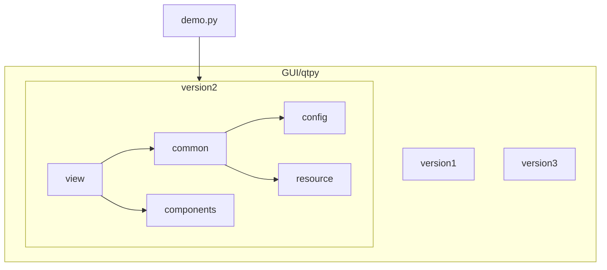
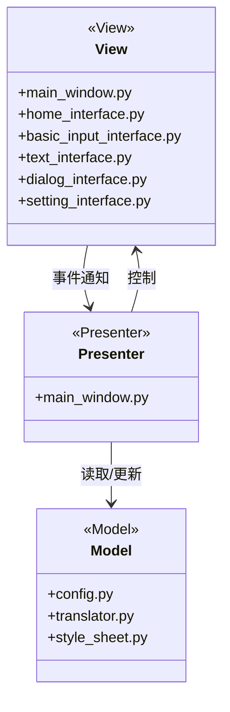
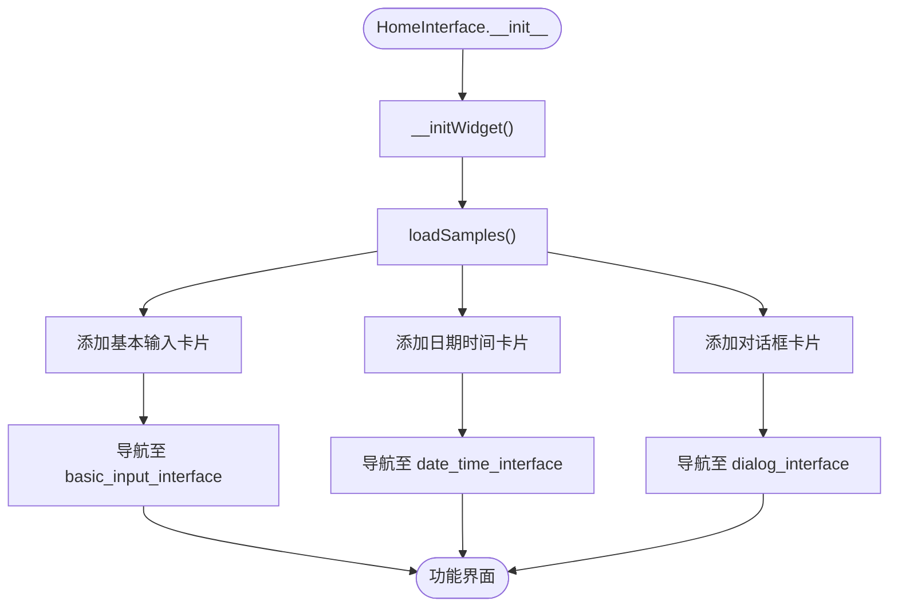
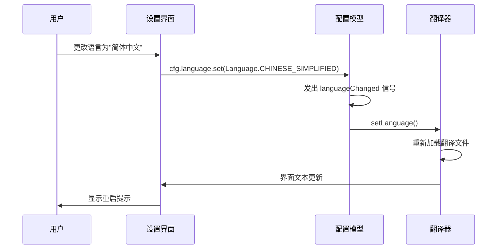
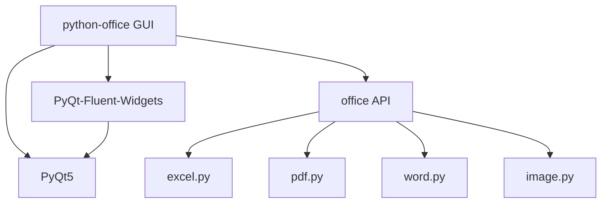

# 图形用户界面

<cite>
**本文档引用的文件**  
- [main.py](file://gui/qtpy/version1/main.py)
- [main_window.py](file://gui/qtpy/version2/gallery/app/view/main_window.py)
- [home_interface.py](file://gui/qtpy/version2/gallery/app/view/home_interface.py)
- [setting_interface.py](file://gui/qtpy/version2/gallery/app/view/setting_interface.py)
- [basic_input_interface.py](file://gui/qtpy/version2/gallery/app/view/basic_input_interface.py)
- [text_interface.py](file://gui/qtpy/version2/gallery/app/view/text_interface.py)
- [dialog_interface.py](file://gui/qtpy/version2/gallery/app/view/dialog_interface.py)
- [config.py](file://gui/qtpy/version2/gallery/app/common/config.py)
- [translator.py](file://gui/qtpy/version2/gallery/app/common/translator.py)
- [style_sheet.py](file://gui/qtpy/version2/gallery/app/common/style_sheet.py)
- [icon.py](file://gui/qtpy/version2/gallery/app/common/icon.py)
- [demo.py](file://gui/qtpy/version2/gallery/demo.py)
- [requirements.txt](file://gui/qtpy/version2/requirements.txt)
</cite>

## 目录
1. [简介](#简介)
2. [项目结构](#项目结构)
3. [核心组件](#核心组件)
4. [架构概述](#架构概述)
5. [详细组件分析](#详细组件分析)
6. [依赖分析](#依赖分析)
7. [性能考虑](#性能考虑)
8. [故障排除指南](#故障排除指南)
9. [结论](#结论)

## 简介
python-office 的图形用户界面（GUI）是该项目降低技术门槛的关键组成部分，旨在为用户提供直观、现代化的操作体验。GUI 实现位于 `gui/qtpy` 目录下，基于 QtPy 框架，提供了多个迭代版本（version1、version2等），以持续改进用户体验。其中，version2 版本采用了 Fluent Design 风格，界面更加现代化和美观。该 GUI 通过封装复杂的代码逻辑，使用户能够通过简单的点击操作完成自动化办公任务，无需编写任何代码。本文档将详细介绍 GUI 的实现、功能、使用方法以及其与核心 API 的集成方式。

## 项目结构
`gui/qtpy` 目录下的项目结构清晰地反映了 GUI 的迭代开发和模块化设计。`version1` 是早期的实现，而 `version2` 是当前的主力版本，采用了更先进的设计模式和框架。`version2` 内部结构高度模块化，分为 `common`（通用组件）、`components`（可复用UI组件）、`config`（配置）、`resource/i18n`（国际化资源）和 `view`（视图/界面）等子目录。这种结构使得代码易于维护和扩展。

**图源**  
- [gui/qtpy/version2/gallery/app/common/config.py](file://gui/qtpy/version2/gallery/app/common/config.py)
- [gui/qtpy/version2/gallery/app/view/home_interface.py](file://gui/qtpy/version2/gallery/app/view/home_interface.py)

**本节来源**  
- [gui/qtpy/version2/gallery/app/common/config.py](file://gui/qtpy/version2/gallery/app/common/config.py)
- [gui/qtpy/version2/gallery/app/view/home_interface.py](file://gui/qtpy/version2/gallery/app/view/home_interface.py)

## 核心组件
GUI 的核心组件包括主窗口（main_window.py）、各种功能界面（如 home_interface.py, basic_input_interface.py 等）以及支撑这些界面的通用模块（如 config.py, translator.py）。主窗口是整个应用的容器，负责管理导航和页面切换。各个功能界面则具体实现了不同的自动化任务。`config.py` 模块定义了应用的配置项，如语言、主题和DPI缩放，而 `translator.py` 则是实现国际化（i18n）的基础，它使用 Qt 的 `tr()` 函数来标记可翻译的文本。

**本节来源**  
- [gui/qtpy/version2/gallery/app/view/main_window.py](file://gui/qtpy/version2/gallery/app/view/main_window.py)
- [gui/qtpy/version2/gallery/app/view/home_interface.py](file://gui/qtpy/version2/gallery/app/view/home_interface.py)
- [gui/qtpy/version2/gallery/app/common/config.py](file://gui/qtpy/version2/gallery/app/common/config.py)
- [gui/qtpy/version2/gallery/app/common/translator.py](file://gui/qtpy/version2/gallery/app/common/translator.py)

## 架构概述
python-office GUI 的架构基于经典的 Model-View-Controller (MVC) 模式，但更准确地说是 Model-View-Presenter (MVP) 或 Model-View-ViewModel (MVVM) 的变体。`common` 目录下的模块（如 `config` 和 `translator`）充当了模型（Model）的角色，负责管理应用状态和数据。`view` 目录下的各个 `interface.py` 文件是视图（View），它们定义了用户界面的布局和外观。`main_window.py` 可以看作是 Presenter 或 ViewModel，它协调视图和模型之间的交互。整个架构通过 QtPy 框架的信号与槽（Signal & Slot）机制进行松耦合的通信。

**图源**  
- [gui/qtpy/version2/gallery/app/view/main_window.py](file://gui/qtpy/version2/gallery/app/view/main_window.py)
- [gui/qtpy/version2/gallery/app/common/config.py](file://gui/qtpy/version2/gallery/app/common/config.py)
- [gui/qtpy/version2/gallery/app/common/translator.py](file://gui/qtpy/version2/gallery/app/common/translator.py)

## 详细组件分析

### 主窗口与导航分析
`main_window.py` 是 GUI 的核心，它继承自 `NavigationInterface`，构建了一个带有侧边导航栏的现代化应用窗口。它通过 `addSubInterface` 方法将 `home_interface`、`basic_input_interface` 等各个功能界面注册到导航系统中。当用户点击导航项时，主窗口会切换到相应的界面。这种设计使得应用结构清晰，易于扩展新功能。

**本节来源**  
- [gui/qtpy/version2/gallery/app/view/main_window.py](file://gui/qtpy/version2/gallery/app/view/main_window.py)

### 首页界面分析
`home_interface.py` 是应用的首页，它展示了一个精美的横幅（BannerWidget）和一个功能分类卡片视图（SampleCardView）。横幅使用了自定义的 `paintEvent` 方法绘制了渐变背景和图片，体现了 Fluent Design 的美学。功能卡片则通过 `loadSamples` 方法动态加载，每个卡片对应一个功能类别（如“基本输入”、“对话框”等），点击卡片会导航到相应的功能界面。这种设计为用户提供了清晰的功能概览。

**图源**  
- [gui/qtpy/version2/gallery/app/view/home_interface.py](file://gui/qtpy/version2/gallery/app/view/home_interface.py)

**本节来源**  
- [gui/qtpy/version2/gallery/app/view/home_interface.py](file://gui/qtpy/version2/gallery/app/view/home_interface.py)

### 基本输入功能分析
`basic_input_interface.py` 展示了各种基本的用户输入控件，如按钮（PushButton）、复选框（CheckBox）、组合框（ComboBox）和开关（SwitchButton）。这个界面继承自 `GalleryInterface`，通过调用 `addExampleCard` 方法来添加一个又一个的示例控件。这表明 `GalleryInterface` 是一个通用的基类，用于构建展示各种组件的页面。该界面不仅展示了控件的外观，还通过事件连接（如 `switchButton.checkedChanged.connect`）展示了如何响应用户交互。

**本节来源**  
- [gui/qtpy/version2/gallery/app/view/basic_input_interface.py](file://gui/qtpy/version2/gallery/app/view/basic_input_interface.py)
- [gui/qtpy/version2/gallery/app/view/gallery_interface.py](file://gui/qtpy/version2/gallery/app/view/gallery_interface.py)

### 文本与对话框功能分析
`text_interface.py` 和 `dialog_interface.py` 进一步展示了更复杂的UI组件。`text_interface` 包含了文本输入框（LineEdit）、数值输入框（SpinBox）和多行文本编辑器（TextEdit），并演示了如何设置占位符文本和默认值。`dialog_interface` 则专注于模态对话框，它通过按钮的 `clicked` 信号连接到 `showDialog`、`showMessageDialog` 等方法，这些方法会创建并显示 `Dialog`、`MessageBox` 或 `ColorDialog` 实例。这清晰地展示了从用户操作到功能执行的完整流程。

**本节来源**  
- [gui/qtpy/version2/gallery/app/view/text_interface.py](file://gui/qtpy/version2/gallery/app/view/text_interface.py)
- [gui/qtpy/version2/gallery/app/view/dialog_interface.py](file://gui/qtpy/version2/gallery/app/view/dialog_interface.py)

### 设置界面与国际化分析
`setting_interface.py` 是一个复杂的设置页面，它使用了 `SettingCardGroup` 和各种 `SettingCard`（如 `SwitchSettingCard`、`OptionsSettingCard`）来组织设置项。这些设置项与 `config.py` 中定义的 `ConfigItem` 直接绑定，实现了配置的持久化。当用户更改设置时，会触发相应的信号（如 `cfg.appRestartSig`），并可能需要重启应用才能生效。国际化支持通过 `translator.py` 实现，`config.py` 中的 `Language` 枚举定义了支持的语言（简体中文、繁体中文、英文）。`.ts` 文件（如 `gallery_zh.ts`）是 Qt 的翻译源文件，需要通过工具编译成 `.qm` 文件才能被应用加载。

**图源**  
- [gui/qtpy/version2/gallery/app/view/setting_interface.py](file://gui/qtpy/version2/gallery/app/view/setting_interface.py)
- [gui/qtpy/version2/gallery/app/common/config.py](file://gui/qtpy/version2/gallery/app/common/config.py)
- [gui/qtpy/version2/gallery/app/common/translator.py](file://gui/qtpy/version2/gallery/app/common/translator.py)

**本节来源**  
- [gui/qtpy/version2/gallery/app/view/setting_interface.py](file://gui/qtpy/version2/gallery/app/view/setting_interface.py)
- [gui/qtpy/version2/gallery/app/common/config.py](file://gui/qtpy/version2/gallery/app/common/config.py)
- [gui/qtpy/version2/gallery/app/common/translator.py](file://gui/qtpy/version2/gallery/app/common/translator.py)

## 依赖分析
GUI 的主要依赖在 `version2/requirements.txt` 中定义，核心是 `PyQt5` 和 `PyQt-Fluent-Widgets[full]`。`PyQt-Fluent-Widgets` 是一个第三方库，它基于 PyQt5 实现了 Fluent Design 风格的 UI 组件，极大地简化了现代化界面的开发。`version1` 使用了 `qt_material` 库来实现主题，而 `version2` 则完全迁移到了 `PyQt-Fluent-Widgets`，这表明项目在追求更一致和专业的视觉体验。GUI 与核心 API 的集成是通过调用 `office` 包下的各个模块（如 `excel.py`, `pdf.py`）来实现的，尽管在当前分析的 GUI 代码中没有直接看到这些调用，但可以推断，在具体的功能实现界面中，会通过导入这些模块来执行实际的自动化任务。

**图源**  
- [gui/qtpy/version2/requirements.txt](file://gui/qtpy/version2/requirements.txt)
- [office/api/excel.py](file://office/api/excel.py)
- [office/api/pdf.py](file://office/api/pdf.py)

**本节来源**  
- [gui/qtpy/version2/requirements.txt](file://gui/qtpy/version2/requirements.txt)
- [office/api/__init__.py](file://office/api/__init__.py)

## 性能考虑
由于 GUI 基于 PyQt5，其性能主要取决于 Python 解释器和 Qt 框架本身。`PyQt-Fluent-Widgets` 引入了丰富的视觉效果（如亚克力材质、动画），这可能会对性能产生一定影响，尤其是在低配置的机器上。然而，对于自动化办公这类非实时性要求极高的应用，这种影响通常是可接受的。为了优化性能，应避免在主线程中执行耗时的文件操作或网络请求，而是使用多线程或异步编程，以防止界面冻结。

## 故障排除指南
如果 GUI 无法启动，请首先检查是否已安装所有依赖，特别是 `PyQt5` 和 `PyQt-Fluent-Widgets`。可以通过运行 `pip install -r gui/qtpy/version2/requirements.txt` 来安装。如果界面显示乱码，可能是字体或国际化配置问题，检查系统字体设置和 `resource/i18n` 目录下的翻译文件。如果某个功能按钮点击无反应，可能是该功能尚未完全实现或与核心 API 的集成存在问题，需要检查相关日志或代码。

**本节来源**  
- [gui/qtpy/version2/requirements.txt](file://gui/qtpy/version2/requirements.txt)
- [gui/qtpy/version2/gallery/app/common/config.py](file://gui/qtpy/version2/gallery/app/common/config.py)

## 结论
python-office 的 GUI 是一个设计良好、现代化的用户界面，它成功地将复杂的自动化功能封装在直观的点击操作之下。通过采用 QtPy 框架和 `PyQt-Fluent-Widgets` 库，项目实现了 Fluent Design 风格，提供了出色的用户体验。模块化的代码结构和清晰的架构设计使得 GUI 易于维护和扩展。未来的发展方向可能包括实现更多核心 API 的功能集成、优化性能、以及持续改进用户交互设计。总体而言，GUI 是 python-office 项目吸引非技术用户的关键，极大地提升了其可用性和普及度。