# 主窗口架构

<cite>
**本文档引用的文件**
- [main_window.py](file://gui/qtpy/version2/gallery/app/view/main_window.py)
- [title_bar.py](file://gui/qtpy/version2/gallery/app/view/title_bar.py)
- [signal_bus.py](file://gui/qtpy/version2/gallery/app/common/signal_bus.py)
- [home_interface.py](file://gui/qtpy/version2/gallery/app/view/home_interface.py)
- [setting_interface.py](file://gui/qtpy/version2/gallery/app/view/setting_interface.py)
- [gallery_interface.py](file://gui/qtpy/version2/gallery/app/view/gallery_interface.py)
- [style_sheet.py](file://gui/qtpy/version2/gallery/app/common/style_sheet.py)
- [config.py](file://gui/qtpy/version2/gallery/app/common/config.py)
</cite>

## 目录
1. [概述](#概述)
2. [项目结构](#项目结构)
3. [核心组件](#核心组件)
4. [架构概览](#架构概览)
5. [详细组件分析](#详细组件分析)
6. [依赖关系分析](#依赖关系分析)
7. [性能考虑](#性能考虑)
8. [故障排除指南](#故障排除指南)
9. [结论](#结论)

## 概述

MainWindow类是Python-Office GUI应用程序的核心控制器，负责管理整个应用程序的界面布局、导航系统和用户交互。该类继承自FramelessWindow，提供了无边框窗口的基础功能，并集成了导航栏、标题栏和多个功能界面，形成了一个完整的桌面应用程序架构。

MainWindow作为GUI主容器，通过精心设计的布局管理系统实现了界面的模块化组织，支持动态界面切换和状态同步。它与信号总线系统紧密协作，确保各个子界面之间的通信和状态更新能够及时响应用户操作。

## 项目结构

Python-Office GUI采用模块化的架构设计，主要包含以下核心目录结构：

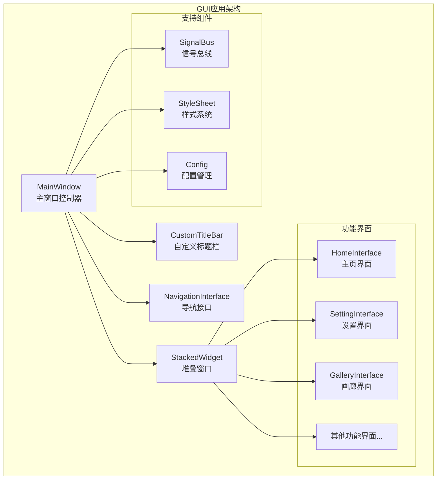

**图表来源**
- [main_window.py](file://gui/qtpy/version2/gallery/app/view/main_window.py#L66-L91)
- [title_bar.py](file://gui/qtpy/version2/gallery/app/view/title_bar.py#L8-L32)

**章节来源**
- [main_window.py](file://gui/qtpy/version2/gallery/app/view/main_window.py#L1-L212)

## 核心组件

### StackedWidget类

StackedWidget是MainWindow中的核心布局组件，负责管理多个界面的堆叠显示和切换动画效果。

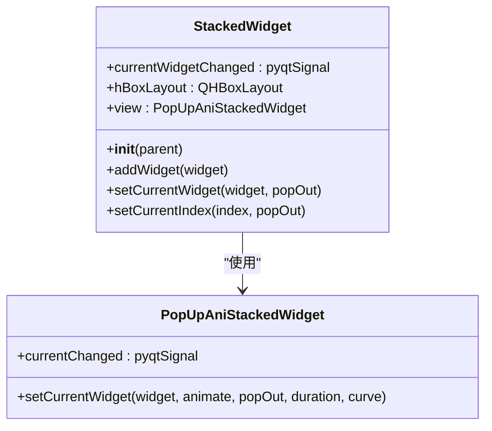

**图表来源**
- [main_window.py](file://gui/qtpy/version2/gallery/app/view/main_window.py#L34-L64)

### MainWindow类

MainWindow类是整个GUI应用程序的核心控制器，继承自FramelessWindow，提供完整的窗口管理和界面控制功能。

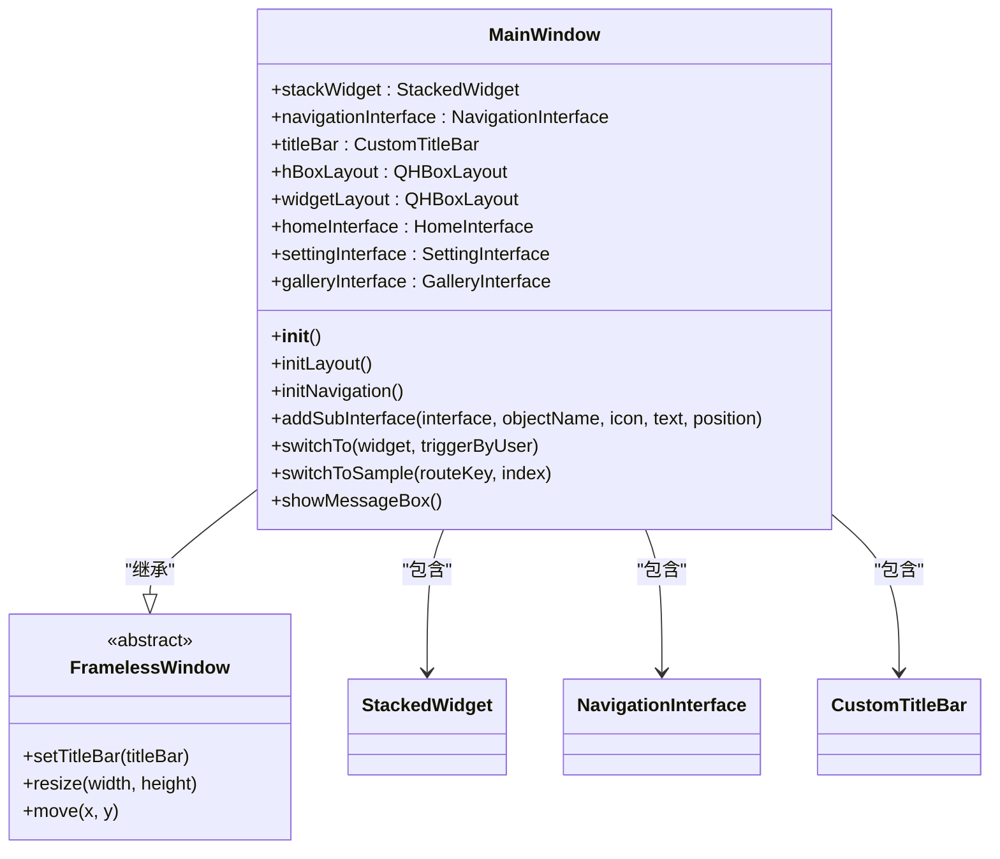

**图表来源**
- [main_window.py](file://gui/qtpy/version2/gallery/app/view/main_window.py#L66-L91)

**章节来源**
- [main_window.py](file://gui/qtpy/version2/gallery/app/view/main_window.py#L34-L212)

## 架构概览

MainWindow的整体架构采用了经典的MVC模式，通过清晰的职责分离实现了高度的可维护性和扩展性。

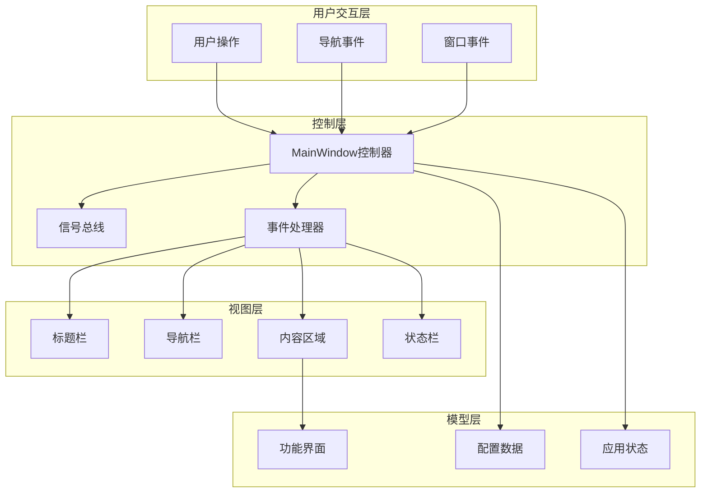

**图表来源**
- [main_window.py](file://gui/qtpy/version2/gallery/app/view/main_window.py#L66-L163)
- [signal_bus.py](file://gui/qtpy/version2/gallery/app/common/signal_bus.py#L5-L11)

## 详细组件分析

### 导航系统设计

MainWindow的导航系统采用了多层次的导航架构，支持顶部导航项、分隔符和底部固定项的灵活组合。

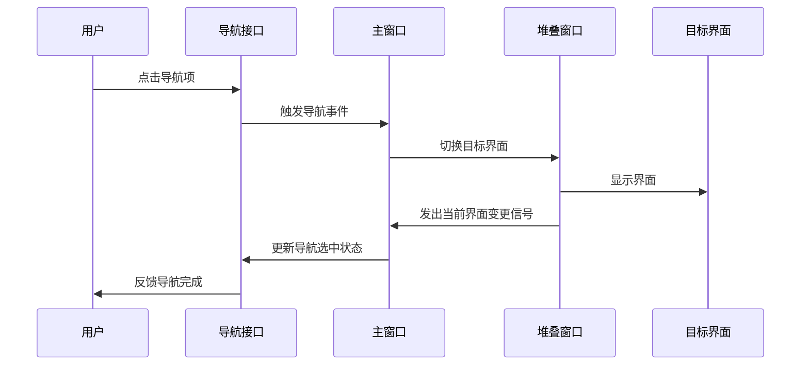

**图表来源**
- [main_window.py](file://gui/qtpy/version2/gallery/app/view/main_window.py#L116-L156)

#### 导航项添加机制

MainWindow通过`addSubInterface`方法统一管理所有功能界面的注册和初始化：

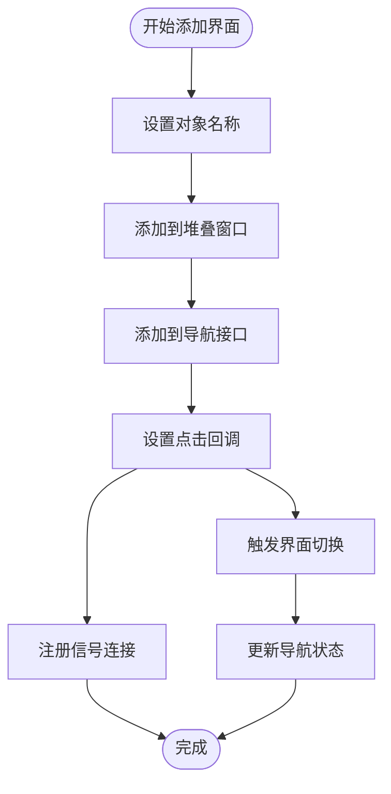

**图表来源**
- [main_window.py](file://gui/qtpy/version2/gallery/app/view/main_window.py#L165-L175)

### 标题栏定制化

CustomTitleBar类提供了丰富的标题栏定制功能，包括图标显示、标题文本和自定义控件支持。

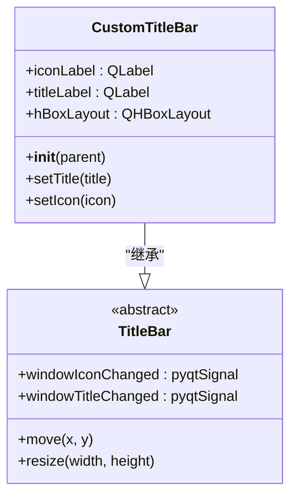

**图表来源**
- [title_bar.py](file://gui/qtpy/version2/gallery/app/view/title_bar.py#L8-L32)

### 信号总线系统

SignalBus作为全局事件总线，实现了组件间的松耦合通信机制。

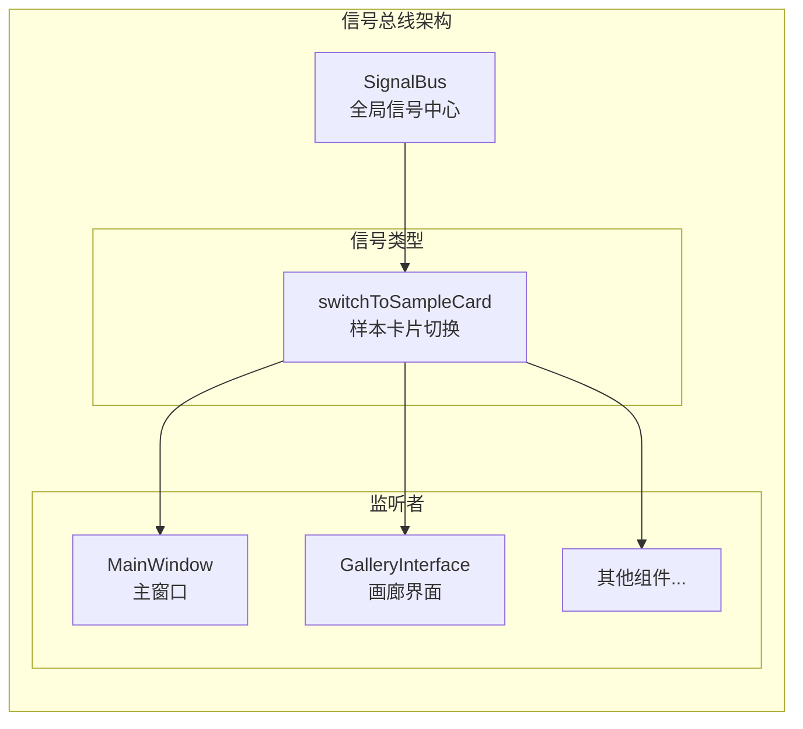

**图表来源**
- [signal_bus.py](file://gui/qtpy/version2/gallery/app/common/signal_bus.py#L5-L11)

**章节来源**
- [main_window.py](file://gui/qtpy/version2/gallery/app/view/main_window.py#L100-L115)
- [title_bar.py](file://gui/qtpy/version2/gallery/app/view/title_bar.py#L1-L32)
- [signal_bus.py](file://gui/qtpy/version2/gallery/app/common/signal_bus.py#L1-L11)

### 界面切换机制

MainWindow实现了多种界面切换方式，包括程序化切换和用户交互切换：

#### 程序化切换流程

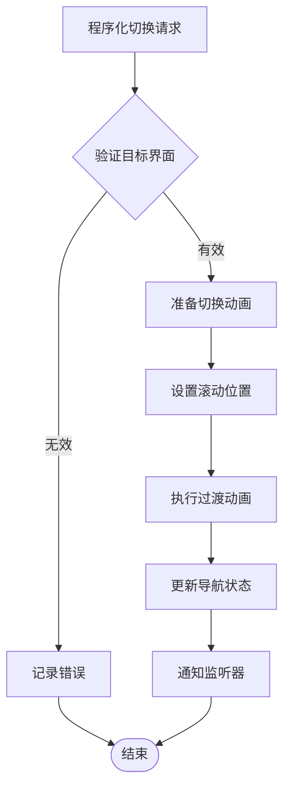

**图表来源**
- [main_window.py](file://gui/qtpy/version2/gallery/app/view/main_window.py#L190-L192)

#### 用户交互切换流程

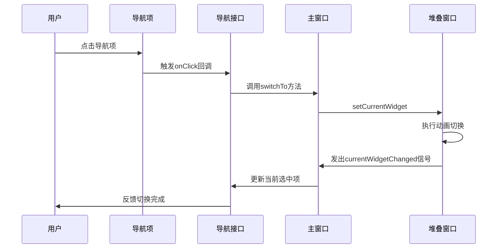

**图表来源**
- [main_window.py](file://gui/qtpy/version2/gallery/app/view/main_window.py#L169-L175)

**章节来源**
- [main_window.py](file://gui/qtpy/version2/gallery/app/view/main_window.py#L190-L212)

### 布局管理系统

MainWindow采用了双层布局管理策略，通过水平布局和嵌套布局实现复杂的界面组织：

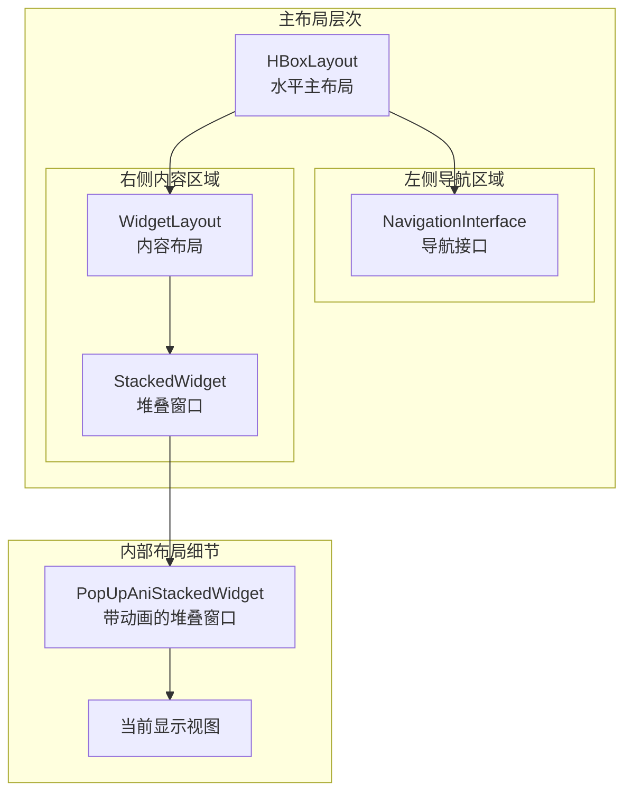

**图表来源**
- [main_window.py](file://gui/qtpy/version2/gallery/app/view/main_window.py#L71-L109)

**章节来源**
- [main_window.py](file://gui/qtpy/version2/gallery/app/view/main_window.py#L100-L109)

## 依赖关系分析

MainWindow类与多个系统组件存在密切的依赖关系，形成了复杂而有序的依赖网络：

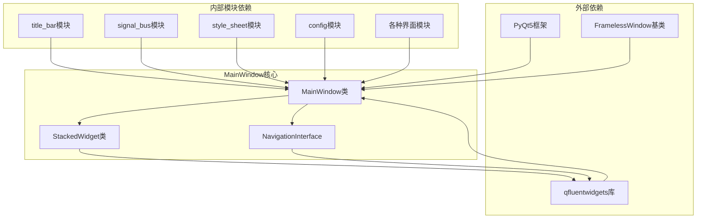

**图表来源**
- [main_window.py](file://gui/qtpy/version2/gallery/app/view/main_window.py#L1-L32)

### 关键依赖说明

| 依赖模块 | 类型 | 用途 | 重要性 |
|---------|------|------|--------|
| qfluentwidgets.NavigationInterface | 第三方库 | 导航界面管理 | 高 |
| qframelesswindow.FramelessWindow | 第三方库 | 无边框窗口基础 | 高 |
| CustomTitleBar | 自定义类 | 标题栏定制化 | 中 |
| SignalBus | 全局单例 | 组件间通信 | 高 |
| StackedWidget | 自定义类 | 界面堆叠管理 | 高 |
| 各种Interface类 | 应用模块 | 功能界面实现 | 高 |

**章节来源**
- [main_window.py](file://gui/qtpy/version2/gallery/app/view/main_window.py#L1-L32)

## 性能考虑

MainWindow在设计时充分考虑了性能优化，采用了多种策略来确保流畅的用户体验：

### 内存管理优化
- 使用对象名称标识符避免内存泄漏
- 及时清理不需要的界面实例
- 采用懒加载策略延迟初始化非关键组件

### 渲染性能优化
- 使用硬件加速的动画效果
- 优化布局计算减少重绘次数
- 实现虚拟化滚动处理大量内容

### 响应性优化
- 异步处理耗时操作
- 使用信号槽机制避免阻塞主线程
- 实现智能缓存策略

## 故障排除指南

### 常见问题及解决方案

#### 界面切换异常
**症状**: 点击导航项后界面不切换或出现空白
**原因**: 目标界面未正确初始化或信号连接失败
**解决方案**: 检查`addSubInterface`调用是否正确，确认信号连接状态

#### 样式显示异常
**症状**: 界面元素样式错乱或颜色不正确
**原因**: 样式表加载失败或主题配置错误
**解决方案**: 验证`StyleSheet.MAIN_WINDOW.apply(self)`调用，检查配置文件

#### 导航状态不同步
**症状**: 导航项高亮与当前界面不匹配
**原因**: `currentWidgetChanged`信号未正确发出
**解决方案**: 检查信号连接和事件处理逻辑

**章节来源**
- [main_window.py](file://gui/qtpy/version2/gallery/app/view/main_window.py#L159-L163)

## 结论

MainWindow类作为Python-Office GUI应用程序的核心控制器，展现了优秀的软件架构设计原则。通过模块化的设计、清晰的职责分离和高效的信号通信机制，它成功地实现了复杂GUI应用的统一管理和协调。

该架构的主要优势包括：
- **高度模块化**: 各功能界面独立开发，便于维护和扩展
- **灵活的布局管理**: 支持多种界面组织方式和动态调整
- **强大的导航系统**: 提供直观的界面切换和状态管理
- **完善的事件处理**: 通过信号总线实现组件间的松耦合通信
- **优秀的用户体验**: 流畅的动画效果和响应式设计

这种设计模式为类似的桌面应用程序开发提供了宝贵的参考价值，展示了如何在保持代码简洁性的同时实现功能的丰富性和扩展性。