# 公共模块详解

<cite>
**本文档引用的文件**
- [config.py](file://gui/qtpy/version2/gallery/app/common/config.py)
- [signal_bus.py](file://gui/qtpy/version2/gallery/app/common/signal_bus.py)
- [style_sheet.py](file://gui/qtpy/version2/gallery/app/common/style_sheet.py)
- [translator.py](file://gui/qtpy/version2/gallery/app/common/translator.py)
- [config.json](file://gui/qtpy/version2/gallery/app/config/config.json)
- [main_window.py](file://gui/qtpy/version2/gallery/app/view/main_window.py)
- [setting_interface.py](file://gui/qtpy/version2/gallery/app/view/setting_interface.py)
- [home_interface.py](file://gui/qtpy/version2/gallery/app/view/home_interface.py)
- [sample_card.py](file://gui/qtpy/version2/gallery/app/components/sample_card.py)
- [demo.py](file://gui/qtpy/version2/gallery/demo.py)
</cite>

## 目录
1. [概述](#概述)
2. [配置管理模块 - config.py](#配置管理模块---configpy)
3. [全局信号通信机制 - signal_bus.py](#全局信号通信机制---signal_buspy)
4. [UI样式主题管理 - style_sheet.py](#ui样式主题管理---style_sheetpy)
5. [多语言切换功能 - translator.py](#多语言切换功能---translatorpy)
6. [模块间协作关系](#模块间协作关系)
7. [实际应用场景分析](#实际应用场景分析)
8. [代码可维护性与扩展性](#代码可维护性与扩展性)
9. [总结](#总结)

## 概述

python-office项目中的common目录包含了四个核心的公共模块，它们共同构成了整个GUI应用程序的基础架构。这些模块分别负责配置管理、信号通信、样式主题和国际化功能，通过统一的设计模式实现了组件间的解耦和代码的可维护性。

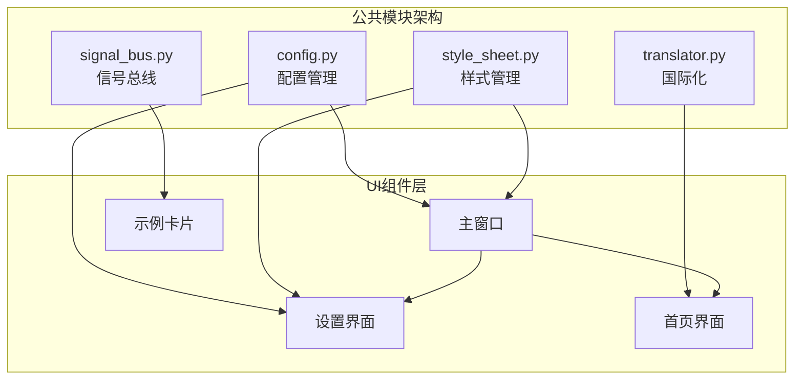

**图表来源**
- [config.py](file://gui/qtpy/version2/gallery/app/common/config.py#L19-L52)
- [signal_bus.py](file://gui/qtpy/version2/gallery/app/common/signal_bus.py#L5-L11)
- [style_sheet.py](file://gui/qtpy/version2/gallery/app/common/style_sheet.py#L7-L21)
- [translator.py](file://gui/qtpy/version2/gallery/app/common/translator.py#L5-L19)

## 配置管理模块 - config.py

### 核心功能

config.py模块实现了完整的应用配置管理系统，基于qfluentwidgets框架的QConfig类构建，提供了类型安全的配置项管理和持久化存储功能。

### 配置项设计

该模块定义了三个主要的配置类别：

1. **文件夹配置**：管理音乐文件夹和下载目录
2. **主窗口配置**：控制DPI缩放和语言设置
3. **材质配置**：管理毛玻璃效果的模糊半径

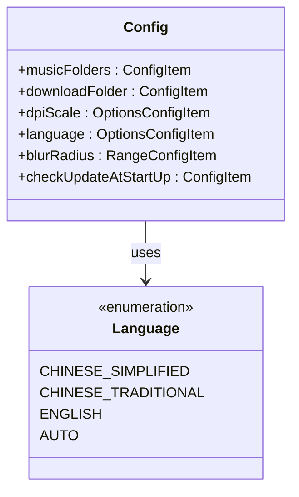

**图表来源**
- [config.py](file://gui/qtpy/version2/gallery/app/common/config.py#L19-L40)

### 类型验证与约束

每个配置项都配备了相应的验证器：

- `BoolValidator`：布尔值验证
- `OptionsValidator`：选项值验证  
- `RangeValidator`：数值范围验证
- `FolderValidator`：文件夹路径验证
- `EnumSerializer`：枚举序列化

### 配置持久化

配置数据通过JSON文件进行持久化存储，支持自动加载和保存：

**章节来源**
- [config.py](file://gui/qtpy/version2/gallery/app/common/config.py#L52)
- [config.json](file://gui/qtpy/version2/gallery/app/config/config.json#L1-L20)

## 全局信号通信机制 - signal_bus.py

### 设计理念

signal_bus.py实现了一个轻量级的全局信号总线，采用单例模式确保在整个应用中只有一个信号总线实例，实现了组件间的松耦合通信。

### 信号定义

目前定义了一个核心信号：

- `switchToSampleCard`：用于导航到特定的示例卡片

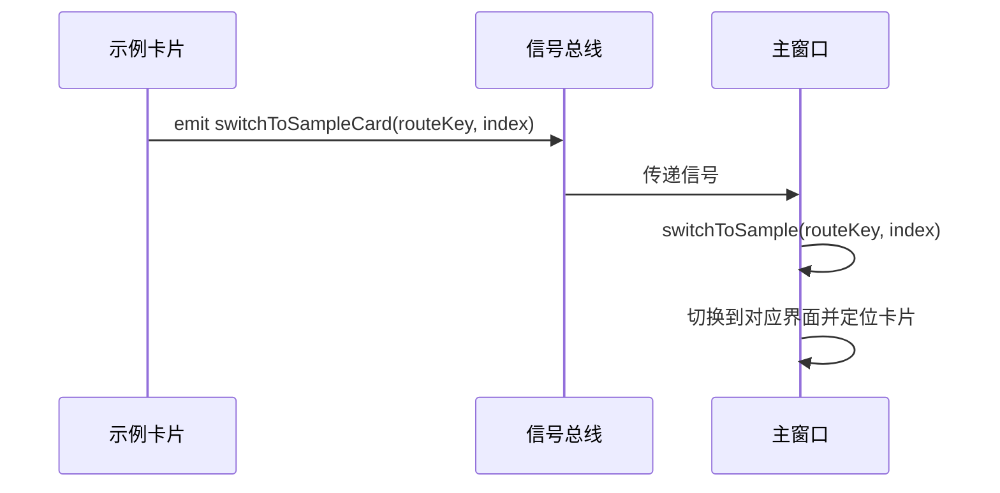

**图表来源**
- [signal_bus.py](file://gui/qtpy/version2/gallery/app/common/signal_bus.py#L8)
- [sample_card.py](file://gui/qtpy/version2/gallery/app/components/sample_card.py#L47)

### 使用场景

信号总线主要用于以下场景：
1. **导航跳转**：从示例卡片点击跳转到对应的详细界面
2. **组件通信**：不同UI组件间的事件传递
3. **状态同步**：跨组件的状态更新通知

**章节来源**
- [signal_bus.py](file://gui/qtpy/version2/gallery/app/common/signal_bus.py#L1-L11)
- [sample_card.py](file://gui/qtpy/version2/gallery/app/components/sample_card.py#L47)

## UI样式主题管理 - style_sheet.py

### 枚举式设计

style_sheet.py采用枚举方式定义所有可用的样式表，确保了类型安全和代码可读性：

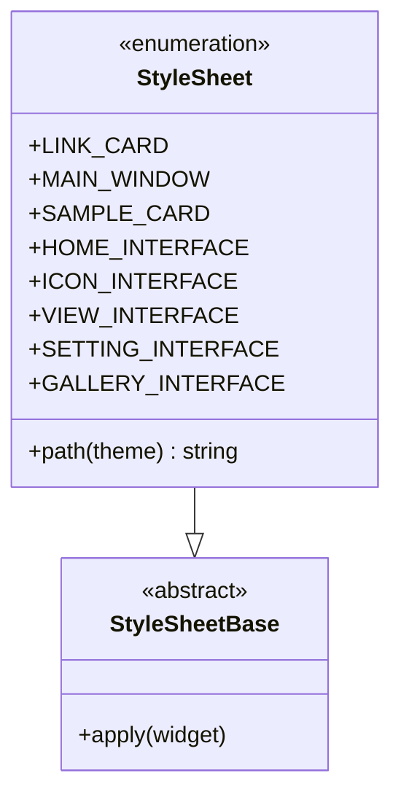

**图表来源**
- [style_sheet.py](file://gui/qtpy/version2/gallery/app/common/style_sheet.py#L7-L21)

### 路径动态解析

样式表路径采用动态解析机制，支持：
1. **主题适配**：根据当前主题自动选择样式文件
2. **资源定位**：通过Qt资源系统定位样式文件
3. **主题切换**：运行时动态切换亮色/暗色主题

### 应用场景

每个界面都有对应的样式表：
- `MAIN_WINDOW`：主窗口整体样式
- `SETTING_INTERFACE`：设置界面专用样式  
- `SAMPLE_CARD`：示例卡片样式
- `HOME_INTERFACE`：首页界面样式

**章节来源**
- [style_sheet.py](file://gui/qtpy/version2/gallery/app/common/style_sheet.py#L1-L22)
- [main_window.py](file://gui/qtpy/version2/gallery/app/view/main_window.py#L188)

## 多语言切换功能 - translator.py

### 国际化架构

translator.py实现了基础的翻译功能，为后续的完整国际化做好准备：

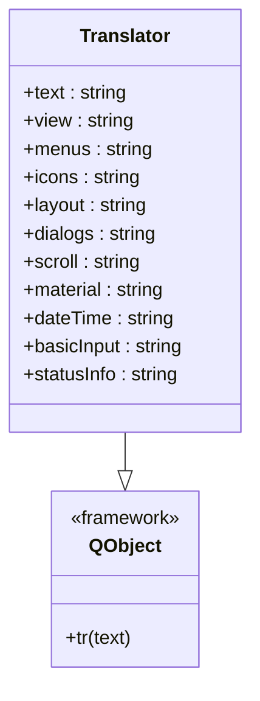

**图表来源**
- [translator.py](file://gui/qtpy/version2/gallery/app/common/translator.py#L5-L19)

### 支持的语言

虽然当前只实现了基础翻译功能，但架构支持多种语言：
1. **文本标签**：基本界面元素的翻译
2. **界面标题**：各个功能模块的名称
3. **操作提示**：用户交互的提示信息

### 与配置系统的集成

翻译功能与配置系统紧密集成，在应用启动时根据用户设置的语言偏好加载相应的翻译资源。

**章节来源**
- [translator.py](file://gui/qtpy/version2/gallery/app/common/translator.py#L1-L19)
- [demo.py](file://gui/qtpy/version2/gallery/demo.py#L28-L46)

## 模块间协作关系

### 依赖关系图

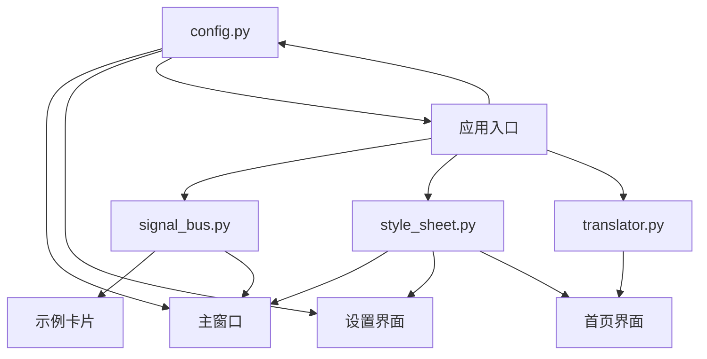

**图表来源**
- [main_window.py](file://gui/qtpy/version2/gallery/app/view/main_window.py#L188)
- [setting_interface.py](file://gui/qtpy/version2/gallery/app/view/setting_interface.py#L155)
- [demo.py](file://gui/qtpy/version2/gallery/demo.py#L8-L46)

### 协作模式

1. **配置驱动**：所有UI组件都监听配置变化，实现动态更新
2. **信号驱动**：通过信号总线实现组件间的事件传递
3. **样式统一**：通过样式表确保界面风格的一致性
4. **国际化支持**：为多语言功能提供基础架构

## 实际应用场景分析

### 主窗口初始化场景

在主窗口初始化过程中，各个公共模块发挥关键作用：

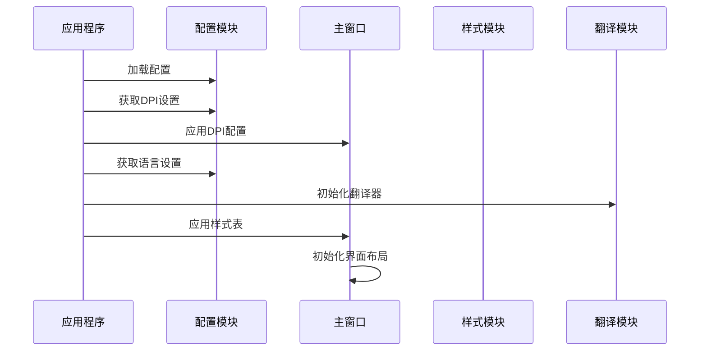

**图表来源**
- [demo.py](file://gui/qtpy/version2/gallery/demo.py#L12-L46)
- [main_window.py](file://gui/qtpy/version2/gallery/app/view/main_window.py#L180-L189)

### 设置界面应用场景

设置界面是配置管理模块的主要应用场景：

| 配置项 | 类型 | 验证器 | 功能描述 |
|--------|------|--------|----------|
| themeMode | OptionsConfigItem | OptionsValidator | 主题模式切换（亮/暗/系统） |
| themeColor | CustomColorSettingCard | - | 自定义主题颜色 |
| dpiScale | OptionsConfigItem | OptionsValidator | 界面缩放比例 |
| language | OptionsConfigItem | EnumSerializer | 语言选择 |
| blurRadius | RangeConfigItem | RangeValidator | 毛玻璃效果强度 |

**章节来源**
- [setting_interface.py](file://gui/qtpy/version2/gallery/app/view/setting_interface.py#L31-L115)

### 示例卡片导航场景

示例卡片的导航功能展示了信号总线的实际应用：

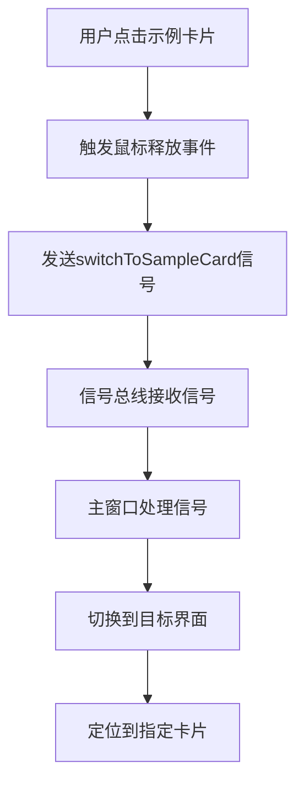

**图表来源**
- [sample_card.py](file://gui/qtpy/version2/gallery/app/components/sample_card.py#L47)
- [main_window.py](file://gui/qtpy/version2/gallery/app/view/main_window.py#L205-L211)

### 样式应用场景

不同界面使用对应的样式表：

| 界面类型 | 样式表 | 应用时机 |
|----------|--------|----------|
| 主窗口 | MAIN_WINDOW | 应用启动时 |
| 设置界面 | SETTING_INTERFACE | 进入设置页面时 |
| 首页界面 | HOME_INTERFACE | 进入首页时 |
| 示例卡片 | SAMPLE_CARD | 创建卡片时 |

**章节来源**
- [main_window.py](file://gui/qtpy/version2/gallery/app/view/main_window.py#L188)
- [setting_interface.py](file://gui/qtpy/version2/gallery/app/view/setting_interface.py#L155)

## 代码可维护性与扩展性

### 设计原则

1. **单一职责**：每个模块专注于特定功能领域
2. **开放封闭**：对扩展开放，对修改封闭
3. **依赖倒置**：高层模块不依赖低层模块的具体实现
4. **接口隔离**：客户端不应依赖它不需要的接口

### 扩展性设计

#### 配置系统的扩展

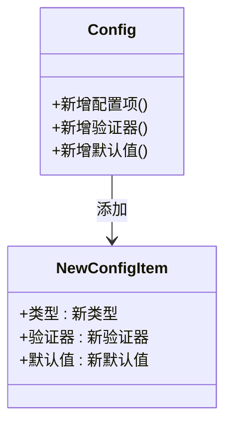

#### 信号系统的扩展

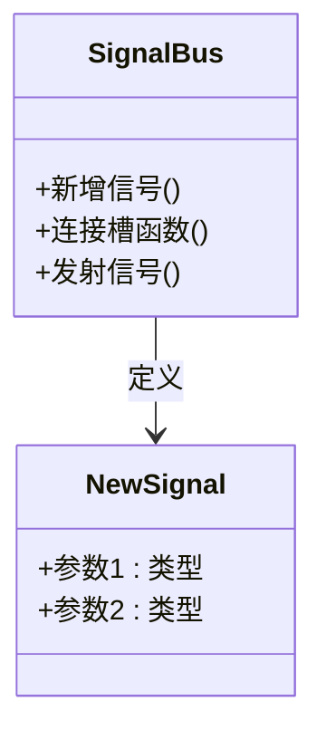

#### 样式系统的扩展

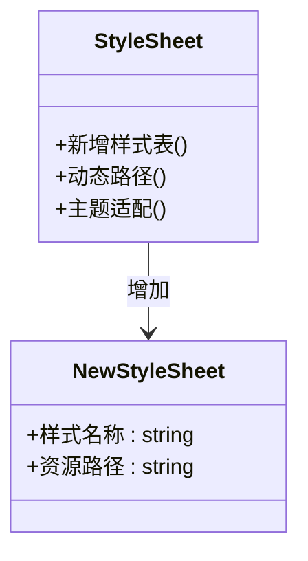

### 维护优势

1. **集中管理**：所有配置、样式、翻译都集中在公共模块
2. **类型安全**：通过类型注解和验证器确保数据完整性
3. **易于测试**：模块化设计便于单元测试
4. **文档友好**：清晰的接口定义便于文档编写
5. **热更新支持**：配置变更无需重启即可生效

**章节来源**
- [config.py](file://gui/qtpy/version2/gallery/app/common/config.py#L19-L52)
- [signal_bus.py](file://gui/qtpy/version2/gallery/app/common/signal_bus.py#L5-L11)
- [style_sheet.py](file://gui/qtpy/version2/gallery/app/common/style_sheet.py#L7-L21)

## 总结

python-office项目的common目录下的四个公共模块构成了一个完整而优雅的基础设施：

1. **config.py**提供了类型安全的配置管理，支持持久化存储和动态更新
2. **signal_bus.py**实现了组件间的松耦合通信，提高了代码的可维护性
3. **style_sheet.py**统一管理UI样式，确保界面风格的一致性
4. **translator.py**为国际化功能奠定了基础架构

这些模块通过合理的接口设计和协作机制，不仅提升了代码的质量，还为未来的功能扩展提供了良好的基础。它们共同体现了现代软件开发中的最佳实践，包括模块化设计、依赖注入、单一职责等原则。

这种设计使得python-office项目能够：
- 快速响应需求变化
- 降低维护成本
- 提高开发效率
- 确保代码质量
- 支持功能扩展

通过深入理解和正确使用这些公共模块，开发者可以构建出更加健壮、可维护和可扩展的GUI应用程序。