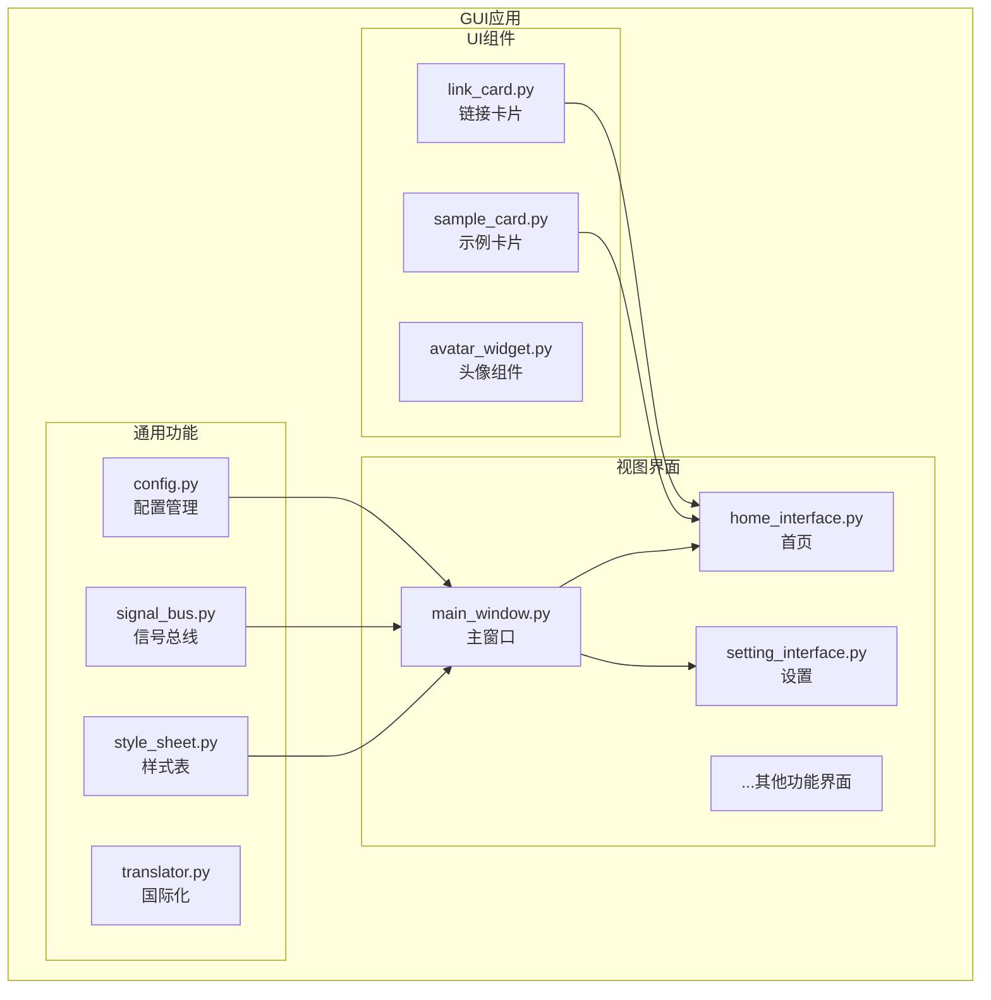
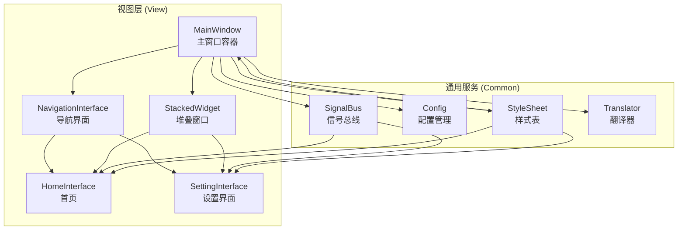
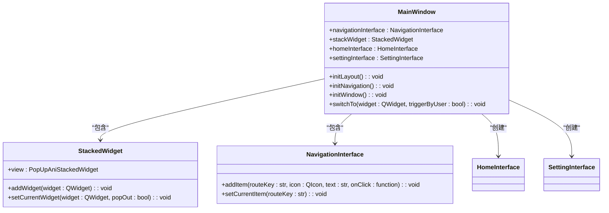
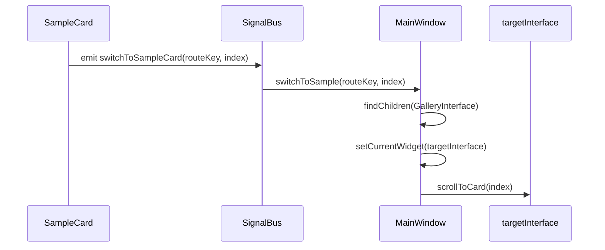
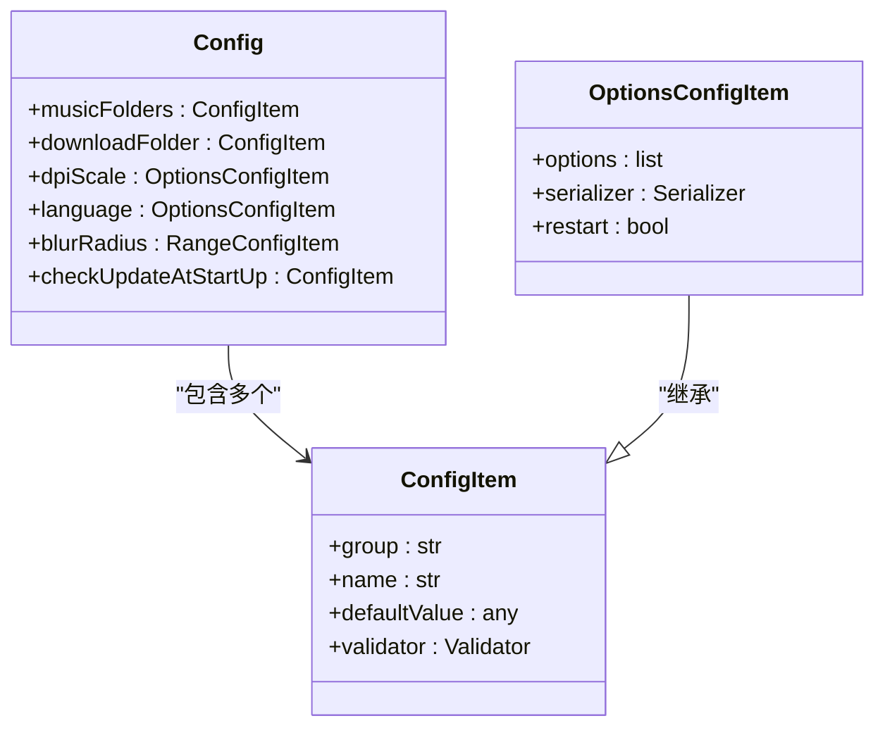
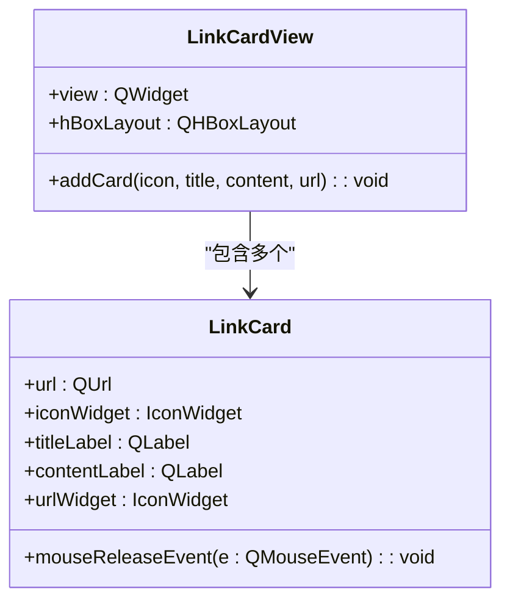
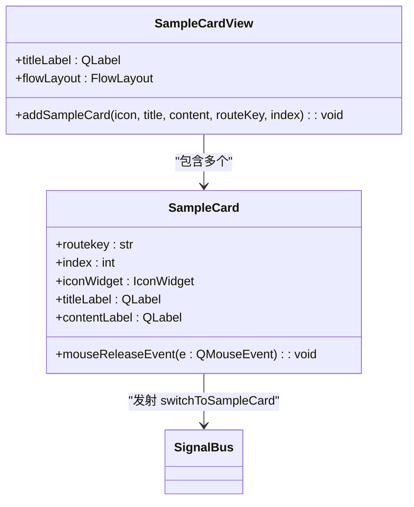
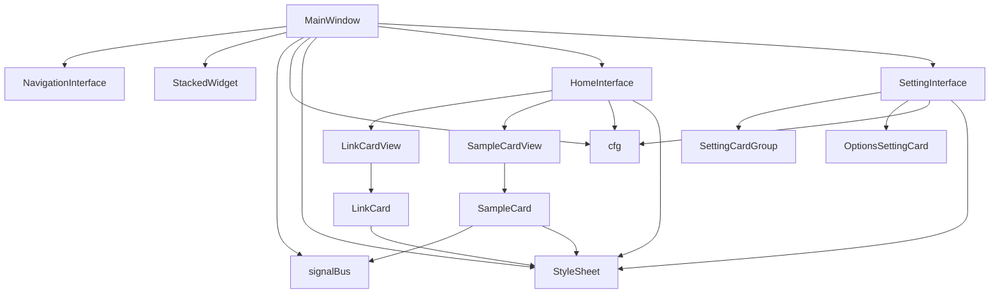

# 核心组件架构

<cite>
**本文档引用的文件**
- [main_window.py](file://gui/qtpy/version2/gallery/app/view/main_window.py)
- [signal_bus.py](file://gui/qtpy/version2/gallery/app/common/signal_bus.py)
- [config.py](file://gui/qtpy/version2/gallery/app/common/config.py)
- [link_card.py](file://gui/qtpy/version2/gallery/app/components/link_card.py)
- [sample_card.py](file://gui/qtpy/version2/gallery/app/components/sample_card.py)
- [style_sheet.py](file://gui/qtpy/version2/gallery/app/common/style_sheet.py)
- [home_interface.py](file://gui/qtpy/version2/gallery/app/view/home_interface.py)
- [setting_interface.py](file://gui/qtpy/version2/gallery/app/view/setting_interface.py)
</cite>

## 目录
1. [简介](#简介)
2. [项目结构](#项目结构)
3. [核心组件](#核心组件)
4. [架构概览](#架构概览)
5. [详细组件分析](#详细组件分析)
6. [依赖分析](#依赖分析)
7. [性能考虑](#性能考虑)
8. [故障排除指南](#故障排除指南)
9. [结论](#结论)

## 简介
本文档深入解析GUI的核心组件架构，重点围绕MainWindow类、信号总线（signal_bus）、配置管理（config.py）和UI组件（如link_card.py、sample_card.py）展开。说明main_window.py如何作为主窗口容器协调各个功能界面，common目录下的工具模块如何支撑全局功能（如国际化、样式表），以及components中自定义控件的实现机制。结合代码示例解释组件间的通信方式（如通过signal_bus传递事件）和状态管理逻辑，阐述其如何封装底层API调用。

## 项目结构
本项目采用模块化设计，GUI相关代码位于`gui/qtpy/version2/gallery/app/`目录下，主要分为三个核心部分：`common`（通用功能）、`components`（可复用UI组件）和`view`（视图界面）。这种分层结构实现了关注点分离，提高了代码的可维护性和可扩展性。

**图源**
- [main_window.py](file://gui/qtpy/version2/gallery/app/view/main_window.py)
- [config.py](file://gui/qtpy/version2/gallery/app/common/config.py)
- [signal_bus.py](file://gui/qtpy/version2/gallery/app/common/signal_bus.py)
- [link_card.py](file://gui/qtpy/version2/gallery/app/components/link_card.py)
- [sample_card.py](file://gui/qtpy/version2/gallery/app/components/sample_card.py)

**本节来源**
- [main_window.py](file://gui/qtpy/version2/gallery/app/view/main_window.py)
- [config.py](file://gui/qtpy/version2/gallery/app/common/config.py)

## 核心组件
核心组件包括主窗口（MainWindow）、信号总线（SignalBus）、配置管理器（Config）和自定义UI组件（LinkCard、SampleCard）。MainWindow作为应用的根容器，负责初始化和协调所有子界面。SignalBus实现了全局事件通信，解耦了组件间的直接依赖。Config类提供了类型安全的配置项管理，并支持运行时热重载。自定义UI组件如LinkCard和SampleCard封装了复杂的样式和交互逻辑，实现了高内聚、低耦合的设计原则。

**本节来源**
- [main_window.py](file://gui/qtpy/version2/gallery/app/view/main_window.py#L66-L212)
- [signal_bus.py](file://gui/qtpy/version2/gallery/app/common/signal_bus.py#L5-L11)
- [config.py](file://gui/qtpy/version2/gallery/app/common/config.py#L19-L52)
- [link_card.py](file://gui/qtpy/version2/gallery/app/components/link_card.py#L10-L71)
- [sample_card.py](file://gui/qtpy/version2/gallery/app/components/sample_card.py#L10-L75)

## 架构概览
系统采用基于Qt的MVC架构，以`MainWindow`为核心，通过`NavigationInterface`实现侧边栏导航，使用`StackedWidget`管理多个功能界面的堆叠显示。`common`目录下的模块提供全局服务，如配置管理、信号分发和样式应用。`components`目录封装了可复用的UI控件，而`view`目录则实现了具体的功能界面。组件间通过信号-槽机制进行松耦合通信，确保了系统的灵活性和可维护性。

**图源**
- [main_window.py](file://gui/qtpy/version2/gallery/app/view/main_window.py#L66-L212)
- [signal_bus.py](file://gui/qtpy/version2/gallery/app/common/signal_bus.py#L5-L11)
- [config.py](file://gui/qtpy/version2/gallery/app/common/config.py#L19-L52)
- [style_sheet.py](file://gui/qtpy/version2/gallery/app/common/style_sheet.py#L7-L22)

## 详细组件分析
本节深入分析GUI中的关键组件，包括主窗口、信号总线、配置系统和自定义UI控件的实现细节。

### MainWindow分析
`MainWindow`类继承自`FramelessWindow`，是整个GUI应用的根容器。它通过组合模式集成`NavigationInterface`和`StackedWidget`，实现了经典的侧边栏导航布局。`MainWindow`负责创建所有子界面实例（如`HomeInterface`、`SettingInterface`等），并通过`initNavigation`方法将它们注册到导航栏中。当用户点击导航项时，`switchTo`方法被调用，从而在`StackedWidget`中切换显示相应的界面。

**图源**
- [main_window.py](file://gui/qtpy/version2/gallery/app/view/main_window.py#L66-L212)

**本节来源**
- [main_window.py](file://gui/qtpy/version2/gallery/app/view/main_window.py#L66-L212)

### 信号总线分析
`SignalBus`是一个单例模式的信号中心，它继承自`QObject`，利用Qt的信号-槽机制实现跨组件通信。`signalBus`实例（全局变量）暴露了`switchToSampleCard`等信号，允许任何组件在不直接引用的情况下广播事件。例如，当用户点击`SampleCard`时，它会发射`switchToSampleCard`信号，`MainWindow`通过连接该信号的槽函数`switchToSample`来响应，从而实现从首页到具体功能界面的跳转。这种设计极大地降低了组件间的耦合度。

**图源**
- [signal_bus.py](file://gui/qtpy/version2/gallery/app/common/signal_bus.py#L5-L11)
- [sample_card.py](file://gui/qtpy/version2/gallery/app/components/sample_card.py#L45-L48)
- [main_window.py](file://gui/qtpy/version2/gallery/app/view/main_window.py#L205-L212)

**本节来源**
- [signal_bus.py](file://gui/qtpy/version2/gallery/app/common/signal_bus.py#L5-L11)
- [sample_card.py](file://gui/qtpy/version2/gallery/app/components/sample_card.py#L45-L48)
- [main_window.py](file://gui/qtpy/version2/gallery/app/view/main_window.py#L110-L111, L205-L212)

### 配置管理分析
`Config`类基于`QConfig`构建，为应用提供了类型安全的配置管理。它定义了多个`ConfigItem`，如`dpiScale`、`language`和`checkUpdateAtStartUp`，这些配置项与JSON文件中的键值对应。`cfg`是`Config`的全局实例，通过`qconfig.load()`从`config.json`文件加载初始值。当配置项被修改时，可以触发`restart`标志，提示用户重启应用以使更改生效。这种方式将配置的定义、存储和访问统一管理，确保了配置的一致性和可维护性。

**图源**
- [config.py](file://gui/qtpy/version2/gallery/app/common/config.py#L19-L52)

**本节来源**
- [config.py](file://gui/qtpy/version2/gallery/app/common/config.py#L19-L52)
- [setting_interface.py](file://gui/qtpy/version2/gallery/app/view/setting_interface.py#L57-L91)

### 自定义UI组件分析
自定义UI组件封装了特定的视觉样式和交互行为，提高了代码的复用性。

#### LinkCard组件
`LinkCard`是一个可点击的卡片组件，通常用于展示外部链接。它包含一个图标、标题、描述文本和一个链接图标。当用户释放鼠标时，`mouseReleaseEvent`被触发，调用`QDesktopServices.openUrl()`打开预设的URL。`LinkCardView`则是一个水平滚动区域，用于容纳多个`LinkCard`，形成链接卡片组。

**图源**
- [link_card.py](file://gui/qtpy/version2/gallery/app/components/link_card.py#L10-L71)

**本节来源**
- [link_card.py](file://gui/qtpy/version2/gallery/app/components/link_card.py#L10-L71)
- [home_interface.py](file://gui/qtpy/version2/gallery/app/view/home_interface.py#L33-L61)

#### SampleCard组件
`SampleCard`是功能示例的入口卡片，点击后会通过`signalBus`导航到对应的功能界面。它与`LinkCard`类似，但其点击行为是内部导航而非打开外部链接。`SampleCardView`使用`FlowLayout`（流式布局）来排列`SampleCard`，使其能根据窗口大小自动换行，提供了良好的响应式体验。

**图源**
- [sample_card.py](file://gui/qtpy/version2/gallery/app/components/sample_card.py#L10-L75)

**本节来源**
- [sample_card.py](file://gui/qtpy/version2/gallery/app/components/sample_card.py#L10-L75)
- [home_interface.py](file://gui/qtpy/version2/gallery/app/view/home_interface.py#L117-L326)

## 依赖分析
系统依赖关系清晰，形成了稳定的应用架构。`MainWindow`是核心依赖枢纽，直接依赖于`common`目录下的`signalBus`、`cfg`和`StyleSheet`，并创建所有`view`中的界面实例。`view`中的界面（如`HomeInterface`）依赖于`components`中的自定义控件（`LinkCard`、`SampleCard`）和`common`中的`config`、`style_sheet`。`components`中的控件则依赖`common`中的`style_sheet`来应用样式。这种依赖关系确保了高层模块（view）依赖于低层模块（components, common），符合依赖倒置原则。

**图源**
- [main_window.py](file://gui/qtpy/version2/gallery/app/view/main_window.py)
- [home_interface.py](file://gui/qtpy/version2/gallery/app/view/home_interface.py)
- [setting_interface.py](file://gui/qtpy/version2/gallery/app/view/setting_interface.py)
- [link_card.py](file://gui/qtpy/version2/gallery/app/components/link_card.py)
- [sample_card.py](file://gui/qtpy/version2/gallery/app/components/sample_card.py)

**本节来源**
- [main_window.py](file://gui/qtpy/version2/gallery/app/view/main_window.py)
- [home_interface.py](file://gui/qtpy/version2/gallery/app/view/home_interface.py)
- [setting_interface.py](file://gui/qtpy/version2/gallery/app/view/setting_interface.py)

## 性能考虑
GUI架构在性能方面表现出色。`StackedWidget`结合`PopUpAniStackedWidget`实现了界面的平滑切换动画，提升了用户体验。`FlowLayout`和`ScrollArea`的使用确保了在内容较多时仍能保持流畅滚动。样式表（StyleSheet）通过枚举和路径映射的方式集中管理，避免了重复加载。配置项的读取和写入操作均通过`QConfig`优化，减少了对JSON文件的频繁I/O操作。整体架构轻量高效，适合桌面应用的性能要求。

## 故障排除指南
- **界面无法切换**：检查`MainWindow`中的`initNavigation`是否正确注册了所有界面，并确认`navigationInterface.setCurrentItem()`的调用。
- **样式不生效**：确保`StyleSheet`的`apply()`方法被正确调用，且QSS文件路径正确。
- **配置未保存**：检查`cfg.set()`的调用，并确认`config.json`文件有写入权限。
- **信号未响应**：验证信号与槽的连接是否正确，例如`signalBus.switchToSampleCard.connect(self.switchToSample)`。
- **链接无法打开**：确认`QDesktopServices.openUrl()`的URL格式正确，且系统默认浏览器可用。

**本节来源**
- [main_window.py](file://gui/qtpy/version2/gallery/app/view/main_window.py)
- [style_sheet.py](file://gui/qtpy/version2/gallery/app/common/style_sheet.py)
- [config.py](file://gui/qtpy/version2/gallery/app/common/config.py)
- [signal_bus.py](file://gui/qtpy/version2/gallery/app/common/signal_bus.py)
- [link_card.py](file://gui/qtpy/version2/gallery/app/components/link_card.py)

## 结论
该GUI架构设计精良，通过`MainWindow`作为中心协调者，`SignalBus`实现松耦合通信，`Config`提供统一的配置管理，以及`components`封装可复用UI控件，共同构建了一个模块化、可维护的桌面应用界面。其清晰的依赖关系和分层设计，为未来的功能扩展和维护提供了坚实的基础。