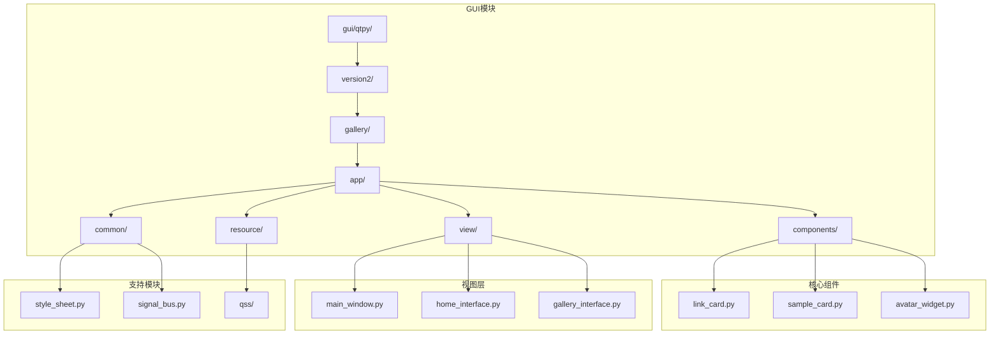
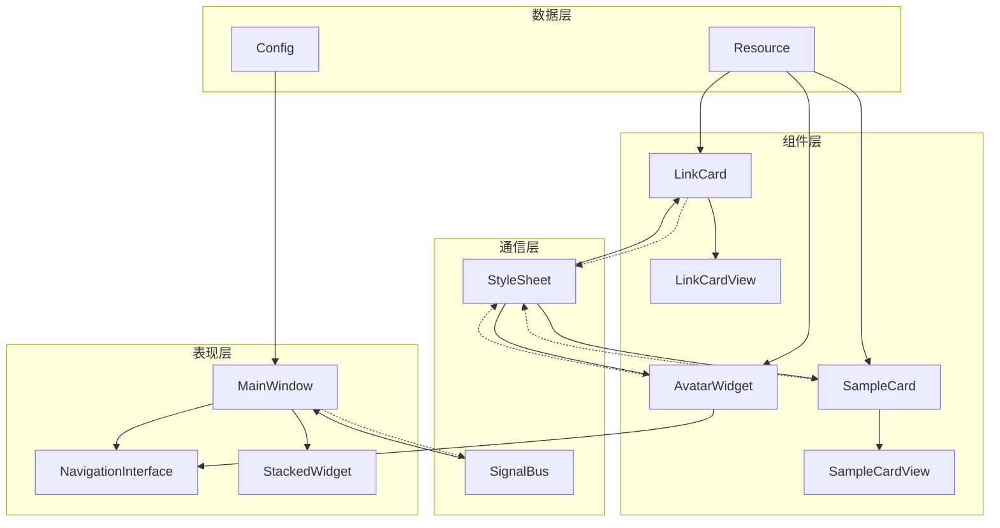
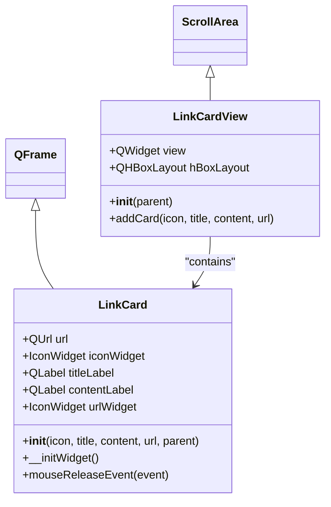
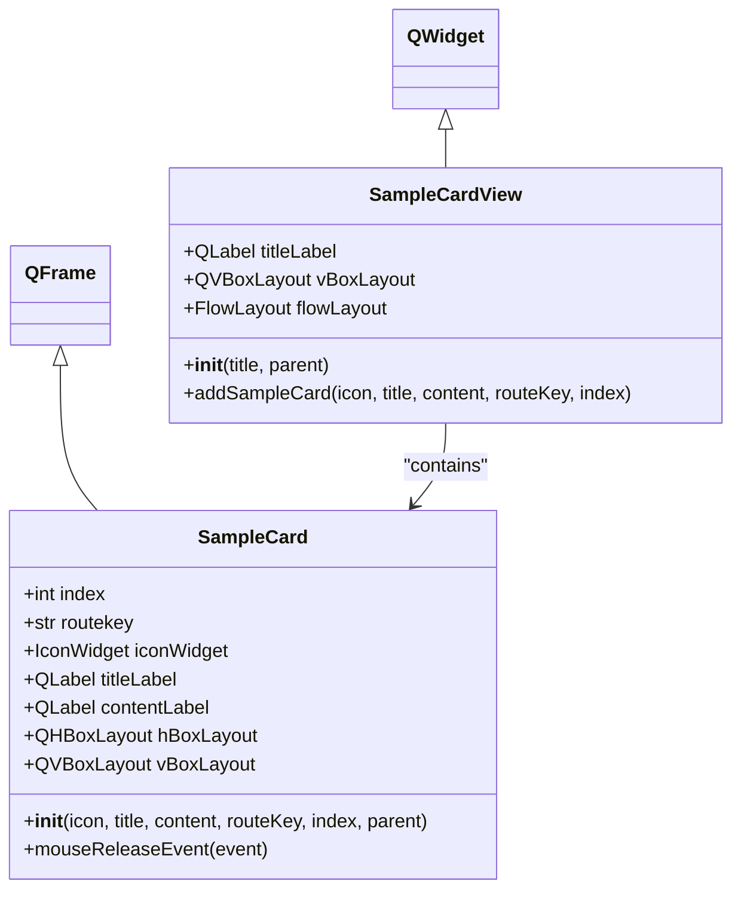
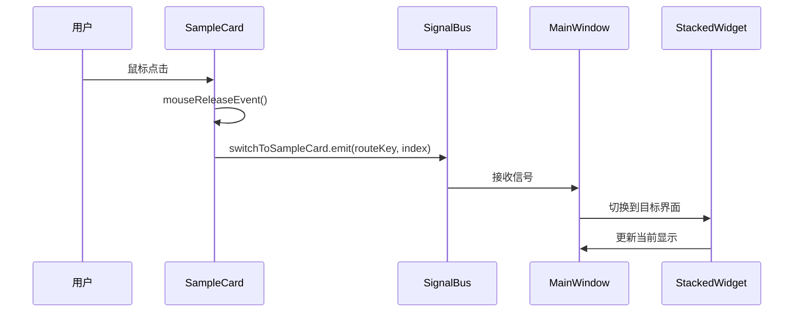
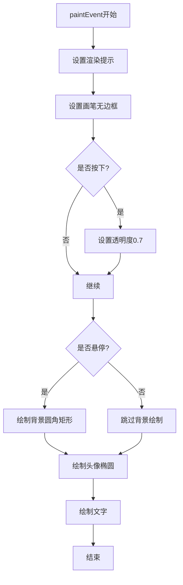
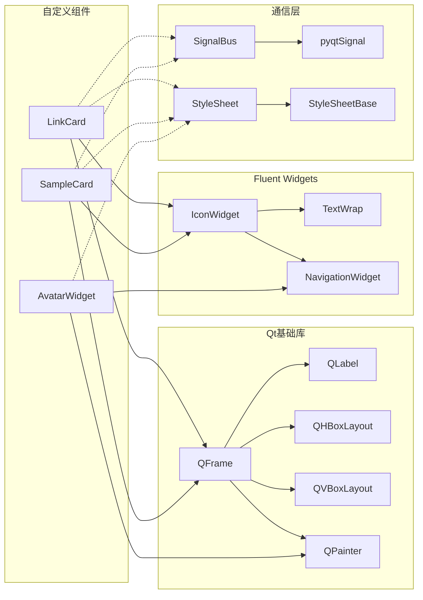

# 自定义UI组件

<cite>
**本文档中引用的文件**
- [link_card.py](file://gui/qtpy/version2/gallery/app/components/link_card.py)
- [sample_card.py](file://gui/qtpy/version2/gallery/app/components/sample_card.py)
- [avatar_widget.py](file://gui/qtpy/version2/gallery/app/components/avatar_widget.py)
- [style_sheet.py](file://gui/qtpy/version2/gallery/app/common/style_sheet.py)
- [signal_bus.py](file://gui/qtpy/version2/gallery/app/common/signal_bus.py)
- [main_window.py](file://gui/qtpy/version2/gallery/app/view/main_window.py)
- [home_interface.py](file://gui/qtpy/version2/gallery/app/view/home_interface.py)
- [gallery_interface.py](file://gui/qtpy/version2/gallery/app/view/gallery_interface.py)
- [link_card.qss](file://gui/qtpy/version2/gallery/app/resource/qss/light/link_card.qss)
- [sample_card.qss](file://gui/qtpy/version2/gallery/app/resource/qss/light/sample_card.qss)
</cite>

## 目录
1. [简介](#简介)
2. [项目结构](#项目结构)
3. [核心组件](#核心组件)
4. [架构概览](#架构概览)
5. [详细组件分析](#详细组件分析)
6. [依赖关系分析](#依赖关系分析)
7. [性能考虑](#性能考虑)
8. [故障排除指南](#故障排除指南)
9. [结论](#结论)

## 简介

本文档详细介绍了python-office项目中三个重要的自定义UI组件：LinkCard（链接卡片）、SampleCard（示例卡片）和AvatarWidget（头像组件）。这些组件基于Fluent Design设计语言，通过继承Qt框架的基础控件实现了高度定制化的界面效果。每个组件都遵循高内聚低耦合的设计原则，通过信号槽机制与主窗口进行通信，实现了模块化和可维护的界面架构。

## 项目结构

该项目采用模块化架构，主要包含以下目录结构：

**图表来源**
- [link_card.py](file://gui/qtpy/version2/gallery/app/components/link_card.py#L1-L71)
- [sample_card.py](file://gui/qtpy/version2/gallery/app/components/sample_card.py#L1-L75)
- [avatar_widget.py](file://gui/qtpy/version2/gallery/app/components/avatar_widget.py#L1-L42)

**章节来源**
- [link_card.py](file://gui/qtpy/version2/gallery/app/components/link_card.py#L1-L71)
- [sample_card.py](file://gui/qtpy/version2/gallery/app/components/sample_card.py#L1-L75)
- [avatar_widget.py](file://gui/qtpy/version2/gallery/app/components/avatar_widget.py#L1-L42)

## 核心组件

### LinkCard - 导航链接卡片

LinkCard是一个专门用于导航跳转的自定义控件，提供直观的视觉元素和流畅的交互体验。它继承自QFrame，集成了图标、标题、内容描述和外部链接功能。

### SampleCard - 功能示例卡片

SampleCard用于展示具体的功能示例，支持点击导航到相应的功能界面。它包含了图标、标题、详细描述和路由键等属性，为用户提供清晰的功能指引。

### AvatarWidget - 用户头像组件

AvatarWidget是一个自定义的导航部件，用于显示用户头像和相关信息。它继承自NavigationWidget，提供了丰富的视觉效果和交互状态。

**章节来源**
- [link_card.py](file://gui/qtpy/version2/gallery/app/components/link_card.py#L10-L46)
- [sample_card.py](file://gui/qtpy/version2/gallery/app/components/sample_card.py#L10-L47)
- [avatar_widget.py](file://gui/qtpy/version2/gallery/app/components/avatar_widget.py#L7-L42)

## 架构概览

整个UI组件系统采用分层架构设计，通过明确的职责分离实现了高度的模块化：

**图表来源**
- [main_window.py](file://gui/qtpy/version2/gallery/app/view/main_window.py#L66-L212)
- [signal_bus.py](file://gui/qtpy/version2/gallery/app/common/signal_bus.py#L5-L11)
- [style_sheet.py](file://gui/qtpy/version2/gallery/app/common/style_sheet.py#L7-L22)

## 详细组件分析

### LinkCard组件分析

LinkCard组件实现了简洁而功能完整的导航卡片，具有以下特点：

#### 类结构设计

**图表来源**
- [link_card.py](file://gui/qtpy/version2/gallery/app/components/link_card.py#L10-L71)

#### 核心功能实现

LinkCard的核心功能包括：
- **图标显示**：使用IconWidget显示主题图标
- **文本包装**：自动处理长文本的换行显示
- **链接跳转**：通过QDesktopServices.openUrl实现外部链接打开
- **鼠标交互**：提供悬停和点击反馈

#### 样式定制

LinkCard通过CSS样式表实现了统一的视觉风格：

| 属性 | Light主题 | Dark主题 |
|------|-----------|----------|
| 边框颜色 | rgb(234, 234, 234) | rgb(60, 60, 60) |
| 背景透明度 | 0.95 | 0.95 |
| 悬停背景色 | rgba(249, 249, 249, 0.93) | rgba(249, 249, 249, 0.93) |
| 字体颜色 | 黑色 | 白色 |

**章节来源**
- [link_card.py](file://gui/qtpy/version2/gallery/app/components/link_card.py#L10-L71)
- [link_card.qss](file://gui/qtpy/version2/gallery/app/resource/qss/light/link_card.qss#L1-L29)

### SampleCard组件分析

SampleCard专注于功能示例的展示，提供了完整的交互式卡片体验：

#### 类结构设计

**图表来源**
- [sample_card.py](file://gui/qtpy/version2/gallery/app/components/sample_card.py#L10-L75)

#### 交互机制

SampleCard通过信号槽机制实现与主窗口的通信：

**图表来源**
- [sample_card.py](file://gui/qtpy/version2/gallery/app/components/sample_card.py#L45-L47)
- [signal_bus.py](file://gui/qtpy/version2/gallery/app/common/signal_bus.py#L8-L8)
- [main_window.py](file://gui/qtpy/version2/gallery/app/view/main_window.py#L205-L212)

#### 布局管理

SampleCard采用了灵活的布局管理系统：

| 组件 | 尺寸 | 对齐方式 | 功能 |
|------|------|----------|------|
| iconWidget | 48x48 | 左对齐 | 显示功能图标 |
| titleLabel | 自适应 | 垂直居中 | 显示功能名称 |
| contentLabel | 自适应 | 垂直居中 | 显示功能描述 |
| hBoxLayout | 全宽 | 垂直居中 | 主要布局容器 |

**章节来源**
- [sample_card.py](file://gui/qtpy/version2/gallery/app/components/sample_card.py#L10-L75)

### AvatarWidget组件分析

AvatarWidget是一个高度定制化的导航部件，提供了丰富的视觉效果和交互状态：

#### 绘图实现

**图表来源**
- [avatar_widget.py](file://gui/qtpy/version2/gallery/app/components/avatar_widget.py#L15-L42)

#### 视觉效果特性

AvatarWidget实现了多层次的视觉反馈：

| 状态 | 效果 | 实现方式 |
|------|------|----------|
| 正常 | 无特殊效果 | 默认绘制 |
| 悬停 | 半透明白色背景 | drawRoundedRect |
| 按下 | 降低透明度 | setOpacity(0.7) |
| 展开状态 | 显示用户名 | drawText |

**章节来源**
- [avatar_widget.py](file://gui/qtpy/version2/gallery/app/components/avatar_widget.py#L7-L42)

## 依赖关系分析

### 组件间依赖关系

**图表来源**
- [link_card.py](file://gui/qtpy/version2/gallery/app/components/link_card.py#L1-L8)
- [sample_card.py](file://gui/qtpy/version2/gallery/app/components/sample_card.py#L1-L8)
- [avatar_widget.py](file://gui/qtpy/version2/gallery/app/components/avatar_widget.py#L1-L5)

### 外部依赖

项目的主要外部依赖包括：

| 依赖库 | 版本要求 | 用途 |
|--------|----------|------|
| PyQt5 | 最新稳定版 | GUI框架基础 |
| qfluentwidgets | 最新版本 | Fluent Design控件库 |
| qframelesswindow | 可选 | 无边框窗口支持 |

**章节来源**
- [link_card.py](file://gui/qtpy/version2/gallery/app/components/link_card.py#L1-L8)
- [sample_card.py](file://gui/qtpy/version2/gallery/app/components/sample_card.py#L1-L8)
- [avatar_widget.py](file://gui/qtpy/version2/gallery/app/components/avatar_widget.py#L1-L5)

## 性能考虑

### 渲染优化

各组件在渲染性能方面采用了多种优化策略：

1. **延迟加载**：组件只在需要时才创建和渲染
2. **缓存机制**：QImage对象被缓存以避免重复加载
3. **绘制优化**：使用SmoothPixmapTransform和Antialiasing提升视觉质量
4. **事件过滤**：合理使用事件过滤器减少不必要的计算

### 内存管理

- **对象生命周期**：所有子控件都正确设置了父对象
- **资源释放**：及时释放不需要的资源
- **信号连接**：避免循环引用导致的内存泄漏

## 故障排除指南

### 常见问题及解决方案

#### LinkCard无法跳转问题

**症状**：点击LinkCard没有响应
**原因**：URL格式不正确或QDesktopServices服务不可用
**解决方案**：检查URL格式，确保使用QUrl构造正确的链接

#### SampleCard导航失效

**症状**：点击SampleCard不切换界面
**原因**：信号槽连接失败或路由键错误
**解决方案**：验证routeKey的正确性，检查信号总线连接

#### AvatarWidget显示异常

**症状**：头像不显示或样式错误
**原因**：图像路径错误或绘制参数问题
**解决方案**：确认图像文件存在，检查paintEvent中的坐标计算

**章节来源**
- [link_card.py](file://gui/qtpy/version2/gallery/app/components/link_card.py#L43-L45)
- [sample_card.py](file://gui/qtpy/version2/gallery/app/components/sample_card.py#L45-L47)
- [avatar_widget.py](file://gui/qtpy/version2/gallery/app/components/avatar_widget.py#L10-L14)

## 结论

python-office项目中的这三个自定义UI组件展现了现代Qt应用程序开发的最佳实践：

1. **模块化设计**：每个组件都有明确的职责和边界
2. **Fluent Design集成**：完美融合了微软的Fluent Design原则
3. **信号槽通信**：实现了松耦合的组件间通信
4. **样式系统**：通过CSS样式表实现了主题化支持
5. **用户体验**：注重交互反馈和视觉一致性

这些组件不仅提供了强大的功能，还展示了如何在保持代码整洁的同时实现复杂的UI需求。通过合理的架构设计和最佳实践的应用，这些组件为构建高质量的桌面应用程序奠定了坚实的基础。