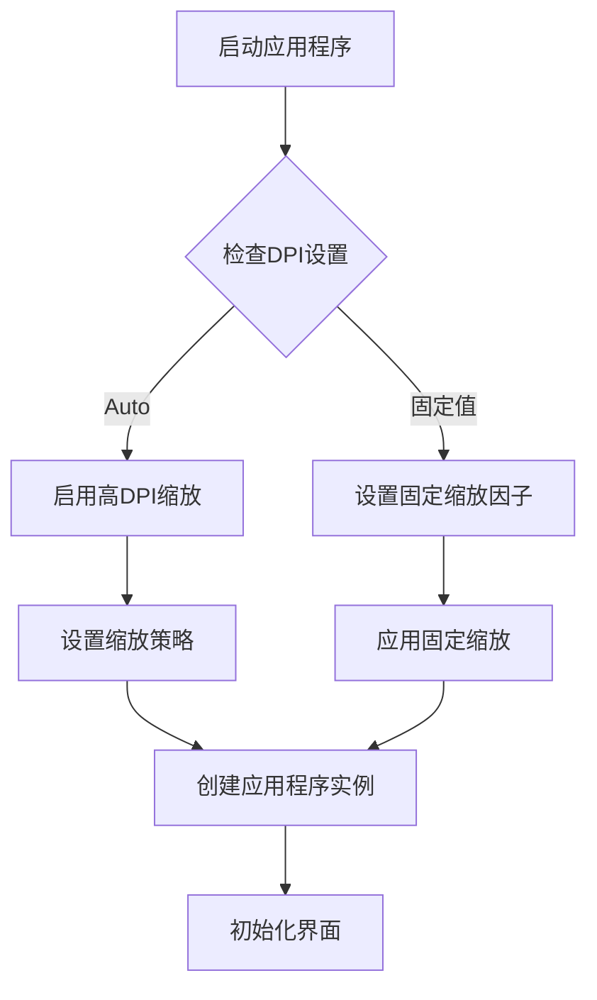
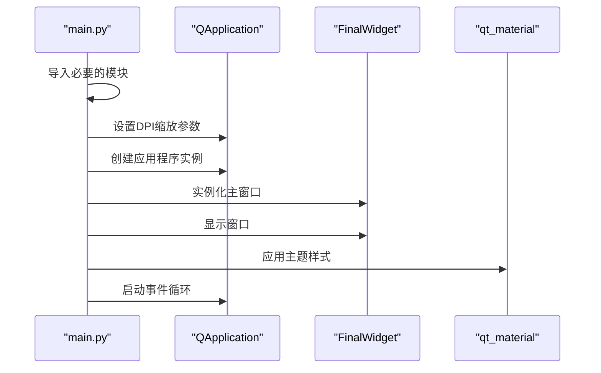
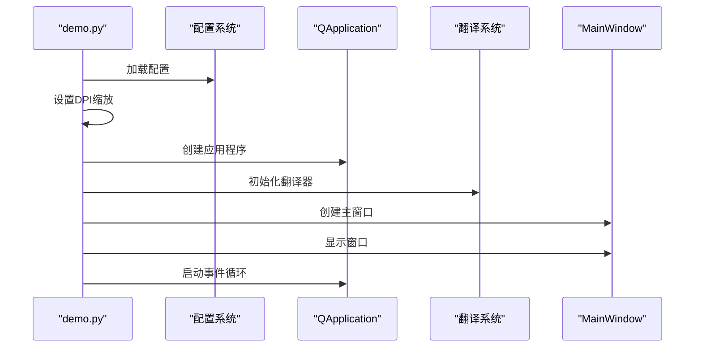

# 运行指南与依赖管理

<cite>
**本文档引用的文件**
- [main.py](file://gui/qtpy/version1/main.py)
- [requirements.txt](file://gui/qtpy/version1/requirements.txt)
- [demo.py](file://gui/qtpy/version2/demo.py)
- [requirements.txt](file://gui/qtpy/version2/requirements.txt)
- [main.py](file://gui/qtpy/version3/main.py)
- [main_window.py](file://gui/qtpy/version2/gallery/app/view/main_window.py)
- [config.py](file://gui/qtpy/version2/gallery/app/common/config.py)
- [FinalWidget.py](file://gui/qtpy/version1/customizeWindowPyfile/FinalWidget.py)
- [home_interface.py](file://gui/qtpy/version2/gallery/app/view/home_interface.py)
- [README.md](file://README.md)
</cite>

## 目录
1. [项目概述](#项目概述)
2. [环境准备](#环境准备)
3. [版本差异对比](#版本差异对比)
4. [依赖安装指南](#依赖安装指南)
5. [QtPy运行环境配置](#qtpy运行环境配置)
6. [程序入口执行流程](#程序入口执行流程)
7. [常见运行时错误及解决方案](#常见运行时错误及解决方案)
8. [启动步骤详解](#启动步骤详解)
9. [故障排除指南](#故障排除指南)
10. [最佳实践建议](#最佳实践建议)

## 项目概述

Python-Office是一个功能强大的Python自动化办公库，提供了多种GUI版本供用户选择。该项目采用QtPy框架构建，支持PyQt5和PySide2等多种Qt绑定，为用户提供丰富的桌面应用程序体验。

### 版本架构

项目目前提供三个主要的GUI版本：

- **version1**: 基础版GUI，使用PyQt5和qt-material主题
- **version2**: 增强版GUI，基于PyQt-Fluent-Widgets框架
- **version3**: 现代版GUI，集成最新配置管理系统

## 环境准备

### 系统要求

- **操作系统**: Windows 10/11, macOS 10.14+, Linux (Ubuntu 18.04+)
- **Python版本**: Python 3.7 或更高版本
- **内存要求**: 至少 2GB RAM
- **磁盘空间**: 至少 500MB 可用空间

### 开发环境配置

#### 1. Python环境设置

```bash
# 检查Python版本
python --version

# 推荐使用虚拟环境
python -m venv python-office-env
source python-office-env/bin/activate  # Linux/macOS
python-office-env\Scripts\activate.bat  # Windows
```

#### 2. 包管理器配置

```bash
# 使用阿里云镜像加速安装
pip install -i https://mirrors.aliyun.com/pypi/simple/
```

## 版本差异对比

### Version1 vs Version2 依赖差异

| 组件 | Version1 | Version2 |
|------|----------|----------|
| 核心Qt框架 | PyQt5 | PyQt5 + PyQt-Fluent-Widgets |
| 主题系统 | qt-material | 内置Fluent设计主题 |
| 国际化 | 基础支持 | 完整多语言支持 |
| 配置管理 | 简单配置 | 完整配置系统 |
| 界面复杂度 | 基础界面 | 复杂现代化界面 |

### 详细依赖对比表

| 依赖项 | Version1 | Version2 | 说明 |
|--------|----------|----------|------|
| python-office | ✓ | ✓ | 核心办公库 |
| PyQt5 | ✓ | ✓ | Qt框架核心 |
| qt-material | ✓ | ✗ | Version1专用主题 |
| PyQt-Fluent-Widgets | ✗ | ✓ | Version2专用UI库 |
| PySide2 | ✗ | ✗ | 可选替代方案 |
| PySide6 | ✗ | ✗ | 可选替代方案 |

**章节来源**
- [requirements.txt](file://gui/qtpy/version1/requirements.txt#L1-L2)
- [requirements.txt](file://gui/qtpy/version2/requirements.txt#L1-L2)

## 依赖安装指南

### Version1 依赖安装

```bash
# 安装基础依赖
pip install python-office PyQt5

# 如果需要主题支持
pip install qt-material
```

### Version2 依赖安装

```bash
# 安装增强版依赖
pip install PyQt5 PyQt-Fluent-Widgets[full]

# 或者使用requirements.txt
pip install -r gui/qtpy/version2/requirements.txt
```

### Version3 依赖安装

Version3使用与Version2相同的依赖，但具有更完善的配置系统。

### 依赖验证

```bash
# 验证安装
python -c "import PyQt5; print(PyQt5.__version__)"
python -c "import qfluentwidgets; print(qfluentwidgets.__version__)"

# 检查python-office
python -c "import office; print(office.__version__)"
```

## QtPy运行环境配置

### DPI缩放设置

Qt应用程序在高DPI显示器上需要特殊的缩放处理。三个版本都实现了自动DPI检测和缩放：



**图表来源**
- [main.py](file://gui/qtpy/version1/main.py#L9-L13)
- [main.py](file://gui/qtpy/version2/demo.py#L12-L20)

### Qt插件路径配置

```bash
# 检查Qt插件路径
python -c "from PyQt5.QtCore import QLibraryInfo; print(QLibraryInfo.location(QLibraryInfo.PluginsPath))"

# 设置环境变量（Windows）
set QT_PLUGIN_PATH=C:\path\to\qt\plugins

# 设置环境变量（Linux/macOS）
export QT_PLUGIN_PATH=/usr/local/qt/plugins
```

### 平台特定配置

#### Windows平台
- 确保Visual C++ Redistributable已安装
- 检查系统字体和显示设置
- 验证DirectX可用性

#### macOS平台
- 安装Xcode命令行工具
- 确保Qt框架正确安装
- 检查系统权限设置

#### Linux平台
```bash
# Ubuntu/Debian
sudo apt-get install qt5-default libqt5gui5

# CentOS/RHEL
sudo yum install qt5-qtbase-devel
```

## 程序入口执行流程

### Version1 执行流程



**图表来源**
- [main.py](file://gui/qtpy/version1/main.py#L8-L20)

### Version2 执行流程

Version2的执行流程更加复杂，包含了国际化、配置管理和主题系统：



**图表来源**
- [demo.py](file://gui/qtpy/version2/demo.py#L1-L46)

### 关键步骤详解

#### 1. DPI缩放设置
- **Version1**: 使用默认的高DPI策略
- **Version2/3**: 支持自动检测和固定缩放

#### 2. 应用实例化
- 创建QApplication实例
- 设置应用程序属性
- 配置高DPI相关参数

#### 3. 主窗口显示
- 实例化主界面组件
- 设置窗口标题和图标
- 显示主窗口并进入事件循环

**章节来源**
- [main.py](file://gui/qtpy/version1/main.py#L8-L20)
- [demo.py](file://gui/qtpy/version2/demo.py#L42-L46)

## 常见运行时错误及解决方案

### 错误类型分类

| 错误类型 | 常见症状 | 解决方案 |
|----------|----------|----------|
| 缺少依赖 | ImportError: No module named 'xxx' | 重新安装缺失的包 |
| Qt插件加载失败 | QML error: Cannot load library | 检查Qt插件路径 |
| DPI缩放问题 | 界面模糊或过小 | 调整DPI设置或缩放因子 |
| 主题加载失败 | 界面显示异常 | 检查主题文件完整性 |
| 国际化错误 | 界面文本显示乱码 | 验证翻译文件路径 |

### 具体错误解决方案

#### 1. 缺少Python-office依赖

```bash
# 错误示例
ImportError: No module named 'office'

# 解决方案
pip install python-office
```

#### 2. PyQt5导入失败

```bash
# 错误示例
ModuleNotFoundError: No module named 'PyQt5'

# 解决方案
pip install PyQt5
```

#### 3. Qt插件加载失败

```bash
# 错误示例
QML error: Cannot load library

# 解决方案
# 1. 检查Qt插件路径
python -c "from PyQt5.QtCore import QLibraryInfo; print(QLibraryInfo.location(QLibraryInfo.PluginsPath))"

# 2. 设置环境变量
export QT_PLUGIN_PATH=/path/to/qt/plugins
```

#### 4. DPI缩放问题

```python
# 错误代码
# 界面显示模糊或过小

# 解决方案
# 在main.py中添加以下代码
import os
os.environ["QT_ENABLE_HIGHDPI_SCALING"] = "0"
os.environ["QT_SCALE_FACTOR"] = "1.5"
```

#### 5. 主题加载失败

```bash
# 错误示例
RuntimeError: Failed to load theme

# 解决方案
# 1. 检查主题文件是否存在
# 2. 使用备用主题
apply_stylesheet(app, theme='light_blue.xml')
```

### 调试技巧

#### 1. 启用Qt调试输出

```bash
# Windows
set QT_LOGGING_RULES=qt.qpa.*=true

# Linux/macOS
export QT_LOGGING_RULES=qt.qpa.*=true
```

#### 2. 检查环境变量

```bash
# 检查Python路径
python -c "import sys; print('\n'.join(sys.path))"

# 检查Qt信息
python -c "from PyQt5.QtCore import QT_VERSION_STR; print(QT_VERSION_STR)"
```

## 启动步骤详解

### Step 1: 环境准备

```bash
# 1. 创建虚拟环境
python -m venv venv-python-office

# 2. 激活虚拟环境
# Windows
venv-python-office\Scripts\activate
# Linux/macOS
source venv-python-office/bin/activate

# 3. 更新pip
pip install --upgrade pip
```

### Step 2: 安装依赖

```bash
# 选择适合的版本
# Version1
pip install python-office PyQt5 qt-material

# Version2
pip install -r gui/qtpy/version2/requirements.txt

# Version3
pip install -r gui/qtpy/version3/requirements.txt
```

### Step 3: 验证安装

```bash
# 验证核心依赖
python -c "
import PyQt5.QtCore
import PyQt5.QtWidgets
import office
print('PyQt5 version:', PyQt5.QtCore.PYQT_VERSION_STR)
print('Python-office version:', office.__version__)
print('Installation successful!')
"
```

### Step 4: 启动应用程序

#### Version1 启动

```bash
cd gui/qtpy/version1
python main.py
```

#### Version2 启动

```bash
cd gui/qtpy/version2
python demo.py
```

#### Version3 启动

```bash
cd gui/qtpy/version3
python main.py
```

### Step 5: 验证运行状态

```bash
# 检查进程
ps aux | grep python  # Linux/macOS
tasklist | findstr python  # Windows

# 检查端口占用（如果有网络功能）
netstat -an | grep 8000  # Linux/macOS
netstat -an | findstr 8000  # Windows
```

## 故障排除指南

### 性能优化

#### 1. 内存使用优化
- 监控内存使用情况
- 及时释放不再使用的资源
- 使用弱引用避免循环引用

#### 2. 启动速度优化
- 延迟加载非关键组件
- 优化资源文件加载
- 减少不必要的初始化操作

### 兼容性问题

#### 1. Python版本兼容性
```python
# 检查Python版本
import sys
if sys.version_info < (3, 7):
    raise RuntimeError("Python 3.7+ required")
```

#### 2. Qt版本兼容性
```python
# 检查Qt版本
from PyQt5.QtCore import QT_VERSION_STR
print("Qt version:", QT_VERSION_STR)
```

### 日志记录

#### 1. 启用详细日志

```python
import logging
logging.basicConfig(level=logging.DEBUG)
logger = logging.getLogger(__name__)
```

#### 2. 错误日志收集

```python
import traceback
try:
    # 应用程序代码
    pass
except Exception as e:
    logger.error("Application error: %s", str(e))
    logger.error(traceback.format_exc())
```

## 最佳实践建议

### 开发环境配置

1. **使用虚拟环境**
   - 每个项目使用独立的虚拟环境
   - 记录依赖版本以便重现环境

2. **版本控制**
   - 将requirements.txt纳入版本控制
   - 使用pip freeze > requirements.txt生成依赖清单

3. **自动化测试**
   - 编写单元测试覆盖核心功能
   - 使用CI/CD进行自动化测试

### 生产环境部署

1. **打包分发**
   ```bash
   # 使用PyInstaller打包
   pip install pyinstaller
   pyinstaller --onefile --windowed main.py
   ```

2. **性能监控**
   - 监控CPU和内存使用率
   - 记录用户交互行为
   - 分析崩溃报告

3. **安全考虑**
   - 验证用户输入
   - 使用HTTPS传输敏感数据
   - 定期更新依赖包

### 用户体验优化

1. **响应式设计**
   - 支持不同屏幕尺寸
   - 适配高DPI显示器
   - 提供多种主题选择

2. **国际化支持**
   - 支持多语言界面
   - 使用标准的翻译文件格式
   - 提供本地化配置选项

3. **无障碍访问**
   - 支持键盘导航
   - 提供屏幕阅读器支持
   - 使用语义化的HTML标签

通过遵循这些最佳实践，可以确保Python-Office GUI应用程序的稳定性、可维护性和用户体验。