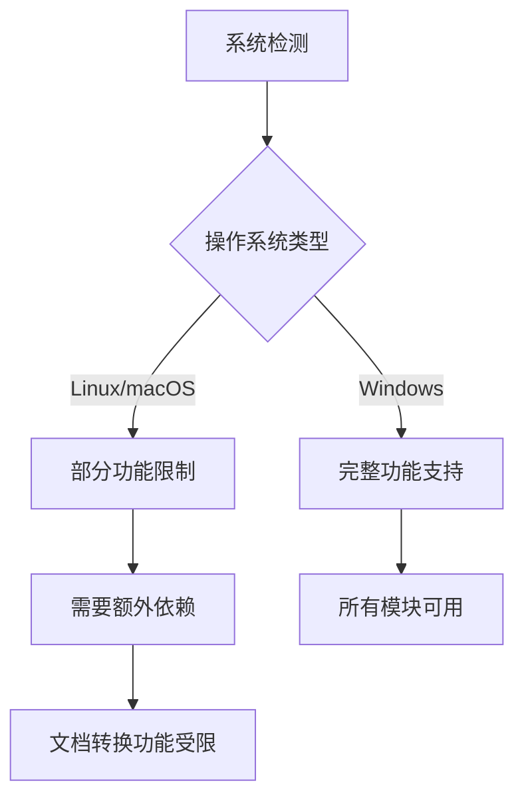
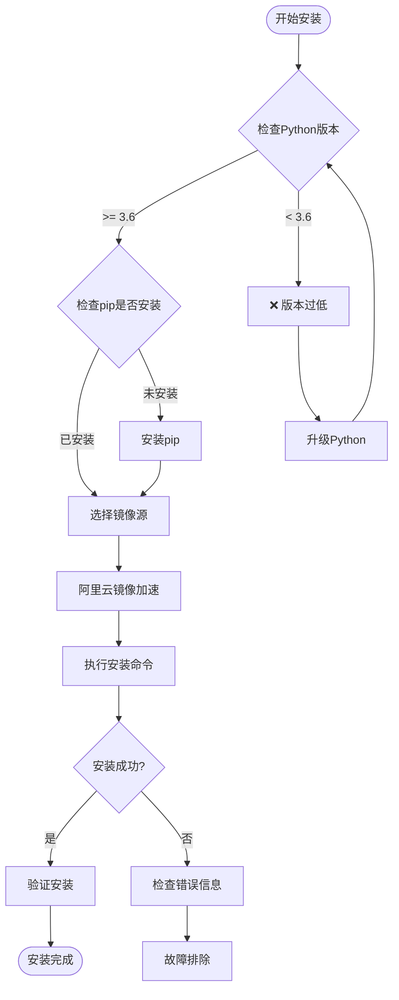
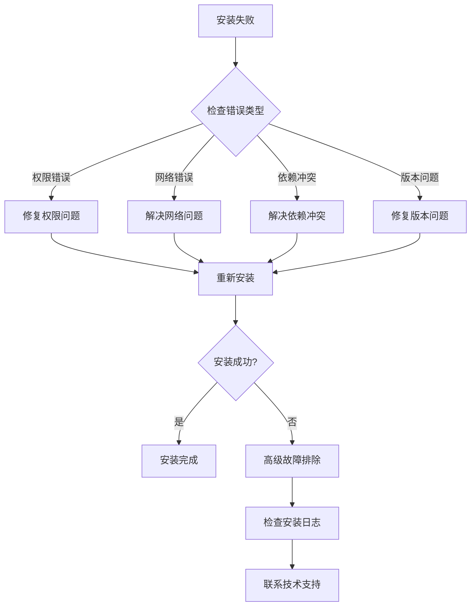
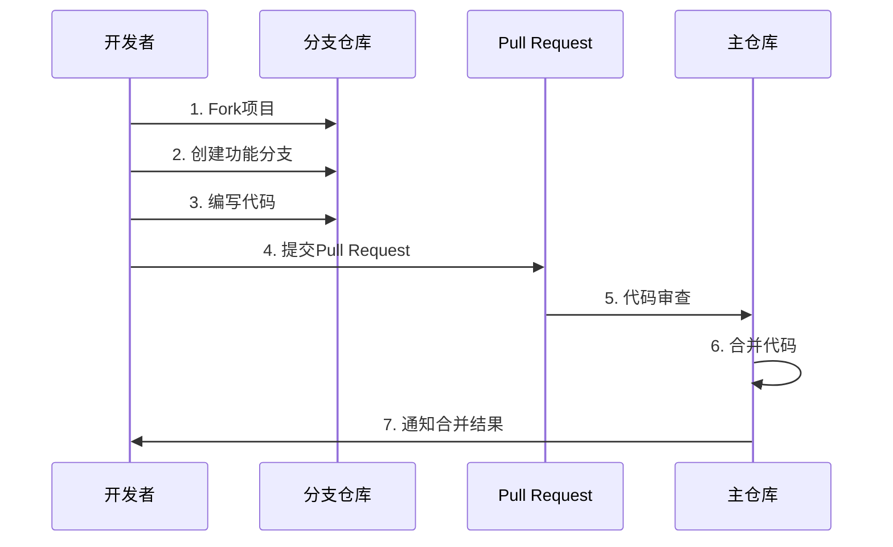
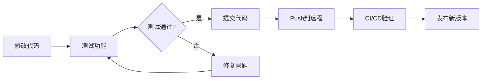

# 安装指南

<cite>
**本文档中引用的文件**
- [README.md](file://README.md)
- [setup.py](file://setup.py)
- [setup.cfg](file://setup.cfg)
- [settings.py](file://settings.py)
- [requirements.txt](file://contributors\old_from_gitee\bob-zhao\requirements.txt)
- [WordType.py](file://contributors\demo\WordType.py)
- [readme.md](file://examples\readme.md)
- [test_dev.py](file://tests\test_code\test_dev.py)
- [compatibility.py](file://office\compatibility.py)
</cite>

## 目录
1. [简介](#简介)
2. [系统要求](#系统要求)
3. [安装方法](#安装方法)
4. [环境准备](#环境准备)
5. [安装验证](#安装验证)
6. [常见问题与解决方案](#常见问题与解决方案)
7. [多平台托管说明](#多平台托管说明)
8. [源码安装](#源码安装)
9. [兼容性说明](#兼容性说明)
10. [故障排除指南](#故障排除指南)

## 简介

python-office是一个功能强大的Python自动化办公第三方库，提供了超过100种办公自动化功能。该库采用模块化设计，支持一键安装和开箱即用，无需复杂的配置过程。

### 核心特性
- **开箱即用**：每个功能只需一行代码
- **模块化架构**：可按需选择功能模块
- **跨平台支持**：支持Windows、Linux、macOS
- **丰富的功能**：涵盖Word、Excel、PDF、PPT、图片处理等多个办公场景

## 系统要求

### Python版本要求
- **最低版本**：Python 3.6及以上
- **推荐版本**：Python 3.8或更高版本
- **兼容性**：支持Python 3.6+的所有主流操作系统

### 系统要求
- **操作系统**：Windows 7+、Linux、macOS
- **内存**：至少512MB可用内存
- **磁盘空间**：约100MB可用空间（取决于安装的模块）

### 平台特定要求


**图表来源**
- [compatibility.py](file://office\compatibility.py#L232-L250)

## 安装方法

### 推荐安装命令

#### 使用阿里云镜像加速安装
```bash
pip install -i https://mirrors.aliyun.com/pypi/simple/ python-office -U
```

#### 参数详解
- `-i https://mirrors.aliyun.com/pypi/simple/`：指定阿里云PyPI镜像源，加速下载
- `python-office`：目标安装包名称
- `-U` 或 `--upgrade`：升级到最新版本

### 安装流程图



**图表来源**
- [setup.cfg](file://setup.cfg#L41-L45)

### 详细安装步骤

#### 步骤1：验证Python环境
```bash
python --version
# 或
python3 --version
```

#### 步骤2：安装pip（如未安装）
```bash
# Windows
python -m ensurepip --upgrade

# Linux/macOS
sudo apt-get install python3-pip  # Ubuntu/Debian
brew install python3              # macOS
```

#### 步骤3：执行安装命令
```bash
# 使用阿里云镜像
pip install -i https://mirrors.aliyun.com/pypi/simple/ python-office -U

# 或使用默认PyPI源
pip install python-office -U
```

## 环境准备

### Python环境配置

#### Windows环境
1. **下载Python**：从[Python官网](https://www.python.org/downloads/)下载适合的版本
2. **安装选项**：勾选"Add Python to PATH"选项
3. **验证安装**：
   ```cmd
   python --version
   pip --version
   ```

#### Linux环境
```bash
# Ubuntu/Debian
sudo apt update
sudo apt install python3 python3-pip python3-venv

# CentOS/RHEL
sudo yum install python3 python3-pip

# 验证
python3 --version
pip3 --version
```

#### macOS环境
```bash
# 使用Homebrew安装
brew install python3

# 或从官网下载安装
# 验证
python3 --version
pip3 --version
```

### 虚拟环境创建（推荐）

#### 创建虚拟环境
```bash
# 创建虚拟环境
python -m venv python-office-env

# 激活虚拟环境
# Windows
python-office-env\Scripts\activate

# Linux/macOS
source python-office-env/bin/activate
```

#### 安装python-office
```bash
pip install -i https://mirrors.aliyun.com/pypi/simple/ python-office -U
```

## 安装验证

### 验证安装成功

#### 方法1：Python交互式验证
```python
# 启动Python解释器
python

# 执行验证代码
>>> import office
>>> print(f"python-office版本: {office.__version__}")
>>> print("安装成功！")
```

#### 方法2：脚本验证
```python
# 创建验证脚本
cat > verify_installation.py << 'EOF'
import office

print(f"python-office版本: {office.__version__}")
print("功能模块列表:")
for module in dir(office):
    if not module.startswith('_'):
        print(f"- {module}")

print("\n安装验证成功！")
EOF

# 执行验证
python verify_installation.py
```

#### 方法3：功能测试
```python
# 测试基本功能
try:
    import office
    print(f"✓ python-office {office.__version__} 安装成功")
    print(f"✓ 总共包含 {len(dir(office))} 个功能模块")
    print("✓ 可以正常使用python-office库")
except ImportError as e:
    print(f"✗ 安装失败: {e}")
```

### 验证结果表格

| 验证项目 | 预期结果 | 说明 |
|---------|---------|------|
| Python版本 | 3.6+ | 确保满足最低要求 |
| pip可用性 | 成功安装 | 验证包管理工具 |
| 库导入 | 无错误 | 检查核心模块 |
| 版本信息 | 显示版本号 | 验证安装完整性 |
| 功能模块 | 显示模块列表 | 检查所有功能 |

**章节来源**
- [test_dev.py](file://tests\test_code\test_dev.py#L1-L3)

## 常见问题与解决方案

### 权限错误

#### 问题描述
```bash
ERROR: Could not install packages due to an EnvironmentError: [Errno 13] Permission denied
```

#### 解决方案
```bash
# 方法1：使用管理员权限
sudo pip install -i https://mirrors.aliyun.com/pypi/simple/ python-office -U

# 方法2：使用用户安装
pip install -i https://mirrors.aliyun.com/pypi/simple/ python-office -U --user

# 方法3：使用虚拟环境
python -m venv myenv
source myenv/bin/activate  # Linux/macOS
myenv\Scripts\activate     # Windows
pip install python-office -U
```

### 网络问题

#### 问题描述
安装过程中出现超时或连接失败

#### 解决方案
```bash
# 使用阿里云镜像
pip install -i https://mirrors.aliyun.com/pypi/simple/ python-office -U

# 设置代理
pip install -i https://mirrors.aliyun.com/pypi/simple/ python-office -U \
    --proxy http://proxy.example.com:8080

# 设置超时时间
pip install -i https://mirrors.aliyun.com/pypi/simple/ python-office -U \
    --timeout 60
```

### 依赖冲突

#### 问题描述
安装过程中出现依赖版本冲突

#### 解决方案
```bash
# 清理pip缓存
pip cache purge

# 强制重新安装
pip install -i https://mirrors.aliyun.com/pypi/simple/ python-office -U --force-reinstall

# 使用约束文件
pip install -r requirements.txt
```

### 版本兼容性问题

#### 问题描述
某些功能在特定Python版本下不可用

#### 解决方案
```bash
# 检查当前Python版本
python --version

# 升级到推荐版本
# Windows: 从Python官网下载新版本
# Linux: sudo apt install python3.8
# macOS: brew upgrade python3

# 降级到兼容版本
pip install python-office==1.0.5
```

### 故障排除流程图



## 多平台托管说明

### 项目托管平台

python-office项目在三个主要平台上进行托管，为用户提供多种访问和贡献方式：

#### GitHub（主仓库）
- **URL**: https://github.com/CoderWanFeng/python-office
- **特点**: 
  - 最新的代码版本
  - 完整的Issue跟踪
  - Pull Request功能
  - 社区活跃度最高

#### Gitee（国内镜像）
- **URL**: https://gitee.com/CoderWanFeng/python-office
- **特点**:
  - 国内访问速度快
  - 支持国内开发者
  - 提供中文界面

#### atomgit（企业级托管）
- **URL**: https://atomgit.com/CoderWanFeng1/python-office
- **特点**:
  - 企业级托管服务
  - 更好的稳定性
  - 商业支持

### 平台对比表

| 平台 | 访问速度 | 社区活跃度 | Issue支持 | PR支持 | 备注 |
|------|---------|-----------|-----------|--------|------|
| GitHub | 快 | 高 | ✓ | ✓ | 主要平台 |
| Gitee | 快 | 中 | ✓ | ✓ | 国内镜像 |
| atomgit | 快 | 中 | ✓ | ✓ | 企业级托管 |

### 贡献指南

#### 代码贡献流程


**图表来源**
- [README.md](file://README.md#L121-L126)

#### 贡献规范
- 在`contributors`文件夹中创建以GitHub用户名命名的文件夹
- 将所有代码提交到自己的文件夹中
- 不要修改其他文件夹中的代码
- 对他人代码有疑问时直接提Issue

**章节来源**
- [README.md](file://README.md#L121-L126)

## 源码安装

### 从GitHub克隆安装

#### 步骤1：克隆仓库
```bash
# 克隆主仓库
git clone https://github.com/CoderWanFeng/python-office.git
cd python-office

# 或克隆Gitee镜像
git clone https://gitee.com/CoderWanFeng/python-office.git
cd python-office
```

#### 步骤2：安装依赖
```bash
# 创建虚拟环境（推荐）
python -m venv venv
source venv/bin/activate  # Linux/macOS
venv\Scripts\activate     # Windows

# 安装开发依赖
pip install -r requirements.txt
pip install -e .
```

#### 步骤3：验证安装
```python
import office
print(f"源码安装版本: {office.__version__}")
```

### 从压缩包安装

#### 下载源码
```bash
# 下载最新Release
wget https://github.com/CoderWanFeng/python-office/archive/refs/tags/v1.0.6.zip
unzip v1.0.6.zip
cd python-office-1.0.6
```

#### 安装过程
```bash
# 使用setuptools安装
python setup.py install

# 或使用pip安装
pip install .
```

### 开发模式安装

#### 设置开发环境
```bash
# 克隆并进入项目目录
git clone https://github.com/CoderWanFeng/python-office.git
cd python-office

# 创建虚拟环境
python -m venv dev-env
source dev-env/bin/activate  # Linux/macOS
dev-env\Scripts\activate     # Windows

# 安装开发依赖
pip install -r requirements.txt

# 开发模式安装
pip install -e .
```

#### 开发工作流


## 兼容性说明

### 平台兼容性矩阵

#### Windows平台
- **完整支持**：所有功能模块
- **依赖项**：Windows特定的第三方库
- **性能**：最佳性能表现

#### Linux平台
- **支持程度**：核心功能完整
- **限制**：部分文档转换功能受限
- **依赖**：需要安装额外的系统依赖

#### macOS平台
- **支持程度**：核心功能完整
- **限制**：部分GUI功能可能受限
- **依赖**：需要安装Homebrew等包管理器

### 兼容性检测机制


**图表来源**
- [compatibility.py](file://office\compatibility.py#L232-L250)

### 兼容性警告系统

当在非Windows系统上首次导入python-office时，系统会自动显示兼容性警告：

```python
# 自动触发兼容性检查
import office

# 警告信息示例：
"""
⚠️ 兼容性警告
您正在非Windows系统上使用python-office库

主要功能：
✅ 基础办公功能
✅ 文档处理
✅ 数据操作

受限功能：
❌ Word文档转换
❌ PPT处理
❌ 部分GUI功能

建议：
1. 使用虚拟机运行Windows
2. 考虑使用在线转换服务
3. 查看官方文档了解详细兼容性
"""
```

**章节来源**
- [compatibility.py](file://office\compatibility.py#L232-L250)

## 故障排除指南

### 常见安装问题诊断表

| 问题症状 | 可能原因 | 解决方案 | 验证方法 |
|---------|---------|---------|---------|
| Permission denied | 权限不足 | 使用sudo或--user参数 | 检查文件权限 |
| Connection timeout | 网络问题 | 使用镜像源或代理 | ping pypi.org |
| Version conflict | 依赖冲突 | 清理缓存，强制重装 | pip list |
| Module not found | 安装不完整 | 重新安装，检查路径 | python -c "import sys; print(sys.path)" |

### 诊断工具

#### 系统信息收集
```bash
# 收集系统信息
python -c "
import platform
import sys
print('Python版本:', sys.version)
print('操作系统:', platform.platform())
print('架构:', platform.machine())
print('处理器:', platform.processor())
"
```

#### 依赖检查
```bash
# 检查已安装的python-office版本
pip show python-office

# 列出所有依赖
pip list | grep -i office
```

#### 日志分析
```bash
# 启用详细输出
pip install -i https://mirrors.aliyun.com/pypi/simple/ python-office -U -v

# 查看安装日志
pip debug --verbose
```

### 技术支持渠道

#### 官方支持
- **GitHub Issues**: https://github.com/CoderWanFeng/python-office/issues
- **Gitee Issues**: https://gitee.com/CoderWanFeng/python-office/issues
- **atomgit Issues**: https://atomgit.com/CoderWanFeng1/python-office/issues

#### 社区交流
- **微信交流群**: 官网提供二维码
- **B站视频教程**: 提供详细的安装和使用教程
- **官网文档**: https://www.python-office.com/

### 升级和卸载

#### 升级到最新版本
```bash
# 升级
pip install -i https://mirrors.aliyun.com/pypi/simple/ python-office -U

# 指定版本升级
pip install -i https://mirrors.aliyun.com/pypi/simple/ python-office==1.0.7
```

#### 卸载
```bash
# 卸载python-office
pip uninstall python-office

# 卸载所有相关包
pip freeze | grep -i office | xargs pip uninstall -y
```

**章节来源**
- [README.md](file://README.md#L131-L134)

## 结论

通过本指南，您应该能够成功在各种环境中安装和配置python-office库。建议：
1. 使用阿里云镜像加速安装
2. 在虚拟环境中安装以避免依赖冲突
3. 定期检查更新以获得最新功能
4. 遵循兼容性指南以确保功能正常

如遇到无法解决的问题，请参考官方文档或联系技术支持团队。