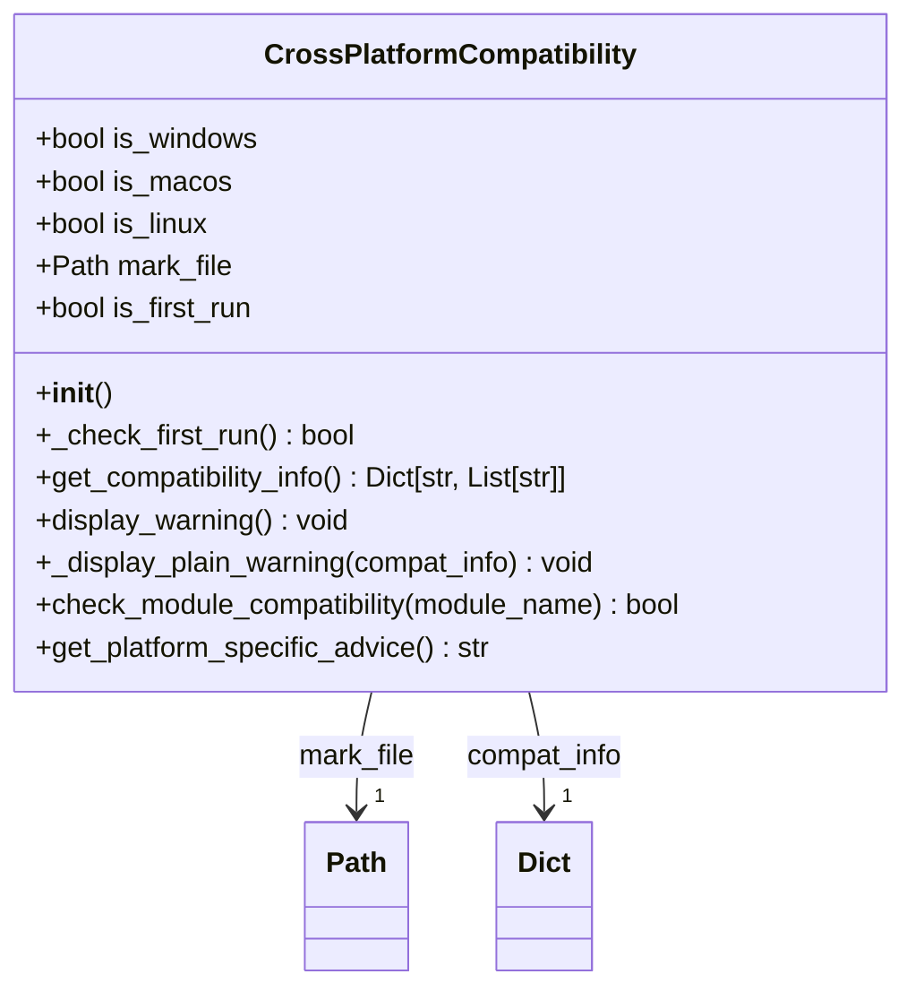
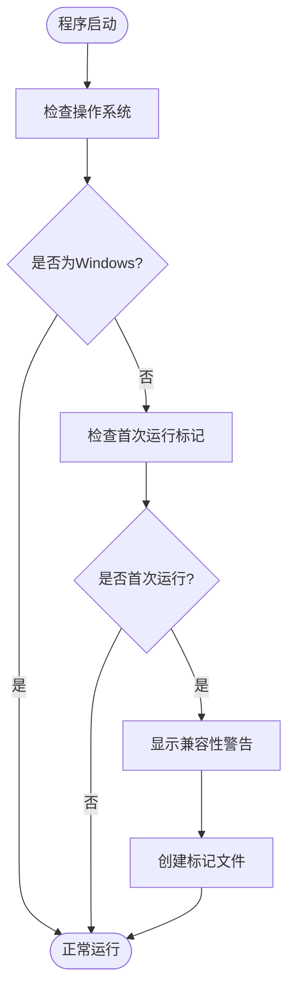

# 常见问题与故障排除

<cite>
**本文档引用的文件**   
- [README.md](file://README.md)
- [setup.py](file://setup.py)
- [office/compatibility.py](file://office/compatibility.py)
- [test_compatibility.py](file://test_compatibility.py)
- [tests/test_main.py](file://tests/test_main.py)
- [office/__init__.py](file://office/__init__.py)
- [office/lib/utils/except_utils.py](file://office/lib/utils/except_utils.py)
- [tests/test_code/test_wechat.py](file://tests/test_code/test_wechat.py)
- [tests/test_code/test_ocr.py](file://tests/test_code/test_ocr.py)
- [examples/PyOfficeRobot/009-批量加好友.py](file://examples/PyOfficeRobot/009-批量加好友.py)
- [examples/poocr/通用文字识别.py](file://examples/poocr/通用文字识别.py)
</cite>

## 目录
1. [简介](#简介)
2. [安装问题排查](#安装问题排查)
3. [功能调用错误](#功能调用错误)
4. [微信自动化问题](#微信自动化问题)
5. [OCR识别问题](#ocr识别问题)
6. [兼容性检查机制](#兼容性检查机制)
7. [测试验证与诊断](#测试验证与诊断)
8. [调试技巧与日志](#调试技巧与日志)
9. [总结](#总结)

## 简介

`python-office` 是一个旨在简化办公自动化的Python第三方库，提供了一行代码解决大部分办公自动化问题的能力。本故障排除指南旨在帮助用户解决在使用`python-office`过程中遇到的最常见问题，包括安装失败、功能调用报错、微信自动化登录问题、OCR识别失败等。通过分析代码库中的核心文件和测试用例，我们将提供详细的解决方案和调试技巧。

## 安装问题排查

安装`python-office`时可能遇到依赖缺失或网络错误等问题。推荐使用阿里云镜像源进行安装以避免网络问题：

```bash
pip install -i https://mirrors.aliyun.com/pypi/simple/ python-office -U
```

如果安装过程中出现依赖缺失错误，请确保您的Python环境满足最低要求。`python-office`集成了多个子库（如`PyOfficeRobot`、`poocr`、`popdf`等），因此安装包较大。如果只需要特定功能，可以单独安装对应的子库，例如：

```bash
pip install poexcel  # 仅安装Excel处理功能
pip install poocr    # 仅安装OCR识别功能
```

**Section sources**
- [README.md](file://README.md#L68-L74)
- [setup.py](file://setup.py#L1-L13)

## 功能调用错误

功能调用时常见的错误包括模块未找到和参数错误。当出现`ModuleNotFoundError`时，请检查是否正确安装了`python-office`库。如果使用的是子模块（如`PyOfficeRobot`），请确保已单独安装该模块。

对于参数错误，建议参考官方文档和示例代码。例如，在使用`PyOfficeRobot`发送消息时，正确的调用方式如下：

```python
import PyOfficeRobot
PyOfficeRobot.chat.send_message(who='微信好友昵称', message='你好')
```

如果出现参数错误，请检查参数名称和类型是否与文档一致。特别是路径参数，应使用原始字符串（raw string）或双反斜杠来避免转义问题。

**Section sources**
- [examples/PyOfficeRobot/001-发一条信息.py](file://examples/PyOfficeRobot/001-发一条信息.py#L46-L52)
- [examples/PyOfficeRobot/009-批量加好友.py](file://examples/PyOfficeRobot/009-批量加好友.py#L12)

## 微信自动化问题

微信自动化功能（`PyOfficeRobot`）依赖于桌面版微信客户端。如果无法正常工作，请确保已安装最新版本的微信桌面客户端，并且微信已登录。

在使用微信机器人功能时，可能会遇到控件改变导致的BUG。例如，`批量加好友`功能在代码注释中明确标记为“有BUG”。建议定期查看项目更新或加入交流群获取最新修复信息。

```python
# 注意：此功能可能有BUG
PyOfficeRobot.friend.add(msg="你好", num_notes={'微信号': '备注'})
```

如果微信自动化功能完全无法启动，请检查是否在非Windows系统上运行。根据`compatibility.py`文件，微信机器人功能仅支持Windows系统。

**Section sources**
- [examples/PyOfficeRobot/009-批量加好友.py](file://examples/PyOfficeRobot/009-批量加好友.py#L14)
- [office/compatibility.py](file://office/compatibility.py#L63)

## OCR识别问题

OCR识别功能（`poocr`）需要用户提供腾讯云的SecretId和SecretKey。如果识别失败，请首先检查API密钥是否正确配置。

```python
import poocr
result = poocr.ocr.GeneralBasicOCR(
    img_path=r'本地图片路径',
    id='你的SecretId', 
    key='你的SecretKey'
)
```

在测试环境中，API密钥通常通过环境变量传递：

```python
import os
id = os.getenv("SecretId")
key = os.getenv("SecretKey")
```

如果识别结果为空或报错，请检查图片路径是否正确，以及图片格式是否支持。此外，网络连接问题也可能导致API调用失败。

**Section sources**
- [examples/poocr/通用文字识别.py](file://examples/poocr/通用文字识别.py#L11-L15)
- [tests/test_code/test_ocr.py](file://tests/test_code/test_ocr.py#L27-L28)

## 兼容性检查机制

`python-office`通过`office/compatibility.py`文件实现跨平台兼容性检查。当用户在非Windows系统上首次运行时，会自动显示兼容性警告。



**Diagram sources**
- [office/compatibility.py](file://office/compatibility.py#L14-L250)

该机制通过创建标记文件（`.python-office/first_run_mark`）来记录首次运行状态，确保警告只显示一次。兼容性信息分为三类：完全支持的功能、仅Windows支持的功能和替代解决方案。



**Diagram sources**
- [office/compatibility.py](file://office/compatibility.py#L22-L38)
- [office/compatibility.py](file://office/compatibility.py#L74-L183)

**Section sources**
- [office/compatibility.py](file://office/compatibility.py#L1-L250)
- [test_compatibility.py](file://test_compatibility.py#L13-L94)

## 测试验证与诊断

`python-office`提供了完整的测试套件来验证安装完整性和功能正确性。用户可以通过运行测试来诊断问题。

```python
import pytest

if __name__ == '__main__':
    pytest.main(['./test_code', '--html=report.html'])
```

测试用例分布在`tests/test_code/`目录下，每个模块都有对应的测试文件，如`test_wechat.py`、`test_ocr.py`等。运行测试可以帮助确认特定功能是否正常工作。

```python
class TestWechat(unittest.TestCase):
    def test_send_file(self):
        send_file(who='文件传输助手', file=r'../test_files/images/0816.jpg')

    def test_receive_message(self):
        receive_message(who='程序员晚枫')
```

如果某个测试失败，可以根据错误信息定位问题。例如，`test_ocr.py`中的测试用例会检查环境变量中的API密钥是否设置。

**Section sources**
- [tests/test_main.py](file://tests/test_main.py#L16-L25)
- [tests/test_code/test_wechat.py](file://tests/test_code/test_wechat.py#L11-L21)
- [tests/test_code/test_ocr.py](file://tests/test_code/test_ocr.py#L21-L35)

## 调试技巧与日志

当遇到问题时，启用详细日志可以帮助诊断。`python-office`使用`loguru`库进行日志记录，用户可以在代码中添加日志输出。

```python
from loguru import logger

logger.info("开始执行OCR识别")
```

此外，检查文件路径和权限也是重要的调试步骤。确保程序有读写目标文件的权限，并使用绝对路径避免路径解析错误。

对于异常处理，`python-office`提供了统一的异常输出装饰器：

```python
def except_dec(msg='异常原因'):
    def except_execute(func):
        @wraps(func)
        def execept_print(*args, **kwargs):
            try:
                return func(*args, **kwargs)
            except Exception as e:
                print('=' * 30)
                print('糟糕，你的程序出现了异常')
                print(f'>>>异常时间：\t{datetime.now()}\n>>>异常函数：\t{func.__name__}\n>>>{msg}：\t{e}')
                print('别慌，你的异常也许【群友也遇到过】 → https://www.python4office.cn/wechat-group/')
        return execept_print
    return except_execute
```

**Section sources**
- [office/lib/utils/except_utils.py](file://office/lib/utils/except_utils.py#L10-L35)
- [tests/test_code/test_ocr.py](file://tests/test_code/test_ocr.py#L16)

## 总结

本指南涵盖了`python-office`使用过程中最常见的问题及其解决方案。从安装问题到功能调用错误，再到特定模块（如微信自动化和OCR）的问题，我们都提供了详细的排查步骤。通过理解兼容性检查机制和利用测试套件，用户可以更有效地诊断和解决问题。建议用户在遇到困难时，首先查阅官方文档，运行测试用例，并加入交流群获取社区支持。

**Section sources**
- [README.md](file://README.md#L132-L134)
- [README.md](file://README.md#L51)