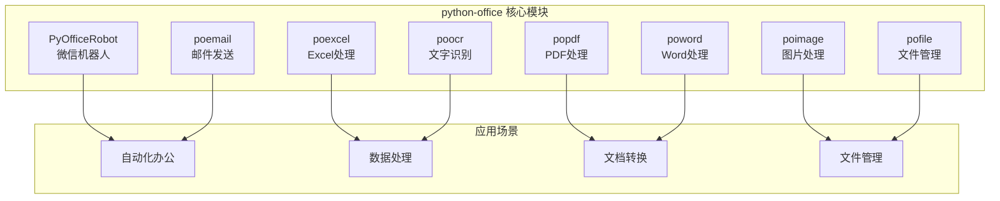
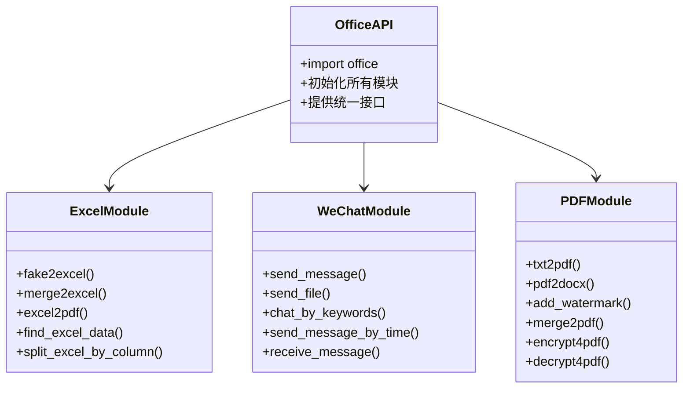
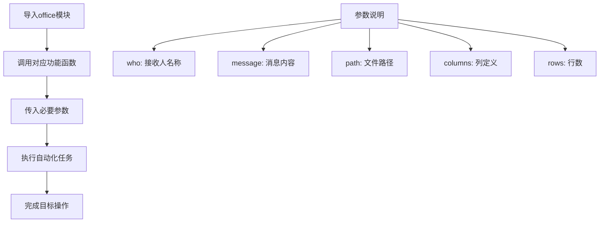
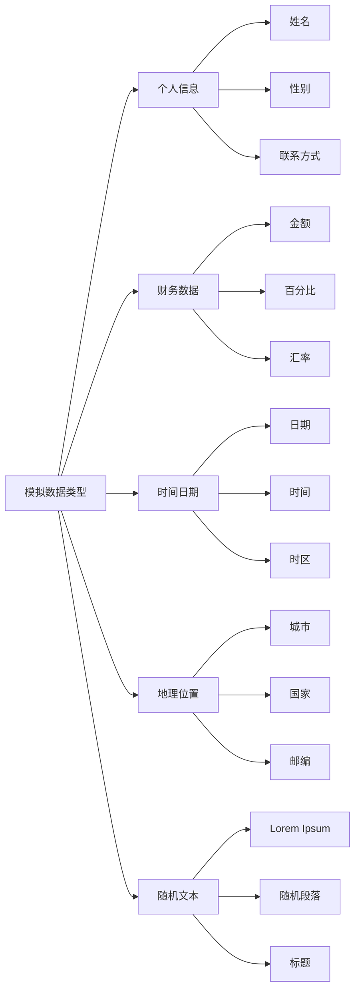
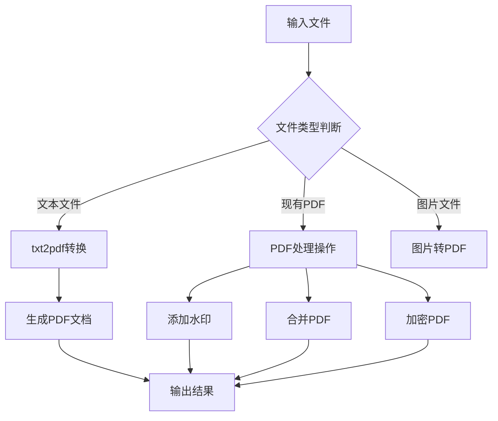

# 快速开始

<cite>
**本文档引用的文件**
- [README.md](file://README.md)
- [examples/readme.md](file://examples/readme.md)
- [examples/PyOfficeRobot/001-发一条信息.py](file://examples/PyOfficeRobot/001-发一条信息.py)
- [examples/poexcel/创建Excel文件.py](file://examples/poexcel/创建Excel文件.py)
- [examples/popdf/TXT转PDF.py](file://examples/popdf/TXT转PDF.py)
- [office/api/__init__.py](file://office/api/__init__.py)
- [office/api/excel.py](file://office/api/excel.py)
- [office/api/wechat.py](file://office/api/wechat.py)
- [office/api/pdf.py](file://office/api/pdf.py)
- [setup.py](file://setup.py)
</cite>

## 目录
1. [项目简介](#项目简介)
2. [安装指南](#安装指南)
3. [核心功能概览](#核心功能概览)
4. [第一个自动化任务](#第一个自动化任务)
5. [详细示例教程](#详细示例教程)
6. [常见问题解答](#常见问题解答)
7. [下一步学习](#下一步学习)

## 项目简介

python-office是一个功能强大的Python自动化办公第三方库，专为解决大部分自动化办公问题而设计。它的最大特点是**每个功能只需一行代码**，无需学习Python基础知识，真正做到开箱即用。

### 主要特性

- **极简编程**：学习成本极低，工作效率显著提升
- **贴合职场需求**：专注于解决实际办公场景中的痛点
- **一键环境搭建**：自动配置所有Python + 自动化办公的编程环境
- **功能丰富**：涵盖Word、Excel、PDF、PPT、图片、文件管理等多个领域

### 支持的功能模块



**图表来源**
- [office/api/__init__.py](file://office/api/__init__.py#L1-L2)
- [README.md](file://README.md#L88-L110)

**章节来源**
- [README.md](file://README.md#L47-L65)
- [examples/readme.md](file://examples/readme.md#L30-L338)

## 安装指南

### 系统要求

- Python 3.6 或更高版本
- Windows、macOS 或 Linux 操作系统
- 稳定的网络连接（用于下载依赖）

### 安装步骤

#### 1. 使用pip安装（推荐）

```bash
pip install -i https://mirrors.aliyun.com/pypi/simple/ python-office -U
```

#### 2. 验证安装

安装完成后，可以通过以下命令验证是否安装成功：

```python
import office
print("python-office 安装成功！")
```

#### 3. 更新到最新版本

如果需要更新到最新版本：

```bash
pip install -i https://mirrors.aliyun.com/pypi/simple/ python-office --upgrade
```

### 常见安装问题

#### 问题1：网络连接问题
如果安装速度慢或失败，可以尝试使用国内镜像源：

```bash
pip install -i https://pypi.tuna.tsinghua.edu.cn/simple python-office -U
```

#### 问题2：权限问题
如果遇到权限错误，可以尝试添加管理员权限：

```bash
pip install -i https://mirrors.aliyun.com/pypi/simple/ python-office -U --user
```

#### 问题3：依赖冲突
如果出现依赖冲突，可以尝试清理缓存后重新安装：

```bash
pip cache purge
pip install -i https://mirrors.aliyun.com/pypi/simple/ python-office -U
```

**章节来源**
- [README.md](file://README.md#L68-L76)
- [setup.py](file://setup.py#L1-L14)

## 核心功能概览

python-office采用模块化设计，每个功能模块都有明确的职责分工：

### API架构设计



**图表来源**
- [office/api/excel.py](file://office/api/excel.py#L1-L137)
- [office/api/wechat.py](file://office/api/wechat.py#L1-L95)
- [office/api/pdf.py](file://office/api/pdf.py#L1-L200)

### 功能分类表

| 模块 | 功能 | 示例代码 | 应用场景 |
|------|------|----------|----------|
| **Excel处理** | 创建Excel文件 | `office.excel.fake2excel()` | 自动生成报表数据 |
| | 合并Excel文件 | `office.excel.merge2excel()` | 整理分散的数据 |
| | Excel转PDF | `office.excel.excel2pdf()` | 导出正式文档 |
| **微信机器人** | 发送消息 | `office.wechat.send_message()` | 自动化通知 |
| | 发送文件 | `office.wechat.send_file()` | 自动化传输 |
| | 关键词回复 | `office.wechat.chat_by_keywords()` | 智能客服 |
| **PDF处理** | 文本转PDF | `office.pdf.txt2pdf()` | 文档归档 |
| | PDF加水印 | `office.pdf.add_watermark()` | 版权保护 |
| | 合并PDF | `office.pdf.merge2pdf()` | 整理文档 |

**章节来源**
- [office/api/excel.py](file://office/api/excel.py#L22-L40)
- [office/api/wechat.py](file://office/api/wechat.py#L6-L16)
- [office/api/pdf.py](file://office/api/pdf.py#L28-L72)

## 第一个自动化任务

让我们从最简单的任务开始，创建您的第一个自动化脚本。

### 步骤1：准备开发环境

1. 打开您喜欢的Python IDE（推荐使用VS Code、PyCharm）
2. 创建一个新的Python文件，命名为`first_task.py`
3. 确保已正确安装python-office库

### 步骤2：选择您的第一个任务

我们为您精选了三个最具代表性的简单用例：

#### 用例1：发送微信消息（PyOfficeRobot）

```python
import office

# 发送一条简单的问候消息
office.wechat.send_message(
    who='文件传输助手',  # 接收人名称
    message='你好，这是python-office的第一个自动化消息！'  # 消息内容
)
```

#### 用例2：创建Excel文件（poexcel）

```python
import office

# 一行代码创建包含模拟数据的Excel文件
office.excel.fake2excel(
    columns=['姓名', '年龄', '城市'],  # 列名
    rows=5,  # 生成5行数据
    path='./my_report.xlsx'  # 输出文件路径
)
```

#### 用例3：转换PDF（popdf）

```python
import office

# 将文本文件转换为PDF
office.pdf.txt2pdf(
    path='./input.txt',  # 输入文本文件
    res_pdf='output_document',  # 输出PDF文件名
    output_path='./'  # 输出目录
)
```

### 步骤3：运行您的第一个脚本

1. 保存文件为`first_task.py`
2. 在终端中运行：
   ```bash
   python first_task.py
   ```
3. 观察执行结果：
   - 微信消息：检查微信是否收到消息
   - Excel文件：检查当前目录是否生成了Excel文件
   - PDF转换：检查是否生成了PDF文件

### 代码解析

每个示例都遵循"一行代码"的使用范式：



**图表来源**
- [examples/PyOfficeRobot/001-发一条信息.py](file://examples/PyOfficeRobot/001-发一条信息.py#L47-L52)
- [examples/poexcel/创建Excel文件.py](file://examples/poexcel/创建Excel文件.py#L17-L19)
- [examples/popdf/TXT转PDF.py](file://examples/popdf/TXT转PDF.py#L6-L7)

**章节来源**
- [examples/PyOfficeRobot/001-发一条信息.py](file://examples/PyOfficeRobot/001-发一条信息.py#L1-L52)
- [examples/poexcel/创建Excel文件.py](file://examples/poexcel/创建Excel文件.py#L1-L19)
- [examples/popdf/TXT转PDF.py](file://examples/popdf/TXT转PDF.py#L1-L7)

## 详细示例教程

### 示例1：微信消息自动化

#### 功能描述
使用PyOfficeRobot模块发送微信消息，支持文本、表情符号和文件传输。

#### 完整代码示例

```python
import office

# 基础消息发送
office.wechat.send_message(
    who='文件传输助手',
    message='🎉 恭喜您，这是python-office的微信自动化消息！'
)

# 发送带表情的消息
office.wechat.send_message(
    who='文件传输助手',
    message='🌟 今日份的提醒：记得喝水哦！💧'
)
```

#### 参数详解

| 参数 | 类型 | 必需 | 描述 | 示例值 |
|------|------|------|------|--------|
| `who` | str | 是 | 接收人名称（支持备注名） | `'文件传输助手'` |
| `message` | str | 是 | 要发送的消息内容 | `'Hello World!'` |

#### 注意事项
1. 确保微信客户端已登录并保持活跃状态
2. 接收人名称必须与微信中的显示名称完全一致
3. 可以发送包含表情符号的Unicode字符串

### 示例2：Excel数据生成

#### 功能描述
使用poexcel模块快速生成包含模拟数据的Excel文件，支持多种数据类型的自动生成。

#### 完整代码示例

```python
import office

# 生成基础数据表
office.excel.fake2excel(
    columns=['员工编号', '姓名', '部门', '入职日期', '薪资'],
    rows=10,
    path='./employee_data.xlsx',
    language='zh_CN'
)

# 生成英文数据表
office.excel.fake2excel(
    columns=['ID', 'Name', 'Department', 'JoinDate', 'Salary'],
    rows=5,
    path='./employee_data_en.xlsx',
    language='en_US'
)
```

#### 支持的数据类型



**图表来源**
- [office/api/excel.py](file://office/api/excel.py#L25-L40)

### 示例3：PDF文档转换

#### 功能描述
使用popdf模块将各种格式的文档转换为PDF格式，支持文本、图片等多种输入源。

#### 完整代码示例

```python
import office

# 文本文件转PDF
office.pdf.txt2pdf(
    path='./documents/input.txt',
    res_pdf='converted_document',
    output_path='./output/'
)

# 多个PDF合并
office.pdf.merge2pdf(
    input_file_list=[
        './pdfs/document1.pdf',
        './pdfs/document2.pdf',
        './pdfs/document3.pdf'
    ],
    output_file='./output/merged_document.pdf'
)

# 为PDF添加水印
office.pdf.add_watermark(
    pdf_file='./original.pdf',
    mark_str='机密文件 - 内部使用',
    output_path='./output/',
    output_file_name='watermarked.pdf'
)
```

#### 转换流程图



**图表来源**
- [office/api/pdf.py](file://office/api/pdf.py#L59-L72)
- [office/api/pdf.py](file://office/api/pdf.py#L155-L167)
- [office/api/pdf.py](file://office/api/pdf.py#L133-L152)

**章节来源**
- [office/api/wechat.py](file://office/api/wechat.py#L6-L16)
- [office/api/excel.py](file://office/api/excel.py#L25-L40)
- [office/api/pdf.py](file://office/api/pdf.py#L59-L72)

## 常见问题解答

### Q1：如何找到examples文件夹？

**解决方案：**
1. **在线访问**：直接访问项目官网查看示例：[https://www.python-office.com/](https://www.python-office.com/)
2. **本地查找**：在项目根目录下寻找`examples`文件夹
3. **代码中引用**：通过官方文档获取示例代码的准确路径

### Q2：修改示例参数时需要注意什么？

**重要提示：**
1. **路径格式**：使用正斜杠`/`或双反斜杠`\\`表示文件路径
2. **文件名规范**：避免使用特殊字符和空格
3. **权限检查**：确保程序有权限访问指定的文件和目录
4. **编码问题**：中文路径需要正确的编码处理

### Q3：为什么微信机器人无法正常工作？

**排查步骤：**
1. **微信状态**：确保微信客户端已登录并保持活跃
2. **参数正确性**：检查`who`参数是否与微信中的显示名称完全匹配
3. **网络连接**：确保计算机有稳定的网络连接
4. **防火墙设置**：检查是否有防火墙阻止相关操作

### Q4：Excel生成失败怎么办？

**常见原因及解决方案：**

| 问题 | 原因 | 解决方案 |
|------|------|----------|
| 文件路径不存在 | 目标目录不存在 | 创建目标目录或使用相对路径 |
| 权限不足 | 缺少写入权限 | 以管理员身份运行或更改权限 |
| 数据类型错误 | 参数类型不匹配 | 检查参数类型是否符合要求 |
| 内存不足 | 数据量过大 | 减少rows参数或分批处理 |

### Q5：PDF转换质量不佳？

**优化建议：**
1. **源文件质量**：确保输入文件分辨率足够高
2. **字体嵌入**：对于文本文件，确保字体已正确嵌入
3. **页面设置**：调整PDF的页面尺寸和边距
4. **压缩级别**：适当调整压缩参数平衡质量和文件大小

### Q6：如何调试自动化脚本？

**调试技巧：**
1. **添加日志**：在关键步骤添加print语句
2. **异常捕获**：使用try-except结构捕获错误
3. **逐步测试**：将复杂任务分解为简单步骤
4. **参数验证**：检查所有输入参数的有效性

```python
import office

try:
    # 调试信息
    print("开始执行Excel生成任务...")
    
    # 执行任务
    office.excel.fake2excel(
        columns=['测试列'],
        rows=1,
        path='./test.xlsx'
    )
    
    print("任务执行成功！")
    
except Exception as e:
    print(f"发生错误：{e}")
    print("请检查参数和文件权限")
```

**章节来源**
- [examples/readme.md](file://examples/readme.md#L30-L338)
- [README.md](file://README.md#L128-L135)

## 下一步学习

恭喜您完成了python-office的快速入门！现在您已经掌握了基本的使用方法，可以继续深入学习更高级的功能：

### 进阶学习路径

#### 1. 深入掌握核心模块
- **Excel高级功能**：学习数据透视表、公式计算、条件格式
- **PDF专业处理**：掌握加密解密、批量处理、OCR识别
- **微信机器人**：实现群聊管理、自动回复、定时任务

#### 2. 实战项目应用
- **自动化报表生成**：结合Excel和PDF模块创建动态报表
- **文档管理系统**：使用文件管理模块构建个人文档库
- **数据迁移工具**：利用多模块协作实现数据格式转换

#### 3. 开发最佳实践
- **错误处理**：学习完善的异常处理机制
- **性能优化**：掌握大数据量处理的技巧
- **代码组织**：建立清晰的项目结构和模块化设计

### 学习资源推荐

| 资源类型 | 内容 | 链接 |
|----------|------|------|
| **官方文档** | 完整API参考手册 | [https://www.python-office.com/](https://www.python-office.com/) |
| **视频教程** | 功能演示视频集合 | [https://www.python-office.com/video/video.html](https://www.python-office.com/video/video.html) |
| **社区交流** | 开发者交流群 | [https://www.python4office.cn/wechat-group/](https://www.python4office.cn/wechat-group/) |
| **示例仓库** | 更多功能示例 | [https://github.com/CoderWanFeng/python-office/tree/master/examples](https://github.com/CoderWanFeng/python-office/tree/master/examples) |

### 社区贡献

python-office是一个开源项目，欢迎您的参与：
- **功能贡献**：提交新的自动化功能
- **文档改进**：完善使用文档和示例
- **Bug反馈**：报告使用过程中遇到的问题
- **代码优化**：提升代码质量和性能

### 最佳实践总结

1. **从简单开始**：先掌握基本功能，再探索高级特性
2. **注重实践**：通过实际项目加深理解
3. **善用社区**：积极参与讨论和分享经验
4. **持续学习**：关注项目更新和新功能发布

现在，您已经具备了使用python-office进行自动化办公的基础能力。记住，最好的学习方式就是动手实践。尝试将这些功能应用到您的日常工作场景中，让自动化真正提升您的工作效率！

**章节来源**
- [examples/readme.md](file://examples/readme.md#L194-L338)
- [README.md](file://README.md#L116-L150)