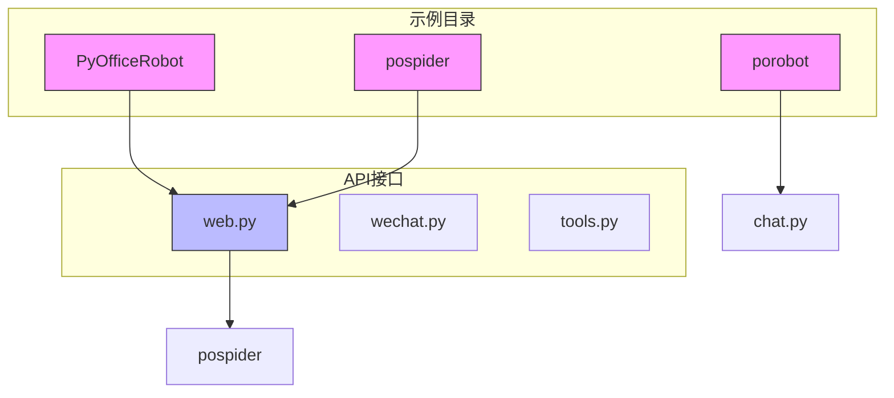
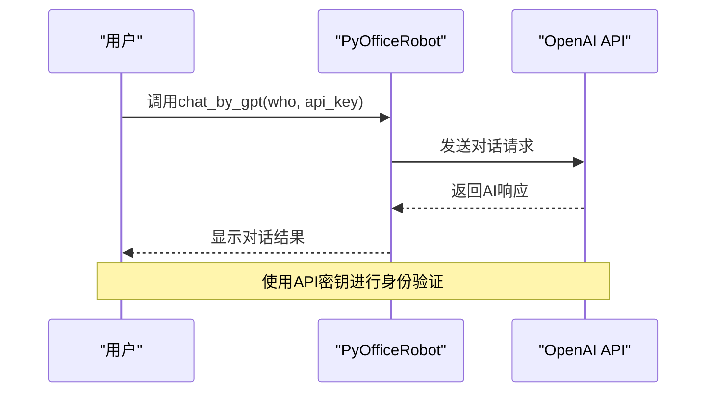
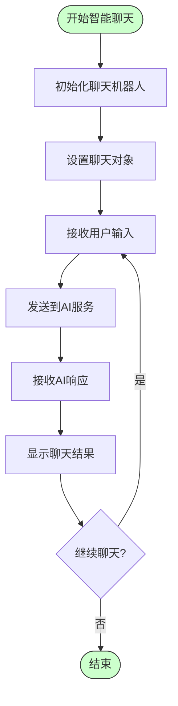
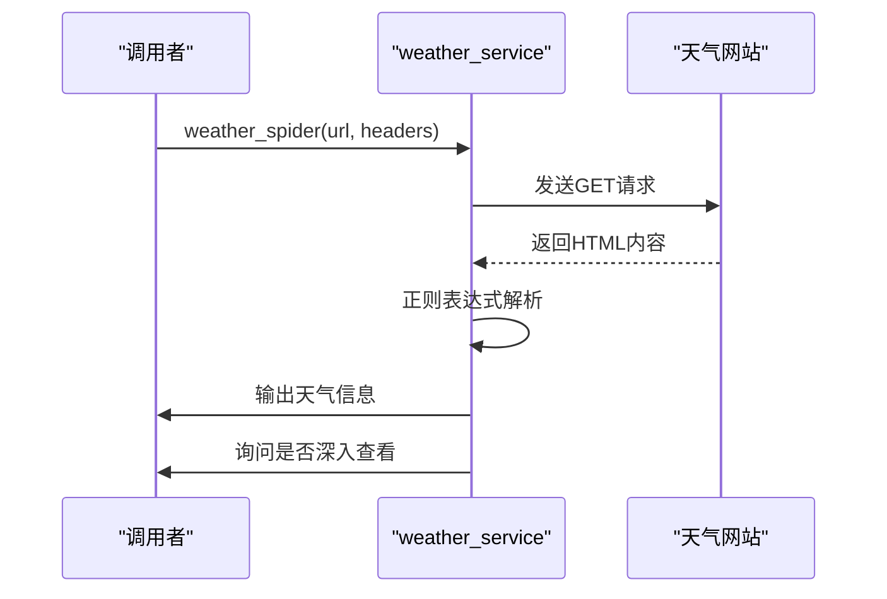
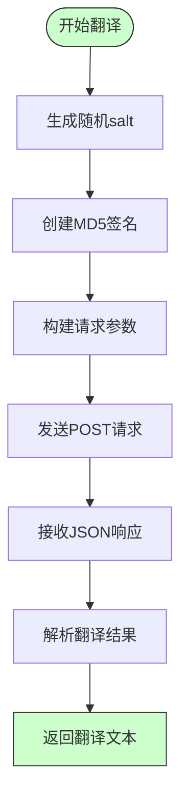

# AI集成

<cite>
**本文档引用的文件**   
- [网页转电子书.py](file://examples/pospider/网页转电子书.py)
- [web.py](file://office/api/web.py)
- [011-chat_chatgpt.py](file://examples/PyOfficeRobot/011-chat_chatgpt.py)
- [012、智能聊天.py](file://examples/PyOfficeRobot/012、智能聊天.py)
- [chat.py](file://examples/porobot/chat.py)
- [weather_service.py](file://office/lib/tools/weather_service.py)
- [Baidu_Text_transAPI.py](file://contributors/CatchDr/Baidu_Text_transAPI.py)
</cite>

## 目录
1. [项目结构](#项目结构)
2. [AI聊天功能集成](#ai聊天功能集成)
3. [网页转电子书功能](#网页转电子书功能)
4. [第三方API集成服务](#第三方api集成服务)
5. [API密钥管理与最佳实践](#api密钥管理与最佳实践)

## 项目结构

python-office项目的目录结构展示了其模块化设计，将AI集成相关功能分布在不同的模块中。核心AI功能主要分布在`examples/PyOfficeRobot`、`examples/pospider`和`office/api`等目录中。



**图示来源**
- [网页转电子书.py](file://examples/pospider/网页转电子书.py)
- [web.py](file://office/api/web.py)
- [011-chat_chatgpt.py](file://examples/PyOfficeRobot/011-chat_chatgpt.py)

**本节来源**
- [网页转电子书.py](file://examples/pospider/网页转电子书.py)
- [web.py](file://office/api/web.py)

## AI聊天功能集成

python-office通过PyOfficeRobot和porobot模块提供了与AI大模型的集成能力，支持与ChatGPT等语言模型的交互。

### ChatGPT对话集成

通过`PyOfficeRobot.chat.chat_by_gpt`函数，开发者可以轻松集成ChatGPT功能。该函数封装了与OpenAI API的交互逻辑，只需提供API密钥即可实现智能对话功能。



**图示来源**
- [011-chat_chatgpt.py](file://examples/PyOfficeRobot/011-chat_chatgpt.py)

**本节来源**
- [011-chat_chatgpt.py](file://examples/PyOfficeRobot/011-chat_chatgpt.py)

### 智能聊天机器人

除了专门的ChatGPT集成，python-office还提供了通用的智能聊天功能，通过简单的API调用即可实现自动化对话。



**图示来源**
- [012、智能聊天.py](file://examples/PyOfficeRobot/012、智能聊天.py)
- [chat.py](file://examples/porobot/chat.py)

**本节来源**
- [012、智能聊天.py](file://examples/PyOfficeRobot/012、智能聊天.py)
- [chat.py](file://examples/porobot/chat.py)

## 网页转电子书功能

python-office提供了强大的网页内容抓取与重构功能，能够将网页内容转换为电子书格式。

### 功能实现原理

`web.py`中的`url2ebook`函数作为接口层，调用`pospider`模块实现网页抓取和内容转换。这种设计实现了功能解耦，使核心API保持简洁。

```mermaid
classDiagram
class web {
+url2ebook(url, tile)
}
class pospider {
+url2ebook(url, tile)
}
web --> pospider : "委托"
note right of web
封装pospider功能
提供简洁API接口
end note
note left of pospider
实现网页抓取
内容提取和格式转换
end note
```

**图示来源**
- [web.py](file://office/api/web.py)
- [网页转电子书.py](file://examples/pospider/网页转电子书.py)

### 使用示例

网页转电子书功能的使用非常简单，只需几行代码即可完成转换：

```python
import office

# 转换网页为电子书
office.web.url2ebook(
    url="https://www.python-office.com",
    tile="Python-Office自动化办公指南"
)
```

该功能特点包括：
- 支持多种网页格式转换
- 自动提取网页主要内容
- 生成标准电子书格式
- 适用于技术文档归档、学习资料整理等场景

**本节来源**
- [web.py](file://office/api/web.py)
- [网页转电子书.py](file://examples/pospider/网页转电子书.py)

## 第三方API集成服务

python-office集成了多种第三方API服务，提供增值功能。

### 天气服务集成

`weather_service.py`实现了天气信息爬取功能，通过HTTP请求获取天气数据并解析HTML内容。



**本节来源**
- [weather_service.py](file://office/lib/tools/weather_service.py)

### 百度翻译API集成

通过`Baidu_Text_transAPI.py`，python-office集成了百度翻译API，支持多语言文本翻译。



该集成实现了：
- API身份验证（appid + sign）
- 请求参数加密
- 响应结果解析
- 错误处理机制

**本节来源**
- [Baidu_Text_transAPI.py](file://contributors/CatchDr/Baidu_Text_transAPI.py)

## API密钥管理与最佳实践

python-office在集成外部AI服务时遵循了安全和效率的最佳实践。

### API密钥管理

对于需要API密钥的服务（如ChatGPT、百度翻译），python-office采用了以下安全实践：
- 将API密钥作为参数传递，避免硬编码
- 提供示例代码时使用占位符（如"你的api_key"）
- 建议用户通过环境变量或配置文件管理密钥

### 请求频率控制

虽然当前代码中未显式实现请求频率控制，但基于项目结构可以建议以下最佳实践：
- 实现请求队列和速率限制
- 添加请求间隔延迟
- 使用指数退避算法处理限流

### 响应缓存策略

为提高性能和减少API调用成本，建议实现以下缓存策略：
- 对频繁请求的静态内容进行缓存
- 设置合理的缓存过期时间
- 使用本地存储保存缓存数据

### 错误处理与重试机制

python-office的代码展示了良好的错误处理模式：
- 使用try-catch块捕获异常
- 提供清晰的错误提示信息
- 建议用户检查网络连接和URL有效性

这些实践帮助开发者安全高效地集成AI能力，同时确保应用的稳定性和用户体验。

**本节来源**
- [011-chat_chatgpt.py](file://examples/PyOfficeRobot/011-chat_chatgpt.py)
- [Baidu_Text_transAPI.py](file://contributors/CatchDr/Baidu_Text_transAPI.py)
- [网页转电子书.py](file://examples/pospider/网页转电子书.py)