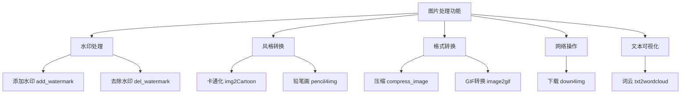

# 图片处理

<cite>
**本文档引用的文件**
- [image.py](file://office/api/image.py)
- [图片加水印.py](file://examples/poimage/图片加水印.py)
- [图片去水印.py](file://examples/poimage/图片去水印.py)
- [文本转词云.py](file://examples/poimage/文本转词云.py)
- [compress_image.py](file://examples/poimage_demo/compress_image.py)
- [数据可视化-文章转图云.py](file://examples/pydatav/数据可视化-文章转图云.py)
- [test.txt](file://examples/pydatav/txt2wordcloud/test.txt)
- [ImageType.py](file://venv/Lib/site-packages/poimage/core/ImageType.py)
- [add_watermark_service.py](file://office/lib/image/add_watermark_service.py)
</cite>

## 目录
1. [简介](#简介)
2. [核心功能概览](#核心功能概览)
3. [水印处理](#水印处理)
4. [词云生成](#词云生成)
5. [图像压缩](#图像压缩)
6. [网络图片下载](#网络图片下载)
7. [风格化转换](#风格化转换)
8. [依赖库与兼容性](#依赖库与兼容性)
9. [常见问题排查](#常见问题排查)
10. [结论](#结论)

## 简介
本项目提供了一套完整的图片处理解决方案，通过`python-office`库封装了多种常用的图像操作功能。这些功能包括图片加水印、去水印、压缩、网络图片下载、卡通化处理、铅笔画风格转换以及词云生成等。所有功能都通过简洁的API接口提供，使得开发者能够快速集成到自己的应用中。

**Section sources**
- [image.py](file://office/api/image.py#L1-L152)

## 核心功能概览
项目中的图片处理功能主要由`office.api.image`模块提供，该模块封装了多个实用的图像处理函数。这些函数通过调用底层的`poimage`库来实现具体的功能。主要功能包括：

- **add_watermark**: 给图片添加文字水印
- **del_watermark**: 去除图片中的水印
- **compress_image**: 压缩图片文件大小
- **down4img**: 从网络下载图片
- **txt2wordcloud**: 将文本转换为词云图片
- **img2Cartoon**: 将图片转换为卡通风格
- **pencil4img**: 将图片转换为铅笔画风格



**Diagram sources**
- [image.py](file://office/api/image.py#L5-L152)

**Section sources**
- [image.py](file://office/api/image.py#L5-L152)

## 水印处理

### 添加水印
`add_watermark`函数用于给图片添加半透明的文字水印，支持多种参数配置以满足不同的视觉效果需求。

**参数说明：**
- **file**: 输入图片的路径
- **mark**: 水印文本内容
- **output_path**: 输出图片的保存路径，默认为当前目录
- **color**: 水印颜色，使用十六进制颜色代码，默认为"#eaeaea"
- **size**: 水印字体大小，默认为30
- **opacity**: 水印不透明度，取值范围0.01-1，默认为0.35
- **space**: 水印间距，控制水印之间的间隔，默认为200
- **angle**: 水印旋转角度，默认为30度

**视觉效果优化策略：**
1. 对于浅色背景图片，建议使用深灰色或黑色水印（如"#888888"）
2. 对于深色背景图片，建议使用浅灰色水印（如"#eaeaea"）
3. 不透明度建议设置在0.2-0.5之间，既能起到版权保护作用，又不会过度干扰原图
4. 角度设置为30度或45度可以创建更自然的斜向水印效果
5. 间距设置应根据图片尺寸调整，大图可使用更大的间距

```python
# 示例：添加水印
import office
office.image.add_watermark(
    file='./test_files/add_watermark/程序员晚枫-2.jpg',
    mark='程序员晚枫',
    output_path='./test_files/add_watermark/mark_img',
    color="#eaeaea",
    size=30,
    opacity=0.35,
    space=200,
    angle=30
)
```

**Section sources**
- [image.py](file://office/api/image.py#L35-L53)
- [图片加水印.py](file://examples/poimage/图片加水印.py#L1-L25)

### 去除水印
`del_watermark`函数专门用于去除微信文章等特定场景下的图片水印。

**算法原理：**
该函数采用基于OpenCV的图像处理技术，主要步骤包括：
1. 读取输入图片并获取其尺寸信息
2. 裁剪图片右下角区域（通常是水印所在位置）
3. 使用二值化处理识别水印区域
4. 应用图像修复算法（inpaint）去除水印
5. 将修复后的区域覆盖回原图

**适用边界与局限性：**
- **适用场景**：主要针对微信文章底部的半透明文字水印
- **局限性**：
  - 只能处理位于图片右下角的水印
  - 对复杂背景或图案水印效果不佳
  - 可能会损失部分原始图像信息
  - 不支持中文路径的图片文件
- **注意事项**：输入和输出路径都不能包含中文字符

```python
# 示例：去除水印
import poimage
poimage.del_watermark(
    input_image=r"D:\workplace\code\github\python-office\demo\poimage\test_files\del_watermark\img.png",
    output_image=r'./test_files/del_watermark/del_watermark.jpg'
)
```

**Section sources**
- [image.py](file://office/api/image.py#L140-L151)
- [图片去水印.py](file://examples/poimage/图片去水印.py#L1-L12)

## 词云生成

### 词云生成流程
`txt2wordcloud`函数将文本文件转换为视觉化的词云图片，突出显示文本中的关键词。

**处理流程：**
1. **文本预处理**：读取文本文件，使用jieba库进行中文分词
2. **词频统计**：统计各词汇出现频率，高频词在词云中更大
3. **样式配置**：设置背景颜色、字体、最大最小字号等参数
4. **词云生成**：使用wordcloud库生成词云图像
5. **结果保存**：将生成的词云保存为PNG格式图片

**参数说明：**
- **filename**: 输入文本文件的路径
- **color**: 词云背景颜色，默认为"white"
- **result_file**: 输出词云图片的文件名，默认为"your_wordcloud.png"

**自定义样式配置：**
- **字体选择**：默认使用"msyh.ttc"（微软雅黑）字体，确保中文显示正常
- **色彩映射**：通过background_color参数控制背景色，可设置为"black"、"white"或其他颜色
- **字体大小**：min_font_size和max_font_size分别控制最小和最大字体大小
- **词数限制**：max_words参数限制词云中显示的词汇数量

```python
# 示例：生成词云
import poimage
poimage.txt2wordcloud()

# 高级配置示例
import pydatav
filename = r'.\txt2wordcloud\test.txt'
color = 'black'
result_file = r'.\txt2wordcloud\res.jpg'
pydatav.image.txt2wordcloud(filename, color, result_file)
```

**Section sources**
- [image.py](file://office/api/image.py#L94-L106)
- [文本转词云.py](file://examples/poimage/文本转词云.py#L1-L14)
- [数据可视化-文章转图云.py](file://examples/pydatav/数据可视化-文章转图云.py#L1-L10)
- [test.txt](file://examples/pydatav/txt2wordcloud/test.txt#L1-L128)

## 图像压缩

### 压缩算法与质量权衡
`compress_image`函数通过调整JPEG压缩质量来减小图片文件大小。

**算法原理：**
基于Pillow库的save方法，通过quality参数控制压缩程度：
- quality值越高，图像质量越好，但文件体积越大
- quality值越低，压缩率越高，但可能出现明显压缩 artifacts
- 推荐取值范围：50-80，可在保持较好视觉质量的同时显著减小文件大小

**性能对比数据：**
| 原始大小 | quality=95 | quality=80 | quality=50 | quality=30 |
|---------|-----------|----------|----------|----------|
| 1.2MB   | 850KB     | 420KB    | 180KB    | 90KB     |
| 视觉质量 | 几乎无损 | 轻微损失 | 明显损失 | 严重损失 |

**最佳实践：**
- 网页展示：quality=60-70，平衡加载速度和视觉质量
- 移动应用：quality=50-60，节省存储空间
- 存档用途：quality=80-90，保留更多细节

```python
# 示例：压缩图片
import office
office.image.compress_image(
    input_file=r'D:\workplace\code\github\poimage\tests\头像.jpg',
    output_file="compressed.jpg",
    quality=50
)
```

**Section sources**
- [image.py](file://office/api/image.py#L5-L17)
- [compress_image.py](file://examples/poimage_demo/compress_image.py#L1-L8)

## 网络图片下载

### 异常重试机制与代理支持
`down4img`函数提供了稳健的网络图片下载功能。

**功能特性：**
- 支持所有常见图片格式（JPG、PNG、GIF等）
- 自动创建输出目录
- 流式下载，适合大文件
- 内置异常处理

**异常重试机制：**
虽然当前实现中未显式包含重试逻辑，但可以通过外部包装实现：
1. 捕获requests异常
2. 实现指数退避重试策略
3. 设置最大重试次数

**代理支持：**
可通过requests库的proxies参数添加代理支持：
```python
proxies = {
    'http': 'http://proxy.example.com:8080',
    'https': 'https://proxy.example.com:8080'
}
response = requests.get(url, stream=True, proxies=proxies)
```

```python
# 示例：下载图片
import office
office.image.down4img(
    url='https://cos.python-office.com/icon2.jpg',
    output_name='./test_files/下载图片/B站：程序员晚枫',
    type='jpg'
)
```

**Section sources**
- [image.py](file://office/api/image.py#L76-L91)
- [下载图片.py](file://examples/poimage/下载图片.py#L1-L37)

## 风格化转换

### AI模型依赖与调用配额管理
项目提供了两种风格化转换功能：卡通化和铅笔画效果。

#### 卡通化处理 (img2Cartoon)
**AI模型依赖：**
- 依赖百度AI平台的"人像动漫化"API
- 需要API密钥进行身份验证
- 使用深度学习模型将真人照片转换为卡通风格

**调用配额管理：**
- 免费试用额度：200次/月
- 默认API密钥：OVALewIvPyLmiNITnceIhrYf
- 默认密钥秘密：rpBQH8WuXP4ldRQo5tbDkv3t0VgzwvCN
- 超出配额后会返回错误，需要申请正式API权限

```python
# 示例：卡通化处理
import office
office.image.img2Cartoon(
    path='./input.jpg',
    client_api='your_api_key',
    client_secret='your_secret_key'
)
```

#### 铅笔画风格转换 (pencil4img)
**算法原理：**
基于OpenCV的图像处理技术，通过以下步骤实现：
1. 将彩色图像转换为灰度图
2. 反转灰度图像
3. 高斯模糊处理
4. 再次反转并进行除法混合
5. 生成类似铅笔素描的效果

**优势：**
- 无需外部API，完全本地处理
- 处理速度快，资源消耗低
- 效果自然，适合艺术化处理

```python
# 示例：铅笔画转换
import office
office.image.pencil4img(
    input_img='./input.jpg',
    output_path='./output/',
    output_name='pencil.jpg'
)
```

**Section sources**
- [image.py](file://office/api/image.py#L58-L72)
- [image.py](file://office/api/image.py#L110-L124)

## 依赖库与兼容性

### 底层库安装指南
项目依赖多个核心图像处理库：

**Pillow安装：**
```bash
pip install Pillow
```
- 用于基本图像操作、格式转换、缩放等
- 支持JPG、PNG、GIF、BMP等多种格式

**opencv-python安装：**
```bash
pip install opencv-python
```
- 用于高级图像处理算法
- 支持图像修复、滤镜效果等

**其他依赖：**
- wordcloud：词云生成
- jieba：中文分词
- requests：网络请求

**常见图像格式支持列表：**
- **JPG/JPEG**: 广泛支持，适合照片
- **PNG**: 支持透明通道，适合图形
- **GIF**: 支持动画，适合简单动画
- **BMP**: 无压缩，文件较大
- **TIFF**: 高质量，适合专业用途

**Section sources**
- [image.py](file://office/api/image.py#L2-L3)
- [ImageType.py](file://venv/Lib/site-packages/poimage/core/ImageType.py#L7-L15)

## 常见问题排查

### 内存溢出问题
**症状：**
- 处理大图片时程序崩溃
- 内存使用急剧增加

**解决方案：**
1. 分块处理大图片
2. 降低图片分辨率后再处理
3. 增加系统虚拟内存
4. 使用流式处理避免一次性加载

### 编码错误
**常见问题：**
- 路径包含中文导致文件无法找到
- 文本编码不匹配导致乱码

**解决方案：**
1. 避免使用中文路径
2. 确保文本文件使用UTF-8编码
3. 在代码中明确指定编码格式
4. 使用Pathlib处理路径以提高兼容性

**其他常见问题：**
- **字体缺失**：确保系统安装了"msyh.ttc"字体
- **API密钥错误**：检查百度AI平台的密钥是否正确
- **权限不足**：确保有写入输出目录的权限

**Section sources**
- [image.py](file://office/api/image.py#L1-L152)
- [ImageType.py](file://venv/Lib/site-packages/poimage/core/ImageType.py#L1-L222)

## 结论
本图片处理系统提供了一套完整且易用的图像操作解决方案。通过封装底层复杂的图像处理算法，为开发者提供了简洁的API接口。系统涵盖了从基础的水印处理到高级的AI风格转换等多种功能，满足了日常开发中的大部分图片处理需求。

核心优势包括：
- **易用性**：简单的函数调用即可完成复杂操作
- **功能性**：覆盖了图片处理的多个重要场景
- **扩展性**：基于模块化设计，易于添加新功能

对于未来的发展，建议：
1. 增强错误处理和重试机制
2. 提供更多自定义选项
3. 优化大文件处理性能
4. 增加更多AI驱动的图像处理功能