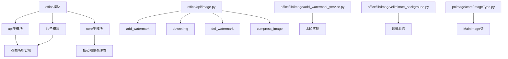
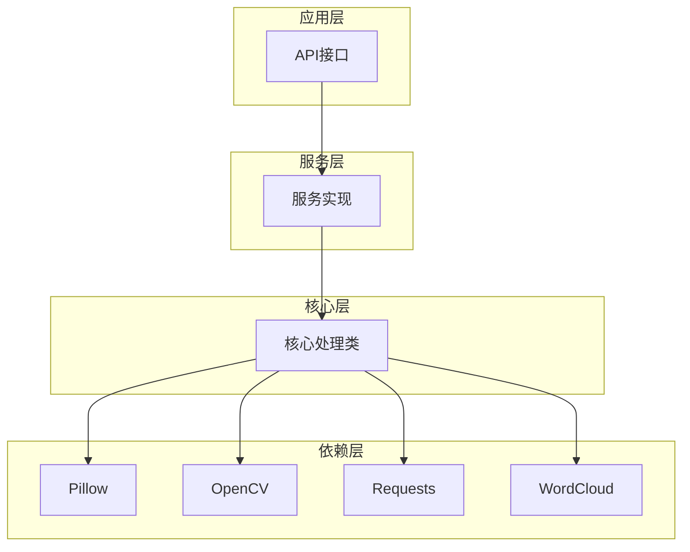
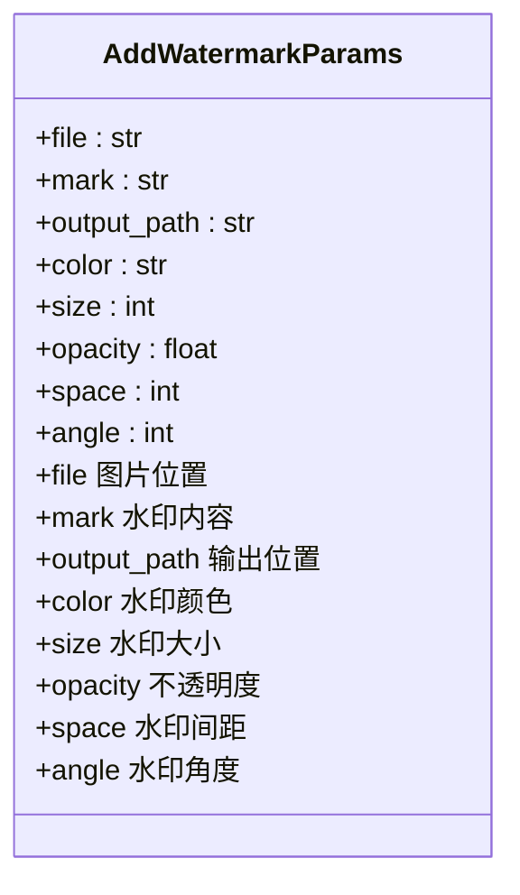
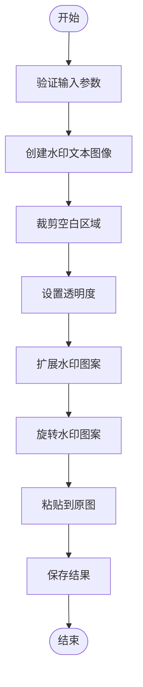
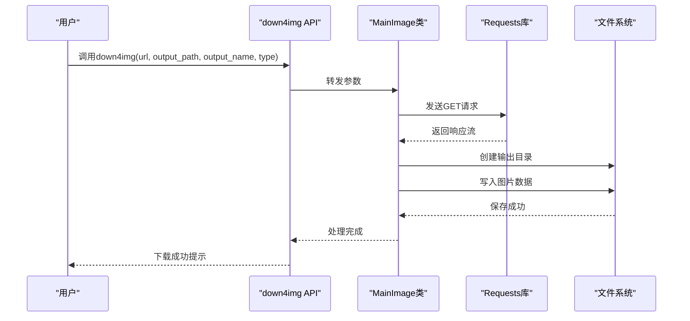
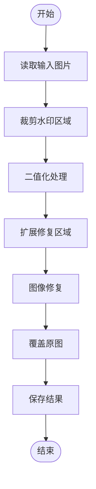
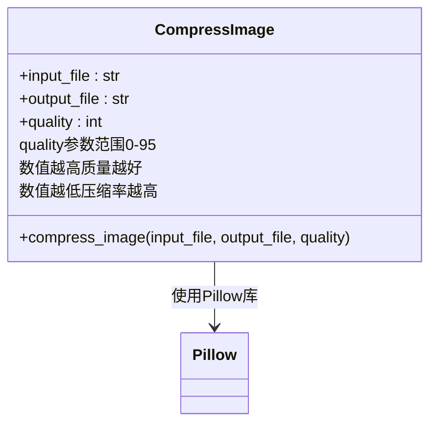

# 核心图像操作

<cite>
**本文档引用的文件**   
- [image.py](file://office/api/image.py)
- [add_watermark_service.py](file://office/lib/image/add_watermark_service.py)
- [eliminate_background.py](file://office/lib/image/eliminate_background.py)
- [ImageType.py](file://venv/Lib/site-packages/poimage/core/ImageType.py)
- [test_image.py](file://tests/test_code/test_image.py)
- [图片加水印.py](file://examples/poimage/图片加水印.py)
- [下载图片.py](file://examples/poimage/下载图片.py)
- [图片去水印.py](file://examples/poimage/图片去水印.py)
- [compress_image.py](file://examples/poimage_demo/compress_image.py)
</cite>

## 目录
1. [简介](#简介)
2. [项目结构](#项目结构)
3. [核心组件](#核心组件)
4. [架构概述](#架构概述)
5. [详细组件分析](#详细组件分析)
6. [依赖分析](#依赖分析)
7. [性能考虑](#性能考虑)
8. [故障排除指南](#故障排除指南)
9. [结论](#结论)

## 简介
本文档详细介绍了python-office库中的核心图像操作功能，包括图片加水印、下载网络图片、去除水印和压缩图片等基础功能。通过分析底层实现原理和参数配置，为开发者提供全面的技术指导和最佳实践建议。

## 项目结构
python-office库的图像处理功能主要分布在office/api和office/lib目录下，通过模块化设计实现了功能分离和代码复用。



**图示来源**
- [image.py](file://office/api/image.py#L1-L152)
- [add_watermark_service.py](file://office/lib/image/add_watermark_service.py#L1-L140)
- [eliminate_background.py](file://office/lib/image/eliminate_background.py#L1-L72)

**本节来源**
- [image.py](file://office/api/image.py#L1-L152)
- [add_watermark_service.py](file://office/lib/image/add_watermark_service.py#L1-L140)
- [eliminate_background.py](file://office/lib/image/eliminate_background.py#L1-L72)

## 核心组件
本文档涵盖的核心图像操作功能包括：add_watermark（添加水印）、down4img（下载图片）、del_watermark（去除水印）和compress_image（压缩图片）。这些功能通过Pillow、cv2、requests等底层库实现，提供了简单易用的API接口。

**本节来源**
- [image.py](file://office/api/image.py#L34-L152)
- [ImageType.py](file://venv/Lib/site-packages/poimage/core/ImageType.py#L22-L165)

## 架构概述
python-office的图像处理功能采用分层架构设计，上层API提供简洁的函数接口，中层服务类封装具体实现逻辑，底层依赖外部库完成核心图像处理任务。



**图示来源**
- [image.py](file://office/api/image.py#L2-L152)
- [ImageType.py](file://venv/Lib/site-packages/poimage/core/ImageType.py#L22-L165)

## 详细组件分析

### 添加水印功能分析
add_watermark函数用于给图片添加文字水印，支持多种参数配置来控制水印的外观和布局。

#### 参数配置说明


**图示来源**
- [image.py](file://office/api/image.py#L35-L47)
- [add_watermark_service.py](file://office/lib/image/add_watermark_service.py#L74-L84)

#### 水印生成流程


**图示来源**
- [add_watermark_service.py](file://office/lib/image/add_watermark_service.py#L74-L111)
- [ImageType.py](file://venv/Lib/site-packages/poimage/core/ImageType.py#L67-L85)

**本节来源**
- [image.py](file://office/api/image.py#L34-L52)
- [add_watermark_service.py](file://office/lib/image/add_watermark_service.py#L74-L111)
- [图片加水印.py](file://examples/poimage/图片加水印.py#L1-L25)

### 下载图片功能分析
down4img函数实现了网络图片下载功能，支持自定义保存路径、文件名和格式。

#### 下载流程


**图示来源**
- [image.py](file://office/api/image.py#L76-L91)
- [ImageType.py](file://venv/Lib/site-packages/poimage/core/ImageType.py#L153-L163)

**本节来源**
- [image.py](file://office/api/image.py#L76-L91)
- [ImageType.py](file://venv/Lib/site-packages/poimage/core/ImageType.py#L153-L163)
- [下载图片.py](file://examples/poimage/下载图片.py#L1-L37)

### 去除水印功能分析
del_watermark函数用于去除图片中的水印，特别是针对微信文章截图的底部水印。

#### 去除水印算法


**图示来源**
- [image.py](file://office/api/image.py#L140-L151)
- [poimage/api/image.py](file://venv/Lib/site-packages/poimage/api/image.py#L38-L69)

**本节来源**
- [image.py](file://office/api/image.py#L140-L151)
- [poimage/api/image.py](file://venv/Lib/site-packages/poimage/api/image.py#L38-L69)
- [图片去水印.py](file://examples/poimage/图片去水印.py#L1-L11)

### 压缩图片功能分析
compress_image函数用于压缩图片文件大小，通过调整质量参数平衡文件体积和视觉质量。

#### 压缩算法流程


**图示来源**
- [image.py](file://office/api/image.py#L5-L17)
- [ImageType.py](file://venv/Lib/site-packages/poimage/core/ImageType.py#L22-L32)

**本节来源**
- [image.py](file://office/api/image.py#L5-L17)
- [ImageType.py](file://venv/Lib/site-packages/poimage/core/ImageType.py#L22-L32)
- [compress_image.py](file://examples/poimage_demo/compress_image.py#L1-L8)

## 依赖分析
python-office的图像处理功能依赖多个第三方库，这些库提供了核心的图像处理能力。

```mermaid
graph TD
office[python-office]
Pillow[Pillow] --> office
CV2[OpenCV] --> office
Requests[Requests] --> office
WordCloud[WordCloud] --> office
Jieba[结巴分词] --> office
Pillow : 图像处理基础
CV2 : 计算机视觉处理
Requests : 网络请求
WordCloud : 词云生成
Jieba : 中文分词
office --> Pillow : 依赖
office --> CV2 : 依赖
office --> Requests : 依赖
office --> WordCloud : 依赖
office --> Jieba : 依赖
```

**图示来源**
- [ImageType.py](file://venv/Lib/site-packages/poimage/core/ImageType.py#L7-L14)
- [setup.py](file://setup.py)

**本节来源**
- [ImageType.py](file://venv/Lib/site-packages/poimage/core/ImageType.py#L7-L14)
- [setup.py](file://setup.py)

## 性能考虑
在使用图像处理功能时，需要注意以下性能相关的问题：

1. **内存使用**：处理大尺寸图片时可能会消耗大量内存，建议在处理前对图片进行适当缩放。
2. **多线程处理**：add_watermark等批量处理功能使用了多线程技术，可以充分利用多核CPU提升处理速度。
3. **磁盘I/O**：频繁的文件读写操作会影响性能，建议合理规划文件存储路径和命名规则。
4. **网络延迟**：down4img功能受网络速度影响较大，对于大文件下载建议实现进度提示功能。

## 故障排除指南
在使用图像处理功能时可能遇到以下常见问题及解决方案：

**本节来源**
- [test_image.py](file://tests/test_code/test_image.py#L1-L44)
- [image.py](file://office/api/image.py)
- [poimage/api/image.py](file://venv/Lib/site-packages/poimage/api/image.py)

### 常见问题
1. **路径包含中文导致失败**：确保图片路径和文件名不包含中文字符。
2. **依赖库缺失**：安装python-office时会自动安装所需依赖，如遇问题可手动安装Pillow、opencv-python等库。
3. **内存溢出**：处理超大图片时可能出现内存不足，建议分批处理或降低图片分辨率。
4. **网络下载失败**：检查网络连接，对于需要代理的环境，可修改requests库的配置。

## 结论
python-office库提供了全面的图像处理功能，通过简洁的API接口和强大的底层实现，使开发者能够轻松完成各种图像操作任务。了解各功能的实现原理和参数配置，有助于更好地应用这些功能解决实际问题。