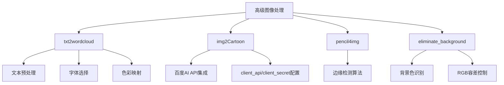
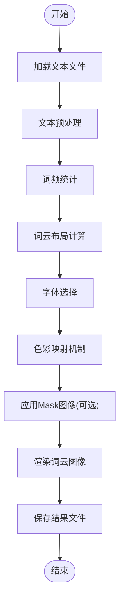
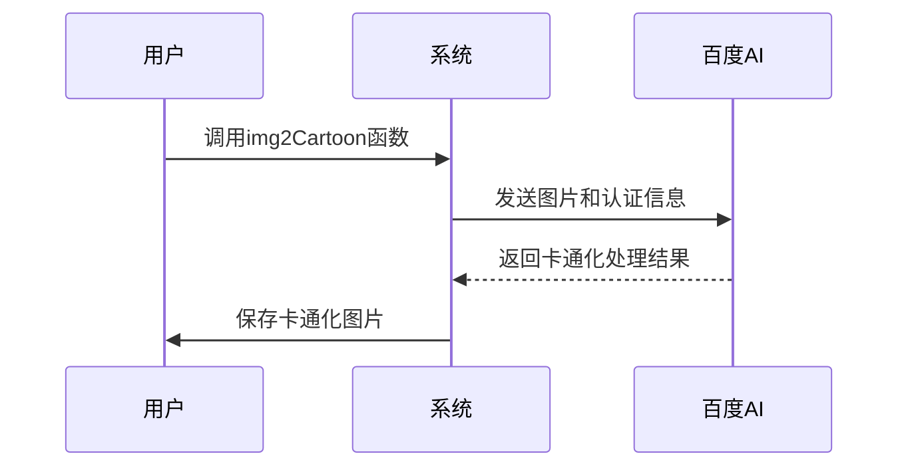
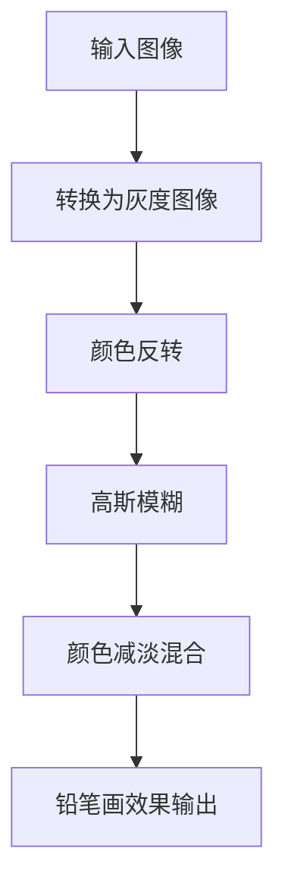
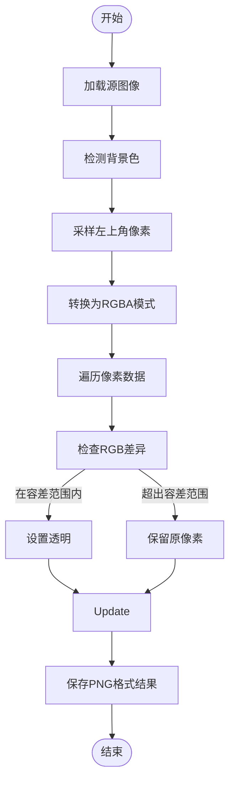
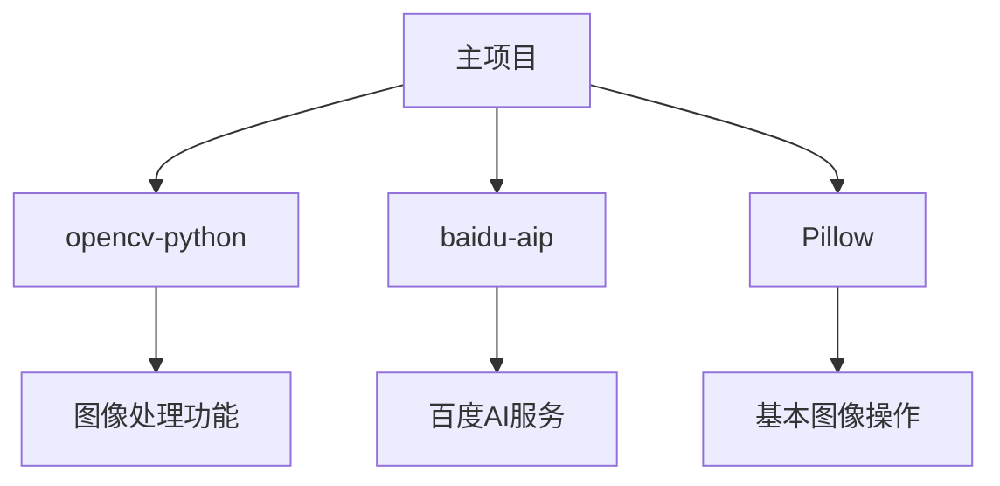

# 高级图像处理

<cite>
**本文档中引用的文件**  
- [image.py](file://office/api/image.py#L42-L152)
- [eliminate_background.py](file://office/lib/image/eliminate_background.py#L1-L72)
- [数据可视化-文章转图云.py](file://examples/pydatav/数据可视化-文章转图云.py#L1-L10)
- [文本转词云.py](file://examples/poimage/文本转词云.py#L1-L14)
- [setup.py](file://setup.py#L1-L14)
- [requirements.txt](file://contributors/old_from_gitee/bob-zhao/requirements.txt#L1)
</cite>

## 目录
1. [简介](#简介)
2. [核心功能概述](#核心功能概述)
3. [txt2wordcloud 词云生成](#txt2wordcloud-词云生成)
4. [img2Cartoon 卡通化处理](#img2cartoon-卡通化处理)
5. [pencil4img 铅笔画风格转换](#pencil4img-铅笔画风格转换)
6. [eliminate_background 消除背景](#eliminate_background-消除背景)
7. [依赖库安装与配置](#依赖库安装与配置)
8. [最佳实践与示例](#最佳实践与示例)

## 简介
本项目提供了一系列高级图像处理功能，旨在简化复杂的图像操作任务。通过封装底层复杂的算法和API调用，用户可以轻松实现词云生成、图像卡通化、铅笔画风格转换以及背景消除等高级功能。这些功能广泛应用于数据可视化、图像编辑和内容创作等领域。

## 核心功能概述

**Diagram sources**  
- [image.py](file://office/api/image.py#L42-L152)

**Section sources**  
- [image.py](file://office/api/image.py#L42-L152)

## txt2wordcloud 词云生成

该功能基于文本内容生成视觉化的词云图像，支持自定义背景颜色和输出文件名。系统会自动处理文本预处理、词频统计、字体选择和色彩映射等复杂过程。

**Diagram sources**  
- [image.py](file://office/api/image.py#L94-L106)
- [数据可视化-文章转图云.py](file://examples/pydatav/数据可视化-文章转图云.py#L1-L10)

**Section sources**  
- [image.py](file://office/api/image.py#L94-L106)
- [文本转词云.py](file://examples/poimage/文本转词云.py#L1-L14)

## img2Cartoon 卡通化处理

通过集成百度AI平台的图像处理API，将普通照片转换为卡通风格图像。该功能需要配置API密钥进行身份验证。

**Diagram sources**  
- [image.py](file://office/api/image.py#L58-L72)

**Section sources**  
- [image.py](file://office/api/image.py#L58-L72)

## pencil4img 铅笔画风格转换

该功能利用图像处理算法将普通照片转换为铅笔画风格，主要基于边缘检测和灰度处理技术实现艺术化效果。

**Diagram sources**  
- [image.py](file://office/api/image.py#L110-L124)

**Section sources**  
- [image.py](file://office/api/image.py#L110-L124)

## eliminate_background 消除背景

该功能用于自动识别并消除图像背景，支持纯色背景图片的处理，通过RGB容差控制实现精确的背景去除。

**Diagram sources**  
- [eliminate_background.py](file://office/lib/image/eliminate_background.py#L20-L62)

**Section sources**  
- [eliminate_background.py](file://office/lib/image/eliminate_background.py#L20-L62)

## 依赖库安装与配置

本项目依赖多个第三方库来实现其功能，包括但不限于图像处理库和AI服务接口。

**Diagram sources**  
- [setup.py](file://setup.py#L1-L14)
- [requirements.txt](file://contributors/old_from_gitee/bob-zhao/requirements.txt#L1)

**Section sources**  
- [setup.py](file://setup.py#L1-L14)
- [requirements.txt](file://contributors/old_from_gitee/bob-zhao/requirements.txt#L1)

## 最佳实践与示例

### 词云生成最佳实践
- 使用高质量的文本文件作为输入
- 选择合适的背景颜色以增强视觉效果
- 可通过mask参数应用自定义形状模板

### 背景消除最佳实践
- 对于纯色背景图片，确保背景色均匀
- 调整margin参数以平衡背景去除精度和前景保留
- 输出格式应选择支持透明度的PNG格式

### 卡通化处理注意事项
- 遵守百度AI API的调用配额限制
- 妥善保管client_api和client_secret密钥
- 处理大尺寸图片时注意API的大小限制

**Section sources**  
- [image.py](file://office/api/image.py#L42-L152)
- [eliminate_background.py](file://office/lib/image/eliminate_background.py#L1-L72)