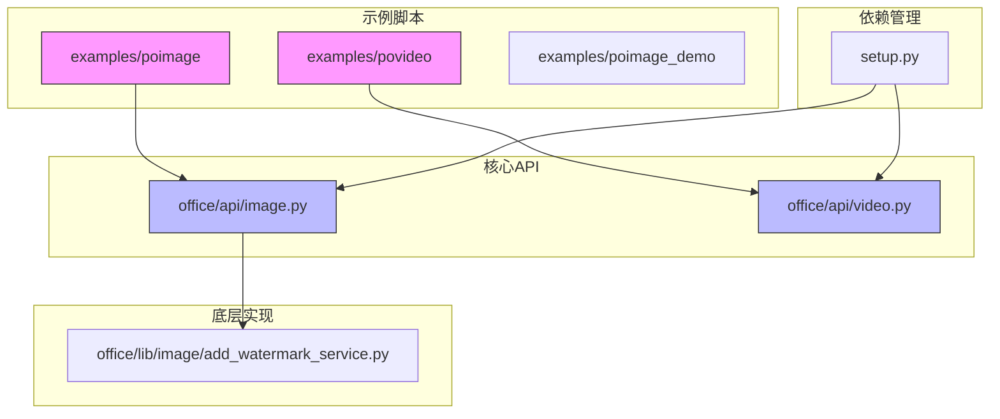
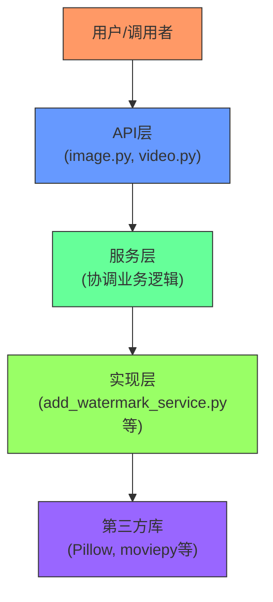
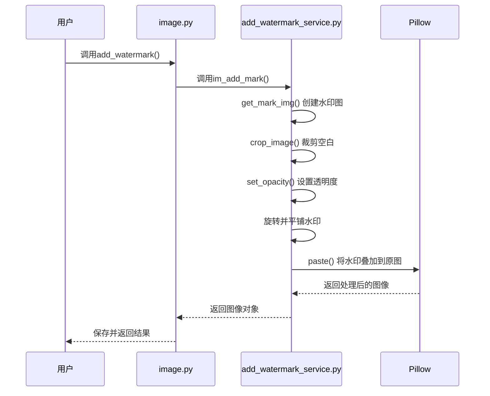
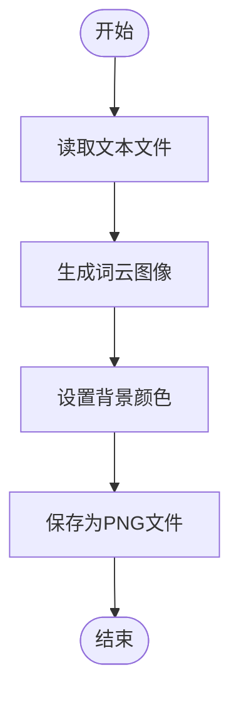
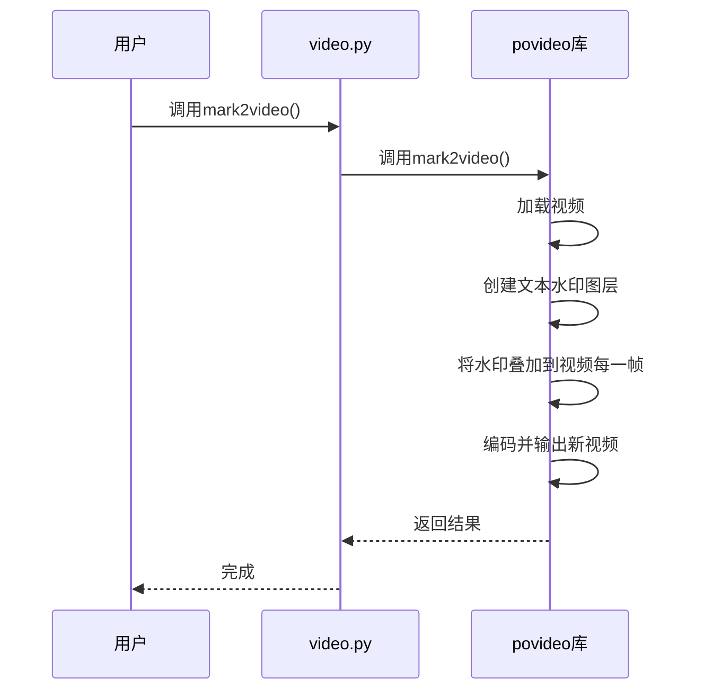
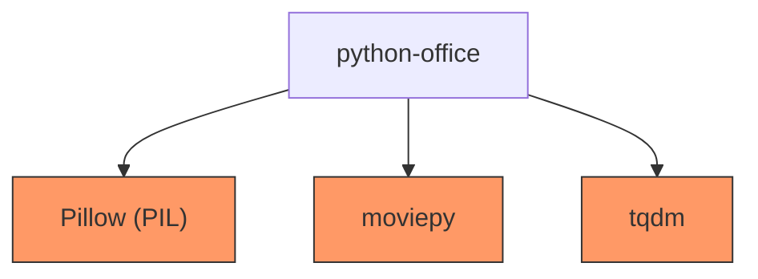

# 多媒体处理

<cite>
**本文档中引用的文件**   
- [image.py](file://office/api/image.py)
- [video.py](file://office/api/video.py)
- [图片加水印.py](file://examples/poimage/图片加水印.py)
- [图片去水印.py](file://examples/poimage/图片去水印.py)
- [文本转词云.py](file://examples/poimage/文本转词云.py)
- [mark2video.py](file://examples/povideo/mark2video.py)
- [add_watermark_service.py](file://office/lib/image/add_watermark_service.py)
- [compress_image.py](file://examples/poimage_demo/compress_image.py)
- [setup.py](file://setup.py)
</cite>

## 目录
1. [简介](#简介)
2. [项目结构](#项目结构)
3. [核心组件](#核心组件)
4. [架构概述](#架构概述)
5. [详细组件分析](#详细组件分析)
6. [依赖分析](#依赖分析)
7. [性能考虑](#性能考虑)
8. [故障排除指南](#故障排除指南)
9. [结论](#结论)

## 简介
本文档深入介绍了python-office库中的多媒体处理功能，重点涵盖图片和视频两大媒体类型的自动化操作。文档系统性地阐述了image.py模块提供的图片加水印、去水印、词云生成等核心功能，并结合poimage目录下的具体脚本实例展示实际应用效果。同时，文档详细说明了povideo/mark2video.py实现的视频标注功能及其典型应用场景。此外，文档还解释了底层依赖库（如Pillow、moviepy）的作用及配置要求，提供了资源消耗评估、格式兼容性列表和常见渲染失败的解决方案，确保用户能够顺利执行多媒体自动化任务。

## 项目结构
python-office库的项目结构清晰地组织了各类办公自动化功能，其中多媒体处理功能主要集中在`examples/poimage`、`examples/povideo`和`office/api`目录下。该结构体现了功能模块化的设计思想，便于用户快速定位和使用特定功能。

**Diagram sources**
- [image.py](file://office/api/image.py)
- [video.py](file://office/api/video.py)
- [图片加水印.py](file://examples/poimage/图片加水印.py)
- [mark2video.py](file://examples/povideo/mark2video.py)

**Section sources**
- [image.py](file://office/api/image.py)
- [video.py](file://office/api/video.py)
- [setup.py](file://setup.py)

## 核心组件
python-office的多媒体处理功能由几个核心组件构成。`image.py`模块是图片处理的核心，提供了加水印、去水印、生成词云、图片转卡通、图片转铅笔画等多种功能。`video.py`模块则专注于视频处理，支持视频转音频、音频转文字、文本转语音以及视频加水印等操作。这些功能通过简洁的API暴露给用户，而具体的实现则封装在底层的`add_watermark_service.py`等文件中。用户可以通过`examples`目录下的脚本快速上手，了解各项功能的使用方法。

**Section sources**
- [image.py](file://office/api/image.py#L1-L152)
- [video.py](file://office/api/video.py#L1-L72)
- [add_watermark_service.py](file://office/lib/image/add_watermark_service.py#L1-L140)

## 架构概述
python-office的多媒体处理功能采用分层架构设计。顶层是用户直接调用的API层（`image.py`和`video.py`），它提供了简洁、易用的函数接口。中间层是业务逻辑层，负责协调和调用底层的具体实现。底层是具体的实现层（如`add_watermark_service.py`），它利用Pillow、moviepy等第三方库完成复杂的图像和视频处理任务。这种架构分离了接口与实现，使得代码更易于维护和扩展。

**Diagram sources**
- [image.py](file://office/api/image.py)
- [video.py](file://office/api/video.py)
- [add_watermark_service.py](file://office/lib/image/add_watermark_service.py)

## 详细组件分析

### 图片处理功能分析
#### 图片加水印功能
图片加水印功能是`image.py`模块的核心功能之一，通过`add_watermark`函数提供。该函数接收图片路径、水印文本、输出路径等参数，调用底层服务实现水印的添加。其底层实现`add_watermark_service.py`利用Pillow库创建一个包含水印文本的透明图层，然后通过旋转、平铺和混合的方式将其叠加到原图上。

**Diagram sources**
- [image.py](file://office/api/image.py#L35-L52)
- [add_watermark_service.py](file://office/lib/image/add_watermark_service.py#L47-L111)

#### 图片去水印功能
图片去水印功能通过`del_watermark`函数实现。该功能直接调用`poimage`库的相应方法，其具体实现细节未在当前代码库中完全展示，但根据示例脚本可知，它支持多种图片格式，并对输入文件的路径和名称有特殊要求（不能包含中文）。

**Section sources**
- [image.py](file://office/api/image.py#L140-L151)
- [图片去水印.py](file://examples/poimage/图片去水印.py#L1-L11)

#### 词云生成功能
词云生成功能通过`txt2wordcloud`函数实现。该函数接收文本文件路径，调用`poimage`库生成词云图像。用户可以通过参数指定背景颜色和输出文件名。

**Diagram sources**
- [image.py](file://office/api/image.py#L94-L106)
- [文本转词云.py](file://examples/poimage/文本转词云.py#L1-L14)

### 视频处理功能分析
#### 视频加水印功能
视频加水印功能通过`video.py`中的`mark2video`函数实现。该函数接收视频路径、输出路径、水印文本等参数，调用`povideo`库完成处理。根据示例脚本，该功能可以为视频添加静态文本水印。

**Diagram sources**
- [video.py](file://office/api/video.py#L39-L56)
- [mark2video.py](file://examples/povideo/mark2video.py#L1-L5)

## 依赖分析
python-office的多媒体处理功能依赖于多个第三方库。虽然`setup.py`文件内容不完整，但从代码实现中可以推断出关键依赖。图片处理功能主要依赖`Pillow`库，用于图像的打开、编辑和保存。视频处理功能，特别是`contributors/CatchDr/video_time_statistics.py`中的示例，明确使用了`moviepy`库来处理视频文件和获取时长信息。此外，`tqdm`库被用于显示处理进度。这些依赖项共同构成了多媒体处理功能的技术基础。

**Diagram sources**
- [add_watermark_service.py](file://office/lib/image/add_watermark_service.py#L9)
- [video_time_statistics.py](file://contributors/CatchDr/video_time_statistics.py#L12)
- [video_time_statistics.py](file://contributors/CatchDr/video_time_statistics.py#L13)

**Section sources**
- [add_watermark_service.py](file://office/lib/image/add_watermark_service.py#L9)
- [video_time_statistics.py](file://contributors/CatchDr/video_time_statistics.py#L12-L13)
- [setup.py](file://setup.py)

## 性能考虑
多媒体处理通常是资源密集型任务。图片加水印和生成词云的性能主要受图片分辨率和文本大小影响。高分辨率图片会显著增加内存占用和处理时间。视频处理的资源消耗更高，尤其是视频加水印，需要逐帧处理，对CPU和内存要求较高。建议在处理大型文件时，确保系统有足够的资源，并考虑分批处理。此外，压缩图片（`compress_image`）功能可以有效减小文件体积，降低后续处理的资源消耗。

## 故障排除指南
1.  **路径包含中文导致失败**：如`图片去水印.py`脚本中的注释所示，某些功能可能不支持包含中文的文件路径或名称，请使用纯英文路径。
2.  **依赖库未安装**：确保已通过`pip install`安装了所有必要的依赖库，如`Pillow`和`moviepy`。
3.  **文件格式不支持**：虽然脚本声称支持多种格式，但某些特定编码或容器格式的视频/音频可能无法被`moviepy`正确解析。
4.  **内存不足**：处理超大图片或超长视频时，可能会遇到内存不足的错误。尝试处理更小的文件或增加系统虚拟内存。
5.  **函数调用参数错误**：仔细检查函数参数，例如`mark2video`的水印内容目前似乎只支持英文。

**Section sources**
- [图片去水印.py](file://examples/poimage/图片去水印.py#L8)
- [add_watermark_service.py](file://office/lib/image/add_watermark_service.py)
- [video.py](file://office/api/video.py)

## 结论
python-office库提供了一套实用的多媒体自动化处理工具，通过简洁的API封装了复杂的图像和视频处理逻辑。其功能覆盖了常见的图片和视频操作需求，如加水印、去水印、生成词云和视频标注。通过分析其架构和实现，用户可以更好地理解其工作原理，并有效地将其集成到自己的工作流中。尽管存在一些限制（如路径不能有中文），但该库为Python开发者提供了一个便捷的多媒体处理解决方案。