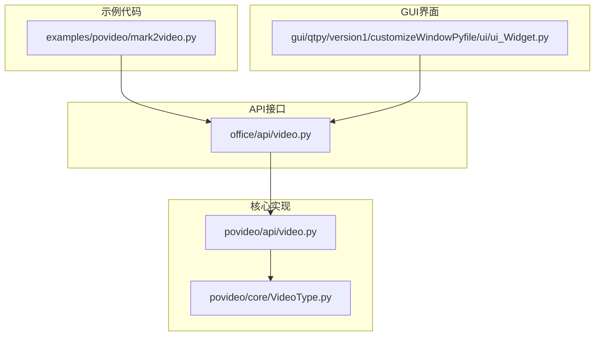
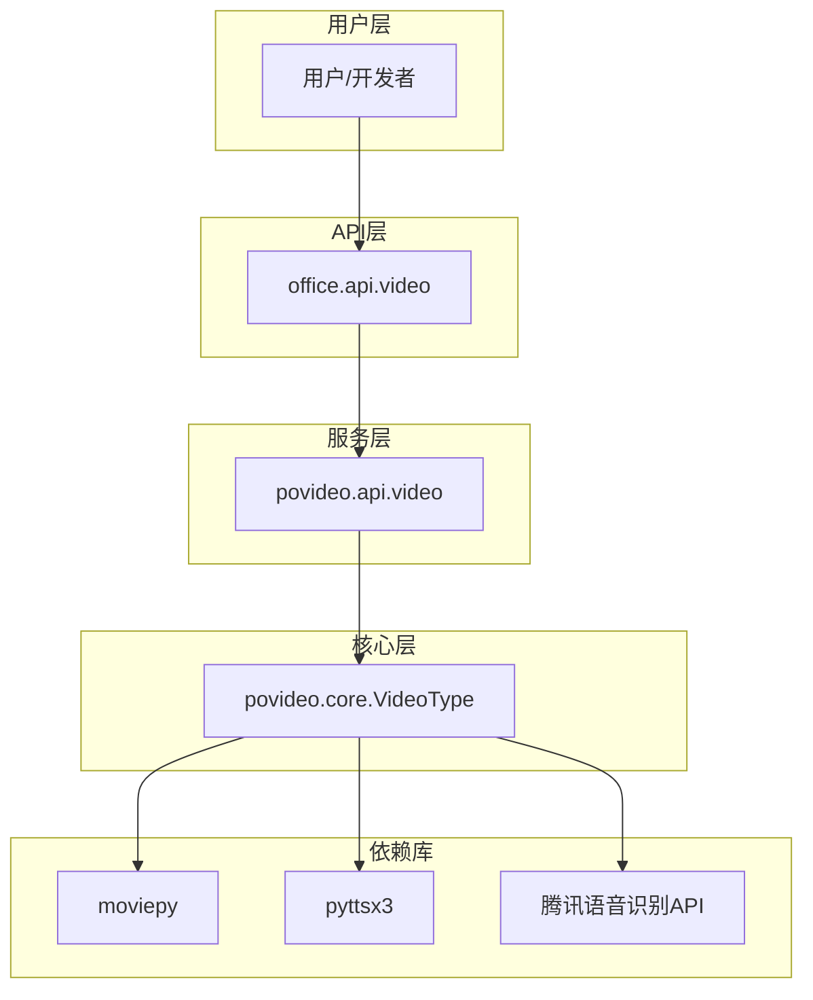
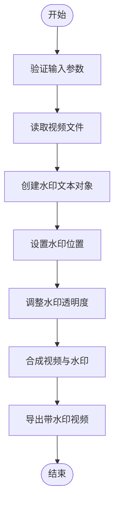
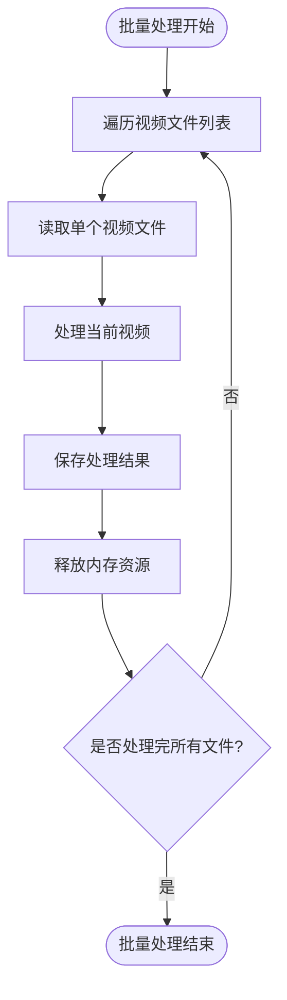
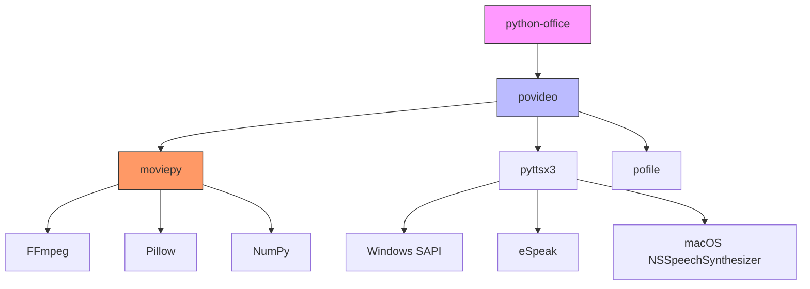
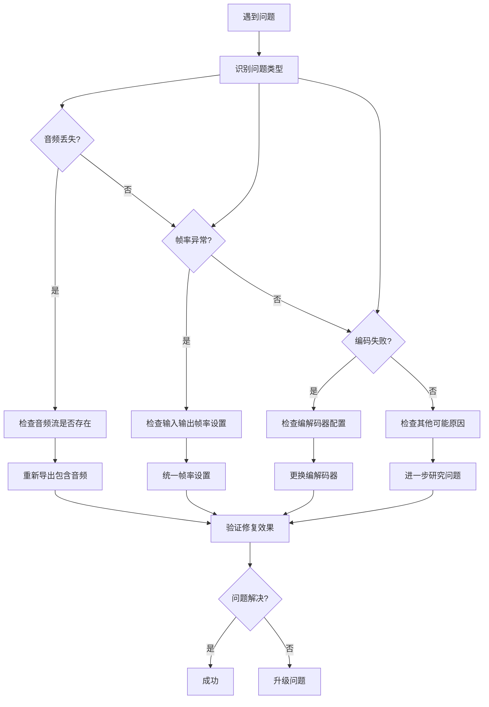

# 视频处理

<cite>
**本文档引用的文件**
- [mark2video.py](file://examples/povideo/mark2video.py)
- [video.py](file://office/api/video.py)
- [VideoType.py](file://venv/Lib/site-packages/povideo/core/VideoType.py)
- [video_time_statistics.py](file://contributors/CatchDr/video_time_statistics.py)
- [ui_Widget.py](file://gui/qtpy/version1/customizeWindowPyfile/ui/ui_Widget.py)
- [test_video.py](file://tests/test_code/test_video.py)
</cite>

## 目录
1. [简介](#简介)
2. [项目结构](#项目结构)
3. [核心组件](#核心组件)
4. [架构概述](#架构概述)
5. [详细组件分析](#详细组件分析)
6. [依赖分析](#依赖分析)
7. [性能考虑](#性能考虑)
8. [故障排除指南](#故障排除指南)
9. [结论](#结论)

## 简介
本文档详细说明了python-office库中的视频处理功能，重点聚焦于mark2video视频标注自动化能力。文档涵盖了视频输入输出配置、时间轴同步机制、帧级水印嵌入原理、底层编解码依赖、批量处理内存模式、GPU加速支持以及图形界面操作流程。同时提供了常见故障的诊断与解决方案，确保用户能够稳定执行视频自动化任务。

## 项目结构
python-office项目的视频处理功能主要分布在examples/povideo目录下，通过office.api.video模块提供统一接口。核心功能由povideo包实现，依赖于moviepy等第三方库进行底层视频处理。



**Diagram sources**
- [mark2video.py](file://examples/povideo/mark2video.py)
- [video.py](file://office/api/video.py)
- [VideoType.py](file://venv/Lib/site-packages/povideo/core/VideoType.py)
- [ui_Widget.py](file://gui/qtpy/version1/customizeWindowPyfile/ui/ui_Widget.py)

**Section sources**
- [project_structure](file://workspace_path)

## 核心组件
视频处理功能的核心组件包括mark2video水印添加、video2mp3音频提取、audio2txt语音识别和txt2mp3文本转语音。这些功能通过统一的API接口暴露给用户，底层依赖moviepy库进行视频处理，pyttsx3库进行语音合成。

**Section sources**
- [video.py](file://office/api/video.py)
- [VideoType.py](file://venv/Lib/site-packages/povideo/core/VideoType.py)

## 架构概述
视频处理功能采用分层架构设计，上层提供简洁的API接口，中层进行功能调度，底层依赖专业库完成具体操作。这种设计模式实现了功能封装与解耦，便于维护和扩展。



**Diagram sources**
- [video.py](file://office/api/video.py)
- [VideoType.py](file://venv/Lib/site-packages/povideo/core/VideoType.py)

## 详细组件分析

### mark2video水印添加分析
mark2video功能实现了视频水印自动化添加，支持自定义水印内容、字体、大小、颜色和位置。

#### 功能实现流程


**Diagram sources**
- [VideoType.py](file://venv/Lib/site-packages/povideo/core/VideoType.py)

#### 参数配置说明
| 参数 | 类型 | 默认值 | 描述 |
|------|------|--------|------|
| video_path | str | 无 | 视频文件路径，必填 |
| output_path | str | ./ | 输出目录路径 |
| output_name | str | mark2video.mp4 | 输出文件名 |
| mark_str | str | www.python-office.com | 水印文本内容 |
| font_size | int | 28 | 水印字体大小 |
| font_type | str | C:\Windows\Fonts\arial.ttf | 字体文件路径 |
| font_color | str | white | 水印颜色 |

**Section sources**
- [video.py](file://office/api/video.py#L39-L56)
- [VideoType.py](file://venv/Lib/site-packages/povideo/core/VideoType.py#L37-L58)

### 批量处理与内存管理
对于批量视频处理任务，系统采用逐个处理模式，避免同时加载多个大型视频文件导致内存溢出。



**Diagram sources**
- [VideoType.py](file://venv/Lib/site-packages/povideo/core/VideoType.py)

## 依赖分析
视频处理功能依赖多个外部库和工具，形成完整的处理链条。



**Diagram sources**
- [video.py](file://office/api/video.py)
- [VideoType.py](file://venv/Lib/site-packages/povideo/core/VideoType.py)

**Section sources**
- [requirements](file://workspace_path)

## 性能考虑
### 格式兼容性矩阵
| 格式 | 视频编码 | 音频编码 | 支持状态 | 备注 |
|------|----------|----------|----------|------|
| MP4 | H.264 | AAC | 完全支持 | 推荐使用 |
| AVI | Xvid | MP3 | 支持 | 文件较大 |
| MOV | H.264 | AAC | 支持 | 苹果设备常用 |
| WMV | WMV | WMA | 有限支持 | Windows平台 |
| FLV | H.264 | MP3 | 支持 | 网络流媒体 |
| MKV | 多种 | 多种 | 支持 | 容器格式 |

### 大文件分片处理最佳实践
1. **分片策略**：将大视频文件按时间分片处理
2. **内存监控**：实时监控内存使用情况
3. **临时存储**：使用临时目录存储中间文件
4. **错误恢复**：记录处理进度，支持断点续传

```python
# 伪代码示例：大文件分片处理
def process_large_video(video_path, chunk_duration=300):
    # 获取视频总时长
    clip = VideoFileClip(video_path)
    total_duration = clip.duration
    
    # 分片处理
    for start_time in range(0, total_duration, chunk_duration):
        end_time = min(start_time + chunk_duration, total_duration)
        # 提取片段
        subclip = clip.subclip(start_time, end_time)
        # 处理片段
        process_clip(subclip)
        # 释放内存
        subclip.close()
    
    # 关闭原始视频
    clip.close()
```

**Section sources**
- [VideoType.py](file://venv/Lib/site-packages/povideo/core/VideoType.py)

## 故障排除指南
### 常见问题诊断流程


**Diagram sources**
- [VideoType.py](file://venv/Lib/site-packages/povideo/core/VideoType.py)
- [test_video.py](file://tests/test_code/test_video.py)

### 具体解决方案
#### 音频丢失问题
- **原因**：视频文件本身无音频流或导出时未包含音频
- **解决方案**：确保`write_videofile`方法中`audio=True`参数设置

#### 帧率异常问题
- **原因**：输入输出帧率不匹配
- **解决方案**：统一设置`fps=30`等标准帧率

#### 编码失败问题
- **原因**：缺少必要的编解码器或权限不足
- **解决方案**：安装完整版FFmpeg并以管理员权限运行

**Section sources**
- [VideoType.py](file://venv/Lib/site-packages/povideo/core/VideoType.py#L58)
- [test_video.py](file://tests/test_code/test_video.py)

## 结论
python-office的视频处理功能提供了完整的mark2video自动化能力，通过简洁的API接口和强大的底层实现，使用户能够轻松完成视频水印添加等任务。系统基于moviepy库构建，支持主流视频格式，具备良好的扩展性和稳定性。通过合理的内存管理和错误处理机制，确保了大文件处理的可靠性。图形界面的集成进一步降低了使用门槛，使非技术用户也能方便地操作视频处理功能。