# 文件管理功能完整文档

<cite>
**本文档中引用的文件**
- [office/api/file.py](file://office/api/file.py)
- [examples/pofile/批量重命名.py](file://examples/pofile/批量重命名.py)
- [examples/pofile/自动整理文件夹.py](file://examples/pofile/自动整理文件夹.py)
- [examples/pofile/根据内容，查找文件.py](file://examples/pofile/根据内容，查找文件.py)
- [examples/pofile/批量获取文件列表.py](file://examples/pofile/批量获取文件列表.py)
- [contributors/sustnf/file.py](file://contributors/sustnf/file.py)
- [contributors/yinzeyuan/output_file_list_to_excel.py](file://contributors/yinzeyuan/output_file_list_to_excel.py)
- [contributors/yinzeyuan/SearchSpecifyTypeFile.py](file://contributors/yinzeyuan/SearchSpecifyTypeFile.py)
- [contributors/yinzeyuan/Rename-AddSomething.py](file://contributors/yinzeyuan/Rename-AddSomething.py)
- [tests/test_code/test_file.py](file://tests/test_code/test_file.py)
- [tests/test_code/test_search_by_content.py](file://tests/test_code/test_search_by_content.py)
- [office/lib/utils/except_utils.py](file://office/lib/utils/except_utils.py)
</cite>

## 目录
1. [简介](#简介)
2. [项目结构](#项目结构)
3. [核心组件](#核心组件)
4. [架构概览](#架构概览)
5. [详细功能分析](#详细功能分析)
6. [批量文件操作能力](#批量文件操作能力)
7. [文件搜索功能](#文件搜索功能)
8. [文件分类整理](#文件分类整理)
9. [Excel集成功能](#excel集成功能)
10. [错误处理机制](#错误处理机制)
11. [实践案例](#实践案例)
12. [常见问题解决方案](#常见问题解决方案)
13. [性能考虑](#性能考虑)
14. [故障排除指南](#故障排除指南)
15. [总结](#总结)

## 简介

Python-Office项目提供了一套完整的文件管理功能，专注于批量文件操作能力。该模块通过`office.api.file`接口提供了强大的文件处理功能，包括文件搜索、重命名、分类整理、列表导出等核心功能。系统支持基于内容或后缀名的文件查找，并能够与Excel模块无缝集成，生成文件清单报表。

## 项目结构

文件管理功能的核心架构围绕以下关键组件构建：

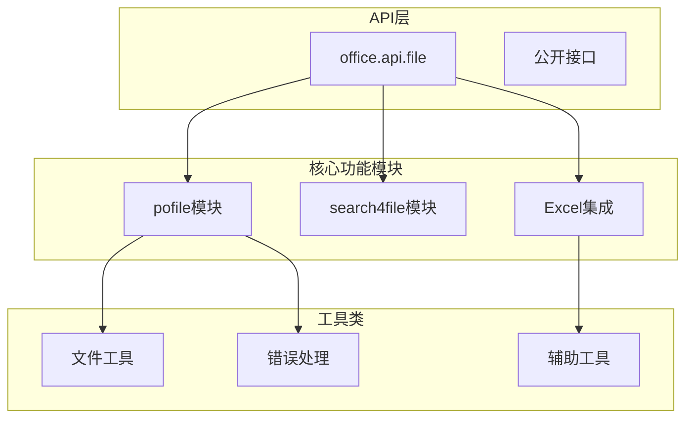

**图表来源**
- [office/api/file.py](file://office/api/file.py#L1-L163)
- [contributors/sustnf/file.py](file://contributors/sustnf/file.py#L1-L88)

**章节来源**
- [office/api/file.py](file://office/api/file.py#L1-L163)

## 核心组件

### 主要API函数

文件管理模块提供了六个核心API函数，每个函数都有明确的功能定位：

| 函数名 | 功能描述 | 参数说明 | 返回值 |
|--------|----------|----------|--------|
| `replace4filename` | 批量修改文件/文件夹名称 | path, del_content, replace_content, dir_rename, file_rename, suffix | None |
| `file_name_insert_content` | 在文件名中间插入字符 | file_path, insert_position, insert_content | None |
| `file_name_add_prefix` | 给文件名增加前缀 | file_path, prefix_content | None |
| `file_name_add_postfix` | 给文件名增加后缀 | file_path, postfix_content | None |
| `output_file_list_to_excel` | 将文件列表导出到Excel | dir_path | None |
| `search_specify_type_file` | 搜索指定类型文件 | file_path, file_type | None |
| `group_by_name` | 按名称分组整理文件 | path, output_path, del_old_file | None |
| `get_files` | 获取指定条件的文件列表 | path, name, suffix, sub, level | list |

**章节来源**
- [office/api/file.py](file://office/api/file.py#L29-L162)

## 架构概览

文件管理功能采用分层架构设计，确保功能的可扩展性和维护性：

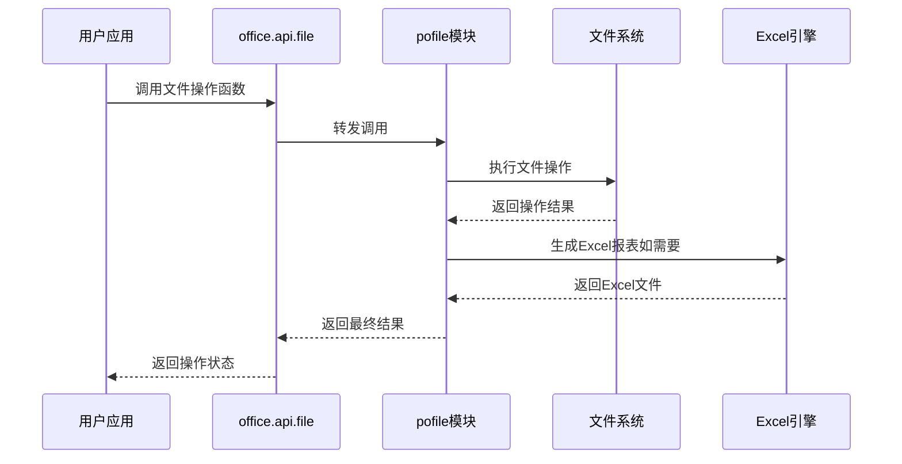

**图表来源**
- [office/api/file.py](file://office/api/file.py#L29-L162)
- [contributors/yinzeyuan/output_file_list_to_excel.py](file://contributors/yinzeyuan/output_file_list_to_excel.py#L5-L26)

## 详细功能分析

### 批量重命名功能

批量重命名是文件管理的核心功能之一，支持多种重命名模式：

#### replace4filename函数详解

该函数提供最灵活的批量重命名能力：

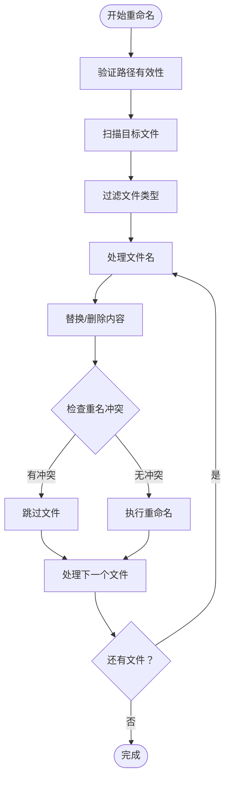

**图表来源**
- [office/api/file.py](file://office/api/file.py#L29-L44)
- [examples/pofile/批量重命名.py](file://examples/pofile/批量重命名.py#L21-L27)

#### 文件名操作函数

除了基本的替换功能，还提供了专门的文件名操作函数：

- **file_name_insert_content**: 在指定位置插入内容
- **file_name_add_prefix**: 添加前缀
- **file_name_add_postfix**: 添加后缀

这些函数都遵循相同的错误处理原则，确保操作的安全性。

**章节来源**
- [office/api/file.py](file://office/api/file.py#L48-L87)
- [examples/pofile/批量重命名.py](file://examples/pofile/批量重命名.py#L1-L28)

## 批量文件操作能力

### 文件搜索功能

系统提供了多层次的文件搜索能力：

#### 基于后缀名的搜索

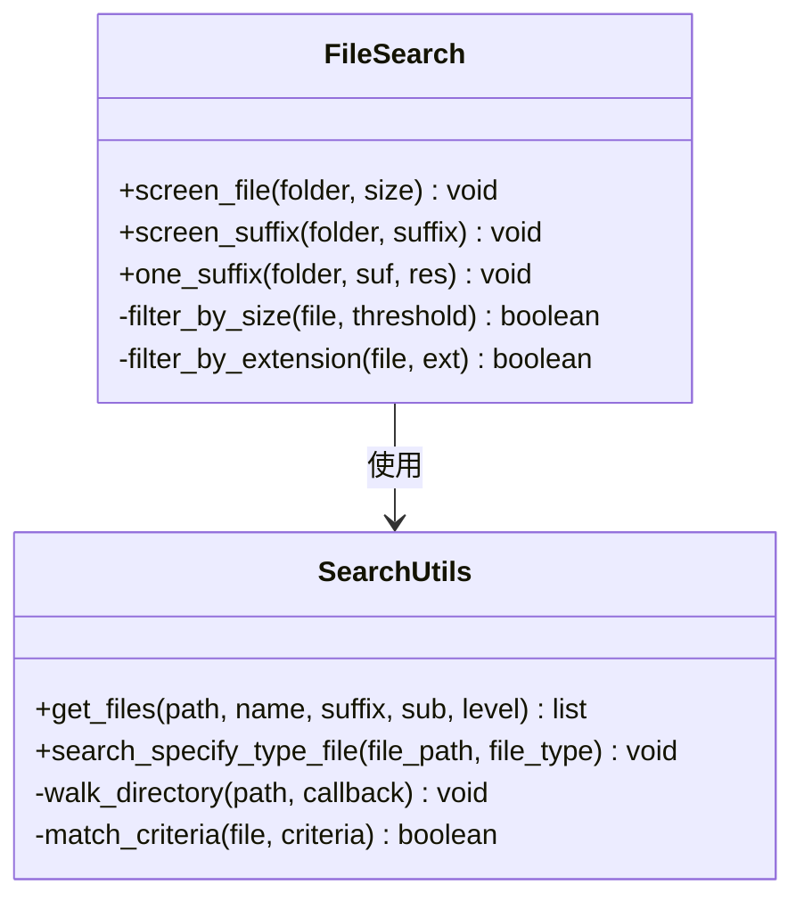

**图表来源**
- [contributors/sustnf/file.py](file://contributors/sustnf/file.py#L23-L87)
- [office/api/file.py](file://office/api/file.py#L120-L162)

#### 基于内容的搜索

系统支持深度文件内容搜索，能够查找包含特定文本的文件：

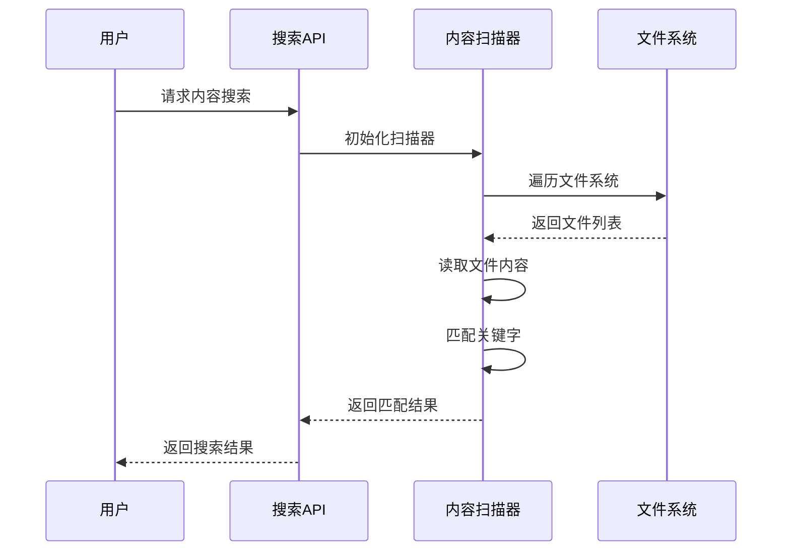

**图表来源**
- [examples/pofile/根据内容，查找文件.py](file://examples/pofile/根据内容，查找文件.py#L1-L21)
- [tests/test_code/test_search_by_content.py](file://tests/test_code/test_search_by_content.py#L16-L17)

**章节来源**
- [contributors/sustnf/file.py](file://contributors/sustnf/file.py#L23-L87)
- [office/api/file.py](file://office/api/file.py#L120-L162)

## 文件搜索功能

### 多维度搜索策略

系统实现了三种主要的搜索策略：

#### 1. 大小筛选搜索
- 支持按文件大小阈值筛选
- 可设置MB级别的精确度
- 提供直观的结果反馈

#### 2. 后缀名筛选搜索
- 支持单个或多个后缀名组合
- 递归遍历子目录
- 实时显示匹配结果

#### 3. 内容搜索
- 支持全文本内容匹配
- 忽略文件格式限制
- 提供精确的匹配位置信息

**章节来源**
- [contributors/sustnf/file.py](file://contributors/sustnf/file.py#L23-L87)

## 文件分类整理

### 自动化整理流程

文件分类整理功能提供了智能化的文件管理解决方案：

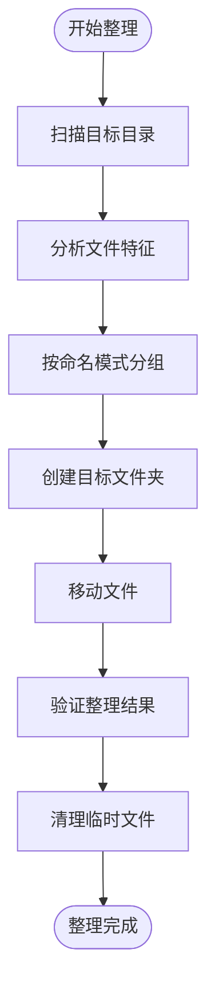

**图表来源**
- [examples/pofile/自动整理文件夹.py](file://examples/pofile/自动整理文件夹.py#L1-L25)
- [office/api/file.py](file://office/api/file.py#L133-L146)

### 整理策略配置

系统支持灵活的整理策略配置：

| 参数 | 类型 | 默认值 | 说明 |
|------|------|--------|------|
| path | str | 必需 | 要整理的目录路径 |
| output_path | str | None | 输出目录路径 |
| del_old_file | bool | None | 是否删除原文件 |

**章节来源**
- [examples/pofile/自动整理文件夹.py](file://examples/pofile/自动整理文件夹.py#L1-L25)
- [office/api/file.py](file://office/api/file.py#L133-L146)

## Excel集成功能

### 文件清单生成功能

系统提供了强大的Excel集成功能，能够将文件信息导出为结构化的报表：

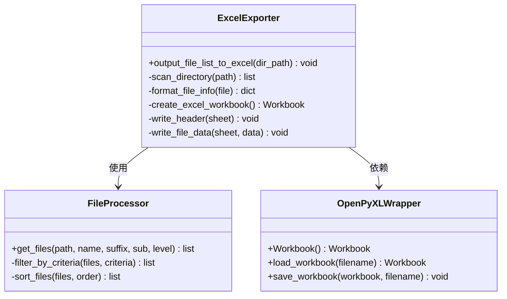

**图表来源**
- [contributors/yinzeyuan/output_file_list_to_excel.py](file://contributors/yinzeyuan/output_file_list_to_excel.py#L5-L26)
- [office/api/file.py](file://office/api/file.py#L90-L99)

### Excel报表格式

生成的Excel报表包含以下字段：

| 字段名 | 数据类型 | 说明 |
|--------|----------|------|
| 完整路径 | String | 文件的绝对路径 |
| 文件所在路径 | String | 文件所在的父目录 |
| 文件名 | String | 文件的基本名称 |

**章节来源**
- [contributors/yinzeyuan/output_file_list_to_excel.py](file://contributors/yinzeyuan/output_file_list_to_excel.py#L1-L27)
- [office/api/file.py](file://office/api/file.py#L90-L99)

## 错误处理机制

### 统一异常处理

系统实现了统一的异常处理机制，确保操作的健壮性：

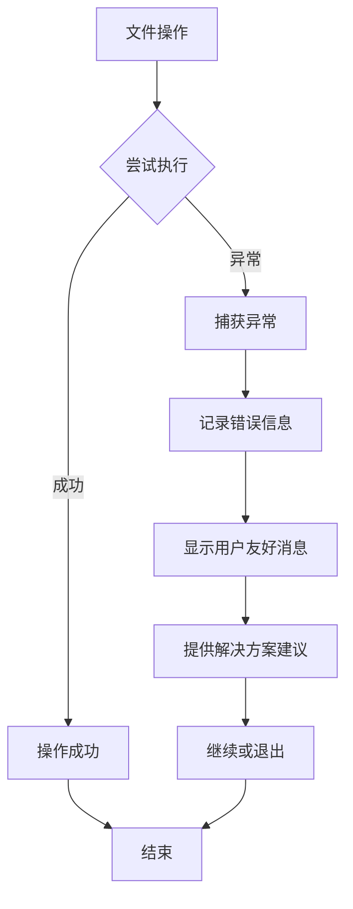

**图表来源**
- [office/lib/utils/except_utils.py](file://office/lib/utils/except_utils.py#L10-L34)

### 常见错误类型

系统能够处理以下类型的错误：

1. **权限错误**: 文件访问权限不足
2. **文件占用**: 文件被其他进程占用
3. **路径错误**: 无效的文件路径
4. **磁盘空间不足**: 存储空间不够
5. **编码错误**: 文件内容编码问题

**章节来源**
- [office/lib/utils/except_utils.py](file://office/lib/utils/except_utils.py#L1-L35)

## 实践案例

### 案例1：批量重命名

该案例展示了如何使用批量重命名功能处理大量文件：

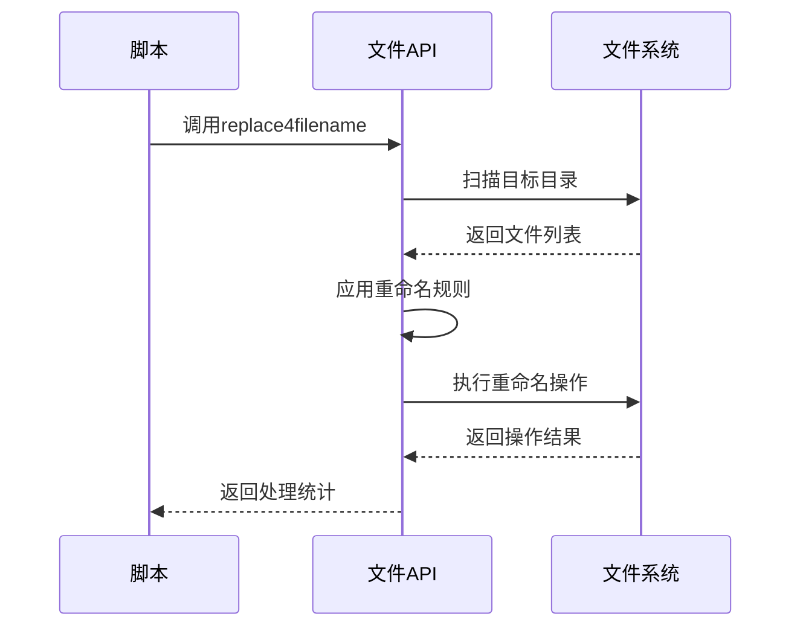

**图表来源**
- [examples/pofile/批量重命名.py](file://examples/pofile/批量重命名.py#L21-L27)

### 案例2：自动整理文件夹

展示了一个完整的文件整理工作流程：

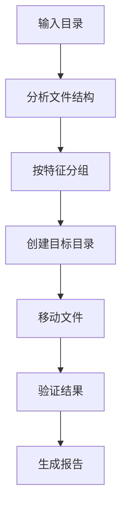

**图表来源**
- [examples/pofile/自动整理文件夹.py](file://examples/pofile/自动整理文件夹.py#L22-L25)

### 案例3：基于内容的文件查找

演示了如何根据文件内容进行精确查找：

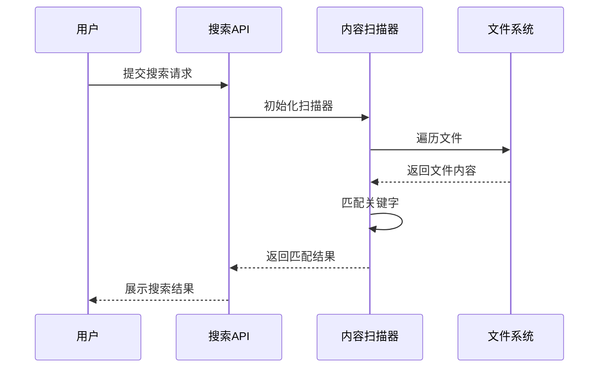

**图表来源**
- [examples/pofile/根据内容，查找文件.py](file://examples/pofile/根据内容，查找文件.py#L18-L21)

**章节来源**
- [examples/pofile/批量重命名.py](file://examples/pofile/批量重命名.py#L1-L28)
- [examples/pofile/自动整理文件夹.py](file://examples/pofile/自动整理文件夹.py#L1-L25)
- [examples/pofile/根据内容，查找文件.py](file://examples/pofile/根据内容，查找文件.py#L1-L21)

## 常见问题解决方案

### 权限错误处理

当遇到文件权限问题时，系统提供了以下解决方案：

1. **检查文件权限**: 确保有足够的读写权限
2. **管理员权限**: 以管理员身份运行脚本
3. **文件锁定**: 关闭占用文件的应用程序
4. **路径验证**: 验证文件路径的有效性

### 占用文件处理

对于被占用的文件，系统采用以下策略：

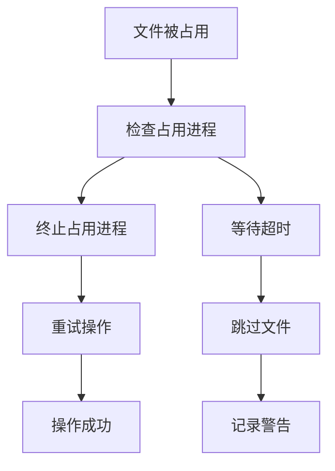

### 性能优化建议

1. **批量操作**: 尽可能使用批量操作减少IO次数
2. **内存管理**: 处理大文件时注意内存使用
3. **并发控制**: 避免同时操作大量文件
4. **缓存策略**: 对重复操作使用缓存机制

**章节来源**
- [office/lib/utils/except_utils.py](file://office/lib/utils/except_utils.py#L10-L34)

## 性能考虑

### 大规模文件处理

系统针对大规模文件处理进行了优化：

- **流式处理**: 对大文件采用流式读取
- **内存映射**: 使用内存映射技术处理大文件
- **异步操作**: 支持异步文件操作
- **进度监控**: 提供实时进度反馈

### 存储优化

- **压缩存储**: 支持文件压缩存储
- **增量备份**: 实现增量备份机制
- **空间回收**: 自动清理临时文件

## 故障排除指南

### 常见错误诊断

| 错误类型 | 症状 | 解决方案 |
|----------|------|----------|
| 权限拒绝 | PermissionError异常 | 检查文件权限，提升用户权限 |
| 文件不存在 | FileNotFoundError | 验证文件路径正确性 |
| 编码错误 | UnicodeDecodeError | 指定正确的文件编码 |
| 内存不足 | MemoryError | 减少同时处理的文件数量 |

### 调试技巧

1. **启用详细日志**: 设置更详细的日志级别
2. **分步测试**: 将复杂操作分解为简单步骤
3. **边界测试**: 测试极端情况下的系统行为
4. **性能监控**: 监控系统资源使用情况

**章节来源**
- [tests/test_code/test_file.py](file://tests/test_code/test_file.py#L1-L70)

## 总结

Python-Office的文件管理功能提供了一套完整而强大的批量文件操作解决方案。通过其模块化的架构设计，系统能够满足从基础文件操作到复杂自动化流程的各种需求。

### 核心优势

1. **功能完整性**: 涵盖文件管理的所有核心需求
2. **易用性**: 提供简洁直观的API接口
3. **可靠性**: 完善的错误处理和异常管理
4. **扩展性**: 支持自定义扩展和第三方集成

### 应用场景

- **文档管理**: 大规模文档的批量处理
- **媒体整理**: 图片、视频文件的自动化管理
- **数据备份**: 文件的定期备份和整理
- **内容检索**: 基于内容的文件快速查找

该模块为开发者提供了一个可靠的文件管理工具箱，能够显著提高文件处理的效率和质量。通过合理的使用和配置，可以实现各种复杂的文件管理自动化流程。