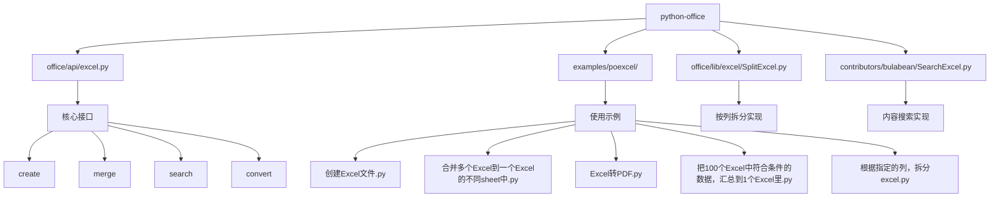
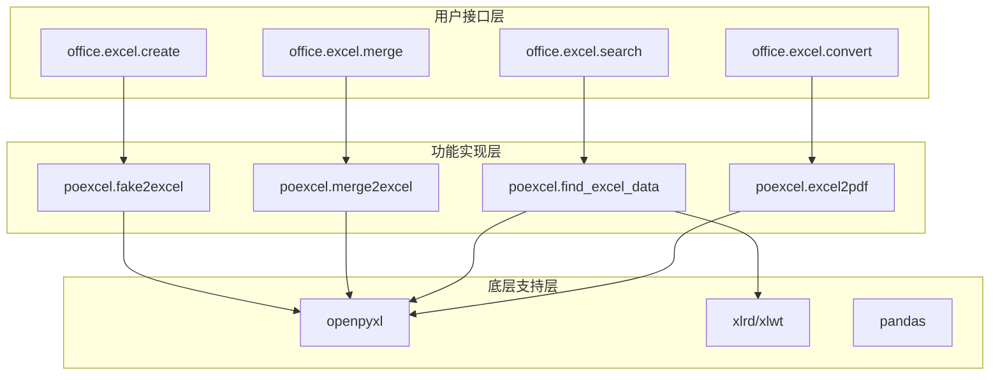
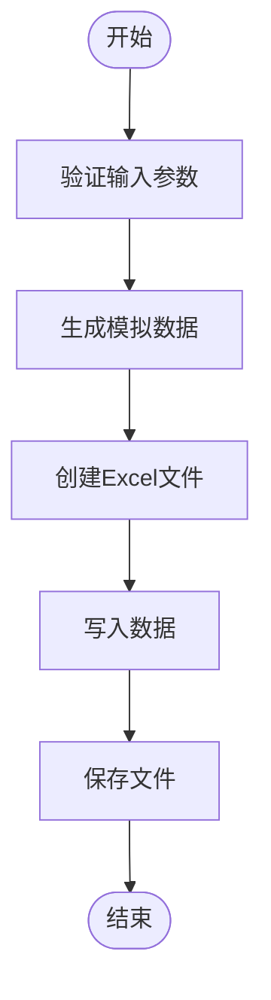
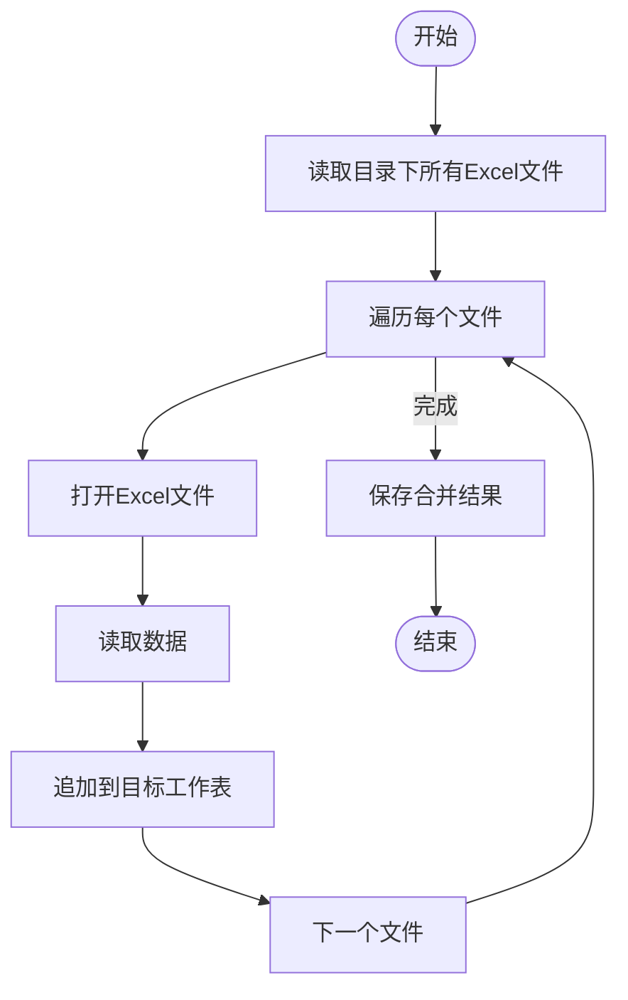
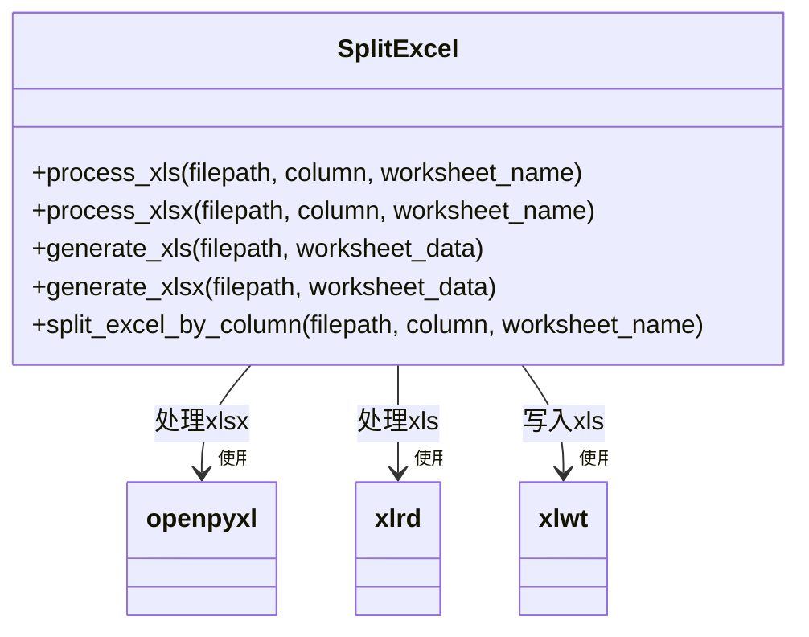
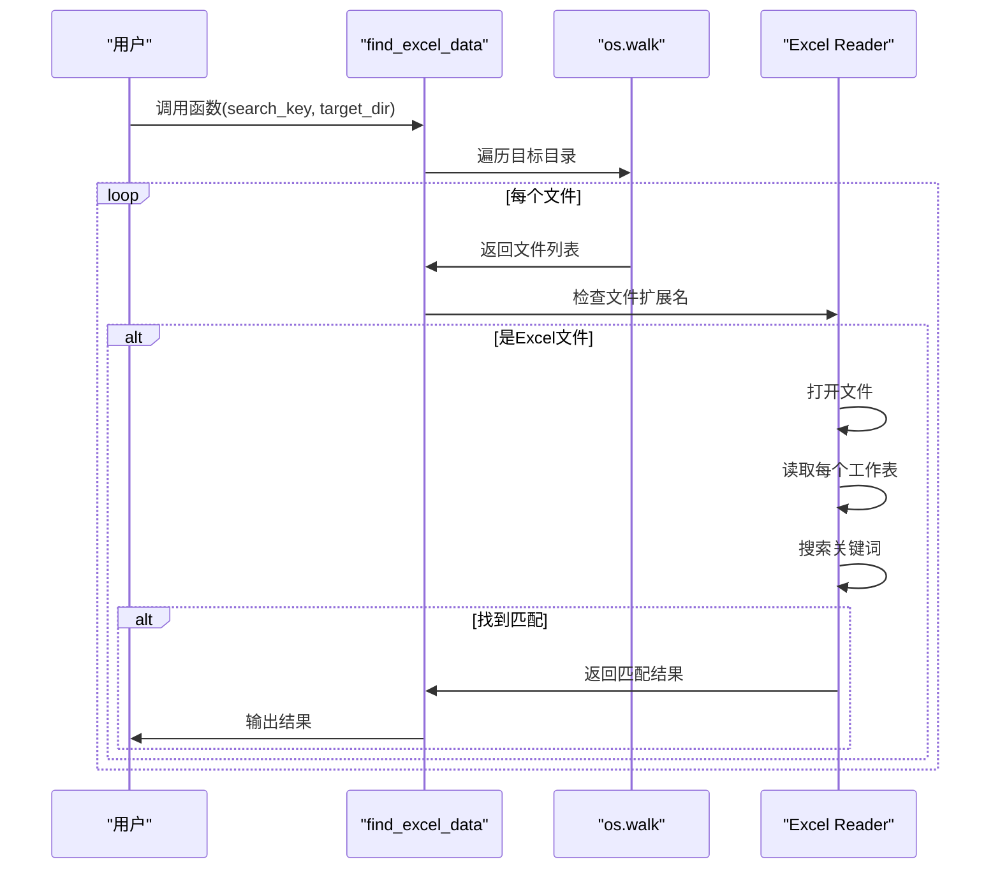
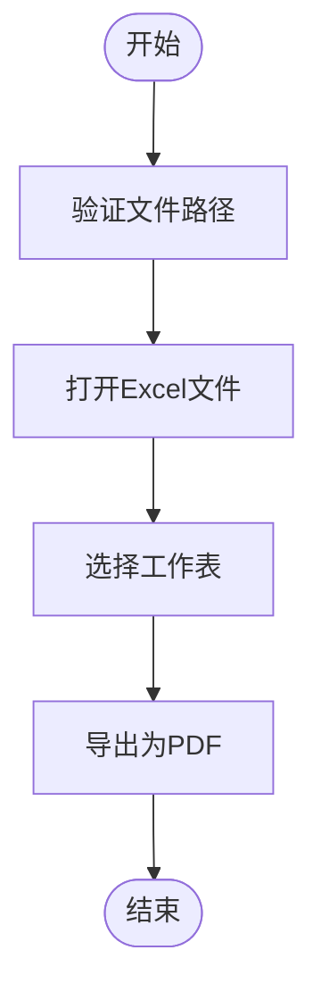
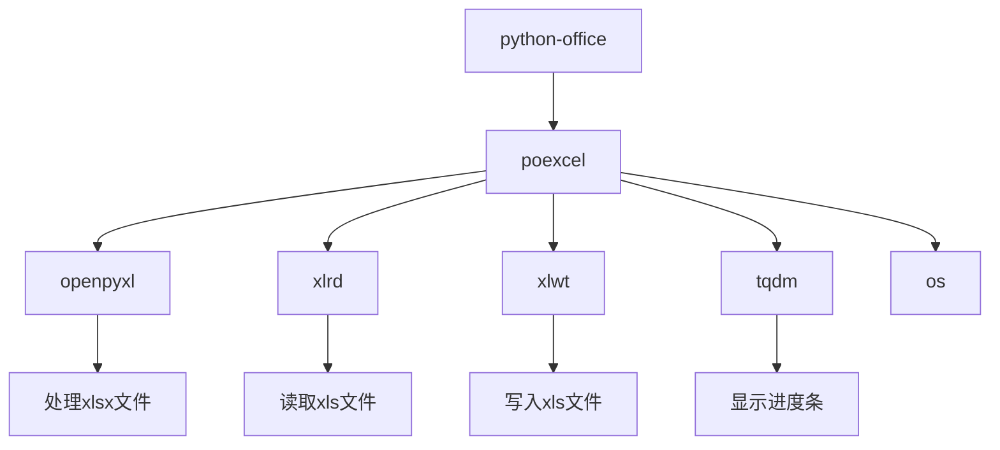

# Excel处理

<cite>
**本文档中引用的文件**  
- [excel.py](file://office/api/excel.py)
- [创建Excel文件.py](file://examples/poexcel/创建Excel文件.py)
- [合并2个Excel的内容到一个sheet中.py](file://examples/poexcel/合并2个Excel的内容到一个sheet中.py)
- [合并多个Excel到一个Excel的不同sheet中.py](file://examples/poexcel/合并多个Excel到一个Excel的不同sheet中.py)
- [Excel转PDF.py](file://examples/poexcel/Excel转PDF.py)
- [把100个Excel中符合条件的数据，汇总到1个Excel里.py](file://examples/poexcel/把100个Excel中符合条件的数据，汇总到1个Excel里.py)
- [根据指定的列，拆分excel.py](file://examples/poexcel/根据指定的列，拆分excel.py)
- [同一个excel里的不同sheet，拆分为不同的excel文件.py](file://examples/poexcel/同一个excel里的不同sheet，拆分为不同的excel文件.py)
- [SplitExcel.py](file://office/lib/excel/SplitExcel.py)
- [SearchExcel.py](file://contributors/bulabean/SearchExcel.py)
</cite>

## 目录
1. [简介](#简介)
2. [项目结构](#项目结构)
3. [核心功能](#核心功能)
4. [架构概述](#架构概述)
5. [详细组件分析](#详细组件分析)
6. [依赖分析](#依赖分析)
7. [性能考虑](#性能考虑)
8. [故障排除指南](#故障排除指南)
9. [结论](#结论)

## 简介
本项目提供了一套完整的Excel自动化处理解决方案，通过`python-office`库实现了从基础数据写入到复杂数据聚合的全流程操作。模块设计遵循简洁易用原则，用户可通过简单的函数调用完成复杂的Excel操作任务。主要功能涵盖Excel文件创建、数据读写、格式转换（如转PDF）、工作表合并与拆分、条件查询与数据汇总等，适用于各类办公自动化场景。

## 项目结构

**图示来源**  
- [office/api/excel.py](file://office/api/excel.py#L1-L136)
- [examples/poexcel/](file://examples/poexcel/)
- [office/lib/excel/SplitExcel.py](file://office/lib/excel/SplitExcel.py#L1-L144)
- [contributors/bulabean/SearchExcel.py](file://contributors/bulabean/SearchExcel.py#L95-L153)

## 核心功能

该模块提供了丰富的Excel处理功能，主要包括：

- **fake2excel**: 自动创建Excel文件并生成模拟数据
- **merge2excel**: 将多个Excel文件合并到一个文件的不同工作表中
- **sheet2excel**: 将单个Excel文件中的多个工作表拆分为独立文件
- **merge2sheet**: 将多个Excel文件的数据合并到同一个工作表中
- **find_excel_data**: 在指定目录下搜索包含特定内容的Excel文件
- **split_excel_by_column**: 根据指定列的内容将Excel文件拆分为多个文件
- **excel2pdf**: 将Excel文件转换为PDF格式

这些功能通过简洁的API设计，使用户能够以最少的代码实现复杂的Excel操作。

**本节来源**  
- [office/api/excel.py](file://office/api/excel.py#L1-L136)

## 架构概述

**图示来源**  
- [office/api/excel.py](file://office/api/excel.py#L22-L136)
- [office/lib/excel/SplitExcel.py](file://office/lib/excel/SplitExcel.py#L2-L144)
- [contributors/bulabean/SearchExcel.py](file://contributors/bulabean/SearchExcel.py#L95-L153)

## 详细组件分析

### 创建Excel文件功能分析

`fake2excel`函数用于自动创建Excel文件并填充模拟数据。支持自定义列名、行数、输出路径和语言设置（中文或英文）。

**图示来源**  
- [office/api/excel.py](file://office/api/excel.py#L25-L40)
- [examples/poexcel/创建Excel文件.py](file://examples/poexcel/创建Excel文件.py#L1-L19)

### 合并Excel功能分析

提供两种合并模式：`merge2excel`将多个文件合并为一个文件的多个工作表；`merge2sheet`将多个文件的数据合并到一个工作表中。

**图示来源**  
- [office/api/excel.py](file://office/api/excel.py#L42-L55)
- [examples/poexcel/合并2个Excel的内容到一个sheet中.py](file://examples/poexcel/合并2个Excel的内容到一个sheet中.py#L1-L28)
- [examples/poexcel/合并多个Excel到一个Excel的不同sheet中.py](file://examples/poexcel/合并多个Excel到一个Excel的不同sheet中.py#L1-L20)

### 拆分Excel功能分析

`split_excel_by_column`函数根据指定列的值将Excel文件拆分为多个文件，支持.xls和.xlsx格式。

**图示来源**  
- [office/lib/excel/SplitExcel.py](file://office/lib/excel/SplitExcel.py#L1-L144)
- [examples/poexcel/根据指定的列，拆分excel.py](file://examples/poexcel/根据指定的列，拆分excel.py#L1-L33)

### 查询与搜索功能分析

`find_excel_data`函数在指定目录下搜索包含关键词的Excel文件，支持.xls和.xlsx格式。

**图示来源**  
- [contributors/bulabean/SearchExcel.py](file://contributors/bulabean/SearchExcel.py#L95-L153)
- [office/api/excel.py](file://office/api/excel.py#L92-L104)

### 格式转换功能分析

`excel2pdf`函数将Excel文件转换为PDF格式，支持指定工作表。

**图示来源**  
- [office/api/excel.py](file://office/api/excel.py#L123-L136)
- [examples/poexcel/Excel转PDF.py](file://examples/poexcel/Excel转PDF.py#L1-L25)

## 依赖分析

**图示来源**  
- [office/api/excel.py](file://office/api/excel.py#L22)
- [office/lib/excel/SplitExcel.py](file://office/lib/excel/SplitExcel.py#L2-L4)
- [contributors/bulabean/SearchExcel.py](file://contributors/bulabean/SearchExcel.py#L1-L4)

## 性能考虑

当处理大量Excel文件时，可能会遇到内存占用过高的问题。建议采取以下措施：

1. **分批处理**：对于大量文件，采用分批处理的方式，避免一次性加载所有文件到内存
2. **使用只读模式**：使用`openpyxl`的`read_only=True`参数，减少内存占用
3. **及时释放资源**：处理完每个文件后及时关闭工作簿对象
4. **选择合适的数据结构**：对于大数据量，考虑使用pandas进行数据处理

对于编码问题，确保文件路径和内容使用UTF-8编码，并在必要时进行编码转换。

**本节来源**  
- [office/lib/excel/SplitExcel.py](file://office/lib/excel/SplitExcel.py#L96)
- [contributors/bulabean/SearchExcel.py](file://contributors/bulabean/SearchExcel.py#L97)

## 故障排除指南

常见问题及解决方案：

- **文件读取异常**：检查文件路径是否正确，文件是否被其他程序占用
- **内存不足**：减少同时处理的文件数量，或升级硬件配置
- **编码错误**：确保使用UTF-8编码处理文件路径和内容
- **列索引越界**：检查指定的列号是否超出文件实际列数范围
- **格式不支持**：确认文件扩展名为.xls或.xlsx，不支持其他格式

**本节来源**  
- [office/lib/excel/SplitExcel.py](file://office/lib/excel/SplitExcel.py#L44-L45)
- [office/lib/excel/SplitExcel.py](file://office/lib/excel/SplitExcel.py#L103-L104)

## 结论

`python-office`的Excel处理模块提供了一套完整、易用的办公自动化解决方案。通过简洁的API设计，用户可以轻松实现各种复杂的Excel操作。模块具有良好的扩展性，支持pandas集成，为高级用户提供了性能优化的可能性。结合丰富的示例代码，即使是编程新手也能快速上手，提高工作效率。