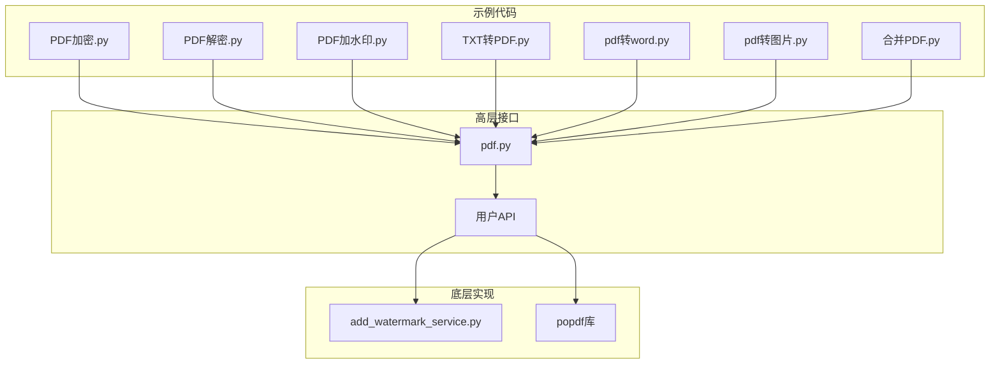
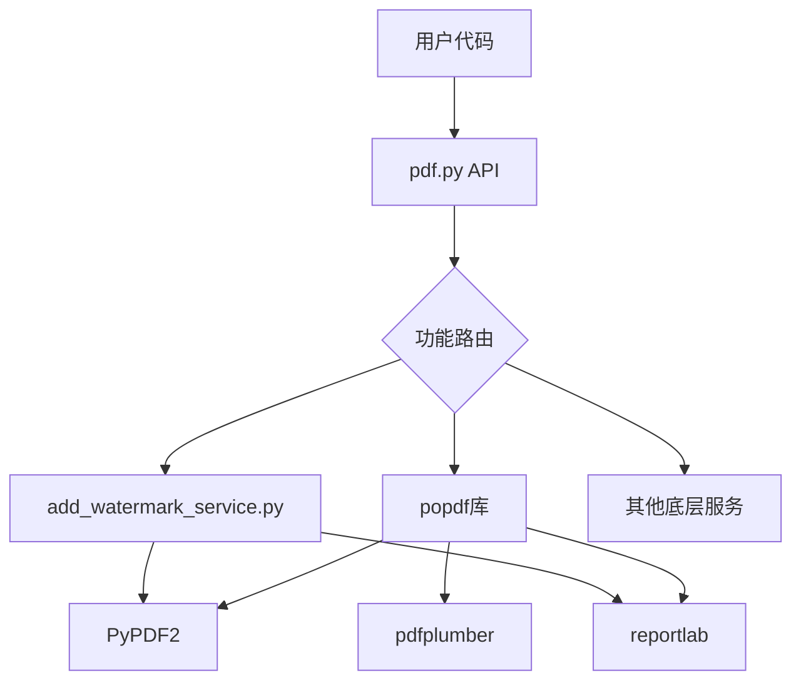
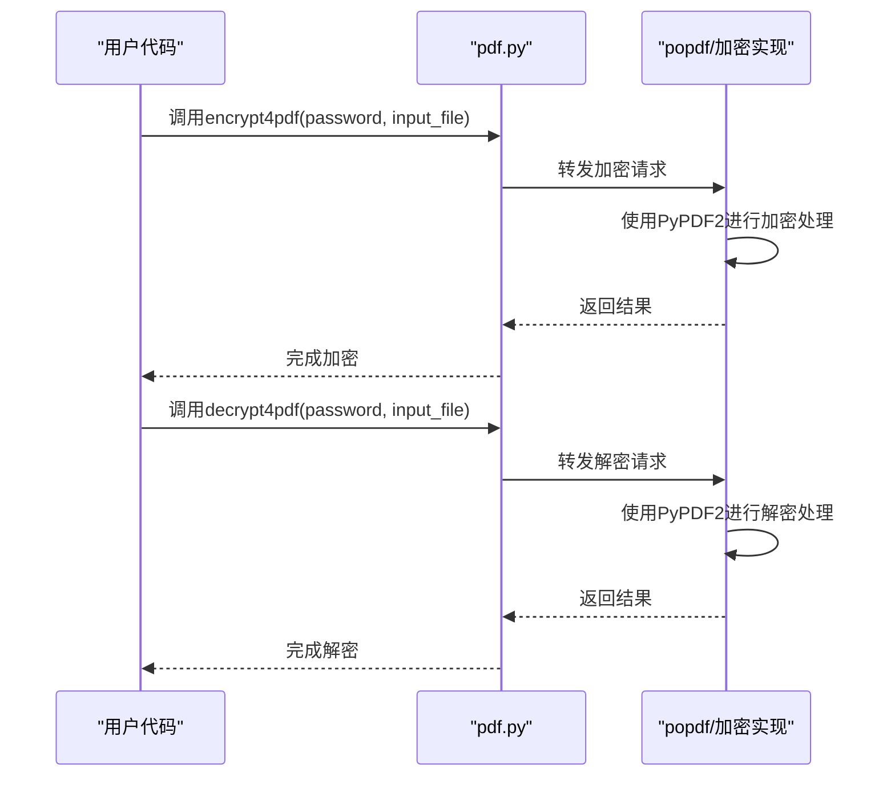
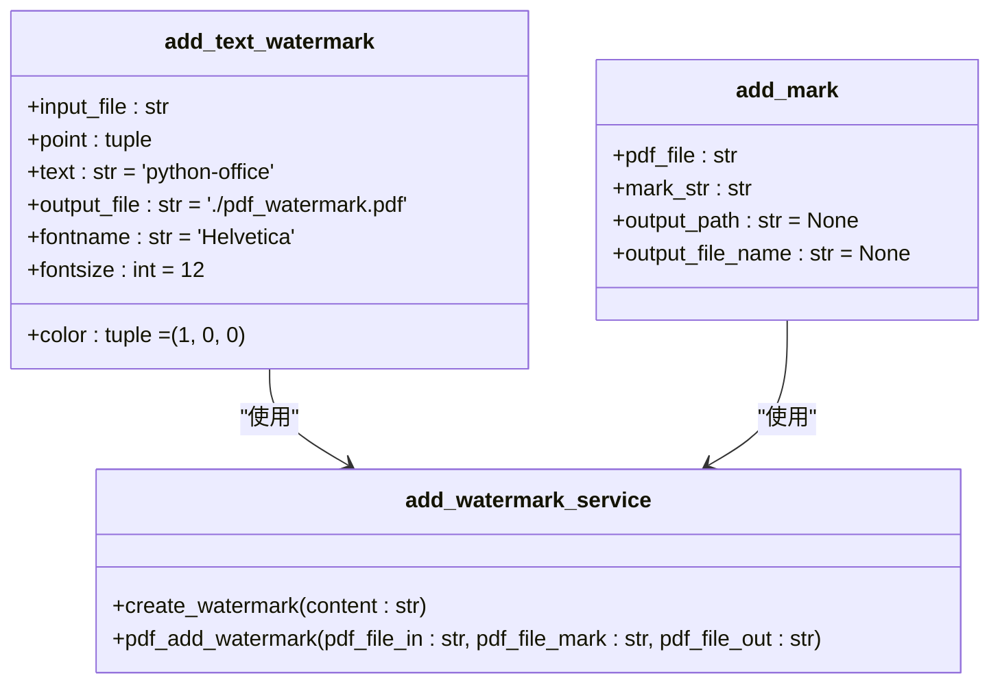
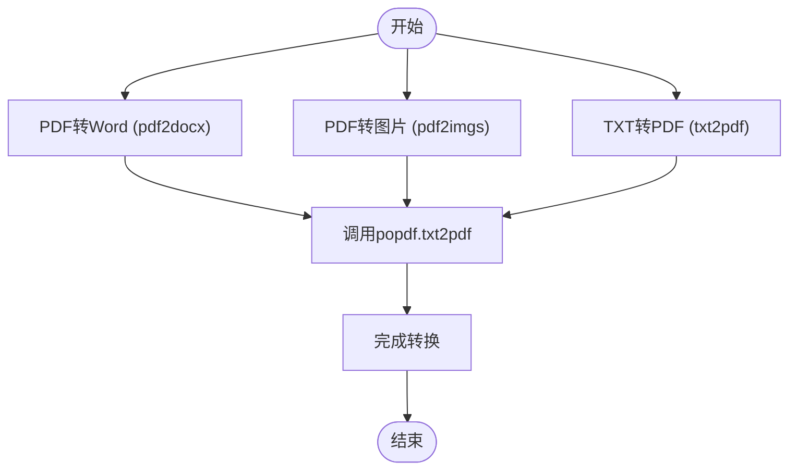
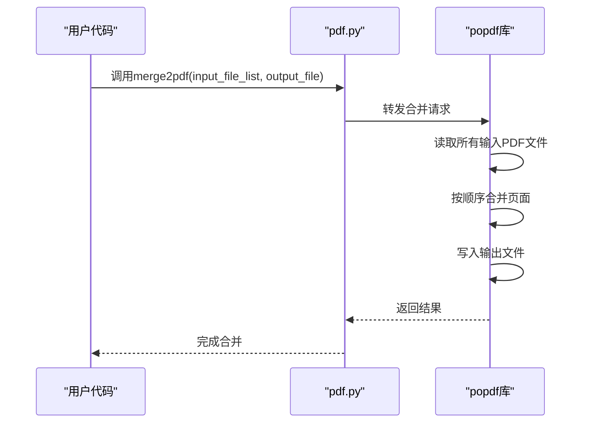
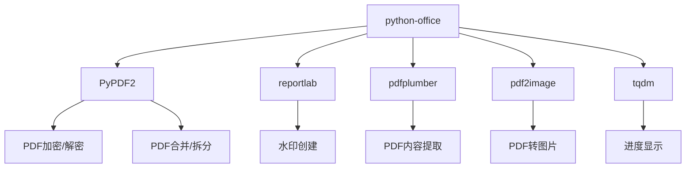

# PDF处理

<cite>
**本文档引用的文件**   
- [pdf.py](file://office/api/pdf.py)
- [add_watermark_service.py](file://office/lib/pdf/add_watermark_service.py)
- [PDF加密.py](file://examples/popdf/PDF加密.py)
- [PDF解密.py](file://examples/popdf/PDF解密.py)
- [PDF加水印.py](file://examples/popdf/PDF加水印.py)
- [TXT转PDF.py](file://examples/popdf/TXT转PDF.py)
- [pdf转word.py](file://examples/popdf/pdf转word.py)
- [pdf转图片.py](file://examples/popdf/pdf转图片.py)
- [合并PDF.py](file://examples/popdf/合并PDF.py)
- [except_utils.py](file://office/lib/utils/except_utils.py)
</cite>

## 目录
1. [简介](#简介)
2. [项目结构](#项目结构)
3. [核心功能](#核心功能)
4. [架构概述](#架构概述)
5. [详细组件分析](#详细组件分析)
6. [依赖分析](#依赖分析)
7. [性能考虑](#性能考虑)
8. [故障排除指南](#故障排除指南)
9. [结论](#结论)

## 简介
python-office库提供了一套完整的PDF处理解决方案，支持多种常见的文档操作需求。该模块封装了底层复杂的PDF处理逻辑，为开发者提供了简洁易用的API接口，能够快速实现PDF文件的加密、解密、加水印、格式转换和合并等关键功能。通过分析源码和示例脚本，本文档将全面记录这些功能的技术细节与使用方式，帮助用户从新手快速上手到深度定制开发。

## 项目结构
python-office项目的PDF处理功能主要分布在`office/api/pdf.py`模块中，该模块作为高层接口暴露给用户使用。实际的实现逻辑则分散在`popdf`包和`office/lib/pdf/`目录下的服务文件中。示例代码位于`examples/popdf/`目录下，提供了各种功能的完整使用示例。这种分层架构使得接口与实现分离，便于维护和扩展。

**Diagram sources**
- [pdf.py](file://office/api/pdf.py)
- [add_watermark_service.py](file://office/lib/pdf/add_watermark_service.py)
- [PDF加密.py](file://examples/popdf/PDF加密.py)

**Section sources**
- [pdf.py](file://office/api/pdf.py)
- [add_watermark_service.py](file://office/lib/pdf/add_watermark_service.py)
- [PDF加密.py](file://examples/popdf/PDF加密.py)

## 核心功能
python-office的PDF处理模块提供了丰富的功能集，涵盖了日常办公中最常见的PDF操作需求。主要功能包括PDF与Word文档之间的相互转换、PDF与图片之间的转换、文本文件转PDF、PDF文件加密解密、添加文本或图片水印、合并多个PDF文件以及拆分PDF文件等。这些功能通过简洁的函数接口暴露给用户，使得复杂的PDF操作变得简单直观。

**Section sources**
- [pdf.py](file://office/api/pdf.py)
- [PDF加密.py](file://examples/popdf/PDF加密.py)
- [PDF解密.py](file://examples/popdf/PDF解密.py)

## 架构概述
PDF处理模块采用分层架构设计，上层`pdf.py`文件提供统一的API接口，下层由`popdf`库和`office/lib/pdf/`中的具体实现服务提供支持。这种设计实现了接口与实现的解耦，使得功能扩展和维护更加容易。所有功能调用最终都会通过`popdf`包或直接调用底层服务来完成实际的PDF处理操作。

**Diagram sources**
- [pdf.py](file://office/api/pdf.py)
- [add_watermark_service.py](file://office/lib/pdf/add_watermark_service.py)

## 详细组件分析

### 加密与解密功能分析
加密和解密功能允许用户保护PDF文件的安全性，防止未经授权的访问。`encrypt4pdf`函数支持对单个PDF文件或整个目录下的多个PDF文件进行批量加密，而`decrypt4pdf`函数则用于解密已加密的PDF文件。这两个功能在处理敏感文档时尤为重要。

**Diagram sources**
- [pdf.py](file://office/api/pdf.py#L92-L131)
- [PDF加密.py](file://examples/popdf/PDF加密.py)
- [PDF解密.py](file://examples/popdf/PDF解密.py)

**Section sources**
- [pdf.py](file://office/api/pdf.py#L92-L131)
- [PDF加密.py](file://examples/popdf/PDF加密.py)
- [PDF解密.py](file://examples/popdf/PDF解密.py)

### 水印添加功能分析
水印添加功能允许用户在PDF文档中添加文本或图片水印，用于版权保护或文档标识。`add_text_watermark`和`add_mark`函数提供了灵活的参数配置，可以自定义水印的位置、内容、字体、大小和颜色等属性。

**Diagram sources**
- [pdf.py](file://office/api/pdf.py#L133-L225)
- [add_watermark_service.py](file://office/lib/pdf/add_watermark_service.py)
- [PDF加水印.py](file://examples/popdf/PDF加水印.py)

**Section sources**
- [pdf.py](file://office/api/pdf.py#L133-L225)
- [add_watermark_service.py](file://office/lib/pdf/add_watermark_service.py)
- [PDF加水印.py](file://examples/popdf/PDF加水印.py)

### 格式转换功能分析
格式转换功能支持多种文件格式之间的转换，包括PDF转Word、PDF转图片、TXT转PDF等。这些功能极大地提高了文档处理的灵活性，满足了不同场景下的需求。

**Diagram sources**
- [pdf.py](file://office/api/pdf.py#L28-L73)
- [pdf转word.py](file://examples/popdf/pdf转word.py)
- [pdf转图片.py](file://examples/popdf/pdf转图片.py)
- [TXT转PDF.py](file://examples/popdf/TXT转PDF.py)

**Section sources**
- [pdf.py](file://office/api/pdf.py#L28-L73)
- [pdf转word.py](file://examples/popdf/pdf转word.py)
- [pdf转图片.py](file://examples/popdf/pdf转图片.py)
- [TXT转PDF.py](file://examples/popdf/TXT转PDF.py)

### 合并PDF功能分析
合并功能允许用户将多个PDF文件合并成一个单一的PDF文档，这对于整理分散的文档非常有用。`merge2pdf`函数接受一个PDF文件路径列表和输出文件名作为参数，按指定顺序合并所有文件。

**Diagram sources**
- [pdf.py](file://office/api/pdf.py#L155-L167)
- [合并PDF.py](file://examples/popdf/合并PDF.py)

**Section sources**
- [pdf.py](file://office/api/pdf.py#L155-L167)
- [合并PDF.py](file://examples/popdf/合并PDF.py)

## 依赖分析
PDF处理模块依赖于多个第三方库来实现其功能。核心依赖包括PyPDF2用于PDF文件的读写和操作，reportlab用于创建PDF内容（如水印），pdfplumber用于PDF内容提取。这些库共同构成了PDF处理的基础能力。

**Diagram sources**
- [pdf.py](file://office/api/pdf.py)
- [add_watermark_service.py](file://office/lib/pdf/add_watermark_service.py)
- [setup.py](file://setup.py)

**Section sources**
- [pdf.py](file://office/api/pdf.py)
- [add_watermark_service.py](file://office/lib/pdf/add_watermark_service.py)

## 性能考虑
对于大型PDF文件的处理，建议采用分块处理策略以避免内存溢出。在添加水印等操作时，模块使用了tqdm库提供进度条显示，让用户了解处理进度。对于批量操作，可以考虑并行处理多个文件以提高效率。此外，处理完成后应及时关闭文件流，释放系统资源。

## 故障排除指南
常见的错误包括权限不足导致无法读写文件、字体缺失导致水印显示异常、密码错误导致解密失败等。对于权限问题，确保程序有足够的文件访问权限；对于字体问题，可以尝试使用系统中存在的其他字体；对于密码错误，仔细核对输入的密码。所有异常都会通过统一的异常处理机制捕获并提供友好的错误提示。

**Section sources**
- [except_utils.py](file://office/lib/utils/except_utils.py)
- [add_watermark_service.py](file://office/lib/pdf/add_watermark_service.py#L50-L58)

## 结论
python-office的PDF处理模块提供了一套完整且易用的解决方案，覆盖了日常办公中常见的PDF操作需求。通过简洁的API设计和清晰的示例代码，用户可以快速上手并集成到自己的项目中。同时，模块的分层架构也为开发者提供了深度定制的可能性。结合安全建议和性能优化策略，该模块能够满足从新手到专业开发者的不同需求。