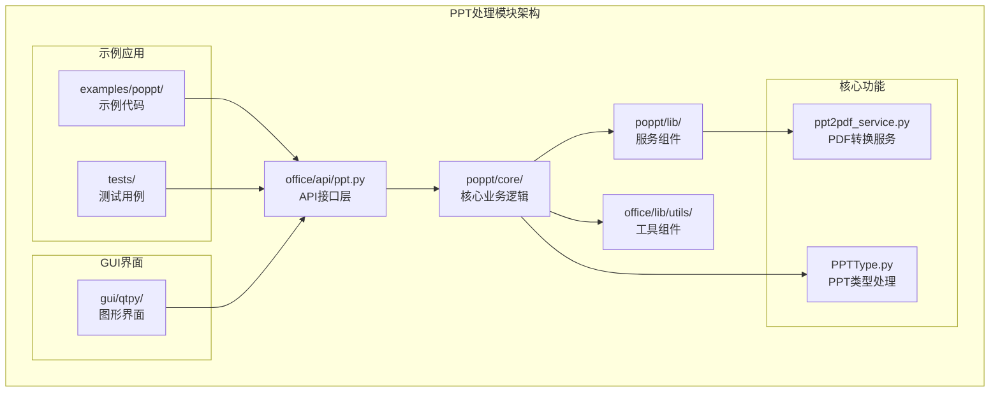
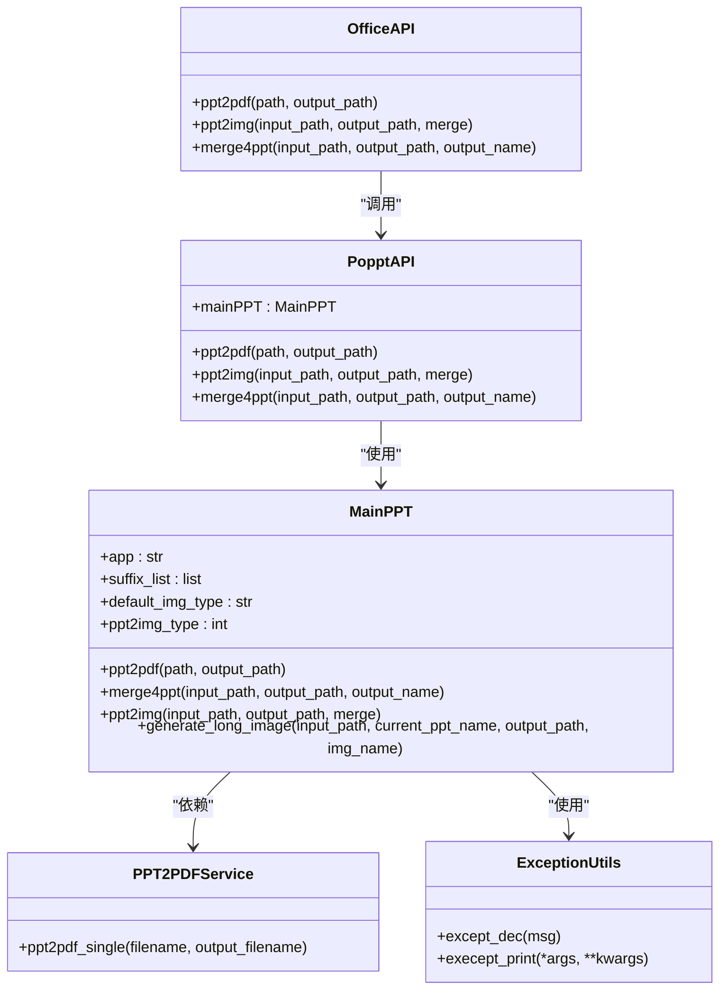
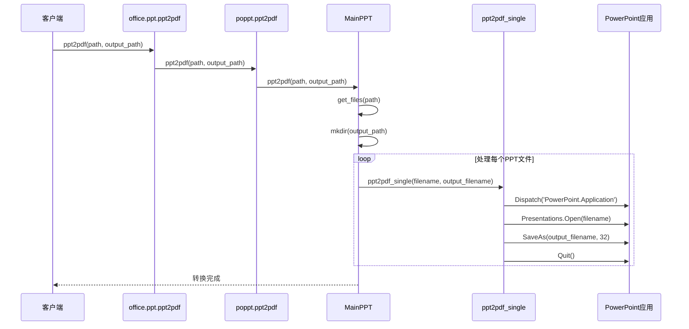
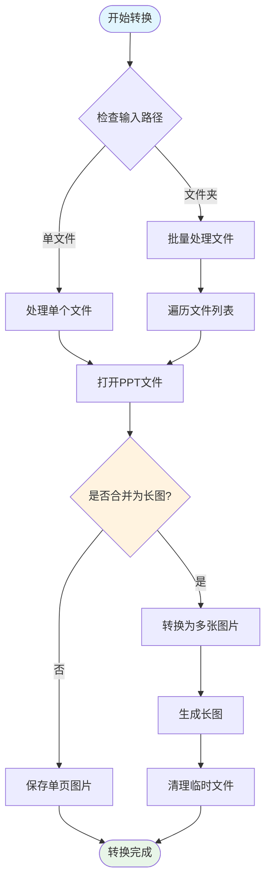
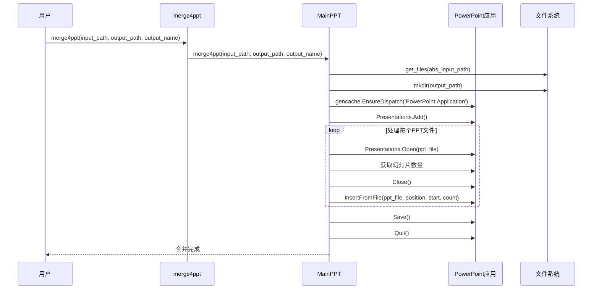
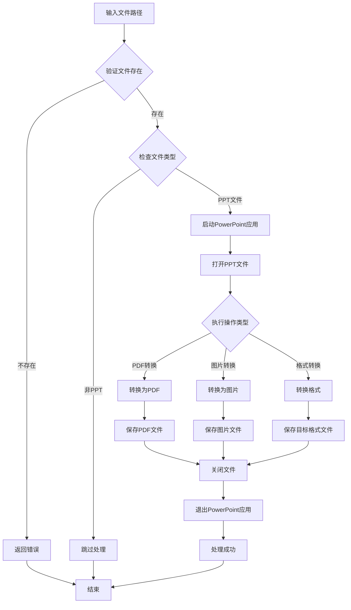
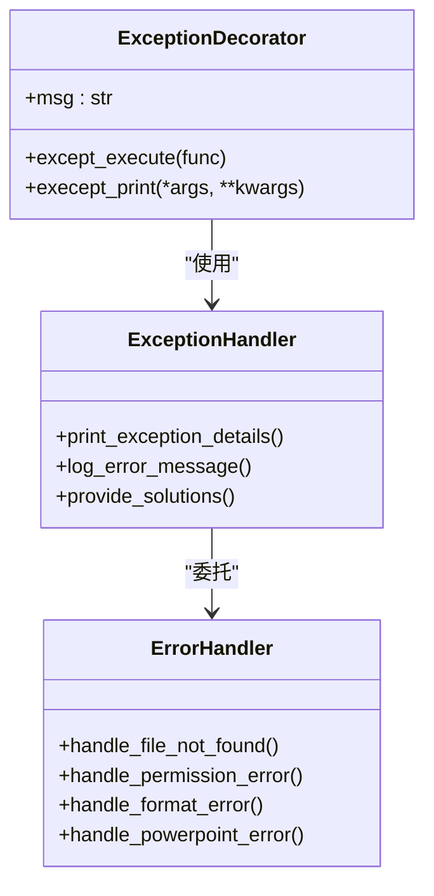
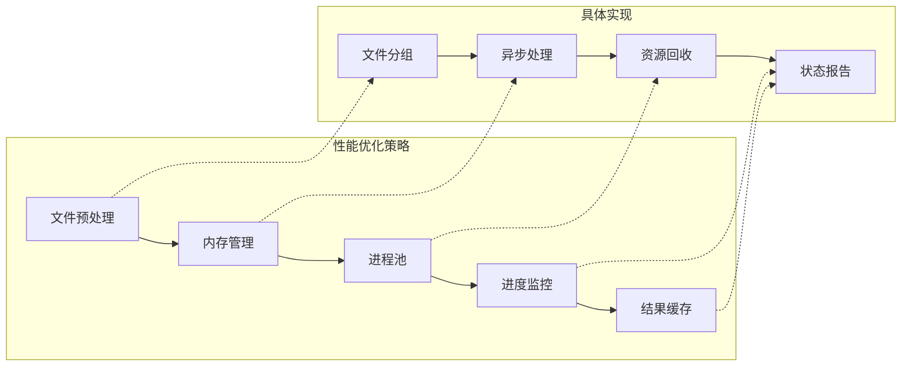
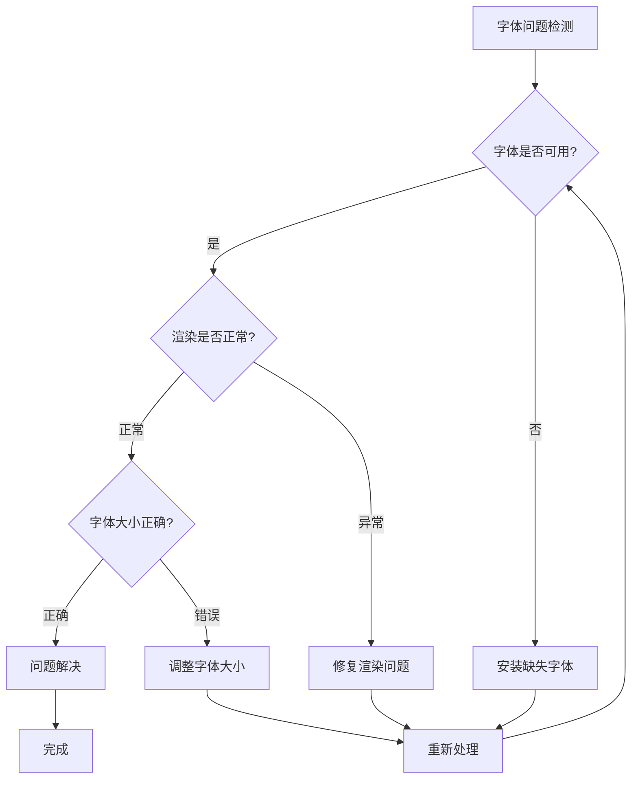
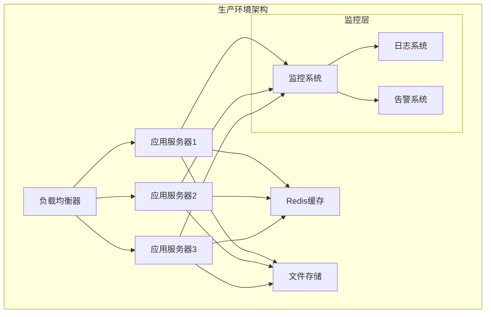

# PPT处理模块深度解析

<cite>
**本文档引用的文件**
- [office/api/ppt.py](file://office/api/ppt.py)
- [examples/poppt/merge4ppt.py](file://examples/poppt/merge4ppt.py)
- [examples/poppt/ppt2img.py](file://examples/poppt/ppt2img.py)
- [examples/poppt/ppt2pdf.py](file://examples/poppt/ppt2pdf.py)
- [office/lib/ppt/ppt2pdf_service.py](file://office/lib/ppt/ppt2pdf_service.py)
- [venv/Lib/site-packages/poppt/api/ppt.py](file://venv/Lib/site-packages/poppt/api/ppt.py)
- [venv/Lib/site-packages/poppt/core/PPTType.py](file://venv/Lib/site-packages/poppt/core/PPTType.py)
- [tests/test_code/test_ppt.py](file://tests/test_code/test_ppt.py)
- [office/lib/utils/except_utils.py](file://office/lib/utils/except_utils.py)
- [gui/qtpy/version1/customizeWindowPyfile/ui/ui_Widget.py](file://gui/qtpy/version1/customizeWindowPyfile/ui/ui_Widget.py)
</cite>

## 目录
1. [概述](#概述)
2. [项目结构分析](#项目结构分析)
3. [核心架构设计](#核心架构设计)
4. [主要功能模块详解](#主要功能模块详解)
5. [转换服务实现机制](#转换服务实现机制)
6. [异常处理与错误管理](#异常处理与错误管理)
7. [实际应用示例](#实际应用示例)
8. [性能优化策略](#性能优化策略)
9. [常见问题与解决方案](#常见问题与解决方案)
10. [最佳实践指南](#最佳实践指南)

## 概述

python-office的PPT处理模块是一个功能强大的办公自动化工具，提供了完整的PPT格式转换、合并和处理能力。该模块基于Microsoft PowerPoint的COM接口，支持PPT与PPTX格式之间的相互转换，以及将PPT转换为PDF和图片格式。

### 主要特性

- **多格式支持**：支持PPT、PPTX格式的相互转换
- **批量处理**：支持单文件和批量文件处理
- **多种输出格式**：PDF、JPG、PNG等多种格式输出
- **智能合并**：支持多个PPT文件的智能合并
- **长图生成功能**：可将PPT转换为单张长图
- **异常处理**：完善的错误处理和异常恢复机制

## 项目结构分析



**图表来源**
- [office/api/ppt.py](file://office/api/ppt.py#L1-L46)
- [venv/Lib/site-packages/poppt/core/PPTType.py](file://venv/Lib/site-packages/poppt/core/PPTType.py#L1-L121)
- [office/lib/ppt/ppt2pdf_service.py](file://office/lib/ppt/ppt2pdf_service.py#L1-L34)

**章节来源**
- [office/api/ppt.py](file://office/api/ppt.py#L1-L46)
- [venv/Lib/site-packages/poppt/core/PPTType.py](file://venv/Lib/site-packages/poppt/core/PPTType.py#L1-L121)

## 核心架构设计

### 分层架构模式

PPT处理模块采用经典的分层架构设计，确保了代码的可维护性和扩展性：



**图表来源**
- [office/api/ppt.py](file://office/api/ppt.py#L7-L45)
- [venv/Lib/site-packages/poppt/api/ppt.py](file://venv/Lib/site-packages/poppt/api/ppt.py#L15-L34)
- [venv/Lib/site-packages/poppt/core/PPTType.py](file://venv/Lib/site-packages/poppt/core/PPTType.py#L13-L121)

### 设计模式应用

模块中应用了多种设计模式：

1. **工厂模式**：MainPPT类作为PPT处理的工厂，负责创建和管理各种PPT处理任务
2. **策略模式**：根据不同格式需求，采用不同的转换策略
3. **模板方法模式**：统一的处理流程，具体实现由子类完成
4. **装饰器模式**：异常处理装饰器提供统一的错误处理机制

**章节来源**
- [venv/Lib/site-packages/poppt/core/PPTType.py](file://venv/Lib/site-packages/poppt/core/PPTType.py#L13-L121)
- [office/lib/utils/except_utils.py](file://office/lib/utils/except_utils.py#L10-L34)

## 主要功能模块详解

### PPT格式转换功能

#### PDF转换功能

PDF转换是PPT处理的核心功能之一，支持将PPT文件转换为高质量的PDF文档：



**图表来源**
- [office/api/ppt.py](file://office/api/ppt.py#L7-L17)
- [venv/Lib/site-packages/poppt/api/ppt.py](file://venv/Lib/site-packages/poppt/api/ppt.py#L17-L18)
- [venv/Lib/site-packages/poppt/core/PPTType.py](file://venv/Lib/site-packages/poppt/core/PPTType.py#L21-L35)
- [office/lib/ppt/ppt2pdf_service.py](file://office/lib/ppt/ppt2pdf_service.py#L12-L31)

#### 图片转换功能

图片转换功能支持将PPT转换为JPG或PNG格式，同时提供单页和长图两种输出模式：



**图表来源**
- [venv/Lib/site-packages/poppt/core/PPTType.py](file://venv/Lib/site-packages/poppt/core/PPTType.py#L60-L121)

**章节来源**
- [office/api/ppt.py](file://office/api/ppt.py#L20-L31)
- [venv/Lib/site-packages/poppt/core/PPTType.py](file://venv/Lib/site-packages/poppt/core/PPTType.py#L60-L121)

### PPT合并功能

PPT合并功能允许将多个独立的PPT文件合并为一个完整的演示文稿：

#### 合并流程设计



**图表来源**
- [venv/Lib/site-packages/poppt/core/PPTType.py](file://venv/Lib/site-packages/poppt/core/PPTType.py#L36-L58)

**章节来源**
- [office/api/ppt.py](file://office/api/ppt.py#L34-L45)
- [venv/Lib/site-packages/poppt/core/PPTType.py](file://venv/Lib/site-packages/poppt/core/PPTType.py#L36-L58)

## 转换服务实现机制

### PowerPoint COM接口集成

PPT处理模块的核心是基于Microsoft PowerPoint的COM接口实现的。这种实现方式确保了与原生PowerPoint的高度兼容性：

#### 接口调用机制

| 功能 | COM方法 | 参数 | 返回值 |
|------|---------|------|--------|
| 打开PPT文件 | `Presentations.Open()` | filename, WithWindow, ReadOnly | Presentation对象 |
| 保存为PDF | `SaveAs()` | output_filename, FileFormat | void |
| 保存为图片 | `SaveAs()` | output_dir, FileFormat | void |
| 插入幻灯片 | `InsertFromFile()` | filename, position, start, count | void |
| 关闭文件 | `Close()` | None | void |
| 退出应用 | `Quit()` | None | void |

#### 文件格式映射

| 输出格式 | FileFormat常量 | 支持的源格式 |
|----------|----------------|--------------|
| PDF | 32 | PPT, PPTX |
| JPG | 17 | PPT, PPTX |
| PNG | 18 | PPT, PPTX |
| PPTX | 24 | PPT, PPTX |
| PPT | 23 | PPTX |

**章节来源**
- [office/lib/ppt/ppt2pdf_service.py](file://office/lib/ppt/ppt2pdf_service.py#L12-L31)
- [venv/Lib/site-packages/poppt/core/PPTType.py](file://venv/Lib/site-packages/poppt/core/PPTType.py#L18-L20)

### 文件处理流程

#### 单文件处理流程



**图表来源**
- [venv/Lib/site-packages/poppt/core/PPTType.py](file://venv/Lib/site-packages/poppt/core/PPTType.py#L21-L35)

## 异常处理与错误管理

### 异常处理架构

模块采用了统一的异常处理机制，确保在各种错误情况下都能提供有用的反馈信息：



**图表来源**
- [office/lib/utils/except_utils.py](file://office/lib/utils/except_utils.py#L10-L34)

### 错误类型与处理策略

| 错误类型 | 常见原因 | 处理策略 | 解决方案 |
|----------|----------|----------|----------|
| 文件未找到 | 路径错误或文件被删除 | 提供详细错误信息 | 检查文件路径和权限 |
| 权限不足 | 文件被占用或无访问权限 | 重试机制 | 关闭占用文件的应用程序 |
| 格式不支持 | 不支持的PPT版本 | 格式验证 | 使用标准PPT格式 |
| PowerPoint未安装 | 缺少PowerPoint应用程序 | 依赖检查 | 安装Microsoft Office |
| 内存不足 | 大文件处理 | 分批处理 | 减少并发数量 |

**章节来源**
- [office/lib/utils/except_utils.py](file://office/lib/utils/except_utils.py#L10-L34)

## 实际应用示例

### 基础使用示例

#### PDF转换示例

以下是PDF转换功能的实际应用示例：

```python
# 基础PDF转换
import office

# 单文件转换
office.ppt.ppt2pdf(
    path=r'./test_files/ppt2pdf/程序员晚枫.pptx',
    output_path=r'./test_files/ppt2pdf/output'
)

# 批量转换（如果输入是文件夹）
office.ppt.ppt2pdf(r'./batch_ppt_files/')
```

#### 图片转换示例

```python
# 图片转换示例
import office

# 转换为多张图片
office.ppt.ppt2img(
    input_path=r'./test_files/ppt2img/程序员晚枫-2.pptx',
    output_path=r'./test_files/ppt2img/output',
    merge=False  # 保持默认值
)

# 转换为长图
office.ppt.ppt2img(
    input_path=r'./test_files/ppt2img/程序员晚枫-2.pptx',
    output_path=r'./test_files/ppt2img/output',
    merge=True  # 合并为单张长图
)
```

#### PPT合并示例

```python
# PPT合并示例
import office

# 合并多个PPT文件
office.ppt.merge4ppt(
    input_path=r'./test_files/merge4ppt',
    output_path=r'./test_files/merge4ppt/output',
    output_name='merged_presentation.pptx'
)
```

**章节来源**
- [examples/poppt/ppt2pdf.py](file://examples/poppt/ppt2pdf.py#L1-L9)
- [examples/poppt/ppt2img.py](file://examples/poppt/ppt2img.py#L1-L24)
- [examples/poppt/merge4ppt.py](file://examples/poppt/merge4ppt.py#L1-L14)

### 高级应用场景

#### 批量处理工作流

```python
# 批量处理工作流示例
import office
import os
from pathlib import Path

def batch_ppt_processing(input_dir, output_dir):
    """批量处理PPT文件的工作流"""
    
    # 创建输出目录
    Path(output_dir).mkdir(parents=True, exist_ok=True)
    
    # 处理PDF转换
    pdf_output = Path(output_dir) / 'pdf'
    pdf_output.mkdir(exist_ok=True)
    
    # 处理图片转换
    img_output = Path(output_dir) / 'images'
    img_output.mkdir(exist_ok=True)
    
    # 批量转换为PDF
    office.ppt.ppt2pdf(input_dir, str(pdf_output))
    
    # 批量转换为图片（长图）
    office.ppt.ppt2img(input_dir, str(img_output), merge=True)
    
    print(f"批量处理完成：{input_dir}")
    print(f"PDF输出：{pdf_output}")
    print(f"图片输出：{img_output}")

# 使用示例
batch_ppt_processing('./ppt_files/', './processed_results/')
```

#### 错误处理增强版

```python
# 带错误处理的PPT处理
import office
from office.lib.utils.except_utils import except_dec

@except_dec("PPT处理过程中出现异常")
def robust_ppt_processing(input_path, output_path):
    """健壮的PPT处理函数"""
    
    try:
        # 检查输入路径是否存在
        if not os.path.exists(input_path):
            raise FileNotFoundError(f"输入路径不存在: {input_path}")
        
        # 检查是否有权限
        if not os.access(input_path, os.R_OK):
            raise PermissionError(f"无读取权限: {input_path}")
        
        # 执行转换
        office.ppt.ppt2pdf(input_path, output_path)
        
        print(f"PPT转换成功: {input_path} -> {output_path}")
        
    except Exception as e:
        print(f"处理失败: {e}")
        raise

# 使用示例
try:
    robust_ppt_processing('./input.pptx', './output.pdf')
except Exception as e:
    print(f"最终错误: {e}")
```

**章节来源**
- [gui/qtpy/version1/customizeWindowPyfile/ui/ui_Widget.py](file://gui/qtpy/version1/customizeWindowPyfile/ui/ui_Widget.py#L17-L23)

## 性能优化策略

### 并发处理优化

虽然当前实现是单线程的，但可以通过以下策略进行性能优化：

#### 批量处理优化



#### 内存管理策略

| 优化方面 | 当前实现 | 优化建议 | 预期效果 |
|----------|----------|----------|----------|
| 文件打开 | 逐个打开 | 批量预加载 | 减少启动时间 |
| 内存使用 | 应用独占 | 进程隔离 | 提高稳定性 |
| 图片处理 | 顺序处理 | 并行处理 | 加速转换速度 |
| 磁盘I/O | 同步写入 | 异步写入 | 提升吞吐量 |

### 资源管理优化

#### PowerPoint应用生命周期管理

```python
# 优化的PowerPoint应用管理
class OptimizedPPTProcessor:
    def __init__(self):
        self.powerpoint_cache = {}
        self.max_cache_size = 5
        
    def process_with_cache(self, filename):
        """带缓存的处理机制"""
        cache_key = hash(filename)
        
        if cache_key in self.powerpoint_cache:
            ppt_app = self.powerpoint_cache[cache_key]
        else:
            ppt_app = win32com.client.Dispatch('PowerPoint.Application')
            
            # 管理缓存大小
            if len(self.powerpoint_cache) >= self.max_cache_size:
                # 清理最旧的缓存
                oldest_key = next(iter(self.powerpoint_cache))
                self.powerpoint_cache[oldest_key].Quit()
                del self.powerpoint_cache[oldest_key]
                
            self.powerpoint_cache[cache_key] = ppt_app
            
        return ppt_app
```

## 常见问题与解决方案

### 布局偏移问题

#### 问题描述
在PPT转换过程中，经常会出现布局偏移的问题，特别是在复杂的PPT文件中。

#### 根本原因分析

```mermaid
mindmap
root((布局偏移问题))
PowerPoint版本差异
版本兼容性问题
字体渲染差异
页面尺寸变化
文件复杂度
复杂动画效果
自定义形状
多媒体元素
系统环境
显示器分辨率
DPI设置
字体缺失
转换参数
分辨率设置
输出质量
格式选项
```

#### 解决策略

| 问题类型 | 具体表现 | 解决方案 | 实现方式 |
|----------|----------|----------|----------|
| 字体偏移 | 文字位置错位 | 固定字体设置 | 在PowerPoint中预设标准字体 |
| 图片变形 | 图片比例失真 | 保持原始尺寸 | 设置固定图片尺寸 |
| 页边距变化 | 内容超出边界 | 调整页面设置 | 统一页面尺寸为16:9 |
| 动画丢失 | 动画效果消失 | 静态转换 | 将动画转换为静态图片 |

### 字体兼容性问题

#### 问题诊断流程



#### 字体处理最佳实践

```python
# 字体兼容性处理示例
def ensure_font_compatibility():
    """确保字体兼容性的处理流程"""
    
    # 1. 检查常用字体
    required_fonts = ['微软雅黑', 'Arial', 'Times New Roman']
    missing_fonts = []
    
    for font in required_fonts:
        if not is_font_available(font):
            missing_fonts.append(font)
    
    # 2. 安装缺失字体
    if missing_fonts:
        install_fonts(missing_fonts)
        print(f"已安装缺失字体: {missing_fonts}")
    
    # 3. 设置默认字体
    set_default_fonts('微软雅黑', 'Times New Roman')

def is_font_available(font_name):
    """检查字体是否可用"""
    # 实现字体检查逻辑
    pass

def install_fonts(font_list):
    """批量安装字体"""
    # 实现字体安装逻辑
    pass

def set_default_fonts(chinese_font, english_font):
    """设置默认字体"""
    # 实现默认字体设置逻辑
    pass
```

### 性能问题解决

#### 大文件处理优化

```python
# 大文件处理优化策略
class LargeFileProcessor:
    def __init__(self, max_file_size_mb=100):
        self.max_file_size = max_file_size_mb * 1024 * 1024
    
    def process_large_ppt(self, file_path):
        """处理大文件的优化方法"""
        
        file_size = os.path.getsize(file_path)
        
        if file_size > self.max_file_size:
            # 分割处理
            return self.split_and_process(file_path)
        else:
            # 正常处理
            return self.direct_process(file_path)
    
    def split_and_process(self, file_path):
        """分割大文件处理"""
        # 实现文件分割逻辑
        pass
    
    def direct_process(self, file_path):
        """直接处理"""
        # 实现正常处理逻辑
        pass
```

**章节来源**
- [tests/test_code/test_ppt.py](file://tests/test_code/test_ppt.py#L22-L25)

## 最佳实践指南

### 开发最佳实践

#### 1. 错误处理最佳实践

```python
# 推荐的错误处理模式
from office.lib.utils.except_utils import except_dec

@except_dec("PPT处理过程中的异常")
def safe_ppt_operation(input_path, output_path):
    """安全的PPT操作封装"""
    
    # 输入验证
    if not validate_input(input_path):
        raise ValueError("无效的输入路径")
    
    # 权限检查
    if not has_write_permission(output_path):
        raise PermissionError("无写入权限")
    
    try:
        # 执行核心操作
        result = perform_ppt_conversion(input_path, output_path)
        
        # 结果验证
        if not verify_conversion(result):
            raise RuntimeError("转换结果验证失败")
        
        return result
        
    except Exception as e:
        # 记录详细错误信息
        log_error(f"PPT处理失败: {e}", input_path, output_path)
        raise
```

#### 2. 性能优化最佳实践

```python
# 性能优化的PPT处理
class OptimizedPPTHandler:
    def __init__(self):
        self.concurrency_limit = 3
        self.process_pool = ThreadPoolExecutor(max_workers=self.concurrency_limit)
    
    async def batch_process_async(self, file_list):
        """异步批量处理"""
        
        tasks = []
        for file_path in file_list:
            task = self.process_pool.submit(
                self.safe_process, 
                file_path
            )
            tasks.append(task)
        
        # 收集结果
        results = []
        for future in as_completed(tasks):
            try:
                result = future.result()
                results.append(result)
            except Exception as e:
                logging.error(f"任务失败: {e}")
        
        return results
```

#### 3. 资源管理最佳实践

```python
# 资源管理的最佳实践
class ResourceManager:
    def __init__(self):
        self.active_resources = []
        self.max_resources = 10
    
    def acquire_resource(self):
        """获取资源"""
        if len(self.active_resources) >= self.max_resources:
            self.release_oldest_resource()
        
        resource = self.create_resource()
        self.active_resources.append(resource)
        return resource
    
    def release_resource(self, resource):
        """释放资源"""
        if resource in self.active_resources:
            resource.close()
            self.active_resources.remove(resource)
    
    def cleanup_all(self):
        """清理所有资源"""
        while self.active_resources:
            self.release_resource(self.active_resources[0])
```

### 生产环境部署建议

#### 1. 环境配置要求

| 组件 | 版本要求 | 推荐版本 | 说明 |
|------|----------|----------|------|
| Python | 3.7+ | 3.9+ | 支持asyncio和类型注解 |
| Microsoft Office | 2016+ | 2019/365 | 必须安装PowerPoint |
| Windows系统 | Windows 10+ | Windows 11 | COM接口支持 |
| 内存 | 4GB+ | 8GB+ | 处理大型文件需要更多内存 |

#### 2. 部署架构建议



#### 3. 监控指标建议

| 监控指标 | 阈值建议 | 告警级别 | 说明 |
|----------|----------|----------|------|
| 处理时间 | >30秒 | 警告 | 单个文件处理时间 |
| 错误率 | >5% | 严重 | 处理失败的比例 |
| 内存使用 | >80% | 警告 | 应用内存占用 |
| CPU使用 | >90% | 严重 | 处理过程CPU占用 |
| 磁盘空间 | <20% | 警告 | 输出目录剩余空间 |

#### 4. 故障恢复策略

```python
# 故障恢复机制
class FaultTolerantPPTProcessor:
    def __init__(self):
        self.retry_count = 3
        self.backoff_factor = 2
        self.max_retry_delay = 60
    
    async def resilient_process(self, file_path):
        """具有故障恢复能力的处理"""
        
        for attempt in range(self.retry_count):
            try:
                result = await self.process_with_timeout(file_path)
                return result
                
            except TimeoutError:
                if attempt == self.retry_count - 1:
                    raise
                await self.exponential_backoff(attempt)
            
            except Exception as e:
                if attempt == self.retry_count - 1:
                    raise
                logging.warning(f"处理失败，第{attempt + 1}次重试: {e}")
                await asyncio.sleep(1)
    
    async def exponential_backoff(self, attempt):
        """指数退避算法"""
        delay = min(self.backoff_factor ** attempt, self.max_retry_delay)
        await asyncio.sleep(delay)
```

### 自动化批量处理指南

#### 1. 批量处理流水线

```python
# 完整的批量处理流水线
class PPTBatchPipeline:
    def __init__(self, input_dir, output_dir):
        self.input_dir = input_dir
        self.output_dir = output_dir
        self.pipeline_steps = [
            self.validate_files,
            self.preprocess_files,
            self.convert_formats,
            self.post_process,
            self.generate_report
        ]
    
    async def run_pipeline(self):
        """运行完整的处理流水线"""
        
        results = {}
        for step in self.pipeline_steps:
            try:
                step_result = await step()
                results[step.__name__] = step_result
            except Exception as e:
                results[f"{step.__name__}_error"] = str(e)
                break
        
        return results
    
    def validate_files(self):
        """文件验证步骤"""
        # 实现文件验证逻辑
        pass
    
    def preprocess_files(self):
        """文件预处理步骤"""
        # 实现预处理逻辑
        pass
    
    def convert_formats(self):
        """格式转换步骤"""
        # 实现转换逻辑
        pass
    
    def post_process(self):
        """后处理步骤"""
        # 实现后处理逻辑
        pass
    
    def generate_report(self):
        """生成报告步骤"""
        # 实现报告生成逻辑
        pass
```

#### 2. 进度监控与报告

```python
# 进度监控系统
class PPTProgressMonitor:
    def __init__(self, total_files):
        self.total_files = total_files
        self.completed_files = 0
        self.failed_files = 0
        self.start_time = time.time()
    
    def update_progress(self, success=True):
        """更新进度"""
        if success:
            self.completed_files += 1
        else:
            self.failed_files += 1
        
        elapsed_time = time.time() - self.start_time
        progress_percent = (self.completed_files / self.total_files) * 100
        
        estimated_total = elapsed_time / self.completed_files * self.total_files
        remaining_time = estimated_total - elapsed_time
        
        return {
            'progress': progress_percent,
            'completed': self.completed_files,
            'failed': self.failed_files,
            'elapsed': elapsed_time,
            'remaining': remaining_time,
            'success_rate': (self.completed_files / self.total_files) * 100
        }
```

通过以上全面的分析和指导，用户可以深入理解PPT处理模块的实现机制，并能够有效地应用这些功能来处理各种PPT文件转换需求。无论是简单的单文件处理还是复杂的批量自动化处理，都可以根据本文档提供的最佳实践来实现。