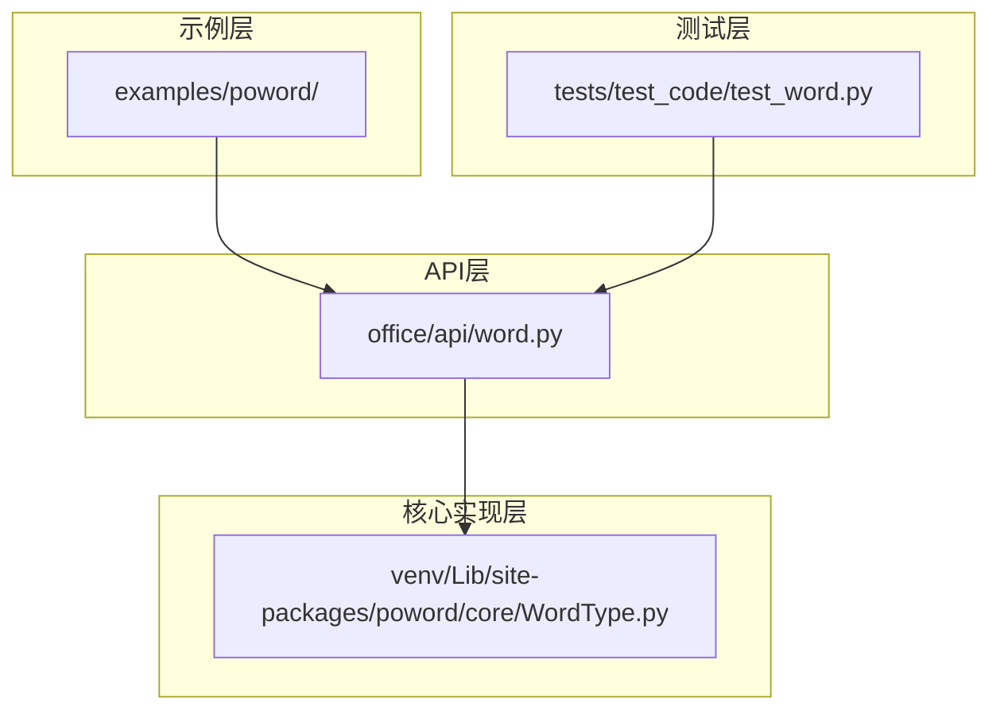
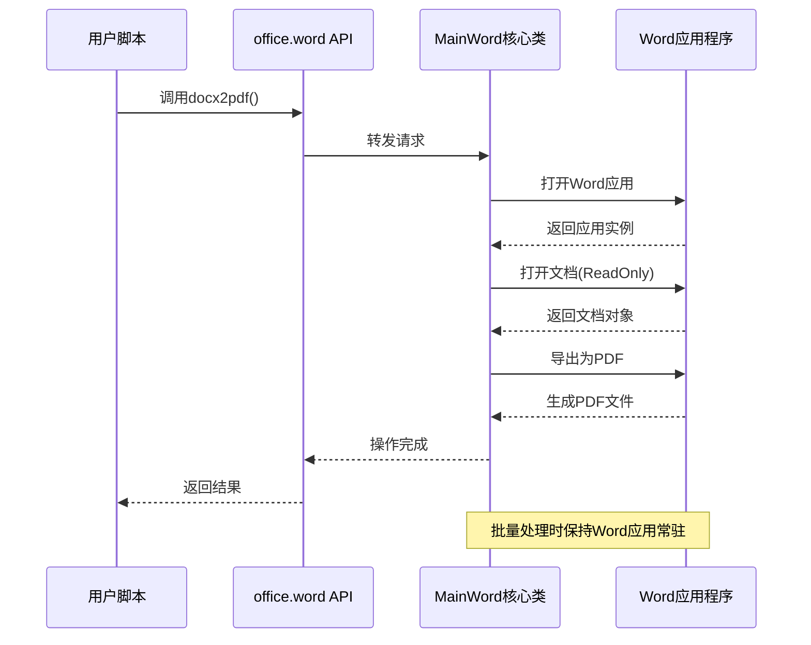
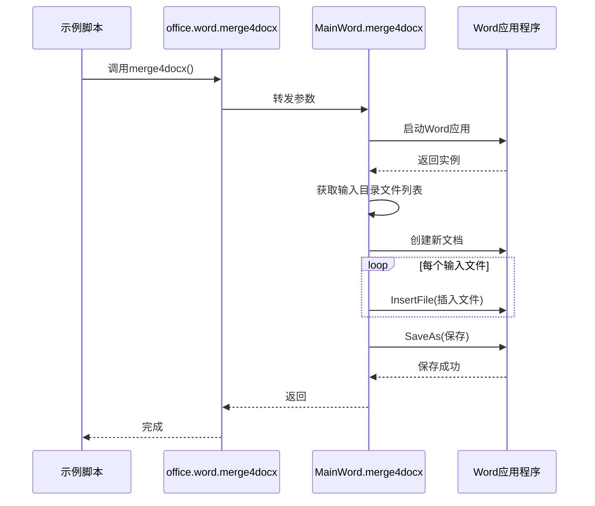
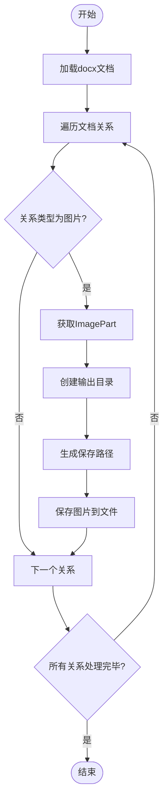
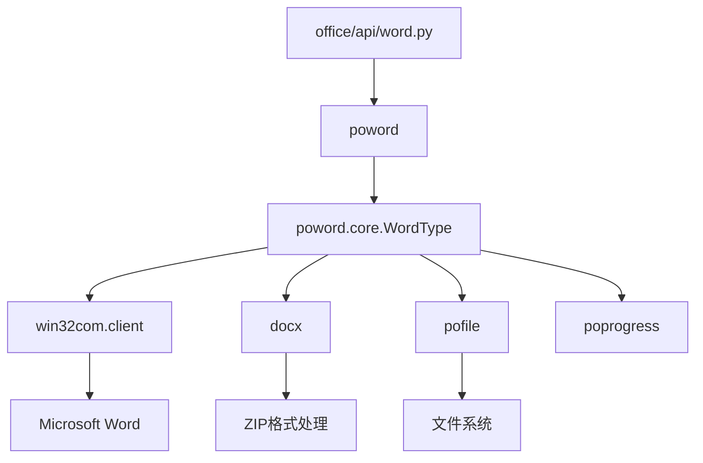

# Word处理

<cite>
**本文档中引用的文件**   
- [word.py](file://office/api/word.py)
- [WordType.py](file://venv/Lib/site-packages/poword/core/WordType.py)
- [doc和docx互转.py](file://examples/poword/doc和docx互转.py)
- [word转PDF.py](file://examples/poword/word转PDF.py)
- [合并word.py](file://examples/poword/合并word.py)
- [test_word.py](file://tests/test_code/test_word.py)
</cite>

## 目录
1. [简介](#简介)
2. [项目结构](#项目结构)
3. [核心组件](#核心组件)
4. [架构概述](#架构概述)
5. [详细组件分析](#详细组件分析)
6. [依赖分析](#依赖分析)
7. [性能考虑](#性能考虑)
8. [故障排除指南](#故障排除指南)
9. [结论](#结论)

## 简介
本项目提供了一套完整的Word文档自动化处理解决方案，通过`python-office`库中的`office.word`模块，实现了doc与docx格式互转、Word转PDF、合并多个Word文档等核心功能。该系统基于COM接口调用Microsoft Word应用程序，确保了与Office原生功能的高度兼容性。通过简洁的API设计，用户可以轻松实现日常办公自动化任务，如批量转换文档格式、合并报告、提取图片资源等。系统还提供了丰富的示例脚本，帮助用户快速上手并集成到实际工作流中。

## 项目结构
项目采用分层架构设计，将API接口、核心实现和示例代码分离，确保了代码的可维护性和可扩展性。主要目录包括：`office/api`存放公共API接口，`poword/core`包含核心功能实现，`examples/poword`提供使用示例，`tests/test_code`包含单元测试。



**Diagram sources**
- [office/api/word.py](file://office/api/word.py)
- [venv/Lib/site-packages/poword/core/WordType.py](file://venv/Lib/site-packages/poword/core/WordType.py)

**Section sources**
- [office/api/word.py](file://office/api/word.py)
- [venv/Lib/site-packages/poword/core/WordType.py](file://venv/Lib/site-packages/poword/core/WordType.py)

## 核心组件
Word处理模块的核心功能包括文档格式转换、PDF导出、文档合并和图片提取。这些功能通过清晰的API接口暴露给用户，支持单个文件和批量处理。系统利用`win32com`库与Microsoft Word应用程序进行交互，确保了转换质量和格式保真度。同时，通过`python-docx`库实现了对docx文件的直接解析和操作，避免了对Word应用程序的依赖。

**Section sources**
- [office/api/word.py](file://office/api/word.py)
- [venv/Lib/site-packages/poword/core/WordType.py](file://venv/Lib/site-packages/poword/core/WordType.py)

## 架构概述
系统采用代理模式设计，`office.api.word`模块作为外观层，封装了底层`poword`库的复杂性。当用户调用API时，请求被转发到`MainWord`类的具体实现。该类通过COM接口与Word应用程序通信，执行实际的文档操作。这种设计分离了接口与实现，使得系统易于维护和扩展。



**Diagram sources**
- [office/api/word.py](file://office/api/word.py)
- [venv/Lib/site-packages/poword/core/WordType.py](file://venv/Lib/site-packages/poword/core/WordType.py)

## 详细组件分析

### 文档转换功能分析
文档转换功能支持doc与docx格式之间的双向转换，以及Word到PDF的导出。系统通过Word应用程序的SaveAs方法实现格式转换，确保了最大程度的格式兼容性。

#### 对象导向组件：
```mermaid
classDiagram
class MainWord {
+str app
+docx2pdf(path, output_path)
+merge4docx(input_path, output_path, new_word_name)
+doc2docx(input_path, output_path, output_name)
+docx2doc(input_path, output_path, output_name)
+docx4imgs(word_path, img_path)
-createpdf(wordPath, pdfPath)
-_convert4word(type_id, input_path, output_path, docSuffix, output_name)
}
class MainWord "..使用.." --> "win32com.client.Dispatch"
class MainWord "..使用.." --> "gencache.EnsureDispatch"
class MainWord "..使用.." --> "Document"
```

**Diagram sources**
- [venv/Lib/site-packages/poword/core/WordType.py](file://venv/Lib/site-packages/poword/core/WordType.py)

**Section sources**
- [venv/Lib/site-packages/poword/core/WordType.py](file://venv/Lib/site-packages/poword/core/WordType.py)
- [office/api/word.py](file://office/api/word.py)

### 合并文档功能分析
合并功能允许将多个Word文档合并为一个单一文档，适用于报告汇总、文档整合等场景。

#### API服务组件：


**Diagram sources**
- [examples/poword/合并word.py](file://examples/poword/合并word.py)
- [venv/Lib/site-packages/poword/core/WordType.py](file://venv/Lib/site-packages/poword/core/WordType.py)

### 图片提取功能分析
图片提取功能可以从docx文档中提取所有嵌入的图片资源，便于内容再利用或归档。

#### 复杂逻辑组件：


**Diagram sources**
- [venv/Lib/site-packages/poword/core/WordType.py](file://venv/Lib/site-packages/poword/core/WordType.py)

## 依赖分析
系统依赖于多个关键库和组件，形成了完整的功能链条。主要依赖包括：`win32com`用于与Word应用程序通信，`python-docx`用于直接操作docx文件，`pofile`用于文件系统操作，`poprogress`提供进度显示。



**Diagram sources**
- [office/api/word.py](file://office/api/word.py)
- [venv/Lib/site-packages/poword/core/WordType.py](file://venv/Lib/site-packages/poword/core/WordType.py)

**Section sources**
- [office/api/word.py](file://office/api/word.py)
- [venv/Lib/site-packages/poword/api/word.py](file://venv/Lib/site-packages/poword/api/word.py)

## 性能考虑
在处理大量文档时，系统性能主要受Word应用程序启动开销和内存使用的影响。建议采用批量处理模式，保持Word应用实例常驻，避免频繁启停。对于图片提取等不需要Word应用的操作，应优先使用`python-docx`直接处理，以提高效率。同时，合理设置输出路径和文件命名策略，避免I/O瓶颈。

## 故障排除指南
常见问题及解决方案：

- **格式丢失问题**：确保源文档在Word中能正常打开，检查特殊字体和嵌入对象的兼容性。
- **图片嵌入异常**：确认docx文件未损坏，使用`python-docx`直接提取通常比通过Word应用更可靠。
- **COM接口错误**：确保Microsoft Office已正确安装，注册表项完整，运行环境有足够权限。
- **路径问题**：使用绝对路径避免相对路径解析错误，确保输出目录有写入权限。
- **批量处理卡顿**：减少Word应用的可视化设置，关闭不必要的后台进程。

**Section sources**
- [tests/test_code/test_word.py](file://tests/test_code/test_word.py)
- [venv/Lib/site-packages/poword/core/WordType.py](file://venv/Lib/site-packages/poword/core/WordType.py)

## 结论
Word处理模块提供了一套完整、可靠的文档自动化解决方案，通过简洁的API设计和稳健的底层实现，满足了日常办公中的各种文档处理需求。系统架构清晰，功能模块化，易于集成和扩展。通过合理使用提供的示例和遵循最佳实践，用户可以高效地实现文档格式转换、合并和内容提取等任务，大幅提升工作效率。