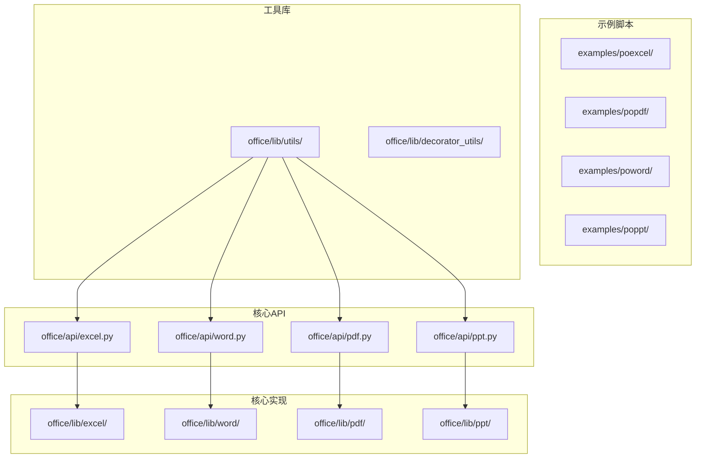
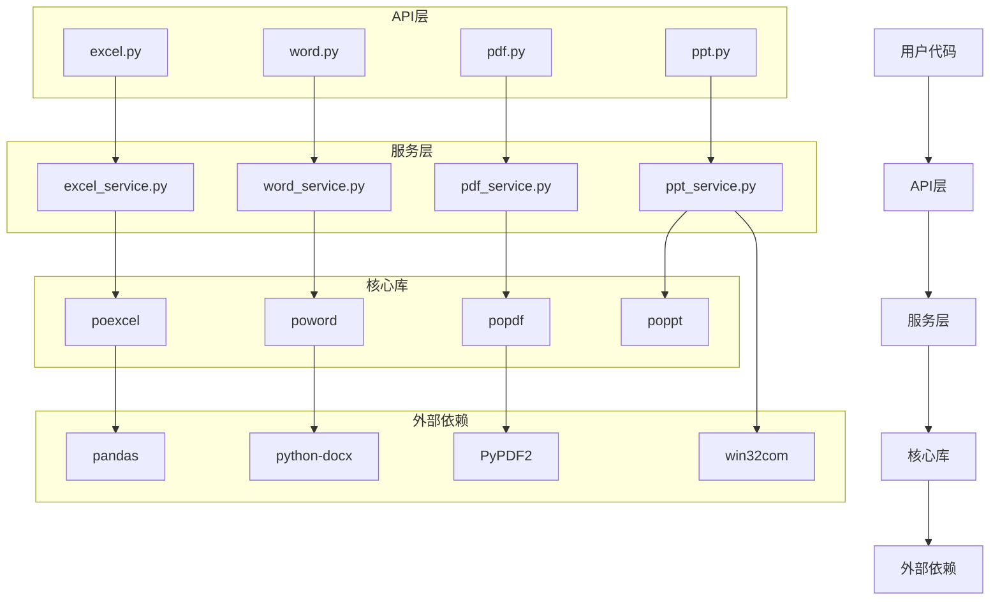
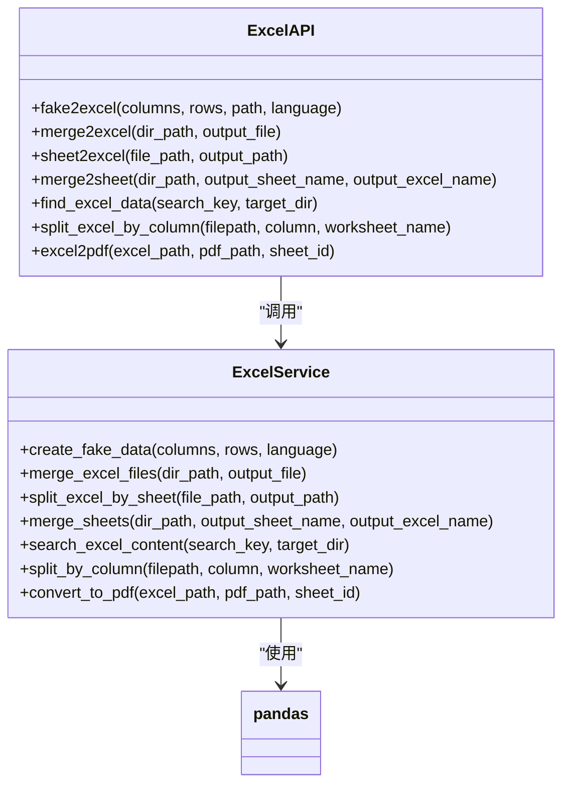
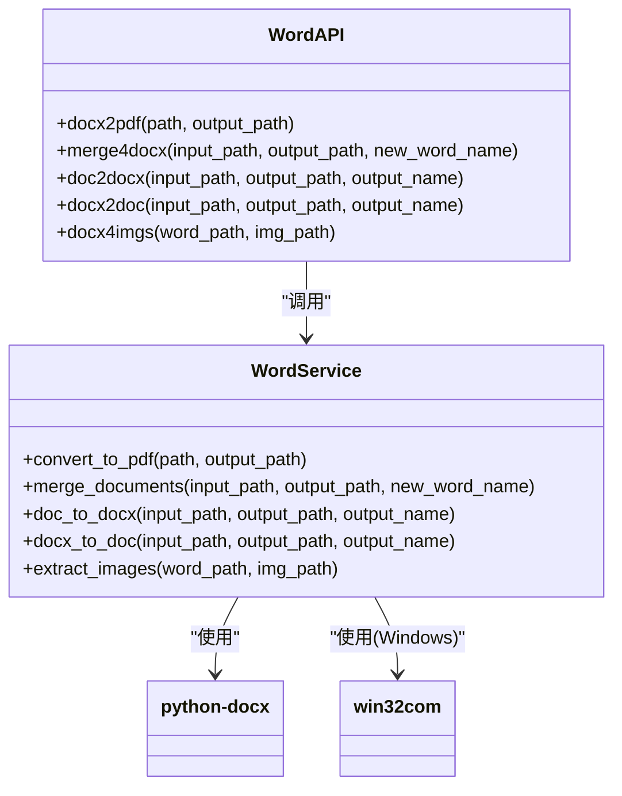
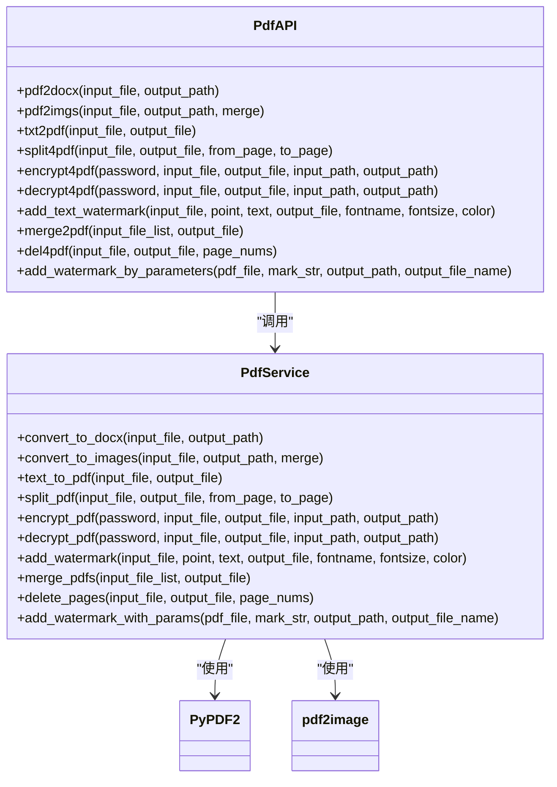
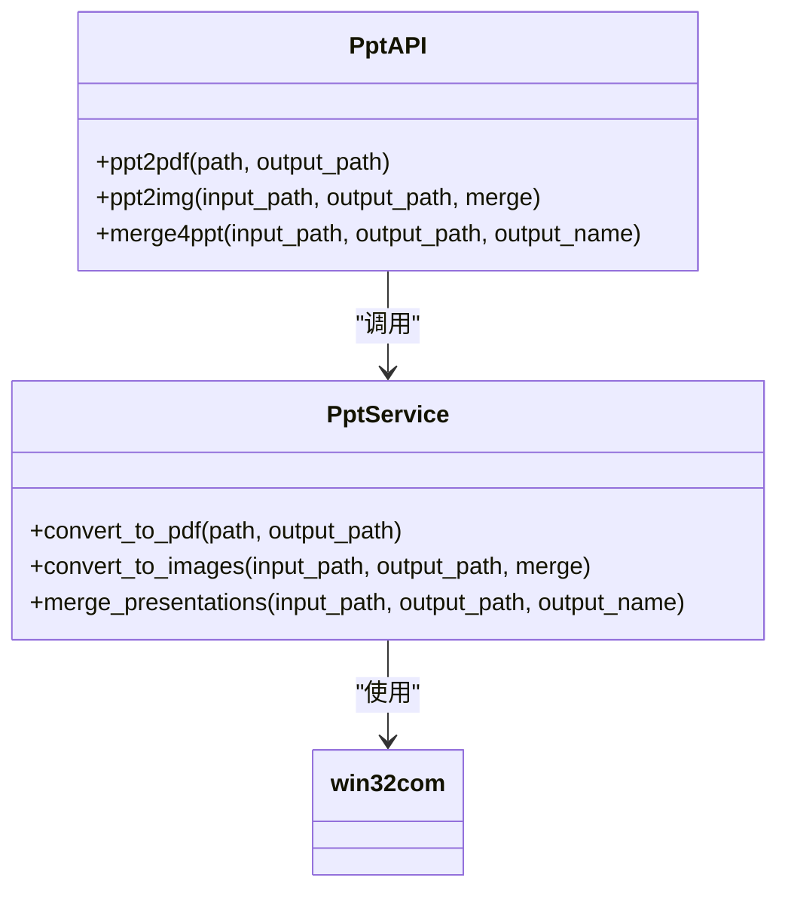
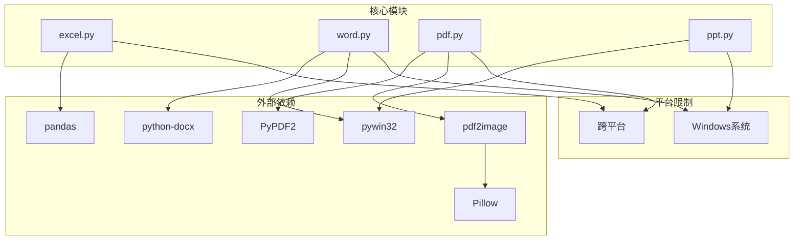
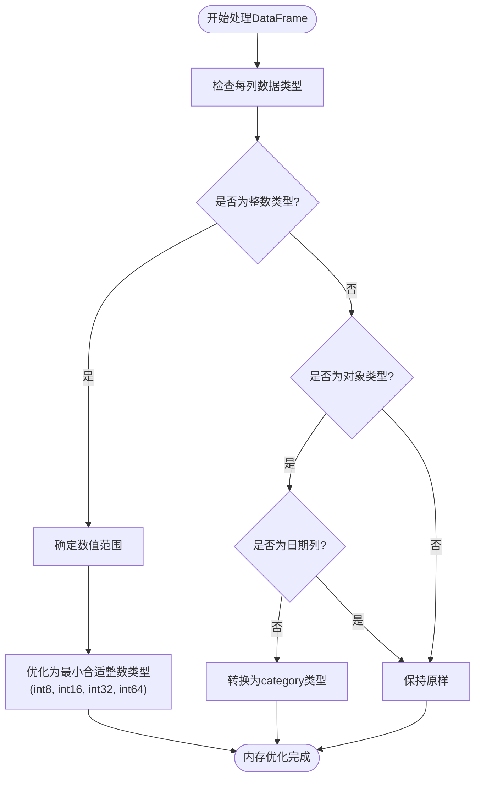
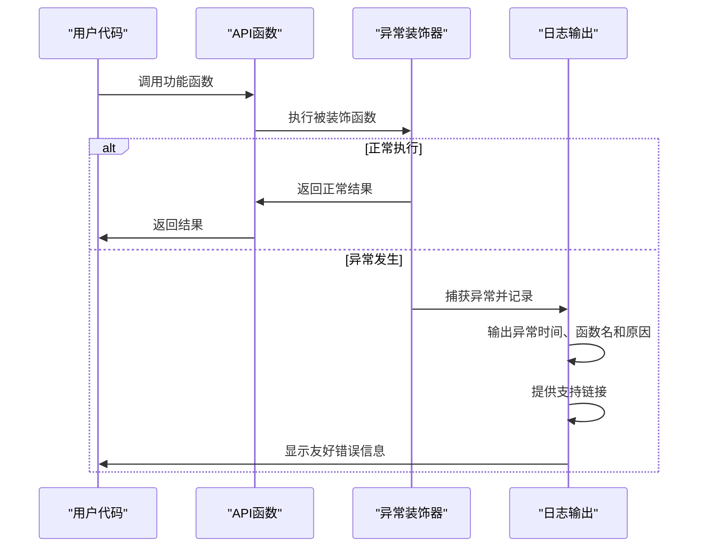

# 文档处理

<cite>
**本文档引用的文件**
- [excel.py](file://office/api/excel.py)
- [word.py](file://office/api/word.py)
- [pdf.py](file://office/api/pdf.py)
- [ppt.py](file://office/api/ppt.py)
- [Excel转PDF.py](file://examples/poexcel/Excel转PDF.py)
- [合并PDF.py](file://examples/popdf/合并PDF.py)
- [word转PDF.py](file://examples/poword/word转PDF.py)
- [批量模拟数据.py](file://examples/poexcel/批量模拟数据.py)
- [根据指定的列，拆分excel.py](file://examples/poexcel/根据指定的列，拆分excel.py)
- [合并2个Excel的内容到一个sheet中.py](file://examples/poexcel/合并2个Excel的内容到一个sheet中.py)
- [except_utils.py](file://office/lib/utils/except_utils.py)
- [pandas_mem.py](file://office/lib/utils/pandas_mem.py)
</cite>

## 目录
1. [简介](#简介)
2. [项目结构](#项目结构)
3. [核心组件](#核心组件)
4. [架构概述](#架构概述)
5. [详细组件分析](#详细组件分析)
6. [依赖分析](#依赖分析)
7. [性能考虑](#性能考虑)
8. [故障排除指南](#故障排除指南)
9. [结论](#结论)

## 简介
本文档详细介绍了`python-office`库中的文档处理功能，涵盖Excel、Word、PDF和PPT四类办公文档的自动化操作。文档解释了每个核心模块（excel.py、word.py、pdf.py、ppt.py）提供的功能，如文件创建、格式转换、内容读写、合并加密等。通过分析`examples/`目录中的实际脚本，展示了典型使用场景。文档还说明了各模块之间的共性设计模式，如统一的输入输出参数规范和异常处理机制，并为初学者和高级用户提供了操作路径和扩展接口指导。

## 项目结构
`python-office`项目采用模块化设计，将不同类型的文档处理功能分离到独立的模块中。核心API位于`office/api/`目录下，每个办公文档类型都有对应的Python文件。示例脚本存放在`examples/`目录中，按功能分类组织。工具库和核心功能实现位于`office/lib/`目录下。

**图源**
- [excel.py](file://office/api/excel.py)
- [word.py](file://office/api/word.py)
- [pdf.py](file://office/api/pdf.py)
- [ppt.py](file://office/api/ppt.py)

**本节源**
- [项目结构](file://workspace)

## 核心组件
`python-office`库的核心文档处理功能由四个主要模块组成：`excel.py`、`word.py`、`pdf.py`和`ppt.py`。这些模块提供了丰富的办公文档自动化功能，从简单的文件转换到复杂的文档合并和内容提取。

**本节源**
- [excel.py](file://office/api/excel.py#L1-L136)
- [word.py](file://office/api/word.py#L1-L72)
- [pdf.py](file://office/api/pdf.py#L1-L226)
- [ppt.py](file://office/api/ppt.py#L1-L46)

## 架构概述
`python-office`库采用分层架构设计，上层API提供简洁的函数接口，底层实现处理具体的文档操作逻辑。这种设计模式使得用户可以轻松调用功能，同时保持代码的可维护性和可扩展性。

**图源**
- [excel.py](file://office/api/excel.py)
- [word.py](file://office/api/word.py)
- [pdf.py](file://office/api/pdf.py)
- [ppt.py](file://office/api/ppt.py)

## 详细组件分析

### Excel模块分析
`excel.py`模块提供了丰富的Excel文件处理功能，包括数据模拟、文件合并拆分、格式转换等。该模块通过简洁的函数接口，使用户能够轻松完成复杂的Excel操作。

**图源**
- [excel.py](file://office/api/excel.py#L25-L136)

**本节源**
- [excel.py](file://office/api/excel.py#L1-L136)
- [批量模拟数据.py](file://examples/poexcel/批量模拟数据.py)
- [根据指定的列，拆分excel.py](file://examples/poexcel/根据指定的列，拆分excel.py)
- [合并2个Excel的内容到一个sheet中.py](file://examples/poexcel/合并2个Excel的内容到一个sheet中.py)

### Word模块分析
`word.py`模块专注于Word文档的处理，支持文档格式转换、合并和图片提取等功能。该模块特别适用于需要批量处理Word文档的场景。

**图源**
- [word.py](file://office/api/word.py#L6-L72)

**本节源**
- [word.py](file://office/api/word.py#L1-L72)
- [word转PDF.py](file://examples/poword/word转PDF.py)

### PDF模块分析
`pdf.py`模块提供了全面的PDF文件处理功能，包括格式转换、加密解密、水印添加和文件合并等。这是`python-office`库中最功能丰富的模块之一。

**图源**
- [pdf.py](file://office/api/pdf.py#L28-L226)

**本节源**
- [pdf.py](file://office/api/pdf.py#L1-L226)
- [合并PDF.py](file://examples/popdf/合并PDF.py)

### PPT模块分析
`ppt.py`模块提供了PPT文件的转换和合并功能。需要注意的是，该模块在Windows系统上依赖Microsoft PowerPoint应用程序。

**图源**
- [ppt.py](file://office/api/ppt.py#L7-L46)

**本节源**
- [ppt.py](file://office/api/ppt.py#L1-L46)
- [ppt2pdf.py](file://examples/poppt/ppt2pdf.py)
- [merge4ppt.py](file://examples/poppt/merge4ppt.py)

## 依赖分析
`python-office`库的文档处理模块依赖于多个外部库和系统组件。这些依赖关系确保了功能的完整性和跨平台兼容性。

**图源**
- [compatibility.py](file://office/compatibility.py#L47-L65)
- [excel.py](file://office/api/excel.py)
- [word.py](file://office/api/word.py)
- [pdf.py](file://office/api/pdf.py)
- [ppt.py](file://office/api/ppt.py)

**本节源**
- [compatibility.py](file://office/compatibility.py#L39-L198)
- [go.mod](file://go.mod)
- [go.sum](file://go.sum)

## 性能考虑
在处理大型办公文档时，性能优化至关重要。`python-office`库通过多种机制来提高处理效率，特别是在内存管理和批量处理方面。

### 内存优化
对于Excel处理，库提供了内存优化功能，通过调整数据类型来减少内存使用：

**图源**
- [pandas_mem.py](file://office/lib/utils/pandas_mem.py#L4-L42)

**本节源**
- [pandas_mem.py](file://office/lib/utils/pandas_mem.py#L1-L42)

### 批量处理建议
1. **分批处理大文件**：对于包含大量数据的Excel文件，建议分批读取和处理，避免内存溢出。
2. **使用生成器**：在处理大量文件时，使用生成器而不是列表来减少内存占用。
3. **及时释放资源**：处理完文件后，及时关闭文件句柄和释放相关资源。
4. **并行处理**：对于独立的文件处理任务，可以考虑使用多线程或多进程来提高效率。

## 故障排除指南
`python-office`库提供了统一的异常处理机制，帮助用户快速定位和解决问题。

### 异常处理机制
库使用装饰器模式实现统一的异常处理：

**图源**
- [except_utils.py](file://office/lib/utils/except_utils.py#L10-L34)

**本节源**
- [except_utils.py](file://office/lib/utils/except_utils.py#L1-L34)

### 常见问题及解决方案
1. **PPT和Word功能在非Windows系统上不可用**：
   - 问题原因：这些功能依赖Microsoft Office应用程序
   - 解决方案：在Windows系统上运行，或使用LibreOffice等替代方案

2. **内存不足错误**：
   - 问题原因：处理大型Excel文件时内存占用过高
   - 解决方案：使用`reduce_pandas_mem_usage`函数优化内存使用，或分批处理数据

3. **文件路径问题**：
   - 问题原因：Windows和Linux系统路径分隔符不同
   - 解决方案：使用`os.path.join()`或原始字符串（r"..."）来构建路径

4. **依赖库缺失**：
   - 问题原因：未安装必要的第三方库
   - 解决方案：根据错误提示安装相应库，如`pip install pandas`、`pip install PyPDF2`等

## 结论
`python-office`库为办公文档自动化提供了全面的解决方案。通过分析其核心模块，我们可以看到该项目具有以下特点：

1. **功能丰富**：涵盖了Excel、Word、PDF和PPT四类主要办公文档的处理需求。
2. **接口简洁**：通过简单的函数调用即可完成复杂的文档操作。
3. **模块化设计**：各功能模块独立，便于维护和扩展。
4. **跨平台考虑**：虽然部分功能受限于Windows系统，但核心功能支持跨平台运行。
5. **用户友好**：提供了详细的文档和示例，以及友好的异常处理机制。

对于初学者，建议从示例脚本开始，逐步了解各个功能的使用方法。对于高级用户，可以深入研究库的内部实现，根据需要进行定制和扩展。在处理大型文件时，务必注意内存管理和性能优化，以确保程序的稳定运行。