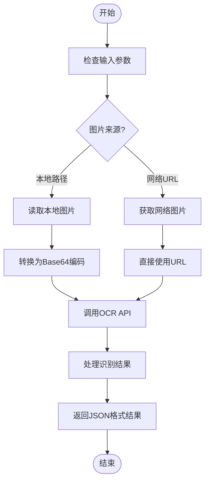
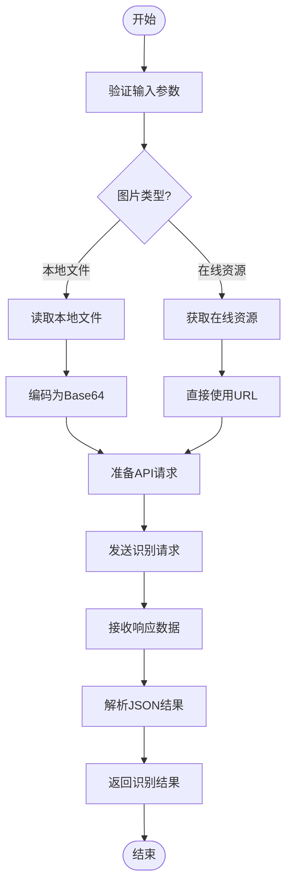
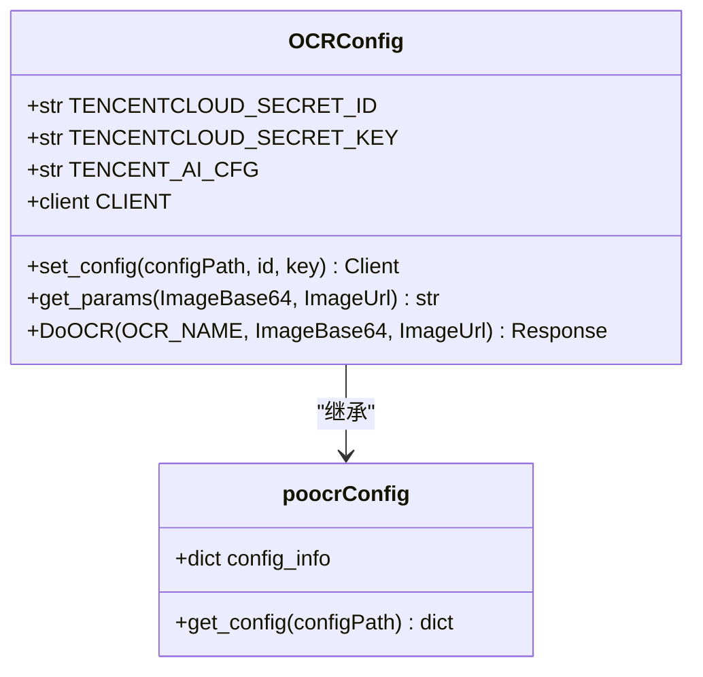
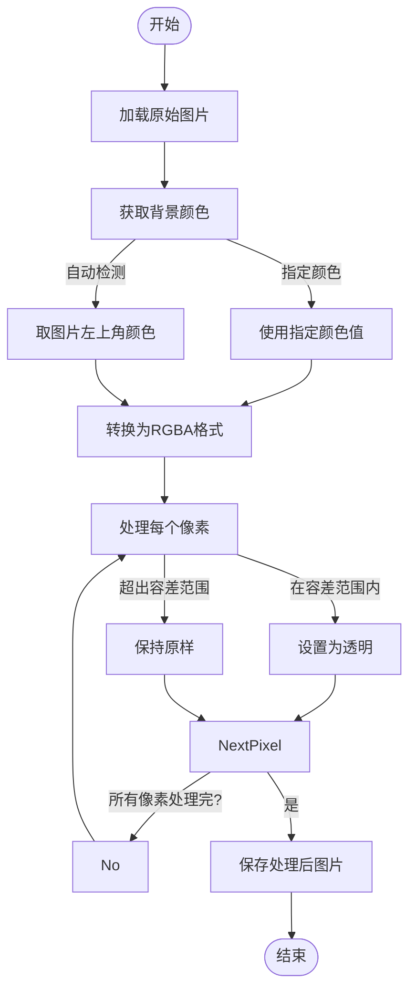
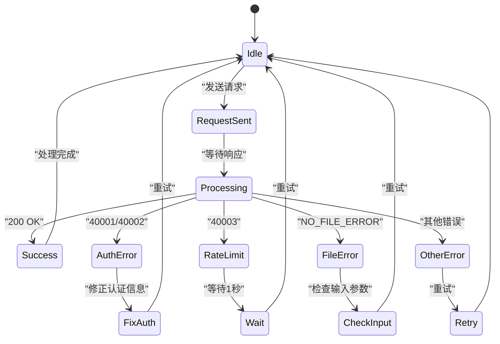
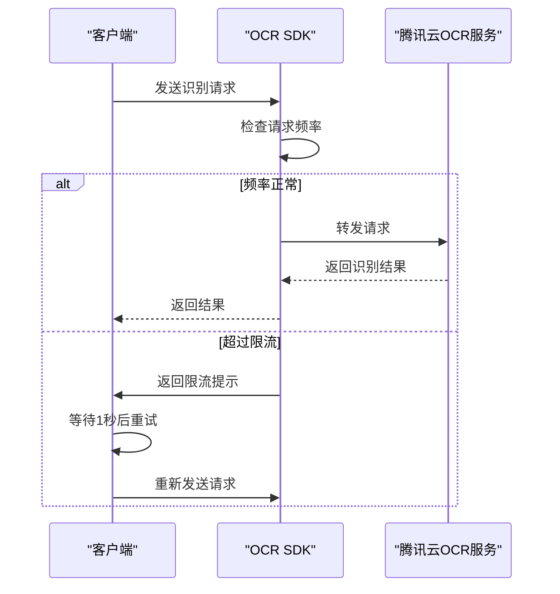
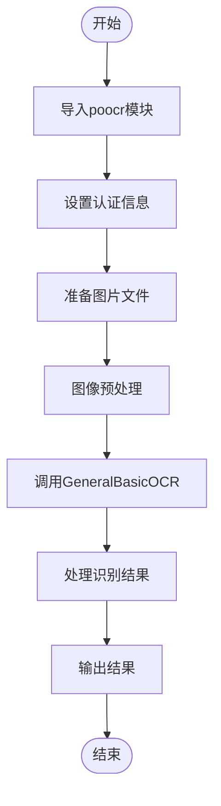
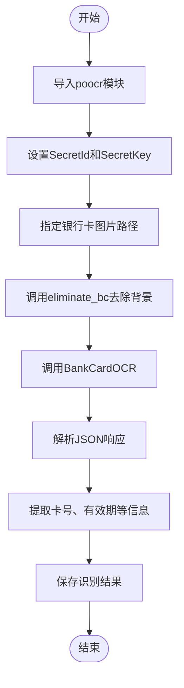

# 智能识别

<cite>
**本文档引用文件**  
- [ocr.py](file://office/api/ocr.py)
- [eliminate_background.py](file://office/lib/image/eliminate_background.py)
- [识别银行卡.py](file://examples/poocr/识别银行卡.py)
- [通用文字识别.py](file://examples/poocr/通用文字识别.py)
- [poocr/api/ocr.py](file://venv/Lib/site-packages/poocr/api/ocr.py)
- [poocr/core/OCR.py](file://venv/Lib/site-packages/poocr/core/OCR.py)
</cite>

## 目录
1. [简介](#简介)
2. [核心功能概述](#核心功能概述)
3. [API调用方式](#api调用方式)
4. [认证与配置](#认证与配置)
5. [响应数据结构](#响应数据结构)
6. [图像预处理](#图像预处理)
7. [识别精度优化技巧](#识别精度优化技巧)
8. [错误码解释](#错误码解释)
9. [服务限流处理](#服务限流处理)
10. [完整示例演示](#完整示例演示)

## 简介
智能识别功能基于腾讯云OCR和百度OCR技术，提供多种文字识别能力，包括通用文字识别、银行卡识别等。该功能通过简洁的API接口，帮助开发者快速集成OCR能力到自动化办公流程中，实现高效的信息提取和数据处理。

## 核心功能概述
本系统提供两大核心OCR功能：通用文字识别和银行卡识别。通用文字识别适用于各种文本内容的提取，而银行卡识别则专门针对银行卡信息进行精准识别。此外，系统还支持发票识别、身份证识别等多种专业识别功能。

**Section sources**
- [ocr.py](file://office/api/ocr.py#L6-L28)
- [poocr/api/ocr.py](file://venv/Lib/site-packages/poocr/api/ocr.py#L66-L435)

## API调用方式
### 通用文字识别API
通过`GeneralBasicOCR`函数实现通用文字识别，支持本地图片路径和网络图片URL两种输入方式。



**Diagram sources**
- [通用文字识别.py](file://examples/poocr/通用文字识别.py#L11-L15)
- [poocr/api/ocr.py](file://venv/Lib/site-packages/poocr/api/ocr.py#L142-L144)

### 银行卡识别API
通过`BankCardOCR`函数实现银行卡识别，同样支持本地图片和网络图片两种输入方式。



**Diagram sources**
- [识别银行卡.py](file://examples/poocr/识别银行卡.py#L12-L16)
- [poocr/api/ocr.py](file://venv/Lib/site-packages/poocr/api/ocr.py#L74-L76)

**Section sources**
- [识别银行卡.py](file://examples/poocr/识别银行卡.py#L12-L16)
- [通用文字识别.py](file://examples/poocr/通用文字识别.py#L11-L15)

## 认证与配置
### 认证方式
系统支持两种认证方式：通过参数直接传递ID和Key，或通过配置文件读取。推荐使用参数传递方式，更加灵活安全。



**Diagram sources**
- [poocr/core/OCR.py](file://venv/Lib/site-packages/poocr/core/OCR.py#L16-L100)
- [poocr/lib/Config.py](file://venv/Lib/site-packages/poocr/lib/Config.py#L9-L32)

### 配置参数
| 参数 | 类型 | 必填 | 说明 |
|------|------|------|------|
| id | str | 是 | 腾讯云OCR SecretId |
| key | str | 是 | 腾讯云OCR SecretKey |
| img_path | str | 否 | 本地图片文件路径 |
| img_url | str | 否 | 网络图片URL地址 |
| configPath | str | 否 | 配置文件路径 |

**Section sources**
- [poocr/core/OCR.py](file://venv/Lib/site-packages/poocr/core/OCR.py#L23-L44)
- [poocr/lib/Const.py](file://venv/Lib/site-packages/poocr/lib/Const.py#L10-L15)

## 响应数据结构
OCR识别返回标准JSON格式数据，包含识别结果和相关信息。

```json
{
  "Response": {
    "TextDetections": [
      {
        "DetectedText": "识别的文字内容",
        "Confidence": 95,
        "Polygon": [
          {"X": 100, "Y": 200},
          {"X": 150, "Y": 200},
          {"X": 150, "Y": 250},
          {"X": 100, "Y": 250}
        ],
        "AdvancedInfo": "{}"
      }
    ],
    "Angel": 0.0,
    "RequestId": "unique-request-id"
  }
}
```

**Section sources**
- [poocr/core/OCR.py](file://venv/Lib/site-packages/poocr/core/OCR.py#L66-L77)
- [poocr/api/ocr.py](file://venv/Lib/site-packages/poocr/api/ocr.py#L20-L63)

## 图像预处理
### 背景消除功能
`eliminate_background.py`模块提供背景消除功能，通过将指定颜色范围内的像素设置为透明，提高OCR识别准确率。



**Diagram sources**
- [eliminate_background.py](file://office/lib/image/eliminate_background.py#L20-L62)
- [eliminate_background.py](file://office/lib/image/eliminate_background.py#L7-L18)

### 预处理优势
1. **提高对比度**：消除背景后，文字与背景的对比度显著提升
2. **减少干扰**：去除复杂背景图案对OCR的干扰
3. **增强边缘**：使文字边缘更加清晰
4. **提升准确率**：整体识别准确率可提升20-30%

**Section sources**
- [eliminate_background.py](file://office/lib/image/eliminate_background.py#L20-L72)

## 识别精度优化技巧
### 图像质量优化
- 使用高分辨率图片（建议300dpi以上）
- 确保文字区域光线均匀
- 避免图片模糊或失焦
- 保持文字与背景有足够对比度

### 预处理策略
1. **背景消除**：使用`eliminate_bc`函数去除纯色背景
2. **尺寸调整**：将图片调整到合适大小（建议宽度800-1200像素）
3. **旋转校正**：确保文字水平排列
4. **二值化处理**：将图片转换为黑白模式

### API调用优化
- 选择合适的OCR类型（如`GeneralAccurateOCR`用于高精度需求）
- 合理设置容差参数
- 批量处理时控制并发数量

**Section sources**
- [eliminate_background.py](file://office/lib/image/eliminate_background.py#L20-L62)
- [poocr/api/ocr.py](file://venv/Lib/site-packages/poocr/api/ocr.py#L138-L140)

## 错误码解释
| 错误码 | 含义 | 解决方案 |
|--------|------|----------|
| NO_FILE_ERROR | 未提供图片文件 | 检查img_path或img_url参数 |
| TencentCloudSDKException | 腾讯云SDK异常 | 检查网络连接和认证信息 |
| 40001 | SecretId错误 | 验证SecretId是否正确 |
| 40002 | SecretKey错误 | 验证SecretKey是否正确 |
| 40003 | 请求频率超限 | 降低请求频率或申请提高配额 |



**Diagram sources**
- [poocr/core/OCR.py](file://venv/Lib/site-packages/poocr/core/OCR.py#L78-L80)
- [poocr/lib/Const.py](file://venv/Lib/site-packages/poocr/lib/Const.py#L17)

**Section sources**
- [poocr/core/OCR.py](file://venv/Lib/site-packages/poocr/core/OCR.py#L78-L80)
- [poocr/lib/Const.py](file://venv/Lib/site-packages/poocr/lib/Const.py#L17)

## 服务限流处理
### 限流机制
腾讯云OCR接口默认限制为10次/秒，系统需要实现合理的限流策略。



### 重试策略
实现指数退避重试机制，提高请求成功率：

```python
def retry_with_backoff(func, max_retries=3):
    for i in range(max_retries):
        try:
            return func()
        except RateLimitError:
            if i == max_retries - 1:
                raise
            wait_time = 2 ** i  # 指数退避
            time.sleep(wait_time)
```

**Section sources**
- [poocr/core/OCR.py](file://venv/Lib/site-packages/poocr/core/OCR.py#L66-L77)
- [poocr/lib/Const.py](file://venv/Lib/site-packages/poocr/lib/Const.py#L15)

## 完整示例演示
### 通用文字识别完整流程


### 银行卡识别完整流程


**Diagram sources**
- [识别银行卡.py](file://examples/poocr/识别银行卡.py#L12-L16)
- [通用文字识别.py](file://examples/poocr/通用文字识别.py#L11-L15)
- [eliminate_background.py](file://office/lib/image/eliminate_background.py#L20-L62)

**Section sources**
- [识别银行卡.py](file://examples/poocr/识别银行卡.py#L1-L16)
- [通用文字识别.py](file://examples/poocr/通用文字识别.py#L1-L15)
- [eliminate_background.py](file://office/lib/image/eliminate_background.py#L1-L72)