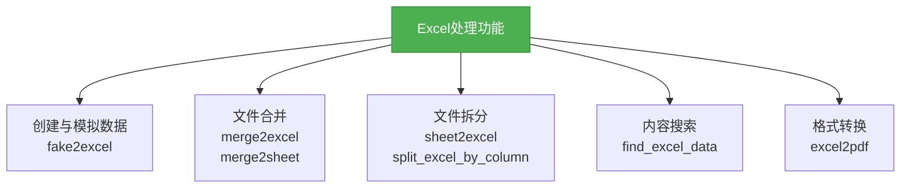
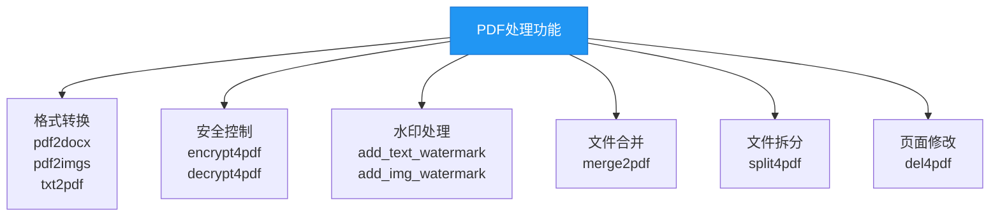
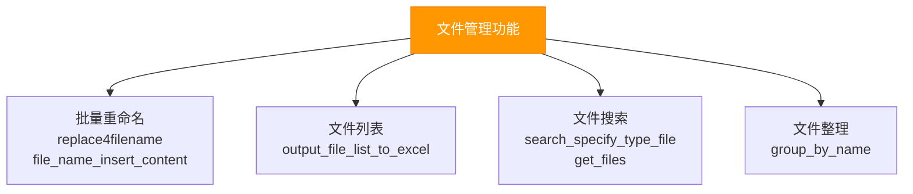
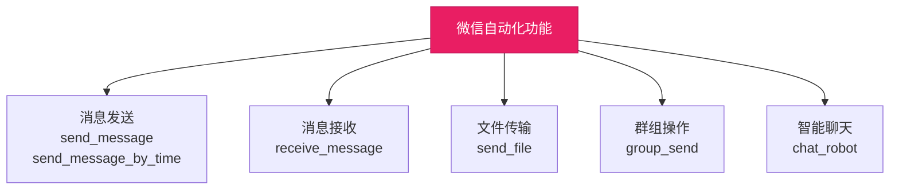
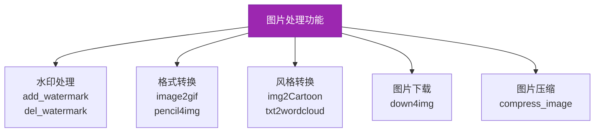
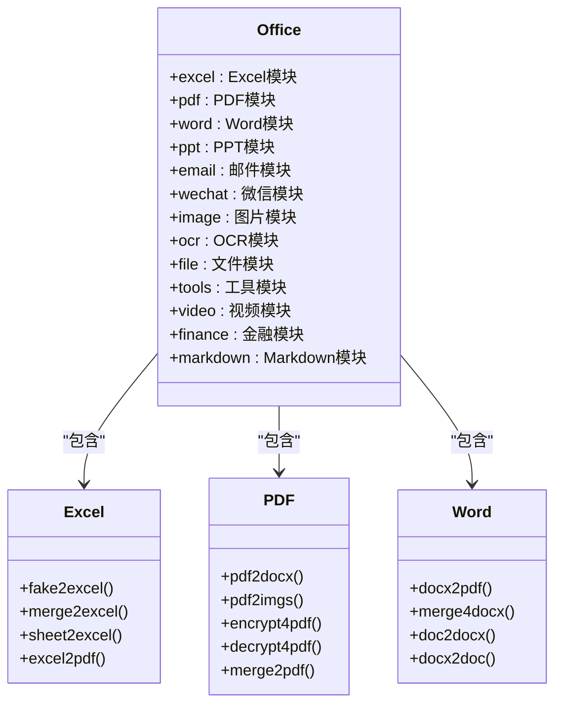

# 核心功能

<cite>
**本文档引用的文件**   
- [README.md](file://README.md)
- [office/__init__.py](file://office/__init__.py)
- [office/api/__init__.py](file://office/api/__init__.py)
- [office/api/excel.py](file://office/api/excel.py)
- [office/api/pdf.py](file://office/api/pdf.py)
- [office/api/word.py](file://office/api/word.py)
- [office/api/ppt.py](file://office/api/ppt.py)
- [office/api/email.py](file://office/api/email.py)
- [office/api/wechat.py](file://office/api/wechat.py)
- [office/api/image.py](file://office/api/image.py)
- [office/api/ocr.py](file://office/api/ocr.py)
- [office/api/file.py](file://office/api/file.py)
- [office/api/tools.py](file://office/api/tools.py)
- [office/api/video.py](file://office/api/video.py)
- [office/api/markdown.py](file://office/api/markdown.py)
- [office/api/finance.py](file://office/api/finance.py)
- [examples/poexcel/创建Excel文件.py](file://examples/poexcel/创建Excel文件.py)
- [examples/popdf/PDF加密.py](file://examples/popdf/PDF加密.py)
- [examples/pofile/批量重命名.py](file://examples/pofile/批量重命名.py)
- [examples/PoOfficeRobot/001-发一条信息.py](file://examples/PoOfficeRobot/001-发一条信息.py)
- [examples/poimage/图片加水印.py](file://examples/poimage/图片加水印.py)
- [examples/poocr/通用文字识别.py](file://examples/poocr/通用文字识别.py)
- [examples/povideo/mark2video.py](file://examples/povideo/mark2video.py)
</cite>

## 目录
1. [简介](#简介)
2. [文档处理](#文档处理)
3. [文件管理](#文件管理)
4. [自动化通信](#自动化通信)
5. [智能识别](#智能识别)
6. [多媒体处理](#多媒体处理)
7. [AI集成与工具](#ai集成与工具)
8. [模块化设计](#模块化设计)

## 简介

python-office 是一个专注于办公自动化的Python第三方库，旨在通过简洁的API解决日常办公中的重复性任务。该库的设计理念是"一行代码解决一个问题"，使没有编程基础的用户也能快速上手。库中集成了多个子模块，覆盖了文档处理、文件管理、通信自动化、智能识别等多个办公场景。用户可以根据需要选择性导入特定功能模块，也可以通过`import office`一次性引入所有功能。项目持续更新，支持用户通过贡献代码来扩展功能。

**Section sources**
- [README.md](file://README.md#L47-L50)
- [office/__init__.py](file://office/__init__.py#L7-L21)

## 文档处理

python-office提供了全面的文档处理能力，支持Excel、Word、PDF和PPT等主流办公文档格式的自动化操作。

### Excel处理

Excel处理模块（poexcel）提供了丰富的数据处理功能，包括数据模拟、文件合并拆分和格式转换。`fake2excel`函数可以自动创建Excel文件并模拟真实数据，适用于测试和演示场景。`merge2excel`和`merge2sheet`函数分别支持将多个Excel文件合并到一个文件的不同工作表中，或将多个工作表合并到一个工作表中。`sheet2excel`函数则可以将单个Excel文件中的不同工作表拆分为独立的文件。此外，还提供了`excel2pdf`函数用于将Excel文件转换为PDF格式。

**Diagram sources**
- [office/api/excel.py](file://office/api/excel.py#L25-L137)
- [examples/poexcel/创建Excel文件.py](file://examples/poexcel/创建Excel文件.py)

**Section sources**
- [office/api/excel.py](file://office/api/excel.py#L25-L137)
- [examples/poexcel/创建Excel文件.py](file://examples/poexcel/创建Excel文件.py)

### PDF处理

PDF处理模块（popdf）提供了完整的PDF文档操作功能。`pdf2docx`和`pdf2imgs`函数分别支持将PDF转换为Word文档和图片格式。`txt2pdf`函数可以将文本文件转换为PDF文档。对于PDF文档的安全性管理，提供了`encrypt4pdf`和`decrypt4pdf`函数用于加密和解密操作。`add_text_watermark`和`add_img_watermark`函数支持添加文本和图片水印。`merge2pdf`函数可以将多个PDF文件合并为一个文件，而`del4pdf`函数则可以删除指定页面。

**Diagram sources**
- [office/api/pdf.py](file://office/api/pdf.py#L28-L226)
- [examples/popdf/PDF加密.py](file://examples/popdf/PDF加密.py)

**Section sources**
- [office/api/pdf.py](file://office/api/pdf.py#L28-L226)
- [examples/popdf/PDF加密.py](file://examples/popdf/PDF加密.py)

### Word处理

Word处理模块（poword）提供了Word文档的基本操作功能。`docx2pdf`函数可以将Word文档转换为PDF格式。`merge4docx`函数支持将多个Docx文件合并为一个文件。`doc2docx`和`docx2doc`函数分别支持Doc与Docx格式之间的相互转换。`docx4imgs`函数可以从Word文档中提取嵌入的图片。

**Section sources**
- [office/api/word.py](file://office/api/word.py#L6-L72)
- [examples/poword/word转PDF.py](file://examples/poword/word转PDF.py)

### PPT处理

PPT处理模块（poppt）提供了PPT文档的转换和合并功能。`ppt2pdf`函数可以将PPT文件转换为PDF格式。`ppt2img`函数支持将PPT转换为图片，可以选择将所有幻灯片合并为一张长图。`merge4ppt`函数可以将多个PPT文件合并为一个文件。

**Section sources**
- [office/api/ppt.py](file://office/api/ppt.py#L7-L46)
- [examples/poppt/ppt2pdf.py](file://examples/poppt/ppt2pdf.py)

## 文件管理

文件管理模块（pofile）提供了强大的文件系统操作功能，帮助用户自动化处理文件和目录。

### 批量文件操作

`replace4filename`函数支持批量修改文件和文件夹名称，可以指定替换内容或删除特定字符串。`file_name_insert_content`、`file_name_add_prefix`和`file_name_add_postfix`函数分别支持在文件名中插入内容、添加前缀和后缀。`output_file_list_to_excel`函数可以将指定目录下的文件列表导出到Excel文件中，便于文件管理。

### 文件搜索与整理

`search_specify_type_file`函数可以在指定目录下搜索特定类型的文件。`get_files`函数可以搜索指定类型或名称的文件，并返回文件路径列表。`group_by_name`函数可以根据文件名对文件进行分组整理。

**Diagram sources**
- [office/api/file.py](file://office/api/file.py#L29-L163)
- [examples/pofile/批量重命名.py](file://examples/pofile/批量重命名.py)

**Section sources**
- [office/api/file.py](file://office/api/file.py#L29-L163)
- [examples/pofile/批量重命名.py](file://examples/pofile/批量重命名.py)

## 自动化通信

python-office提供了邮件和微信自动化功能，帮助用户实现通信任务的自动化。

### 邮件自动化

邮件模块（poemail）支持自动发送和接收邮件。`send_email`函数可以发送带有附件的邮件，支持QQ邮箱等多种邮件服务。用户需要提供邮箱密钥、发件人和收件人地址等信息。

**Section sources**
- [office/api/email.py](file://office/api/email.py#L9-L35)
- [examples/poemail/发送邮件.py](file://examples/poemail/发送邮件.py)

### 微信自动化

微信机器人模块（PyOfficeRobot）提供了丰富的微信自动化功能。`send_message`函数可以向指定联系人发送消息。`send_message_by_time`函数支持定时发送消息。`chat_by_keywords`函数可以根据关键词自动回复。`send_file`函数可以发送文件。`group_send`函数支持群发消息。`chat_robot`函数可以实现智能聊天功能。

**Diagram sources**
- [office/api/wechat.py](file://office/api/wechat.py#L6-L95)
- [examples/PoOfficeRobot/001-发一条信息.py](file://examples/PoOfficeRobot/001-发一条信息.py)

**Section sources**
- [office/api/wechat.py](file://office/api/wechat.py#L6-L95)
- [examples/PoOfficeRobot/001-发一条信息.py](file://examples/PoOfficeRobot/001-发一条信息.py)

## 智能识别

智能识别模块（poocr）利用OCR技术实现文档内容的自动识别。

### 文字识别

`VatInvoiceOCR2Excel`函数可以识别增值税发票内容并导出到Excel文件中。该功能基于百度OCR API实现，可以自动提取发票上的关键信息，如发票代码、号码、金额等，并将识别结果结构化存储。用户可以提供百度OCR的API密钥和密钥，也可以使用默认配置。

**Section sources**
- [office/api/ocr.py](file://office/api/ocr.py#L6-L29)
- [examples/poocr/通用文字识别.py](file://examples/poocr/通用文字识别.py)

## 多媒体处理

python-office提供了图片和视频处理功能，满足多媒体内容的自动化处理需求。

### 图片处理

图片模块（poimage）提供了多种图片处理功能。`add_watermark`函数可以给图片添加文字水印。`compress_image`函数可以压缩图片以减小文件大小。`img2Cartoon`函数可以将图片转换为卡通风格。`down4img`函数可以从网络下载图片。`txt2wordcloud`函数可以根据文本内容生成词云图片。`pencil4img`函数可以将图片转换为铅笔画风格。`del_watermark`函数可以尝试去除图片中的水印。

**Diagram sources**
- [office/api/image.py](file://office/api/image.py#L5-L153)
- [examples/poimage/图片加水印.py](file://examples/poimage/图片加水印.py)

**Section sources**
- [office/api/image.py](file://office/api/image.py#L5-L153)
- [examples/poimage/图片加水印.py](file://examples/poimage/图片加水印.py)

### 视频处理

视频模块（povideo）提供了视频处理功能。`video2mp3`函数可以将视频文件转换为MP3音频文件。`audio2txt`函数可以从音频中提取文字内容。`mark2video`函数可以给视频添加文字水印。`txt2mp3`函数可以将文本转换为语音。

**Section sources**
- [office/api/video.py](file://office/api/video.py#L8-L73)
- [examples/povideo/mark2video.py](file://examples/povideo/mark2video.py)

## AI集成与工具

python-office集成了多种实用工具和AI功能，扩展了办公自动化的应用场景。

### 工具函数

工具模块（wftools）提供了多种实用功能。`transtools`函数可以实现文本翻译。`qrcodetools`函数可以生成二维码。`passwordtools`函数可以生成随机密码。`weather`函数可以获取天气信息。`url2ip`函数可以将URL转换为IP地址。`lottery8ticket`函数可以生成彩票号码。`create_article`函数可以创建文章。`pwd4wifi`函数可以生成WiFi密码列表。`net_speed_test`函数可以测试网络速度。

**Section sources**
- [office/api/tools.py](file://office/api/tools.py#L8-L146)
- [examples/potools/工具类功能演示.py](file://examples/potools/工具类功能演示.py)

### 金融计算

金融模块（pofinance）提供了股票交易相关的计算功能。`t0`函数可以计算T+0交易的收益，考虑了买入卖出价格、交易数量、手续费和印花税等因素，帮助投资者评估交易策略的盈利能力。

**Section sources**
- [office/api/finance.py](file://office/api/finance.py#L7-L35)
- [examples/pofinance/1、单次做T.py](file://examples/pofinance/1、单次做T.py)

### Markdown转换

Markdown模块（pomarkdown）提供了文档格式转换功能。`excel2markdown`函数可以将Excel文件转换为Markdown格式，便于在支持Markdown的平台（如GitHub、博客等）上展示表格数据。

**Section sources**
- [office/api/markdown.py](file://office/api/markdown.py#L4-L21)
- [examples/pomarkdown/Excel转Markdown.py](file://examples/pomarkdown/Excel转Markdown.py)

## 模块化设计

python-office采用模块化设计理念，将不同功能划分为独立的模块，用户可以根据需要按需导入。

### 模块结构

项目的核心功能实现在`office/api/`目录下的各个Python文件中，每个文件对应一个功能模块。`office/__init__.py`文件通过导入这些模块，实现了统一的API入口。这种设计既支持用户通过`from office import excel`等方式导入特定功能，也支持通过`import office`导入所有功能。

### 使用方式

用户可以通过两种方式使用python-office：一是直接导入特定模块，如`from office import excel`；二是导入整个库，如`import office`，然后通过`office.excel.fake2excel()`调用具体功能。这种设计既保证了灵活性，又提供了统一的使用体验。

**Diagram sources**
- [office/__init__.py](file://office/__init__.py#L7-L21)
- [office/api/__init__.py](file://office/api/__init__.py)

**Section sources**
- [office/__init__.py](file://office/__init__.py#L7-L21)
- [office/api/__init__.py](file://office/api/__init__.py)