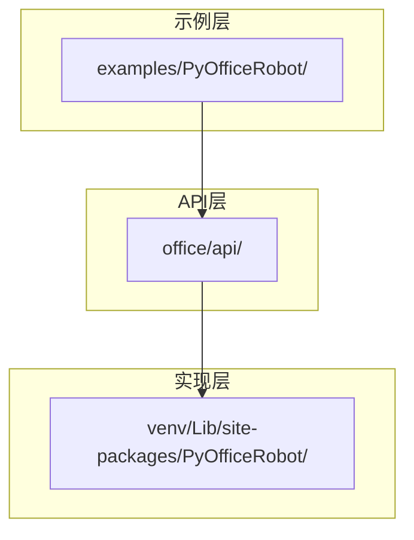
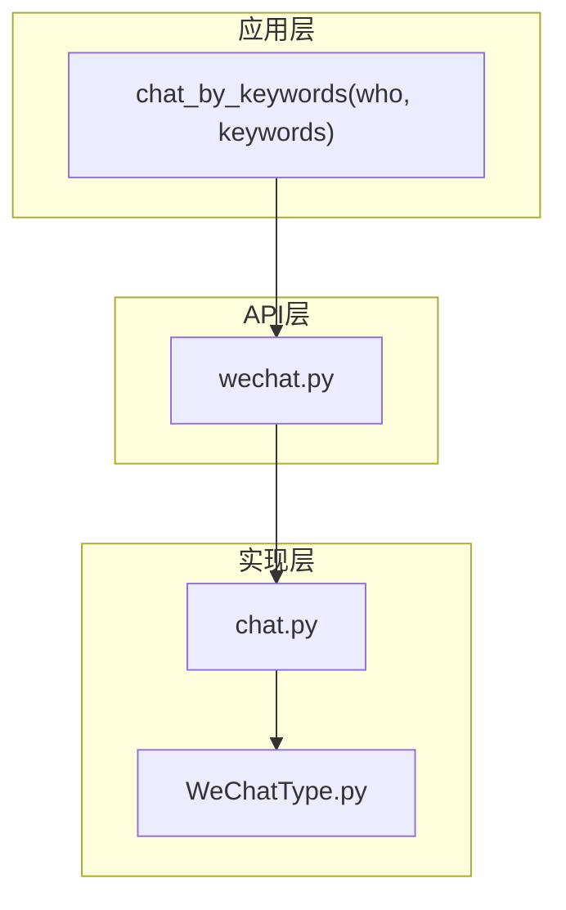
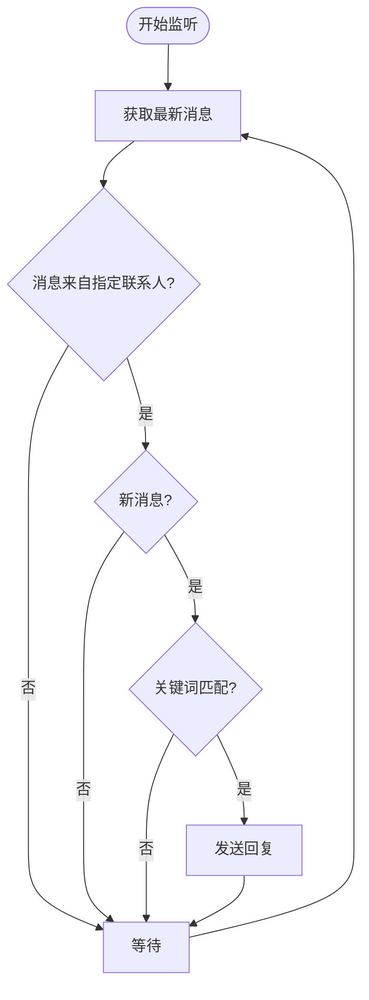
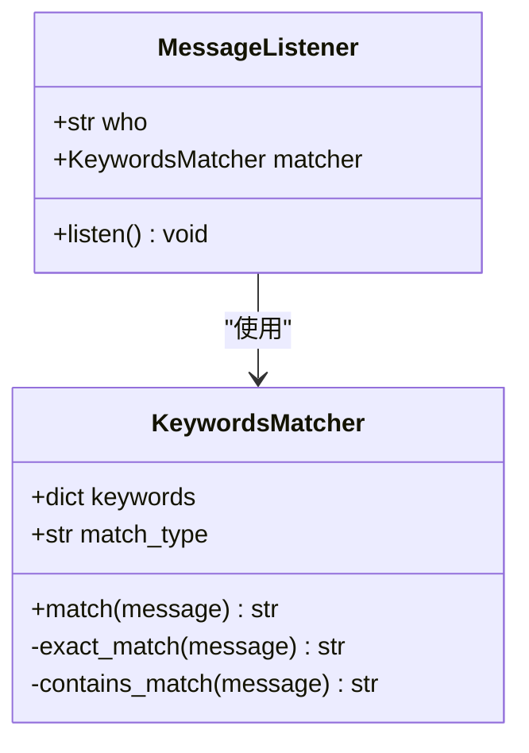
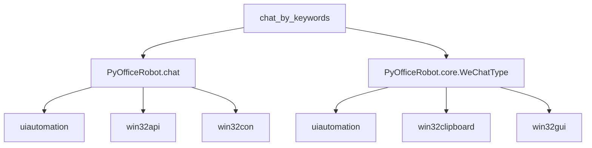

# 关键词自动回复

<cite>
**本文档引用的文件**
- [003-根据关键词回复.py](file://examples/PyOfficeRobot/003-根据关键词回复.py)
- [wechat.py](file://office/api/wechat.py)
- [chat.py](file://venv/Lib/site-packages/PyOfficeRobot/api/chat.py)
- [group.py](file://venv/Lib/site-packages/PyOfficeRobot/api/group.py)
- [WeChatType.py](file://venv/Lib/site-packages/PyOfficeRobot/core/WeChatType.py)
</cite>

## 目录
1. [简介](#简介)
2. [项目结构](#项目结构)
3. [核心组件](#核心组件)
4. [架构概述](#架构概述)
5. [详细组件分析](#详细组件分析)
6. [依赖分析](#依赖分析)
7. [性能考虑](#性能考虑)
8. [故障排除指南](#故障排除指南)
9. [结论](#结论)

## 简介
本文档全面讲解`chat_by_keywords`函数的事件监听机制与匹配逻辑，说明`keywords`参数如何定义触发词列表及其模糊匹配规则。结合'根据关键词回复.py'示例，构建一个完整的自动客服响应系统，展示关键词-回复内容映射的实现方式。分析该功能在后台持续监听消息时的资源消耗情况，并提供性能优化建议。指导用户处理中文编码、特殊符号干扰等问题，确保关键词匹配准确率。

## 项目结构
本项目采用分层架构设计，主要分为示例代码、核心API和底层实现三个层次。示例代码位于`examples/PyOfficeRobot/`目录下，提供了各种功能的使用示例。核心API位于`office/api/`目录下，封装了主要功能接口。底层实现位于`venv/Lib/site-packages/PyOfficeRobot/`目录下，包含了具体的实现逻辑。

**图示来源**
- [003-根据关键词回复.py](file://examples/PyOfficeRobot/003-根据关键词回复.py)
- [wechat.py](file://office/api/wechat.py)

**本节来源**
- [003-根据关键词回复.py](file://examples/PyOfficeRobot/003-根据关键词回复.py)
- [wechat.py](file://office/api/wechat.py)

## 核心组件
`chat_by_keywords`功能的核心组件包括事件监听机制、关键词匹配逻辑和消息发送模块。事件监听通过轮询微信客户端获取最新消息，关键词匹配支持精确匹配和模糊匹配两种模式，消息发送则通过模拟键盘操作实现。

**本节来源**
- [chat.py](file://venv/Lib/site-packages/PyOfficeRobot/api/chat.py#L31-L49)
- [group.py](file://venv/Lib/site-packages/PyOfficeRobot/api/group.py#L31-L60)

## 架构概述
`chat_by_keywords`功能的架构分为三层：应用层、API层和实现层。应用层提供用户友好的接口，API层处理参数验证和调用转发，实现层负责具体的微信客户端操作。

**图示来源**
- [wechat.py](file://office/api/wechat.py#L32-L42)
- [chat.py](file://venv/Lib/site-packages/PyOfficeRobot/api/chat.py#L31-L49)

## 详细组件分析

### 事件监听机制分析
`chat_by_keywords`函数通过无限循环持续监听微信消息，每次循环都会获取最新的消息内容并与预设的关键词进行匹配。

**图示来源**
- [chat.py](file://venv/Lib/site-packages/PyOfficeRobot/api/chat.py#L36-L50)
- [WeChatType.py](file://venv/Lib/site-packages/PyOfficeRobot/core/WeChatType.py#L276-L291)

**本节来源**
- [chat.py](file://venv/Lib/site-packages/PyOfficeRobot/api/chat.py#L31-L51)
- [WeChatType.py](file://venv/Lib/site-packages/PyOfficeRobot/core/WeChatType.py#L275-L292)

### 关键词匹配逻辑分析
关键词匹配支持两种模式：精确匹配和包含匹配。精确匹配要求消息内容与关键词完全一致，包含匹配则只要消息中包含关键词即可触发回复。

**图示来源**
- [group.py](file://venv/Lib/site-packages/PyOfficeRobot/api/group.py#L54-L57)
- [chat.py](file://venv/Lib/site-packages/PyOfficeRobot/api/chat.py#L39-L48)

**本节来源**
- [group.py](file://venv/Lib/site-packages/PyOfficeRobot/api/group.py#L31-L60)
- [chat.py](file://venv/Lib/site-packages/PyOfficeRobot/api/chat.py#L31-L49)

## 依赖分析
`chat_by_keywords`功能依赖多个外部库和内部模块，形成了复杂的依赖关系网络。

**图示来源**
- [chat.py](file://venv/Lib/site-packages/PyOfficeRobot/api/chat.py#L4-L11)
- [WeChatType.py](file://venv/Lib/site-packages/PyOfficeRobot/core/WeChatType.py#L11-L21)

**本节来源**
- [chat.py](file://venv/Lib/site-packages/PyOfficeRobot/api/chat.py)
- [WeChatType.py](file://venv/Lib/site-packages/PyOfficeRobot/core/WeChatType.py)

## 性能考虑
`chat_by_keywords`功能在后台持续运行时会消耗一定的系统资源，主要体现在CPU使用率和内存占用方面。由于采用轮询机制，频繁的消息检查会导致CPU持续工作。

**优化建议：**
1. 增加消息检查间隔时间，减少CPU占用
2. 使用事件驱动机制替代轮询，降低资源消耗
3. 优化关键词匹配算法，提高匹配效率
4. 限制监听的消息数量，避免内存溢出

**本节来源**
- [chat.py](file://venv/Lib/site-packages/PyOfficeRobot/api/chat.py#L36-L50)
- [group.py](file://venv/Lib/site-packages/PyOfficeRobot/api/group.py#L49-L50)

## 故障排除指南
在使用`chat_by_keywords`功能时，可能会遇到中文编码、特殊符号干扰等问题，影响关键词匹配准确率。

**常见问题及解决方案：**
1. **中文编码问题**：确保源文件使用UTF-8编码，避免乱码
2. **特殊符号干扰**：在关键词匹配前进行文本清洗，去除特殊符号
3. **匹配不准确**：检查关键词是否包含不可见字符，使用精确匹配模式
4. **性能问题**：调整轮询间隔，避免系统资源过度消耗

**本节来源**
- [003-根据关键词回复.py](file://examples/PyOfficeRobot/003-根据关键词回复.py#L1-L16)
- [chat.py](file://venv/Lib/site-packages/PyOfficeRobot/api/chat.py#L39-L48)

## 结论
`chat_by_keywords`函数提供了一个完整的自动客服响应系统，通过关键词-回复内容映射实现智能回复。该功能采用轮询机制持续监听消息，支持精确匹配和模糊匹配两种模式。虽然存在一定的资源消耗问题，但通过合理的优化措施可以显著提升性能。正确处理中文编码和特殊符号问题，能够确保关键词匹配的准确率，为用户提供可靠的自动回复服务。