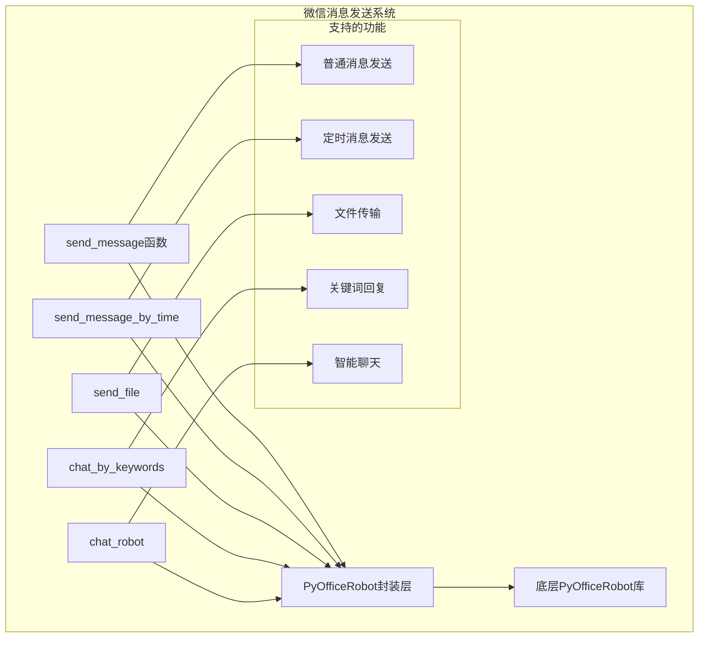
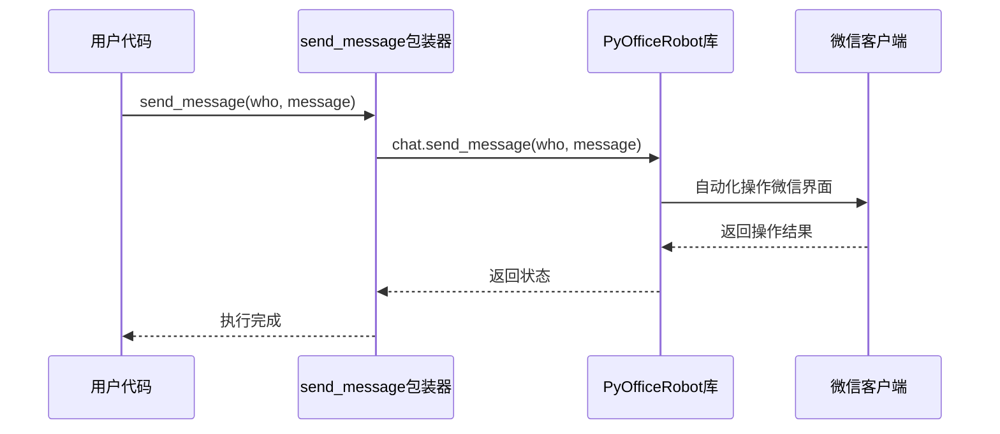
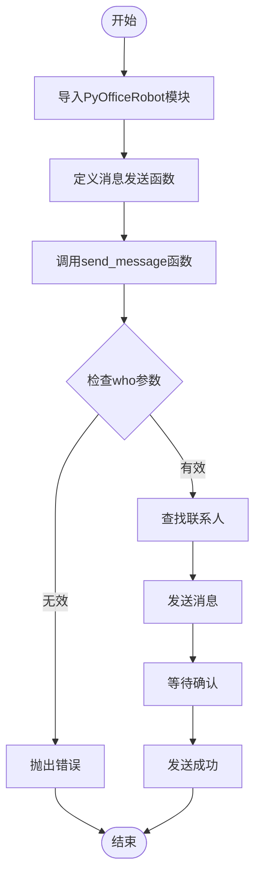
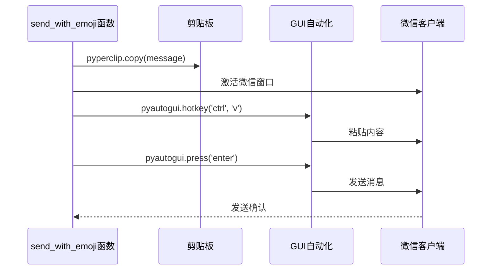
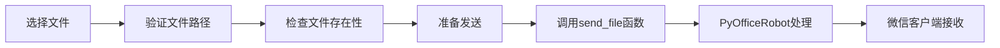
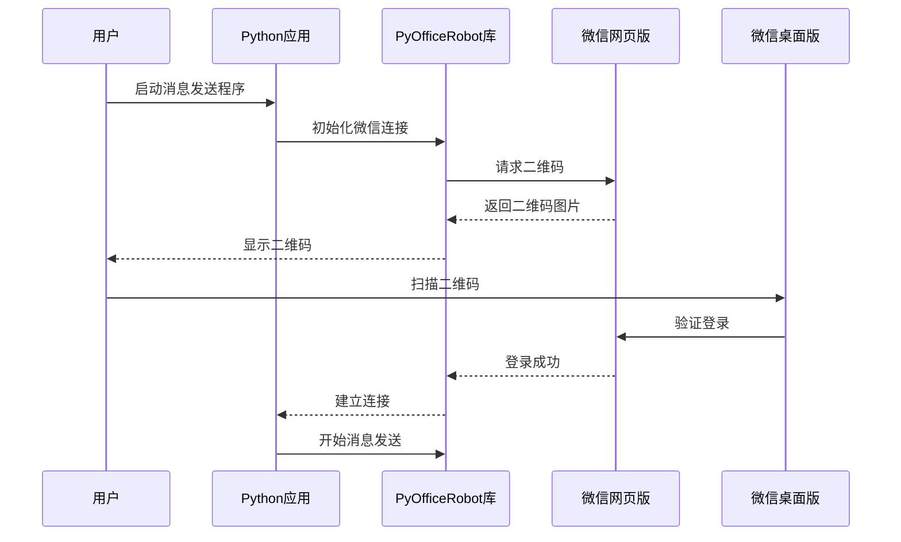
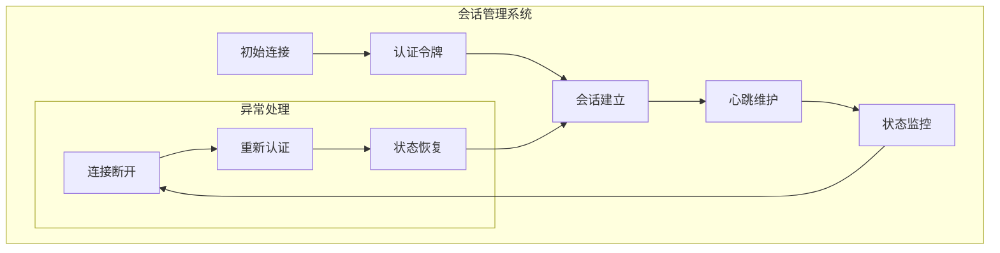

# 发送消息

<cite>
**本文档引用的文件**
- [wechat.py](file://office/api/wechat.py)
- [001-发一条信息.py](file://examples/PyOfficeRobot/001-发一条信息.py)
- [002-发文件.py](file://examples/PyOfficeRobot/002-发文件.py)
- [003-根据关键词回复.py](file://examples/PyOfficeRobot/003-根据关键词回复.py)
- [004-定时发送.py](file://examples/PyOfficeRobot/004-定时发送.py)
- [008-发消息换行.py](file://examples/PyOfficeRobot/008-发消息换行.py)
- [006-独立版本.py](file://examples/PyOfficeRobot/006-独立版本.py)
- [test_wechat.py](file://tests/test_code/test_wechat.py)
</cite>

## 目录
1. [简介](#简介)
2. [核心功能概述](#核心功能概述)
3. [send_message函数详解](#send_message函数详解)
4. [参数说明与使用方法](#参数说明与使用方法)
5. [基础消息发送示例](#基础消息发送示例)
6. [高级功能与特殊字符处理](#高级功能与特殊字符处理)
7. [二维码登录机制](#二维码登录机制)
8. [会话保持原理](#会话保持原理)
9. [常见问题与解决方案](#常见问题与解决方案)
10. [最佳实践建议](#最佳实践建议)
11. [总结](#总结)

## 简介

Python-Office库提供了基于PyOfficeRobot的微信消息发送功能，这是一个强大的自动化微信通信工具。通过封装PyOfficeRobot库，我们提供了简洁易用的接口来实现微信消息的自动发送、文件传输、定时发送等功能。

该功能的核心优势包括：
- 支持普通文本消息发送
- 内置Emoji表情符号支持
- 提供换行符处理机制
- 实现定时消息发送
- 支持文件传输功能
- 具备关键词自动回复能力

## 核心功能概述

Python-Office的微信消息发送功能主要包含以下核心组件：

**图表来源**
- [wechat.py](file://office/api/wechat.py#L6-L94)

## send_message函数详解

### 函数签名与架构

`send_message`函数是微信消息发送的核心入口，它直接封装了PyOfficeRobot的底层实现：

**图表来源**
- [wechat.py](file://office/api/wechat.py#L6-L16)

### 技术实现原理

该函数采用自动化桌面操作技术，通过模拟用户交互来实现微信消息发送：

1. **参数验证与预处理**：函数接收两个字符串参数，分别表示接收者和消息内容
2. **底层调用**：直接调用PyOfficeRobot.chat.send_message方法
3. **异常处理**：依赖PyOfficeRobot库内置的错误处理机制
4. **返回值**：无返回值，执行状态由库内部管理

**章节来源**
- [wechat.py](file://office/api/wechat.py#L6-L16)

## 参数说明与使用方法

### who参数详解

`who`参数是接收消息的联系人标识，具有以下特点：

| 特性 | 说明 | 示例 |
|------|------|------|
| 类型 | 字符串类型 | `str` |
| 必需 | 是 | 必须提供 |
| 匹配规则 | 支持昵称或备注名 | `'小红书：程序员晚枫'` |
| 精确匹配 | 完全匹配联系人名称 | 区分大小写 |
| 特殊字符 | 支持特殊字符和空格 | `'CSDN：程序员晚枫'` |

#### 联系人名称识别机制

系统通过以下方式识别联系人：
- **精确匹配**：完全匹配联系人的昵称或备注名
- **模糊匹配**：支持部分匹配（具体算法依赖PyOfficeRobot库）
- **优先级**：优先使用备注名进行匹配

### message参数详解

`message`参数支持多种文本格式和特殊字符：

| 格式类型 | 支持情况 | 处理方式 | 示例 |
|----------|----------|----------|------|
| 普通文本 | ✅ 完全支持 | 直接发送 | `'你好，世界！'` |
| Emoji表情 | ✅ 支持 | Unicode编码处理 | `'🌤️ 午安！'` |
| 换行符 | ✅ 支持 | 特殊标记处理 | `'第一行{ctrl}{ENTER}第二行'` |
| 特殊字符 | ✅ 支持 | 转义处理 | `'@#$%^&*()'` |
| HTML标签 | ❌ 不支持 | 需要转义 | `'<b>粗体</b>'` |

**章节来源**
- [001-发一条信息.py](file://examples/PyOfficeRobot/001-发一条信息.py#L47-L52)
- [008-发消息换行.py](file://examples/PyOfficeRobot/008-发消息换行.py#L6)

## 基础消息发送示例

### 最简单的消息发送

基于示例脚本[`001-发一条信息.py`](file://examples/PyOfficeRobot/001-发一条信息.py)，展示基础消息发送的完整代码流程：

**图表来源**
- [001-发一条信息.py](file://examples/PyOfficeRobot/001-发一条信息.py#L46-L52)

### 代码实现流程

基础消息发送遵循以下步骤：

1. **模块导入**：确保正确导入PyOfficeRobot库
2. **参数准备**：准备who和message参数
3. **函数调用**：调用send_message函数
4. **异常处理**：处理可能的发送失败情况

**章节来源**
- [001-发一条信息.py](file://examples/PyOfficeRobot/001-发一条信息.py#L46-L52)

## 高级功能与特殊字符处理

### Emoji表情符号支持

系统提供专门的Emoji支持函数，通过剪贴板技术实现复杂字符的发送：

**图表来源**
- [001-发一条信息.py](file://examples/PyOfficeRobot/001-发一条信息.py#L7-L44)

### 换行符处理机制

系统支持通过特殊标记实现消息换行：

| 标记 | 功能 | 使用场景 |
|------|------|----------|
| `{ctrl}{ENTER}` | 插入换行符 | 长消息分段 |
| `\n` | 换行符 | 简单换行需求 |
| `\r\n` | Windows换行符 | 跨平台兼容 |

**章节来源**
- [008-发消息换行.py](file://examples/PyOfficeRobot/008-发消息换行.py#L6)

### 文件发送功能

除了文本消息，系统还支持文件发送：

**图表来源**
- [002-发文件.py](file://examples/PyOfficeRobot/002-发文件.py#L8)

**章节来源**
- [002-发文件.py](file://examples/PyOfficeRobot/002-发文件.py#L6-L8)

## 二维码登录机制

### 登录流程概述

虽然Python-Office库本身不直接处理二维码登录，但PyOfficeRobot库实现了完整的登录机制：

### 会话保持原理

PyOfficeRobot库采用以下机制保持微信会话：

1. **持久化认证**：保存登录凭证
2. **心跳检测**：定期保持连接活跃
3. **自动重连**：网络中断时自动恢复
4. **状态同步**：实时同步微信状态

## 会话保持原理

### 技术实现机制

### 性能优化策略

1. **连接池管理**：复用连接减少资源消耗
2. **缓存机制**：缓存常用联系人信息
3. **异步处理**：非阻塞消息发送
4. **错误重试**：智能重试机制

## 常见问题与解决方案

### 联系人名称识别失败

**问题描述**：无法找到指定的联系人

**解决方案**：
1. **检查名称准确性**：确保使用正确的昵称或备注名
2. **联系人状态**：确认联系人未被删除或拉黑
3. **网络连接**：检查网络连接稳定性
4. **权限设置**：确认应用具有必要的权限

### 消息发送延迟

**问题描述**：消息发送出现明显延迟

**解决方案**：
1. **网络优化**：改善网络环境
2. **并发控制**：避免同时发送过多消息
3. **系统负载**：降低系统资源占用
4. **重试机制**：实现智能重试逻辑

### 特殊字符处理问题

**问题描述**：特殊字符显示异常

**解决方案**：
1. **Unicode编码**：确保正确编码特殊字符
2. **转义处理**：对特殊字符进行适当转义
3. **字符集设置**：统一使用UTF-8编码
4. **测试验证**：在不同环境下测试字符显示

### 频率限制问题

**问题描述**：触发微信频率限制

**解决方案**：
1. **发送间隔**：设置合理的发送间隔（建议至少1秒）
2. **批量处理**：合理安排消息发送批次
3. **监控告警**：监控发送频率和成功率
4. **降频策略**：在高峰期降低发送频率

**章节来源**
- [001-发一条信息.py](file://examples/PyOfficeRobot/001-发一条信息.py#L33-L44)

## 最佳实践建议

### 代码组织建议

1. **模块化设计**：将消息发送功能封装为独立模块
2. **配置管理**：使用配置文件管理联系人信息
3. **日志记录**：添加详细的日志记录功能
4. **异常处理**：完善异常处理和错误恢复机制

### 性能优化建议

1. **连接复用**：避免频繁建立和断开连接
2. **批量操作**：合并多个小操作为批量操作
3. **缓存策略**：缓存常用的联系人信息
4. **异步处理**：使用异步方式处理消息发送

### 安全性建议

1. **敏感信息保护**：妥善保管登录凭证
2. **权限控制**：限制消息发送权限
3. **审计日志**：记录所有消息发送操作
4. **定期清理**：定期清理过期的会话信息

### 可靠性建议

1. **重试机制**：实现智能重试逻辑
2. **监控告警**：建立发送状态监控
3. **故障恢复**：具备自动故障恢复能力
4. **备份策略**：重要消息的备份机制

## 总结

Python-Office的微信消息发送功能通过PyOfficeRobot库提供了强大而灵活的自动化通信能力。该功能的主要优势包括：

1. **简单易用**：提供简洁的API接口
2. **功能丰富**：支持多种消息格式和发送方式
3. **稳定可靠**：具备完善的错误处理机制
4. **扩展性强**：支持自定义功能扩展

通过合理使用这些功能并遵循最佳实践，开发者可以构建高效可靠的微信自动化应用。在使用过程中，需要注意频率限制、网络安全和个人隐私保护等方面的要求。