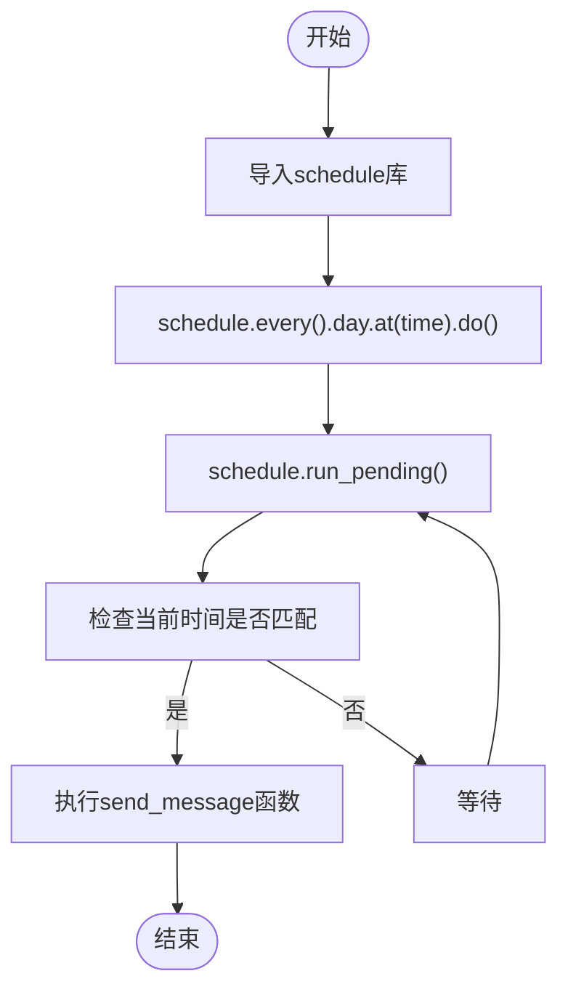
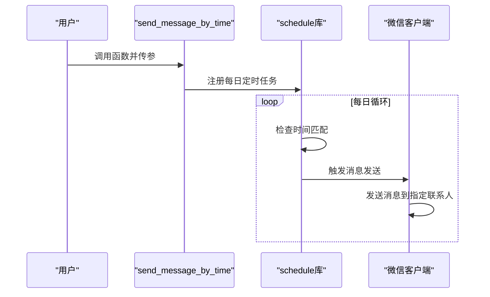
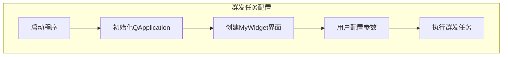
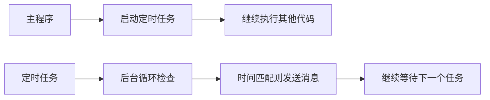
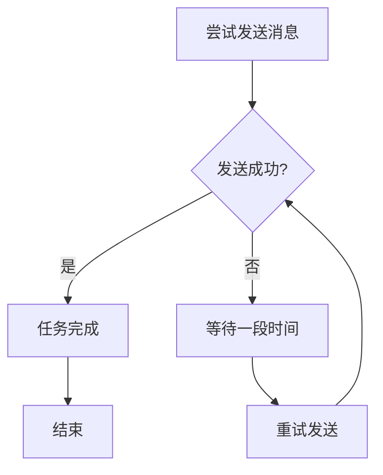

# 定时发送消息

<cite>
**本文档引用的文件**
- [004-定时发送.py](file://examples/PyOfficeRobot/004-定时发送.py)
- [010-定时群发.py](file://examples/PyOfficeRobot/010-定时群发.py)
- [chat.py](file://venv/Lib/site-packages/PyOfficeRobot/api/chat.py)
- [group.py](file://venv/Lib/site-packages/PyOfficeRobot/api/group.py)
- [wechat.py](file://office/api/wechat.py)
</cite>

## 目录
1. [简介](#简介)
2. [核心功能实现](#核心功能实现)
3. [单次定时消息配置](#单次定时消息配置)
4. [周期性群发任务配置](#周期性群发任务配置)
5. [非阻塞执行机制](#非阻塞执行机制)
6. [时间同步与时区处理](#时间同步与时区处理)
7. [高级用法建议](#高级用法建议)
8. [结论](#结论)

## 简介
`send_message_by_time`函数是PyOfficeRobot库中用于实现定时发送微信消息的核心功能。该功能允许用户在指定时间自动向微信联系人发送消息，支持单次定时发送和周期性群发两种模式。本文档将深入解析该功能的实现机制，并提供详细的使用指导。

## 核心功能实现

`send_message_by_time`函数的实现基于`schedule`库，通过每日定时触发的方式实现消息发送。函数接收三个参数：接收消息的联系人名称、要发送的消息内容和预定发送时间。



**图示来源**
- [chat.py](file://venv/Lib/site-packages/PyOfficeRobot/api/chat.py#L75-L79)

**本节来源**
- [chat.py](file://venv/Lib/site-packages/PyOfficeRobot/api/chat.py#L75-L79)

## 单次定时消息配置

单次定时消息的配置通过`004-定时发送.py`示例文件展示。用户需要指定接收消息的联系人昵称或备注名、消息内容和发送时间。

```python
PyOfficeRobot.chat.send_message_by_time(who='快手：程序员晚枫', message='你好', time='21:51:55')
```

时间参数采用24小时制的`HH:MM:SS`格式，精确到秒。该配置会在每天的指定时间向指定联系人发送消息。



**图示来源**
- [004-定时发送.py](file://examples/PyOfficeRobot/004-定时发送.py#L8)
- [chat.py](file://venv/Lib/site-packages/PyOfficeRobot/api/chat.py#L75-L79)

**本节来源**
- [004-定时发送.py](file://examples/PyOfficeRobot/004-定时发送.py#L6-L8)

## 周期性群发任务配置

周期性群发任务通过`010-定时群发.py`示例文件展示。该功能使用PySide6库创建图形用户界面，允许用户配置群发任务。

```python
if __name__ == '__main__':
    PyOfficeRobot.group.send()
```

群发功能的实现包含以下步骤：
1. 初始化QApplication
2. 创建并展示MyWidget界面组件
3. 通过图形界面配置群发参数
4. 执行群发任务



**图示来源**
- [010-定时群发.py](file://examples/PyOfficeRobot/010-定时群发.py#L7-L8)
- [group.py](file://venv/Lib/site-packages/PyOfficeRobot/api/group.py#L20-L27)

**本节来源**
- [010-定时群发.py](file://examples/PyOfficeRobot/010-定时群发.py#L7-L8)
- [group.py](file://venv/Lib/site-packages/PyOfficeRobot/api/group.py#L20-L27)

## 非阻塞执行机制

`send_message_by_time`函数通过后台线程和无限循环实现非阻塞执行。函数内部使用`while True`循环持续调用`schedule.run_pending()`，检查是否有待执行的任务。

这种实现方式确保了定时任务可以在不影响主程序执行的情况下后台运行。当没有任务需要执行时，程序会持续等待，直到下一个任务时间点到达。



**图示来源**
- [chat.py](file://venv/Lib/site-packages/PyOfficeRobot/api/chat.py#L77-L79)

**本节来源**
- [chat.py](file://venv/Lib/site-packages/PyOfficeRobot/api/chat.py#L75-L79)

## 时间同步与时区处理

为确保定时消息准确发送，用户需要正确设置系统时间和网络同步。由于`send_message_by_time`函数依赖于系统时间，任何时间偏差都可能导致消息发送异常。

建议用户：
1. 启用操作系统的时间自动同步功能
2. 确保系统时区设置正确
3. 定期检查系统时间准确性

时区差异是导致定时发送异常的常见原因。如果用户在不同时区之间移动，应更新系统时区设置，以确保定时任务按照当地时间执行。

**本节来源**
- [chat.py](file://venv/Lib/site-packages/PyOfficeRobot/api/chat.py#L75-L79)
- [004-定时发送.py](file://examples/PyOfficeRobot/004-定时发送.py#L6-L8)

## 高级用法建议

### 任务取消
目前`send_message_by_time`函数没有直接提供任务取消功能。如果需要取消已设置的定时任务，建议重启程序或重新配置任务。

### 异常重试
在实际使用中，可能会遇到网络波动或微信客户端异常导致消息发送失败的情况。建议在关键业务场景中添加异常处理机制，实现失败重试功能。



**图示来源**
- [chat.py](file://venv/Lib/site-packages/PyOfficeRobot/api/chat.py#L75-L79)

**本节来源**
- [chat.py](file://venv/Lib/site-packages/PyOfficeRobot/api/chat.py#L75-L79)

## 结论
`send_message_by_time`函数通过`schedule`库实现了简单而有效的定时消息发送功能。该功能支持单次定时发送和周期性群发两种模式，能够满足不同场景下的自动化消息发送需求。通过后台线程实现非阻塞执行，确保了主程序的正常运行。用户在使用时应注意系统时间同步和时区设置，以避免发送异常。对于关键业务，建议添加异常处理和重试机制，提高系统的可靠性。