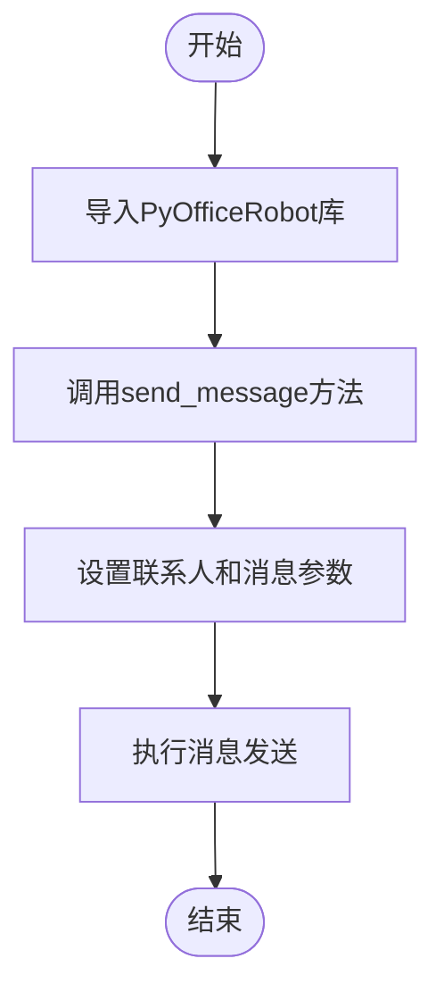
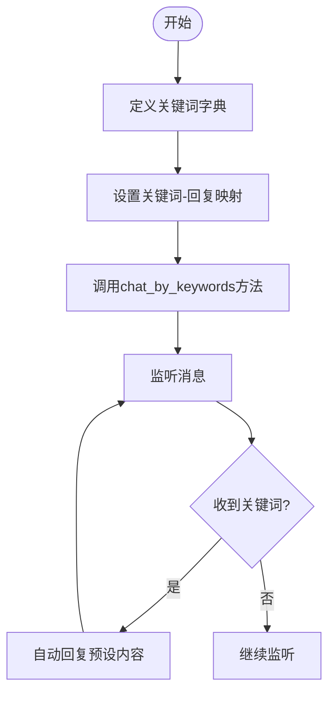

# 微信自动化

<cite>
**本文档引用的文件**
- [wechat.py](file://office/api/wechat.py)
- [001-发一条信息.py](file://examples/PyOfficeRobot/001-发一条信息.py)
- [002-发文件.py](file://examples/PyOfficeRobot/002-发文件.py)
- [003-根据关键词回复.py](file://examples/PyOfficeRobot/003-根据关键词回复.py)
- [004-定时发送.py](file://examples/PyOfficeRobot/004-定时发送.py)
- [007-收集群消息.py](file://examples/PyOfficeRobot/007-收集群消息.py)
- [010-定时群发.py](file://examples/PyOfficeRobot/010-定时群发.py)
- [012、智能聊天.py](file://examples/PyOfficeRobot/012、智能聊天.py)
- [@AutomationLog.txt](file://examples/PyOfficeRobot/@AutomationLog.txt)
</cite>

## 目录
1. [简介](#简介)
2. [核心功能与接口](#核心功能与接口)
3. [应用场景与代码实现](#应用场景与代码实现)
4. [登录机制与会话持久化](#登录机制与会话持久化)
5. [微信协议合规性注意事项](#微信协议合规性注意事项)
6. [故障排查指南](#故障排查指南)
7. [生产环境建议](#生产环境建议)

## 简介
微信自动化技术通过PyOfficeRobot接口实现了对微信客户端的程序化控制，支持消息收发、文件传输、关键词响应、定时任务等多种功能。该技术基于桌面客户端自动化原理，无需依赖网页版微信，适用于所有微信用户。通过简单的API调用，开发者可以快速构建自动化工作流，提升工作效率。

## 核心功能与接口

PyOfficeRobot提供了七个核心函数来实现微信自动化能力，这些函数封装在wechat.py模块中，为开发者提供了简洁易用的接口。

### send_message函数
用于向指定联系人发送文本消息。该函数接收两个参数：`who`表示接收消息的联系人名称（可以是昵称或备注名），`message`表示要发送的消息内容。函数通过调用PyOfficeRobot.chat.send_message实现消息发送功能。

**Section sources**
- [wechat.py](file://office/api/wechat.py#L6-L17)

### send_message_by_time函数
实现定时消息发送功能。该函数接收三个参数：`who`表示接收消息的联系人名称，`message`表示要发送的消息内容，`time`表示预定发送时间（24小时制）。函数通过调用PyOfficeRobot.chat.send_message_by_time实现定时发送功能。

**Section sources**
- [wechat.py](file://office/api/wechat.py#L19-L30)

### chat_by_keywords函数
实现基于关键词的自动回复功能。该函数接收两个参数：`who`表示进行聊天的联系人名称，`keywords`表示触发聊天的关键词字典，其中键为接收到的关键词，值为对应的回复内容。函数通过调用PyOfficeRobot.chat.chat_by_keywords实现关键词响应功能。

**Section sources**
- [wechat.py](file://office/api/wechat.py#L33-L43)

### send_file函数
用于向指定联系人发送文件。该函数接收两个参数：`who`表示接收文件的联系人名称，`file`表示要发送的文件路径（在Windows系统中建议使用原始字符串格式）。函数通过调用PyOfficeRobot.file.send_file实现文件传输功能。

**Section sources**
- [wechat.py](file://office/api/wechat.py#L46-L56)

### group_send函数
实现群发消息功能。该函数无参数，执行时会向预设的群组列表发送消息。函数通过调用PyOfficeRobot.group.send实现群组消息发送功能。

**Section sources**
- [wechat.py](file://office/api/wechat.py#L59-L65)

### receive_message函数
用于接收和保存微信消息。该函数接收三个可选参数：`who`表示发送消息的微信联系人（默认为"文件传输助手"），`txt`表示消息内容的文本文件名（默认为"userMessage.txt"），`output_path`表示消息内容的保存路径（默认为当前目录）。函数通过调用PyOfficeRobot.chat.receive_message实现消息接收功能。

**Section sources**
- [wechat.py](file://office/api/wechat.py#L68-L82)

### chat_robot函数
实现智能聊天功能。该函数接收一个可选参数`who`表示指定聊天对象（默认为"程序员晚枫"），启动后可实现自动对话。函数通过调用PyOfficeRobot.chat.chat_robot实现智能对话功能。

**Section sources**
- [wechat.py](file://office/api/wechat.py#L85-L94)

## 应用场景与代码实现

### 消息收发场景
在"001-发一条信息.py"示例中，展示了基本的消息发送功能。通过调用PyOfficeRobot.chat.send_message方法，指定联系人和消息内容即可完成消息发送。示例中还提供了支持Emoji符号的优化版本，通过pyperclip和pyautogui库实现复杂内容的粘贴发送。

**Diagram sources**
- [001-发一条信息.py](file://examples/PyOfficeRobot/001-发一条信息.py#L46-L52)

### 定时任务场景
在"004-定时发送.py"示例中，展示了定时消息发送功能。通过调用PyOfficeRobot.chat.send_message_by_time方法，指定联系人、消息内容和发送时间（如"21:51:55"）即可设置定时任务。该功能适用于生日祝福、会议提醒等需要精确时间控制的场景。

**Section sources**
- [004-定时发送.py](file://examples/PyOfficeRobot/004-定时发送.py#L6-L8)

### 关键词响应场景
在"003-根据关键词回复.py"示例中，展示了关键词自动回复功能。通过定义关键词字典，将触发词与回复内容进行映射，然后调用PyOfficeRobot.chat.chat_by_keywords方法启动监听。当指定联系人发送匹配关键词的消息时，系统会自动回复预设内容。此功能适用于客服机器人、活动报名等场景。

**Diagram sources**
- [003-根据关键词回复.py](file://examples/PyOfficeRobot/003-根据关键词回复.py#L7-L15)

### 文件传输场景
在"002-发文件.py"示例中，展示了文件发送功能。通过调用PyOfficeRobot.file.send_file方法，指定联系人和文件路径即可发送文件。示例中特别提醒在Windows系统中使用原始字符串（r前缀）来避免路径转义问题。

**Section sources**
- [002-发文件.py](file://examples/PyOfficeRobot/002-发文件.py#L8)

### 群组消息收集场景
在"007-收集群消息.py"示例中，展示了群消息收集功能。通过调用PyOfficeRobot.file.get_group_list方法获取群组列表，为后续的群发或消息监控做准备。需要注意的是，该功能在当前版本可能存在BUG（AttributeError: 'NoneType' object has no attribute 'Name'）。

**Section sources**
- [007-收集群消息.py](file://examples/PyOfficeRobot/007-收集群消息.py#L7)

### 智能对话场景
在"012、智能聊天.py"示例中，展示了智能聊天功能。通过调用PyOfficeRobot.chat.chat_robot方法，指定聊天对象即可启动智能对话模式。该功能可能集成了自然语言处理技术，实现更自然的交互体验。

**Section sources**
- [012、智能聊天.py](file://examples/PyOfficeRobot/012、智能聊天.py#L7)

## 登录机制与会话持久化

微信自动化采用二维码登录机制，用户需要使用手机微信扫描桌面客户端显示的二维码完成身份验证。这种登录方式与微信官方客户端保持一致，确保了安全性。登录成功后，系统会维持会话状态，直到用户主动退出或长时间无操作。

会话持久化通过保存登录凭证实现，使得在程序重启后无需重复扫描二维码。然而，当微信客户端更新或长时间未使用时，可能需要重新登录。从@AutomationLog.txt日志文件可以看出，系统在执行操作时可能会遇到控件查找超时的问题，这表明自动化脚本依赖于微信客户端的UI元素稳定性。

**Section sources**
- [@AutomationLog.txt](file://examples/PyOfficeRobot/@AutomationLog.txt#L1-L84)

## 微信协议合规性注意事项

使用微信自动化技术时必须遵守微信用户协议，避免过度使用导致账号受限。频繁的消息发送、大量好友添加等行为可能被系统识别为异常操作，从而触发安全机制。建议在开发和使用过程中：

1. 避免短时间内发送大量消息
2. 不要用于发送垃圾信息或广告
3. 尊重他人隐私，不滥用消息监听功能
4. 遵守微信平台的使用规范和政策

虽然该技术为个人效率提升提供了便利，但不应将其用于违反微信服务条款的用途。

## 故障排查指南

### 登录超时问题
当出现登录超时或二维码无法扫描的情况时，建议检查网络连接，确保手机和电脑处于同一网络环境。同时确认微信客户端是否为最新版本，旧版本可能存在兼容性问题。

### 消息发送频率限制
如果遇到消息发送失败或被限制的情况，可能是由于发送频率过高。建议在代码中添加适当的延迟（如time.sleep），并遵循生产环境建议的调用间隔。

### 联系人名称匹配失败
当系统无法识别联系人名称时，请确认名称的准确性，包括特殊字符和空格。建议使用微信通讯录中显示的确切名称，并注意中文字符的全角/半角区别。

### 控件查找超时
从@AutomationLog.txt日志中可见，"Find Control Timeout"错误表明系统无法找到预期的UI控件。这通常发生在微信客户端更新后，UI元素发生变化。解决方案包括更新PyOfficeRobot库到最新版本，或等待开发者发布兼容性补丁。

**Section sources**
- [@AutomationLog.txt](file://examples/PyOfficeRobot/@AutomationLog.txt#L1-L84)

## 生产环境建议

在生产环境中使用微信自动化功能时，建议设置合理的调用间隔，避免过于频繁的操作。推荐的实践包括：

1. 在消息发送之间添加随机延迟（如1-3秒）
2. 批量操作时采用分批处理策略
3. 实现错误重试机制，增强系统稳定性
4. 记录操作日志，便于问题追踪和审计
5. 设置操作上限，防止意外的大量操作

通过合理配置和使用，微信自动化技术可以在确保账号安全的前提下，有效提升工作效率。