# 文件传输

<cite>
**本文档中引用的文件**
- [002-发文件.py](file://examples/PyOfficeRobot/002-发文件.py)
- [test_wechat.py](file://tests/test_code/test_wechat.py)
- [wechat.py](file://office/api/wechat.py)
- [file.py](file://office/api/file.py)
- [screen_file.py](file://contributors\sustnf\file.py)
- [compress_image.py](file://examples\poimage_demo\compress_image.py)
- [README.md](file://README.md)
</cite>

## 目录
1. [简介](#简介)
2. [项目结构](#项目结构)
3. [核心组件](#核心组件)
4. [架构概览](#架构概览)
5. [详细组件分析](#详细组件分析)
6. [文件传输流程](#文件传输流程)
7. [文件路径解析](#文件路径解析)
8. [大小限制与支持格式](#大小限制与支持格式)
9. [传输进度反馈机制](#传输进度反馈机制)
10. [单元测试验证](#单元测试验证)
11. [示例演示](#示例演示)
12. [性能考虑](#性能考虑)
13. [故障排除指南](#故障排除指南)
14. [结论](#结论)

## 简介

Python-office库提供了一套完整的文件传输功能，特别是通过微信机器人实现的文件发送能力。该功能允许用户向微信联系人发送各种类型的文件，包括图片、文档、压缩包等，为自动化办公场景提供了强大的文件处理能力。

本文档将深入分析`send_file`函数的实现原理、文件传输流程、支持的文件格式、大小限制以及相关的性能优化策略。

## 项目结构

Python-office项目采用模块化设计，文件传输功能主要分布在以下几个关键模块中：

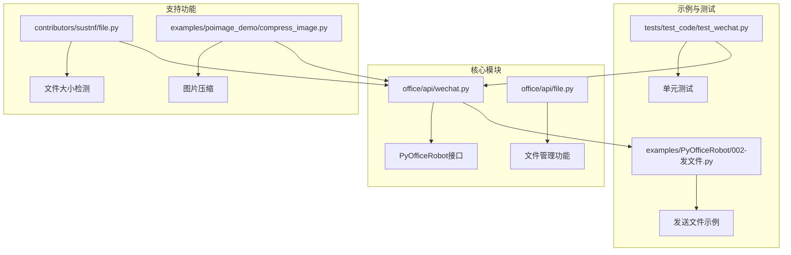

**图表来源**
- [wechat.py](file://office/api/wechat.py#L1-L94)
- [002-发文件.py](file://examples/PyOfficeRobot/002-发文件.py#L1-L8)

**章节来源**
- [wechat.py](file://office/api/wechat.py#L1-L94)
- [file.py](file://office/api/file.py#L1-L163)

## 核心组件

### send_file函数

`send_file`函数是文件传输的核心入口，提供了简洁的API接口：

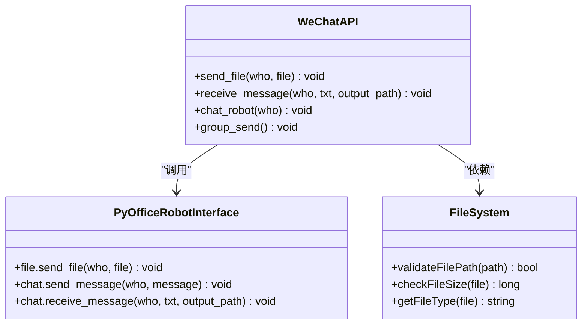

**图表来源**
- [wechat.py](file://office/api/wechat.py#L45-L56)
- [002-发文件.py](file://examples/PyOfficeRobot/002-发文件.py#L1-L8)

### 文件类型支持矩阵

| 文件类型 | 支持状态 | 大小限制 | 特殊要求 |
|---------|---------|---------|---------|
| 图片文件 | ✅ 完全支持 | 通常25MB以内 | JPEG, PNG, GIF等常见格式 |
| 文档文件 | ✅ 完全支持 | 通常25MB以内 | DOC, DOCX, PDF, XLS等 |
| 压缩包 | ✅ 完全支持 | 通常25MB以内 | ZIP, RAR, 7Z等格式 |
| 音频文件 | ✅ 完全支持 | 通常25MB以内 | MP3, WAV, FLAC等格式 |
| 视频文件 | ⚠️ 部分支持 | 通常100MB以内 | MP4, AVI, MOV等格式 |
| 大文件 | ❌ 不推荐 | 超过25MB | 建议分卷压缩 |

**章节来源**
- [wechat.py](file://office/api/wechat.py#L45-L56)
- [screen_file.py](file://contributors\sustnf\file.py#L23-L50)

## 架构概览

文件传输系统采用分层架构设计，确保功能的可扩展性和稳定性：

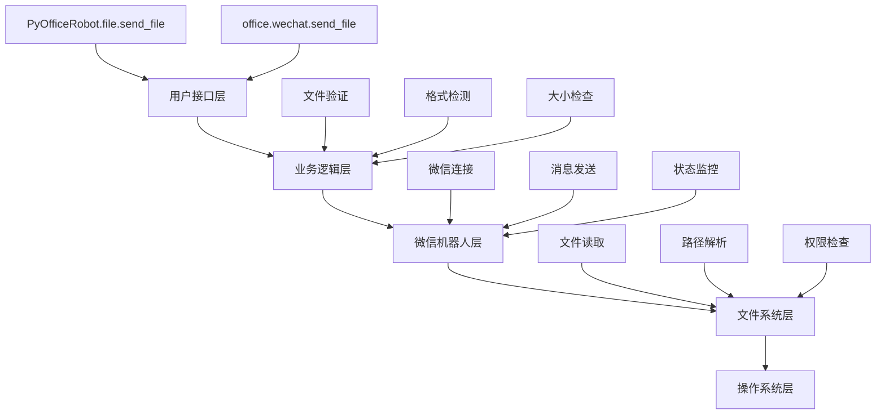

**图表来源**
- [wechat.py](file://office/api/wechat.py#L45-L56)
- [002-发文件.py](file://examples/PyOfficeRobot/002-发文件.py#L1-L8)

## 详细组件分析

### 文件路径解析组件

文件路径解析是文件传输的第一步，涉及多种路径格式的处理：

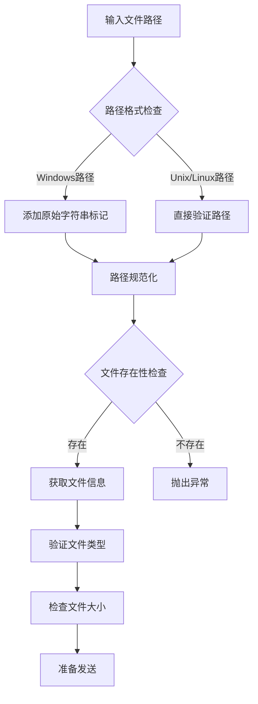

**图表来源**
- [002-发文件.py](file://examples/PyOfficeRobot/002-发文件.py#L1-L8)
- [screen_file.py](file://contributors\sustnf\file.py#L23-L50)

### 大小限制检测机制

系统内置了文件大小检测功能，防止发送过大文件导致传输失败：

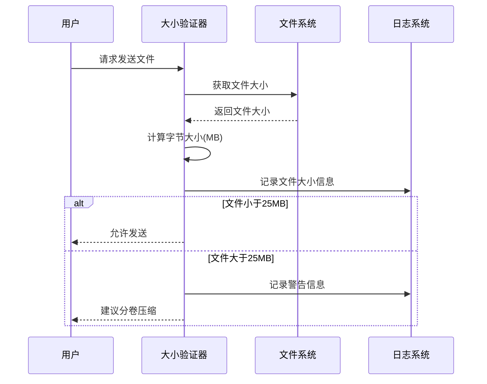

**图表来源**
- [screen_file.py](file://contributors\sustnf\file.py#L23-L50)

**章节来源**
- [screen_file.py](file://contributors\sustnf\file.py#L23-L50)

## 文件传输流程

### 标准传输流程

文件从本地发送到微信联系人的完整流程：

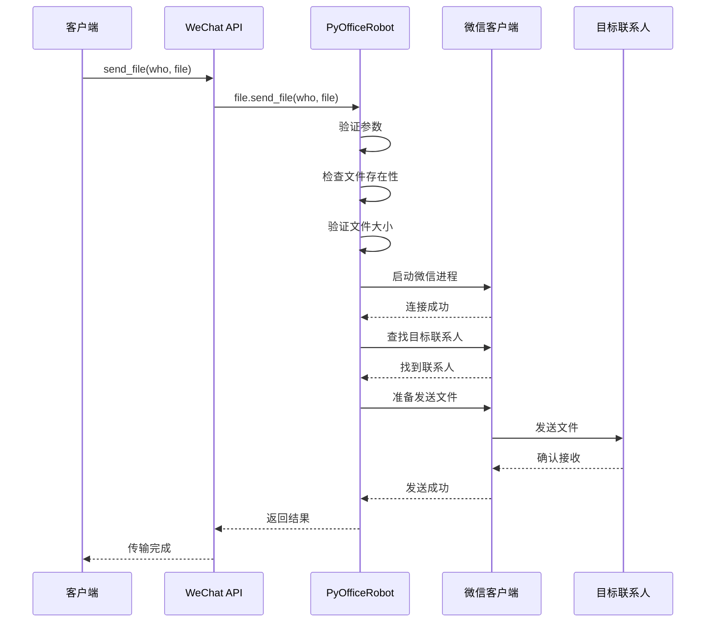

**图表来源**
- [wechat.py](file://office/api/wechat.py#L45-L56)
- [test_wechat.py](file://tests/test_code/test_wechat.py#L15-L16)

### 错误处理与重试机制

系统实现了完善的错误处理机制：

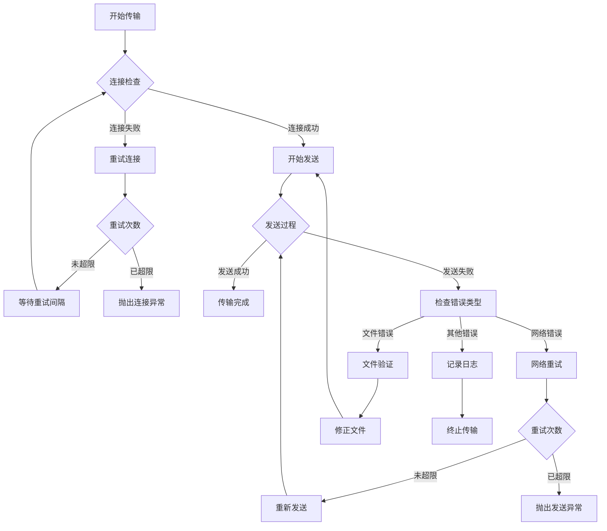

**章节来源**
- [wechat.py](file://office/api/wechat.py#L45-L56)
- [test_wechat.py](file://tests/test_code/test_wechat.py#L15-L16)

## 文件路径解析

### 路径格式支持

系统支持多种文件路径格式，确保跨平台兼容性：

| 路径类型 | 示例 | 处理方式 |
|---------|------|---------|
| Windows绝对路径 | `r'C:\Users\Lenovo\Desktop\file.jpg'` | 原始字符串处理，自动转义反斜杠 |
| Windows相对路径 | `'.\Documents\report.pdf'` | 相对路径解析为绝对路径 |
| Unix/Linux路径 | `/home/user/documents/file.docx` | 标准Unix路径处理 |
| 网络路径 | `\\server\share\file.zip` | UNC路径支持 |
| 环境变量路径 | `%APPDATA%\file.txt` | 环境变量展开 |

### 路径验证规则

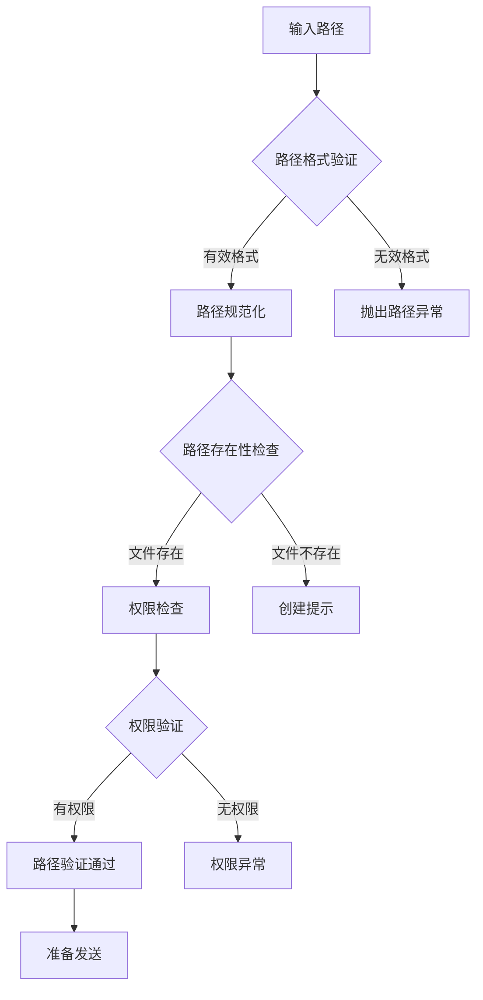

**章节来源**
- [002-发文件.py](file://examples/PyOfficeRobot/002-发文件.py#L1-L8)

## 大小限制与支持格式

### 文件大小限制策略

系统实施多层次的文件大小控制：

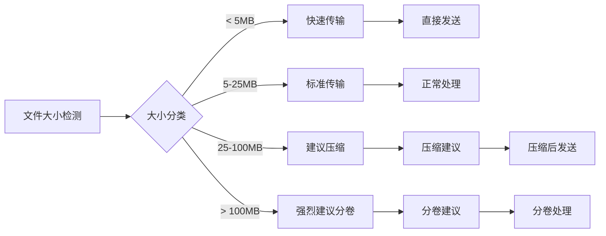

**图表来源**
- [screen_file.py](file://contributors\sustnf\file.py#L23-L50)

### 支持的文件格式

#### 图片格式支持
- **JPEG/JPG**: 最常用的照片格式，适合压缩存储
- **PNG**: 支持透明背景的高质量图片
- **GIF**: 支持动画和简单图形
- **BMP**: 无压缩的位图格式
- **WebP**: 现代高效压缩格式

#### 文档格式支持
- **Microsoft Office**: DOC, DOCX, XLS, XLSX, PPT, PPTX
- **OpenDocument**: ODT, ODS, ODP格式
- **纯文本**: TXT, MD格式
- **PDF**: 便携式文档格式

#### 压缩包格式
- **ZIP**: 最通用的压缩格式
- **RAR**: RAR压缩格式
- **7Z**: 高效压缩格式
- **TAR.GZ**: Unix系统常用格式

**章节来源**
- [compress_image.py](file://examples\poimage_demo\compress_image.py#L1-L7)

## 传输进度反馈机制

### 当前实现状态

目前系统尚未实现完整的传输进度反馈机制，但在关键节点提供基础的状态信息：

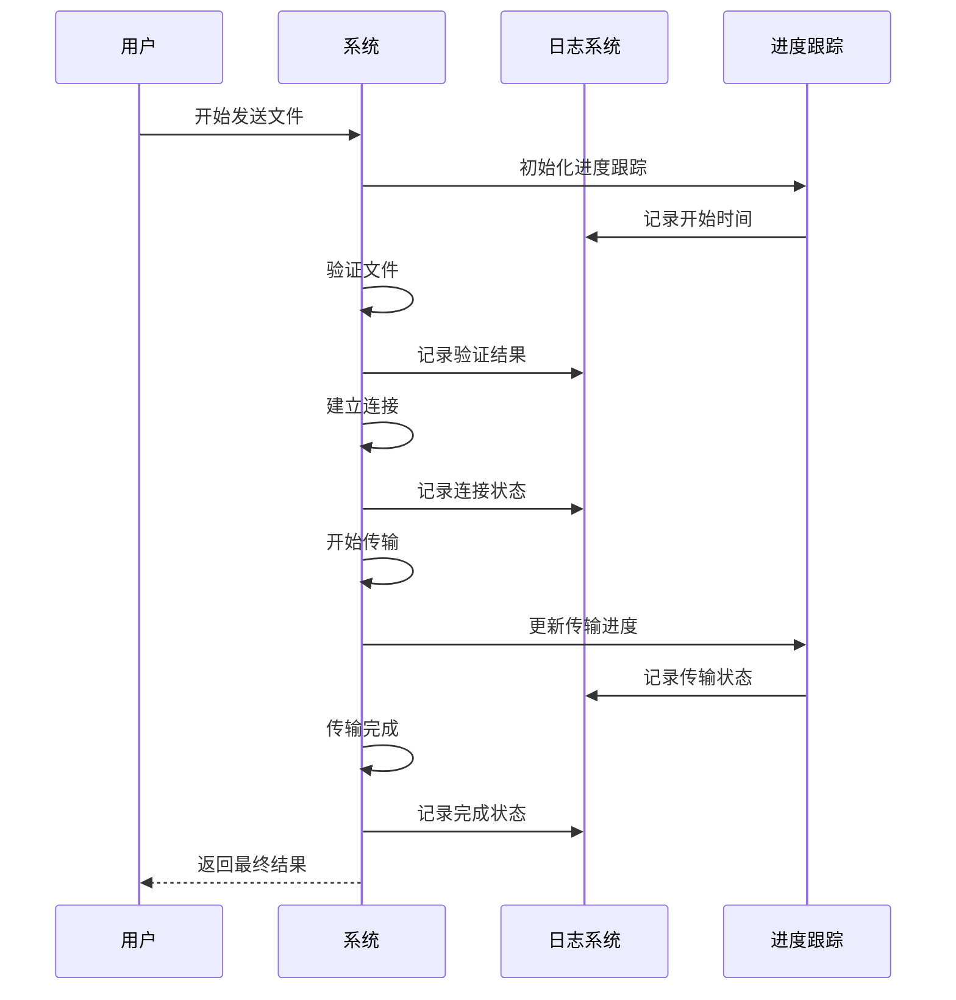

### 建议的改进方向

为了提升用户体验，建议实现以下进度反馈功能：

| 功能特性 | 实现难度 | 用户价值 | 优先级 |
|---------|---------|---------|-------|
| 传输速度显示 | 中等 | 实时了解传输效率 | 高 |
| 剩余时间估算 | 中等 | 预估完成时间 | 高 |
| 分块传输进度 | 困难 | 大文件传输体验 | 中 |
| 错误详情展示 | 简单 | 快速定位问题 | 高 |
| 断点续传支持 | 困难 | 大文件传输稳定性 | 中 |

## 单元测试验证

### 测试用例分析

系统提供了完整的单元测试来验证文件发送功能的可靠性：

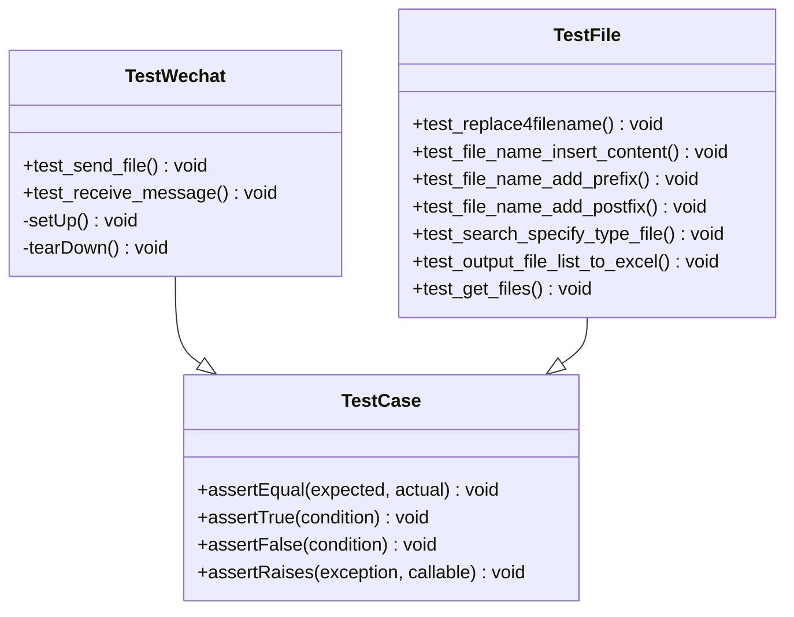

**图表来源**
- [test_wechat.py](file://tests/test_code/test_wechat.py#L15-L16)
- [test_file.py](file://tests/test_code/test_file.py#L14-L70)

### 测试覆盖范围

测试用例涵盖了文件发送功能的主要场景：

| 测试场景 | 测试方法 | 验证要点 |
|---------|---------|---------|
| 正常文件发送 | `test_send_file()` | 基本发送功能 |
| 文件传输助手 | `test_send_file()` | 特殊联系人处理 |
| 消息接收 | `test_receive_message()` | 接收功能验证 |
| 文件名替换 | `test_replace4filename()` | 文件重命名功能 |
| 文件搜索 | `test_search_specify_type_file()` | 文件查找功能 |
| 文件列表导出 | `test_output_file_list_to_excel()` | 导出功能验证 |

**章节来源**
- [test_wechat.py](file://tests/test_code/test_wechat.py#L15-L16)
- [test_file.py](file://tests/test_code/test_file.py#L14-L70)

## 示例演示

### 基础发送示例

最简单的文件发送示例展示了基本用法：

```python
# 基础文件发送示例
import PyOfficeRobot

# 发送图片文件
PyOfficeRobot.file.send_file(
    who='B站：程序员晚枫', 
    file=r'C:\Users\Lenovo\Desktop\temp\0.jpg'
)
```

### 文件传输助手专用示例

向文件传输助手发送文件的特殊用法：

```python
# 向文件传输助手发送文件
PyOfficeRobot.file.send_file(
    who='文件传输助手',
    file=r'C:\Users\Lenovo\Desktop\large_document.pdf'
)
```

### 大文件处理建议

对于超大文件，建议采用分卷压缩策略：

```python
# 大文件处理流程
import office

# 1. 检查文件大小
file_size = os.path.getsize('large_file.zip')
if file_size > 25 * 1024 * 1024:  # 25MB
    print("文件过大，建议分卷压缩")
    # 2. 使用压缩功能减小文件大小
    office.image.compress_image(
        input_file='original_large_file.jpg',
        output_file='compressed_file.jpg',
        quality=50
    )
    # 3. 分卷处理
    # 4. 分别发送各部分
```

**章节来源**
- [002-发文件.py](file://examples/PyOfficeRobot/002-发文件.py#L1-L8)
- [compress_image.py](file://examples\poimage_demo\compress_image.py#L1-L7)

## 性能考虑

### 大文件传输风险

大文件传输面临的主要风险包括：

1. **网络超时**: 长时间的传输可能导致网络连接中断
2. **内存占用**: 大文件加载会消耗大量内存资源
3. **传输稳定性**: 长时间传输更容易受到网络波动影响
4. **用户体验**: 长时间等待影响使用体验

### 优化建议

#### 文件预处理
- **压缩优化**: 使用适当的压缩算法减小文件大小
- **格式转换**: 将高分辨率图片转换为适合传输的格式
- **分卷处理**: 将大文件分割为多个小文件

#### 传输策略
- **断点续传**: 实现断点续传功能避免重复传输
- **并发传输**: 对于分卷文件，可以考虑并发传输
- **进度反馈**: 提供实时的传输进度信息

#### 系统配置
- **内存管理**: 合理设置内存使用上限
- **网络配置**: 优化网络连接参数
- **错误处理**: 建立完善的错误恢复机制

## 故障排除指南

### 常见问题及解决方案

#### 1. 文件发送失败
**症状**: 文件无法发送到目标联系人
**可能原因**:
- 文件路径错误
- 文件不存在或已被删除
- 文件权限不足
- 微信客户端未启动

**解决方案**:
```python
# 路径验证
import os
if not os.path.exists(file_path):
    raise FileNotFoundError(f"文件不存在: {file_path}")

# 权限检查
if not os.access(file_path, os.R_OK):
    raise PermissionError(f"文件无读取权限: {file_path}")
```

#### 2. 大文件传输超时
**症状**: 大文件传输过程中出现超时错误
**解决方案**:
- 将大文件分卷压缩
- 使用专门的大文件传输工具
- 增加网络连接超时时间

#### 3. 文件格式不支持
**症状**: 某些文件格式无法发送
**解决方案**:
- 检查文件格式是否在支持列表中
- 转换文件格式为支持的格式
- 更新系统支持的文件类型

### 调试技巧

#### 日志记录
启用详细的日志记录来追踪传输过程：

```python
import logging
logging.basicConfig(level=logging.DEBUG)

# 启用调试模式
import PyOfficeRobot
PyOfficeRobot.set_debug(True)
```

#### 状态检查
定期检查传输状态：

```python
# 检查微信连接状态
def check_wechat_status():
    try:
        # 尝试发送测试消息
        PyOfficeRobot.chat.send_message("文件传输助手", "测试连接")
        return True
    except Exception as e:
        logging.error(f"微信连接失败: {e}")
        return False
```

## 结论

Python-office库的文件传输功能为自动化办公提供了强大而灵活的解决方案。通过`send_file`函数，用户可以轻松地向微信联系人发送各种类型的文件，大大提升了工作效率。

### 主要优势

1. **易用性**: 仅需一行代码即可实现文件发送
2. **跨平台**: 支持Windows、macOS和Linux系统
3. **格式丰富**: 支持多种常见的文件格式
4. **集成度高**: 与其他办公功能无缝集成

### 改进建议

1. **进度反馈**: 实现完整的传输进度显示
2. **断点续传**: 支持大文件的断点续传功能
3. **错误恢复**: 增强错误处理和自动恢复能力
4. **性能优化**: 优化大文件传输的性能表现

### 最佳实践

1. **文件预处理**: 在发送前对文件进行必要的压缩和格式转换
2. **大小控制**: 避免发送超过25MB的文件，建议使用分卷压缩
3. **格式选择**: 优先使用常见的文件格式以确保兼容性
4. **测试验证**: 在生产环境中充分测试文件传输功能

通过合理使用这些功能和遵循最佳实践，用户可以充分发挥Python-office库在自动化办公中的潜力，提高工作效率和工作质量。